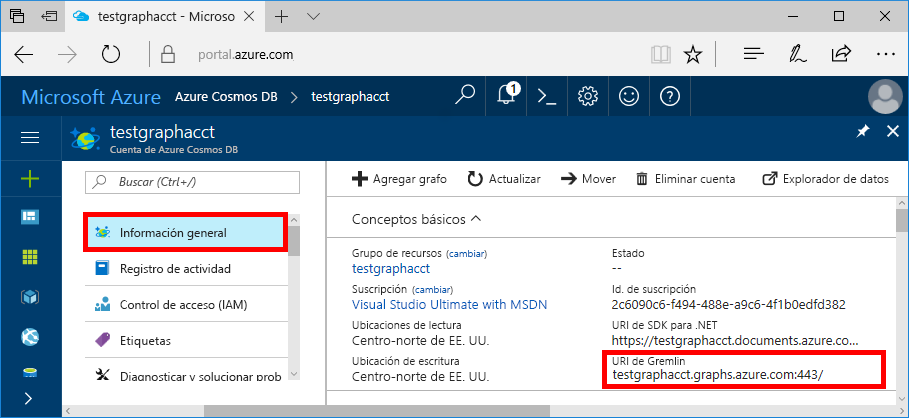
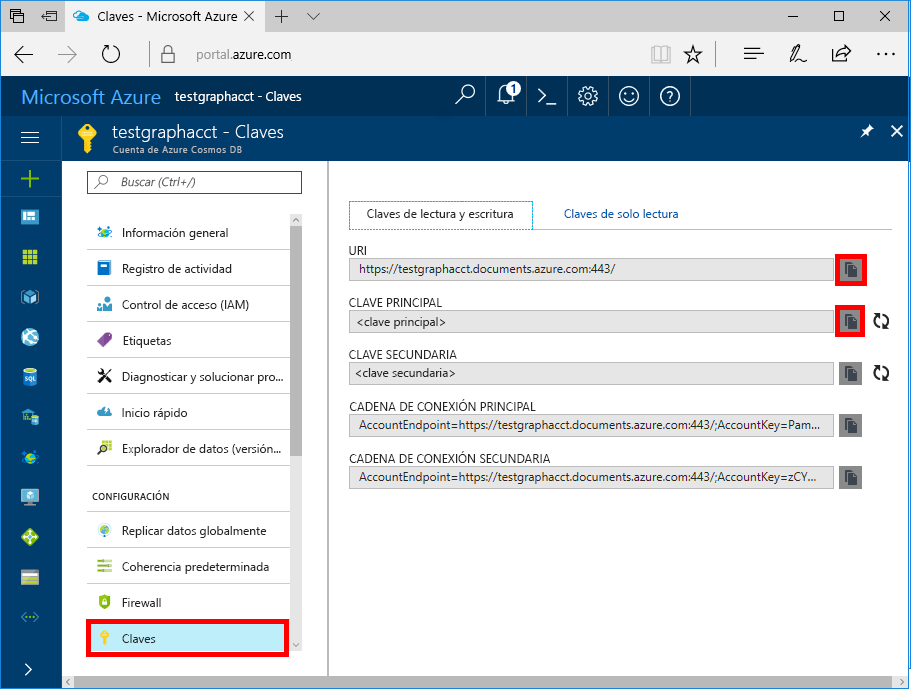

# <a name="azure-cosmos-db-create-query-and-traverse-a-graph-in-the-gremlin-console"></a>Azure Cosmos DB: Creación, consulta y recorrido de un grafo en la consola de Gremlin

> [!div class="op_single_selector"]
> * [Gremlin Console](create-graph-gremlin-console.md)
> * [.NET](create-graph-dotnet.md)
> * [Java](create-graph-java.md)
> * [Node.js](create-graph-nodejs.md)
> * [Python](create-graph-python.md)
> * [PHP](create-graph-php.md)
>  

Azure Cosmos DB es un servicio de base de datos con varios modelos y de distribución global de Microsoft. Puede crear rápidamente bases de datos de documentos, clave-valor y grafos, y realizar consultas en ellas. Todas las bases de datos se beneficiarán de las funcionalidades de distribución global y escala horizontal en Azure Cosmos DB. 

En esta guía de inicio rápido se muestra cómo crear una cuenta de [Gremlin API](graph-introduction.md), una base de datos y un grafo (contenedor) de Azure Cosmos DB mediante Azure Portal y cómo usar la [consola de Gremlin](https://tinkerpop.apache.org/docs/current/reference/#gremlin-console) de [Apache TinkerPop](https://tinkerpop.apache.org) para trabajar con los datos de Gremlin API. En este tutorial, creará y consultará vértices y bordes, actualizará una propiedad de vértice, consultará vértices, recorrerá el grafo y quitará un vértice.


La consola de Gremlin se basa en Groovy/Java y se ejecuta en Linux, Mac y Windows. Puede descargarla desde el [sitio de Apache TinkerPop](https://tinkerpop.apache.org/downloads.html).

## <a name="prerequisites"></a>Requisitos previos

Necesita tener una suscripción de Azure para crear una cuenta de Azure Cosmos DB para este inicio rápido.

[!INCLUDE [quickstarts-free-trial-note](../../includes/quickstarts-free-trial-note.md)]

También necesita instalar la [consola de Gremlin](https://tinkerpop.apache.org/). Use la versión 3.2.5 o posterior. (Para usar la consola de Gremlin en Windows, es preciso instalar [Java Runtime](https://www.oracle.com/technetwork/java/javase/overview/index.html).)

## <a name="create-a-database-account"></a>Creación de una cuenta de base de datos

[!INCLUDE [cosmos-db-create-dbaccount-graph](../../includes/cosmos-db-create-dbaccount-graph.md)]

## <a name="add-a-graph"></a>Agregar un grafo

[!INCLUDE [cosmos-db-create-graph](../../includes/cosmos-db-create-graph.md)]

## <a id="ConnectAppService"></a>Conectarse a su App Service
1. Antes de iniciar la consola de Gremlin, cree o modifique el archivo de configuración remote-secure.yaml en el directorio `apache-tinkerpop-gremlin-console-3.2.5/conf`.
2. Rellene sus configuraciones de *host*, *puerto*, *nombre de usuario*, *contraseña*, *connectionPool* y *serializador* como se define en la siguiente tabla:

    Configuración|Valor sugerido|DESCRIPCIÓN
    ---|---|---
    hosts|[*nombre-de-la-cuenta*.gremlin.cosmosdb.azure.com] o [*nombre-de-la-cuenta*.graphs.azure.com] para las cuentas creadas antes del 20 de diciembre de 2017|Vea la siguiente captura de pantalla. Este es el valor del Identificador URI de Gremlin en la página Información general de Azure Portal, entre corchetes, sin la terminación :443/.
    puerto|443|Se establece en 443.
    nombre de usuario|*Su nombre de usuario*|El recurso con la forma `/dbs/<db>/colls/<coll>` donde `<db>` es el nombre de la base de datos y `<coll>` es el nombre de la colección.
    contraseña|*La clave principal*| Ver la segunda captura de pantalla más adelante. Es la clave principal, que puede obtener en la página Claves de Azure Portal, en el cuadro de texto Clave principal. Use el botón Copiar a la izquierda del cuadro de texto para copiar el valor.
    connectionPool|{enableSsl: true}|La configuración del grupo de conexiones para SSL.
    serializer|{ className:org.apache.tinkerpop.gremlin.<br>driver.ser.GraphSONMessageSerializerV1d0,<br> config: { serializeResultToString: true }}|Establecer en este valor y eliminar los saltos de línea `\n` cuando se pegue el valor.

    Para obtener el valor de los hosts, copie el valor de **URI de Gremlin** de la página **Introducción**: 

    Para obtener el valor de la contraseña, copie la **Clave principal** de la página **Claves**: 

El archivo remote-secure.yaml debe tener este aspecto:

```
hosts: [your_database_server.gremlin.cosmosdb.azure.com]
port: 443
username: /dbs/your_database_account/colls/your_collection
password: your_primary_key
connectionPool: {
  enableSsl: true
}
serializer: { className: org.apache.tinkerpop.gremlin.driver.ser.GraphSONMessageSerializerV1d0, config: { serializeResultToString: true }}
```

3. En el terminal, ejecute `bin/gremlin.bat` o `bin/gremlin.sh` para iniciar la [Consola de Gremlin](https://tinkerpop.apache.org/docs/3.2.5/tutorials/getting-started/).
4. En el terminal, ejecute `:remote connect tinkerpop.server conf/remote-secure.yaml` para conectarse a App Service.

    > [!TIP]
    > Si recibe el error `No appenders could be found for logger` asegúrese de que ha actualizado el valor de serializador en el archivo remote-secure.yaml tal como se describe en el paso 2. 

5. A continuación ejecute `:remote console` para redirigir todos los comandos de la consola al servidor remoto.

   > [!NOTE]
   > Si no ejecuta el comando `:remote console` pero quiere redirigir todos los comandos de consola al servidor remoto, debe anteponer `:>` al comando. Por ejemplo, tiene que ejecutarlo como `:> g.V().count()`. Este prefijo es parte del comando y es importante si se usa la consola de Gremlin con Azure Cosmos DB. Si omite este prefijo, le indica a la consola que ejecute el comando localmente, a menudo en un gráfico en memoria. Con este prefijo `:>`, le indica a la consola que ejecute un comando remoto, en este caso en Azure Cosmos DB (ya sea el emulador local o una instancia de Azure).

Estupendo. Ahora que hemos terminado la configuración, comencemos a ejecutar algunos comandos de la consola.

Probemos un comando count() sencillo. En el símbolo del sistema de la consola, escriba lo siguiente:

```
g.V().count()
```

## <a name="create-vertices-and-edges"></a>Crear vértices y bordes

Comencemos agregando cinco vértices de personas para *Thomas*, *Mary Kay*, *Robin*, *Ben* y *Jack*.

Entrada (Thomas):

```
g.addV('person').property('firstName', 'Thomas').property('lastName', 'Andersen').property('age', 44).property('userid', 1)
```

Salida:

```
==>[id:796cdccc-2acd-4e58-a324-91d6f6f5ed6d,label:person,type:vertex,properties:[firstName:[[id:f02a749f-b67c-4016-850e-910242d68953,value:Thomas]],lastName:[[id:f5fa3126-8818-4fda-88b0-9bb55145ce5c,value:Andersen]],age:[[id:f6390f9c-e563-433e-acbf-25627628016e,value:44]],userid:[[id:796cdccc-2acd-4e58-a324-91d6f6f5ed6d|userid,value:1]]]]
```
Entrada (Mary Kay):

```
g.addV('person').property('firstName', 'Mary Kay').property('lastName', 'Andersen').property('age', 39).property('userid', 2)

```

Salida:

```
==>[id:0ac9be25-a476-4a30-8da8-e79f0119ea5e,label:person,type:vertex,properties:[firstName:[[id:ea0604f8-14ee-4513-a48a-1734a1f28dc0,value:Mary Kay]],lastName:[[id:86d3bba5-fd60-4856-9396-c195ef7d7f4b,value:Andersen]],age:[[id:bc81b78d-30c4-4e03-8f40-50f72eb5f6da,value:39]],userid:[[id:0ac9be25-a476-4a30-8da8-e79f0119ea5e|userid,value:2]]]]

```

Entrada (Robin):

```
g.addV('person').property('firstName', 'Robin').property('lastName', 'Wakefield').property('userid', 3)
```

Salida:

```
==>[id:8dc14d6a-8683-4a54-8d74-7eef1fb43a3e,label:person,type:vertex,properties:[firstName:[[id:ec65f078-7a43-4cbe-bc06-e50f2640dc4e,value:Robin]],lastName:[[id:a3937d07-0e88-45d3-a442-26fcdfb042ce,value:Wakefield]],userid:[[id:8dc14d6a-8683-4a54-8d74-7eef1fb43a3e|userid,value:3]]]]
```

Entrada (Ben):

```
g.addV('person').property('firstName', 'Ben').property('lastName', 'Miller').property('userid', 4)

```

Salida:

```
==>[id:ee86b670-4d24-4966-9a39-30529284b66f,label:person,type:vertex,properties:[firstName:[[id:a632469b-30fc-4157-840c-b80260871e9a,value:Ben]],lastName:[[id:4a08d307-0719-47c6-84ae-1b0b06630928,value:Miller]],userid:[[id:ee86b670-4d24-4966-9a39-30529284b66f|userid,value:4]]]]
```

Entrada (Jack):

```
g.addV('person').property('firstName', 'Jack').property('lastName', 'Connor').property('userid', 5)
```

Salida:

```
==>[id:4c835f2a-ea5b-43bb-9b6b-215488ad8469,label:person,type:vertex,properties:[firstName:[[id:4250824e-4b72-417f-af98-8034aa15559f,value:Jack]],lastName:[[id:44c1d5e1-a831-480a-bf94-5167d133549e,value:Connor]],userid:[[id:4c835f2a-ea5b-43bb-9b6b-215488ad8469|userid,value:5]]]]
```


Después, vamos a agregar bordes a las relaciones entre estas personas.

Entrada (Thomas -> Mary Kay):

```
g.V().hasLabel('person').has('firstName', 'Thomas').addE('knows').to(g.V().hasLabel('person').has('firstName', 'Mary Kay'))
```

Salida:

```
==>[id:c12bf9fb-96a1-4cb7-a3f8-431e196e702f,label:knows,type:edge,inVLabel:person,outVLabel:person,inV:0d1fa428-780c-49a5-bd3a-a68d96391d5c,outV:1ce821c6-aa3d-4170-a0b7-d14d2a4d18c3]
```

Entrada (Thomas -> Robin):

```
g.V().hasLabel('person').has('firstName', 'Thomas').addE('knows').to(g.V().hasLabel('person').has('firstName', 'Robin'))
```

Salida:

```
==>[id:58319bdd-1d3e-4f17-a106-0ddf18719d15,label:knows,type:edge,inVLabel:person,outVLabel:person,inV:3e324073-ccfc-4ae1-8675-d450858ca116,outV:1ce821c6-aa3d-4170-a0b7-d14d2a4d18c3]
```

Entrada (Robin -> Ben):

```
g.V().hasLabel('person').has('firstName', 'Robin').addE('knows').to(g.V().hasLabel('person').has('firstName', 'Ben'))
```

Salida:

```
==>[id:889c4d3c-549e-4d35-bc21-a3d1bfa11e00,label:knows,type:edge,inVLabel:person,outVLabel:person,inV:40fd641d-546e-412a-abcc-58fe53891aab,outV:3e324073-ccfc-4ae1-8675-d450858ca116]
```

## <a name="update-a-vertex"></a>Actualizar un vértice

Vamos a actualizar el vértice *Thomas* con una nueva edad de *45*.

Entrada:
```
g.V().hasLabel('person').has('firstName', 'Thomas').property('age', 45)
```
Salida:

```
==>[id:ae36f938-210e-445a-92df-519f2b64c8ec,label:person,type:vertex,properties:[firstName:[[id:872090b6-6a77-456a-9a55-a59141d4ebc2,value:Thomas]],lastName:[[id:7ee7a39a-a414-4127-89b4-870bc4ef99f3,value:Andersen]],age:[[id:a2a75d5a-ae70-4095-806d-a35abcbfe71d,value:45]]]]
```

## <a name="query-your-graph"></a>Consultar el grafo

Ahora, vamos a ejecutar una variedad de consultas en su grafo.

Primero, vamos a probar una consulta con un filtro para devolver solo las personas mayores de 40 años.

Entrada (consulta de filtro):

```
g.V().hasLabel('person').has('age', gt(40))
```

Salida:

```
==>[id:ae36f938-210e-445a-92df-519f2b64c8ec,label:person,type:vertex,properties:[firstName:[[id:872090b6-6a77-456a-9a55-a59141d4ebc2,value:Thomas]],lastName:[[id:7ee7a39a-a414-4127-89b4-870bc4ef99f3,value:Andersen]],age:[[id:a2a75d5a-ae70-4095-806d-a35abcbfe71d,value:45]]]]
```

Después, vamos a proyectar el nombre de las personas que sean mayores de 40 años.

Entrada (filtro + consulta de proyección):

```
g.V().hasLabel('person').has('age', gt(40)).values('firstName')
```

Salida:

```
==>Thomas
```

## <a name="traverse-your-graph"></a>Recorrer el grafo

Vamos a recorrer el grafo para devolver todos los amigos de Thomas.

Entrada (amigos de Thomas):

```
g.V().hasLabel('person').has('firstName', 'Thomas').outE('knows').inV().hasLabel('person')
```

Salida: 

```
==>[id:f04bc00b-cb56-46c4-a3bb-a5870c42f7ff,label:person,type:vertex,properties:[firstName:[[id:14feedec-b070-444e-b544-62be15c7167c,value:Mary Kay]],lastName:[[id:107ab421-7208-45d4-b969-bbc54481992a,value:Andersen]],age:[[id:4b08d6e4-58f5-45df-8e69-6b790b692e0a,value:39]]]]
==>[id:91605c63-4988-4b60-9a30-5144719ae326,label:person,type:vertex,properties:[firstName:[[id:f760e0e6-652a-481a-92b0-1767d9bf372e,value:Robin]],lastName:[[id:352a4caa-bad6-47e3-a7dc-90ff342cf870,value:Wakefield]]]]
```

Ahora, vamos a obtener la siguiente capa de vértices. Recorra el grafo para devolver todos los amigos de los amigos de Thomas.

Entrada (amigos de los amigos de Thomas):

```
g.V().hasLabel('person').has('firstName', 'Thomas').outE('knows').inV().hasLabel('person').outE('knows').inV().hasLabel('person')
```
Salida:

```
==>[id:a801a0cb-ee85-44ee-a502-271685ef212e,label:person,type:vertex,properties:[firstName:[[id:b9489902-d29a-4673-8c09-c2b3fe7f8b94,value:Ben]],lastName:[[id:e084f933-9a4b-4dbc-8273-f0171265cf1d,value:Miller]]]]
```

## <a name="drop-a-vertex"></a>Quitar un vértice

Vamos a eliminar un vértice de la base de datos del grafo.

Entrada (quitar vértice de Jack):

```
g.V().hasLabel('person').has('firstName', 'Jack').drop()
```

## <a name="clear-your-graph"></a>Borrar el grafo

Por último, vamos a borrar todos los vértices y bordes de la base de datos.

Entrada:

```
g.E().drop()
g.V().drop()
```

Felicidades. Acaba de completar este tutorial de Azure Cosmos DB: Gremlin API

## <a name="review-slas-in-the-azure-portal"></a>Revisión de los SLA en Azure Portal

[!INCLUDE [cosmosdb-tutorial-review-slas](../../includes/cosmos-db-tutorial-review-slas.md)]

## <a name="clean-up-resources"></a>Limpieza de recursos

[!INCLUDE [cosmosdb-delete-resource-group](../../includes/cosmos-db-delete-resource-group.md)]

## <a name="next-steps"></a>Pasos siguientes

En este inicio rápido, ha obtenido información sobre cómo crear una cuenta de Azure Cosmos DB, crear un grafo con el Explorador de datos, crear vértices y bordes, y recorrer el grafo con la consola de Gremlin. Ahora puede crear consultas más complejas e implementar con Gremlin una lógica de recorrido del grafo eficaz. 

> [!div class="nextstepaction"]
> [Consulta mediante Gremlin](tutorial-query-graph.md)
