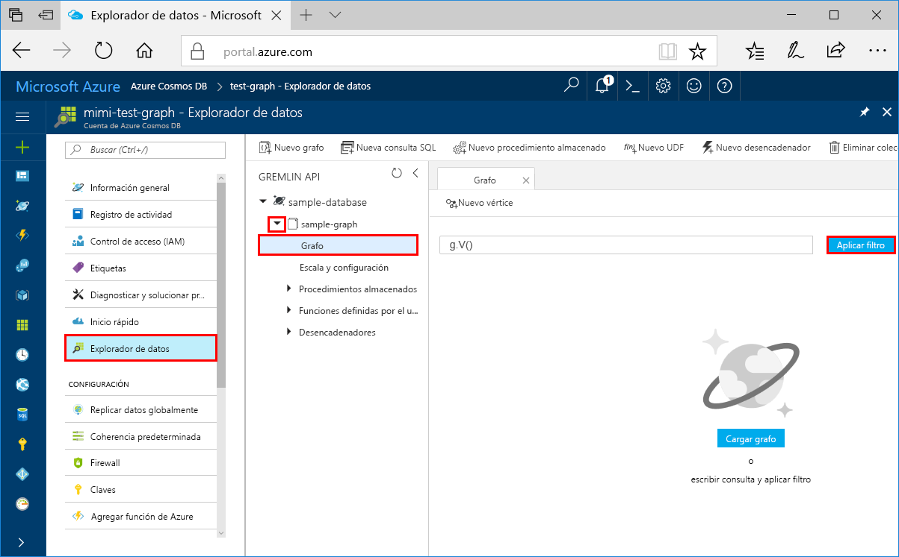
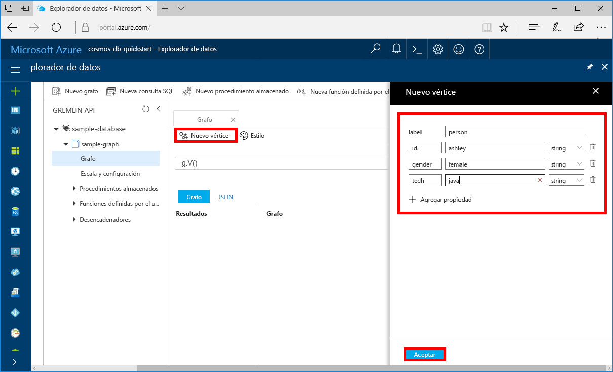

# <a name="azure-cosmos-db-create-a-graph-database-using-java-and-the-azure-portal"></a>Azure Cosmos DB: creación una base de datos de grafos mediante Java y Azure Portal

Azure Cosmos DB es un servicio de base de datos con varios modelos y de distribución global de Microsoft. Utilice Azure Cosmos DB para crear y consultar rápidamente las bases de datos de gráficos, tablas y documentos administradas. 

Este tutorial rápido crea una base de datos de gráficos simple mediante las herramientas de Azure Portal para Azure Cosmos DB. Este tutorial rápido también muestra cómo crear rápidamente una aplicación de consola Java usando una base de datos de grafos mediante el controlador [Gremlin Java](https://mvnrepository.com/artifact/org.apache.tinkerpop/gremlin-driver) de OSS. Las instrucciones que se indican en este tutorial rápido se pueden seguir en cualquier sistema operativo que sea capaz de ejecutar Java. Con esta guía de inicio rápido se familiarizará con la creación y modificación de los gráficos en la interfaz de usuario o mediante programación, lo que prefiera. 

## <a name="prerequisites"></a>Requisitos previos
[!INCLUDE [quickstarts-free-trial-note](../../includes/quickstarts-free-trial-note.md)]

Además:

* [Kit de desarrollo de Java (JDK) 1.7+](http://www.oracle.com/technetwork/java/javase/downloads/jdk8-downloads-2133151.html)
    * En Ubuntu, ejecute `apt-get install default-jdk` para instalar el JDK.
    * Asegúrese de establecer la variable de entorno JAVA_HOME para que apunte a la carpeta donde está instalado el JDK.
* [Descargar](http://maven.apache.org/download.cgi) e [instalar](http://maven.apache.org/install.html) un archivo binario de [Maven](http://maven.apache.org/)
    * En Ubuntu, puede ejecutar `apt-get install maven` para instalar Maven.
* [Git](https://www.git-scm.com/)
    * En Ubuntu, puede ejecutar `sudo apt-get install git` para instalar Git.

## <a name="create-a-database-account"></a>Creación de una cuenta de base de datos

Para poder crear una base de datos de grafos, debe crear una cuenta de base de datos de Gremlin (Graph) con Azure Cosmos DB.

[!INCLUDE [cosmos-db-create-dbaccount-graph](../../includes/cosmos-db-create-dbaccount-graph.md)]

## <a name="add-a-graph"></a>Agregar un grafo

Ahora puede usar la herramienta Explorador de datos en Azure Portal para crear una base de datos de grafos. 

1. Haga clic en **Explorador de datos** > **Nuevo gráfico**.

    El área **Agregar gráfico** se muestra en el extremo derecho, pero es posible que haya que desplazarse hacia la derecha para verlo.

    

2. En la página **Agregar gráfico**, especifique la configuración del nuevo gráfico.

    Configuración|Valor sugerido|Descripción
    ---|---|---
    Identificador de base de datos|sample-database|Escriba *sample-database* como nombre de la nueva base de datos. Los nombres de bases de datos deben tener entre 1 y 255 caracteres y no pueden contener `/ \ # ?` o un espacio al final.
    Identificador de grafo|sample-graph|Escriba *sample-graph* como nombre de la nueva colección. Los nombres de grafo tienen los mismos requisitos de caracteres que los identificadores de base de datos.
    Capacidad de almacenamiento|Fija (10 GB)|Cambie el valor a **Fija (10 GB)**. Este valor corresponde a la capacidad de almacenamiento de la base de datos.
    Rendimiento|400 RU|Cambie el rendimiento a 400 unidades de solicitud por segundo (RU/s). Si quiere reducir la latencia, puede escalar verticalmente el rendimiento más adelante.
    Clave de partición|Déjelo en blanco|Para este tutorial rápido, deje en blanco la clave de partición.

3. Una vez que haya rellenado el formulario, haga clic en **Aceptar**.

## <a name="clone-the-sample-application"></a>Clonación de la aplicación de ejemplo

Ahora vamos a empezar a trabajar con el código. Vamos a clonar una aplicación de API Graph desde GitHub, establecer la cadena de conexión y ejecutarla. Verá lo fácil que es trabajar con datos mediante programación.  

1. Abra una ventana de terminal de Git, como git bash y utilice el comando `cd` para cambiar a una carpeta para instalar la aplicación de ejemplo.  

    ```bash
    cd "C:\git-samples"
    ```

2. Ejecute el comando siguiente para clonar el repositorio de ejemplo. Este comando crea una copia de la aplicación de ejemplo en el equipo. 

    ```bash
    git clone https://github.com/Azure-Samples/azure-cosmos-db-graph-java-getting-started.git
    ```

## <a name="review-the-code"></a>Revisar el código

Este paso es opcional. Si está interesado en aprender cómo se crean los recursos de base de datos en el código, puede revisar los siguientes fragmentos de código. Todos los fragmentos de código se toman del archivo `Program.java` en la carpeta C:\git-samples\azure-cosmos-db-graph-java-getting-started\src\GetStarted. En caso contrario, puede ir directamente a [Actualización de la cadena de conexión](#update-your-connection-string). 

* El elemento `Client` de Gremlin se a partir de la configuración de `src/remote.yaml`.

    ```java
    cluster = Cluster.build(new File("src/remote.yaml")).create();
    ...
    client = cluster.connect();
    ```

* Se ejecuta una serie de pasos de Gremlin mediante el método `client.submit`.

    ```java
    ResultSet results = client.submit(gremlin);

    CompletableFuture<List<Result>> completableFutureResults = results.all();
    List<Result> resultList = completableFutureResults.get();

    for (Result result : resultList) {
        System.out.println(result.toString());
    }
    ```

## <a name="update-your-connection-information"></a>Actualización de la información de conexión

Ahora vuelva a Azure Portal para obtener la información de conexión y cópiela en la aplicación. Esta configuración permitirá que la aplicación se comunique con la base de datos hospedada.

1. En [Azure Portal](http://portal.azure.com/), haga clic en **Claves**. 

    Copie la primera parte del valor URI.

    
2. Abra el archivo src/remote.yaml y pegue el valor sobre `$name$` en `hosts: [$name$.graphs.azure.com]`.

    La línea 1 de remote.yaml debe tener un aspecto similar a 

    `hosts: [test-graph.graphs.azure.com]`

3. En Azure Portal, use el botón Copiar para copiar la clave principal y péguela sobre `$masterKey$` en `password: $masterKey$`.

    La línea 4 de remote.yaml debe tener ahora un aspecto similar a 

    `password: 2Ggkr662ifxz2Mg==`

4. Cambio de la línea 3 de remote.yaml de

    `username: /dbs/$database$/colls/$collection$`

    to 

    `username: /dbs/sample-database/colls/sample-graph`

5. Guarde el archivo remote.yaml.

## <a name="run-the-console-app"></a>Ejecutar la aplicación de consola

1. En la ventana del terminal de git, use `cd` para cambiar a la carpeta azure-cosmos-db-graph-java-getting-started.

    ```git
    cd "C:\git-samples\azure-cosmos-db-graph-java-getting-started"
    ```

2. En la ventana del terminal de git, escriba `mvn package` para instalar los paquetes Java necesarios.

3. En la ventana del terminal de Git, ejecute `mvn exec:java -D exec.mainClass=GetStarted.Program` para iniciar la aplicación de Java.

    En la ventana del terminal se muestran los vértices y los bordes que se agregan al grafo. Una vez que el programa se detenga, vuelva a cambiar a Azure Portal en el Explorador de Internet. 

<a id="add-sample-data"></a>
## <a name="review-and-add-sample-data"></a>Revise y agregue datos de ejemplo

Ahora puede volver al Explorador de datos y ver los vértices que se agregan al grafo, y agregar puntos de datos adicionales.

1. Haga clic en el **Explorador de datos**, expanda **sample-graph**, haga clic en **Gráfico** y luego haga clic en **Aplicar filtro**. 

   

2. En la lista **Resultados**, observe los nuevos usuarios agregados al grafo. Seleccione **ben** y observe que se ha conectado a robin. Puede mover los vértices arrastrando y colocando, acercarse y alejarse desplazando la rueda del mouse y ampliar el tamaño del gráfico con la flecha doble. 

   

3. Vamos a agregar algunos usuarios nuevos. Haga clic en el botón **Nuevo vértice** para agregar datos al grafo.

   

4. Escriba una etiqueta de *persona*.

5. Haga clic en **Agregar propiedad** para agregar cada una de las siguientes propiedades. Tenga en cuenta que puede crear propiedades únicas para cada persona en el grafo. Solo se requiere la clave de identificador.

    key|value|Notas
    ----|----|----
    id|ashley|Identificador único del vértice. Si no se especifica un identificador, se genera uno automáticamente.
    gender|mujer| 
    técnico | Java | 

    > [!NOTE]
    > En este tutorial rápido se crea una colección sin particiones. Sin embargo, si crea una colección con particiones especificando una clave de partición durante la creación de la colección, debe incluir la clave de partición como una clave en cada nuevo vértice. 

6. Haga clic en **Aceptar**. Puede que tenga que expandir la pantalla para ver **Aceptar** en la parte inferior de la pantalla.

7. Haga clic en **Nuevo vértice** de nuevo y agregue otro usuario. 

8. Escriba una etiqueta de *persona*.

9. Haga clic en **Agregar propiedad** para agregar cada una de las siguientes propiedades:

    key|value|Notas
    ----|----|----
    id|rakesh|Identificador único del vértice. Si no se especifica un identificador, se genera uno automáticamente.
    gender|hombre| 
    centro educativo|MIT| 

10. Haga clic en **Aceptar**. 

11. Haga clic en **Aplicar filtro** con el filtro `g.V()` predeterminado para mostrar todos los valores en el gráfico. Todos los usuarios se muestran ahora en la lista **Resultados**. 

    Si agrega más datos, puede usar filtros para limitar los resultados. De forma predeterminada, el Explorador de datos usa `g.V()` para recuperar todos los vértices en un gráfico. Se puede cambiar a otra [consulta de gráfico](tutorial-query-graph.md), como `g.V().count()`, para devolver un recuento de todos los vértices en el gráfico en formato JSON. Si ha cambiado el filtro, vuelva a cambiar el filtro a `g.V()` y haga clic en **Aplicar filtro** para volver a mostrar todos los resultados.

12. Ahora podemos conectar a rakesh y ashley. Asegúrese de que **ashley** está seleccionado en la lista **Resultados** y, a continuación, haga clic en el botón para editar junto a **Destinos** en la parte inferior derecha. Puede que tenga que ampliar la ventana para ver el área **Propiedades**.

   

13. En el cuadro **Destino**, escriba *rakesh*, en el cuadro **Edge label** (Etiqueta de borde), escriba *sabe* y, a continuación, haga clic en la casilla.

   

14. Ahora seleccione **rakesh** en la lista de resultados y compruebe que ashley y rakesh están conectados. 

   

   Esto completa la parte de la creación de recursos de este tutorial. Puede seguir agregando vértices en el gráfico, modificar los vértices existentes o cambiar las consultas. Ahora vamos a revisar las métricas que proporciona Azure Cosmos DB y, a continuación, limpiaremos los recursos. 

## <a name="review-slas-in-the-azure-portal"></a>Revisar los SLA en Azure Portal

[!INCLUDE [cosmosdb-tutorial-review-slas](../../includes/cosmos-db-tutorial-review-slas.md)]

## <a name="clean-up-resources"></a>Limpieza de recursos

[!INCLUDE [cosmosdb-delete-resource-group](../../includes/cosmos-db-delete-resource-group.md)]

## <a name="next-steps"></a>Pasos siguientes

En esta guía de inicio rápido, ha obtenido información sobre cómo crear una cuenta de Azure Cosmos DB, crear un grafo mediante el Explorador de datos y ejecutar una aplicación. Ahora puede crear consultas más complejas e implementar con Gremlin una lógica eficaz de recorrido del grafo. 

> [!div class="nextstepaction"]
> [Consulta mediante Gremlin](tutorial-query-graph.md)

