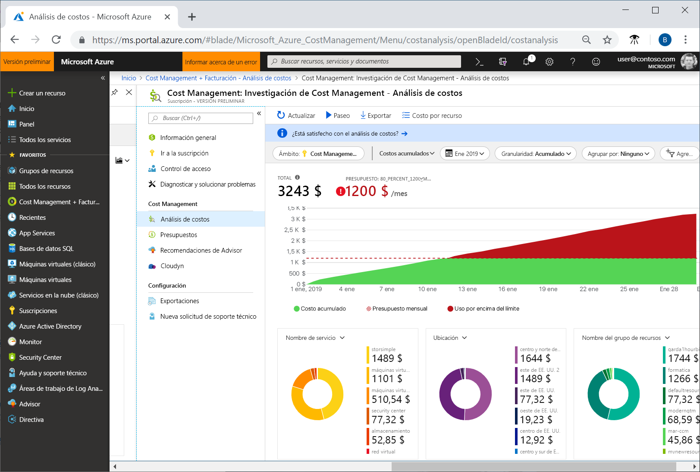
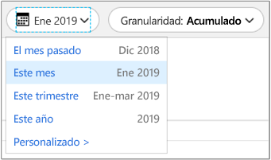
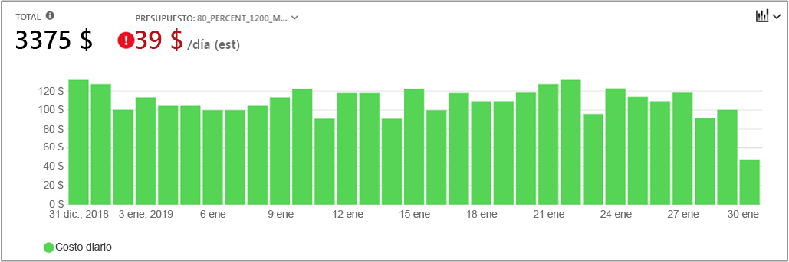
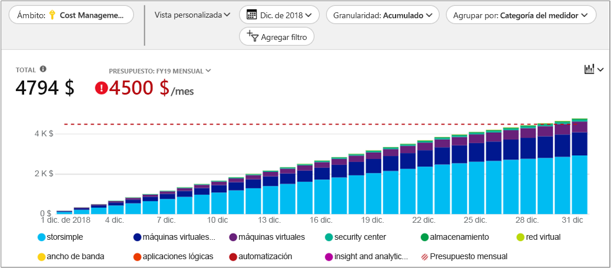
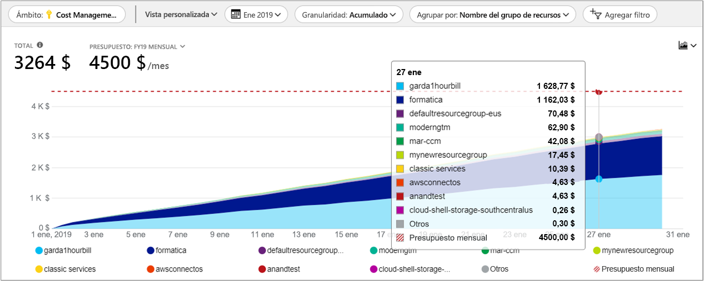

# Guía de inicio rápido: Explore y analice los costos con Análisis de costos

Antes de que pueda controlar y optimizar correctamente sus costos de Azure, debe saber en qué lugar de su organización se originaron los costos. También resulta de utilidad saber cuánto dinero cuestan sus servicios y en apoyo a qué entornos y sistemas. La visión general de la gama de costos al completo es fundamental para conocer con precisión los patrones de gasto de la organización. Los patrones de gastos pueden utilizarse para aplicar mecanismos de control de costos, como los presupuestos.

En esta guía de inicio rápido, va a utilizar el análisis de costos para explorar y analizar los costos de organización. Puede ver los costos agregados de la organización para saber dónde se producen esos costos con el tiempo e identificar las tendencias de gasto. Puede ver los costos acumulados con el tiempo para estimar las tendencias de costos mensual, trimestral o incluso anualmente con respecto a un presupuesto. Un presupuesto ayuda a los proveedores a cumplir con las restricciones financieras. Y un presupuesto se utiliza para ver los costos diarios o mensuales para aislar las irregularidades de los gastos. Además, puede descargar los datos del informe actual para realizar análisis adicionales o para usarlos en un sistema externo.

En esta guía de inicio rápido, ha aprendido a hacer lo siguiente:

- Revise los costos en análisis de costos
- Personalización de vistas de costos
- Descargue datos de análisis de costos

## Requisitos previos

El análisis de costos está disponible para todos los clientes con [Contrato Enterprise (EA)](https://azure.microsoft.com/pricing/enterprise-agreement/). Debe tener al menos acceso de lectura a uno o varios de los siguientes ámbitos para ver datos de costos. Para más información acerca de cómo asignar acceso a los datos de Cost Management, consulte [Asignación del acceso a los datos](assign-access-acm-data.md).

- Cuenta de facturación
- department
- Cuenta de inscripción
- Grupo de administración
- Subscription
- Grupos de recursos

## Inicio de sesión en Azure

- Inicie sesión en Azure Portal en https://portal.azure.com.

## Revise los costos en análisis de costos

Para revisar los costos con el análisis de costos, en Azure Portal, vaya a **Administración de costos + Facturación**  &gt; **Administración de costos** &gt;  **Cambiar ámbito**, elija un ámbito y haga clic en **Seleccionar**.

El ámbito que seleccione se utiliza en todo Cost Management para proporcionar la consolidación de datos y controlar el acceso a la información de costos. Cuando use ámbitos, no realice una selección múltiple de ellos. En su lugar, seleccione un ámbito mayor al que otros se acumulan y luego filtre lo que desee. Es importante comprender esto porque algunas personas no deberían tener acceso a un ámbito principal al que se acumulan los ámbitos secundarios.

Haga clic en **Abrir análisis de costos**.

La vista de análisis de costos inicial incluye las siguientes áreas:

**Total**: muestra los costos totales correspondientes al mes actual.

**Presupuesto**: muestra el límite de gasto previsto para el ámbito seleccionado, en caso de estar disponible.

**Costo acumulado**: muestra el gasto total acumulado de forma diaria desde principios de mes. Después de [crear un presupuesto](tutorial-acm-create-budgets.md) para su cuenta de facturación o suscripción, podrá ver rápidamente su tendencia de gastos con el presupuesto. Mantenga el puntero sobre una fecha para ver el costo acumulado hasta ese día.

**Gráficos dinámicos (anillos)**: proporcionan gráficos dinámicos, que desglosan el costo total por un conjunto común de propiedades estándar. Muestran el costo acumulado durante el mes actual, de mayor a menor. Puede cambiar los gráficos dinámicos en cualquier momento seleccionando un área dinámica diferente. Los costos se clasifican por servicio (categoría de medidor), ubicación (región) y ámbito secundario predeterminado. Por ejemplo, cuentas de inscripción en cuentas de facturación, grupos de recursos en suscripciones y recursos en grupos de recursos.

## Personalización de vistas de costos

La vista predeterminada proporciona respuestas rápidas a preguntas habituales como:

- ¿Cuánto he gastado?
- ¿Me mantendré dentro de mi presupuesto?

Sin embargo, hay muchos casos donde se necesitan análisis más profundos. La personalización comienza en la parte superior de la página, con la selección de fecha.

De forma predeterminada, el análisis de costos muestra los datos correspondientes al mes actual. Use el selector de fecha para cambiar rápidamente al último mes, este mes, este trimestre natural, este año natural o un intervalo de fechas personalizado que elija. Seleccionar el último mes es la forma más rápida de analizar su última factura de Azure y conciliar cargos fácilmente. Las opciones de trimestre y año actuales ayudan a hacer un seguimiento de los costos con respecto a presupuestos a más largo plazo. También puede seleccionar un intervalo de fechas diferente. Por ejemplo, puede seleccionar un solo día, los últimos siete días o los que sean desde un año antes del mes actual.

De forma predeterminada, el análisis de costos muestra los costos **acumulados**. Los costos acumulados incluyen todos los costos correspondientes a cada día, además de los días anteriores, a fin de obtener una vista en constante crecimiento de sus costos acumulados diarios. Esta vista está optimizada para mostrar sus tendencias con respecto a un presupuesto durante el intervalo de tiempo seleccionado.

También hay la vista **diaria** que muestra los costos de cada día. La vista diaria no muestra una tendencia de crecimiento. La vista está diseñada para mostrar irregularidades como picos de costos o caídas de un día para otro. Si ha seleccionado un presupuesto, la vista diaria también muestra una estimación del aspecto que puede tener su presupuesto diario. Cuando los costos diarios son sistemáticamente superiores al presupuesto diario estimado, puede esperar sobrepasar su presupuesto mensual. El presupuesto diario estimado simplemente se trata de un medio para ayudarle a visualizar su presupuesto en un nivel más bajo. Cuando los costos diarios experimenten fluctuaciones, la comparación del presupuesto diario estimado con su presupuesto mensual será menos precisa.

Por lo general, puede esperar ver datos o notificaciones para los recursos consumidos en ocho horas.

En **Agrupar por** puede seleccionar una categoría de grupo para cambiar los datos mostrados en el gráfico del área total superior. La agrupación le permite ver rápidamente cómo se clasifican los gastos por recurso común y propiedades de uso común, como grupo de recursos o etiquetas de recursos. Para agrupar por etiquetas, seleccione la clave de etiqueta por la que desea agrupar. Verá los costos desglosados por cada valor de dicha etiqueta, con un segmento adicional para los recursos que tengan dicha etiqueta.

La mayoría de [los recursos de Azure admiten el etiquetado](../azure-resource-manager/tag-support.md); sin embargo, algunas etiquetas no están disponibles en Cost Management y facturación. Además, no se admiten las etiquetas de grupo de recursos. Cost Management solo admite etiquetas de recursos a partir de la fecha en que las etiquetas se aplican directamente al recurso.

Esta es una vista de los costos de servicio de Azure correspondientes al último mes.

Los gráficos dinámicos del gráfico principal muestran distintas agrupaciones para una imagen más amplia de los costos generales durante el período seleccionado y con los filtros elegidos. Seleccione una propiedad o una etiqueta para ver los costos agregados por cualquier dimensión. El conjunto completo de datos de la vista total se encuentra en la parte inferior de la pantalla. Para verlo, es preciso expandir el cajón **Datos** o seleccionar **Exportar > Descargar CSV** en la parte superior de la pantalla. Este es un ejemplo del cajón de datos de los grupos de recursos.

La imagen anterior muestra los nombres de los grupos de recursos. Aunque se puede agrupar por etiqueta para ver los costos totales por etiqueta, en ninguna de las vistas de análisis de costos está disponible la posibilidad de ver todas las etiquetas por recurso o grupo de recursos.

Al agrupar los costos por un atributo concreto, se muestran los diez mayores contribuidores a los costos, de mayor a menor. Si hay más de diez grupos, se muestran los nueve mayores colaboradores de costos. También se muestra como un grupo **Otros**, que cubre todos los demás grupos juntos. Al agrupar por etiquetas, también puede ver un grupo **Sin etiqueta** para los costos a los que no se ha aplicado la clave de etiqueta. El grupo **Sin etiqueta** siempre es el último, aunque haya más costos sin etiqueta que con ella. Si hay diez valores de etiqueta, o más, los costos sin etiqueta formarán parte de **Otros**.

Las máquinas virtuales, redes y recursos de almacenamiento *clásicos* (Azure Service Management o ASM) no comparten datos de facturación detallados. Al agrupar los costos, se combinan como **servicios clásicos**.

## Descargue datos de análisis de costos

Puede **descargar** información del análisis de costos para generar un archivo CSV para todos los datos mostrados actualmente en Azure Portal. Cualquier filtro o agrupación que se aplique se incluye en el archivo. Los datos subyacentes del gráfico Total superior que no se muestran activamente se incluyen en el archivo CSV.

## Pasos siguientes

Continúe con el primer tutorial para aprender crear y administrar presupuestos.

> [!div class="nextstepaction"]
> [Creación y administración de presupuestos](tutorial-acm-create-budgets.md)
