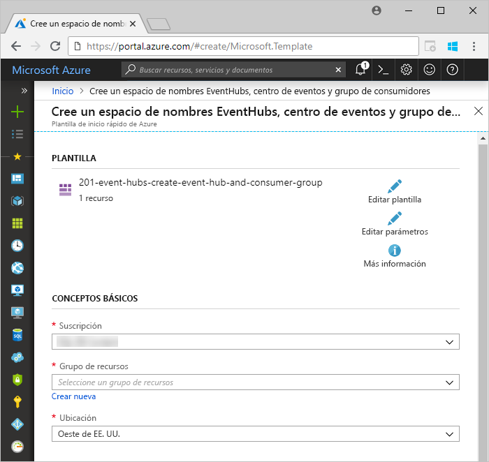
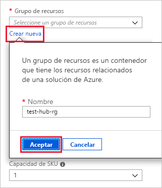
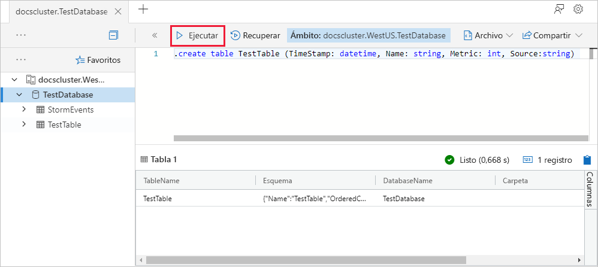
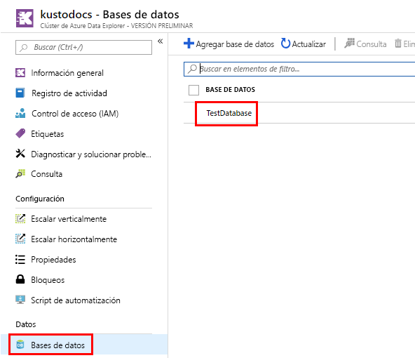
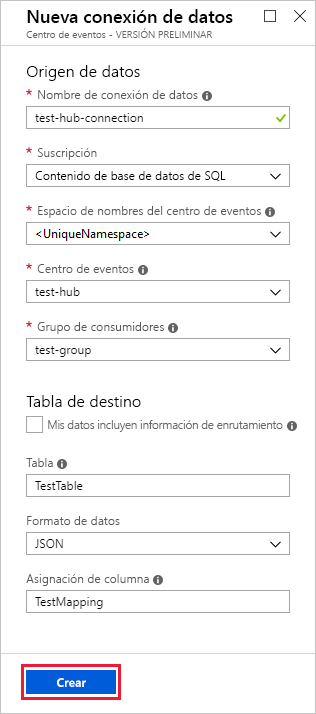
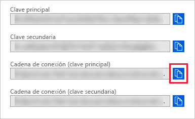
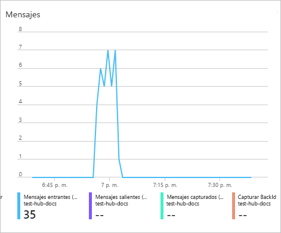
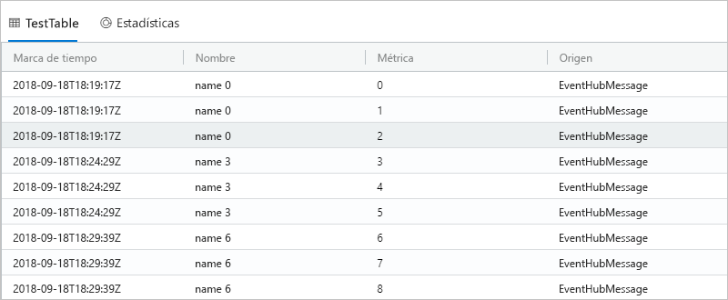

# <a name="quickstart-ingest-data-from-event-hub-into-azure-data-explorer"></a>Guía de inicio rápido: Ingesta de datos desde el centro de eventos en el Explorador de datos de Azure

El Explorador de datos de Azure es un servicio de exploración de datos altamente escalable y rápido para datos de telemetría y registro. El Explorador de datos de Azure ofrece ingesta (carga de datos) de Event Hubs, una plataforma de streaming de macrodatos y un servicio de ingesta de eventos. Event Hubs puede procesar millones de eventos por segundo prácticamente en tiempo real. En esta guía de inicio rápido, creará un centro de eventos, se conectará a él desde el Explorador de datos de Azure y verá el flujo de datos a través del sistema.

Si no tiene una suscripción a Azure, cree una [cuenta gratuita de Azure](https://azure.microsoft.com/free/) antes de empezar.

## <a name="prerequisites"></a>Requisitos previos

Además de una suscripción de Azure, necesita lo siguiente para completar esta guía de inicio rápido:

* [Una base de datos y un clúster de prueba](create-cluster-database-portal.md)

* [Una aplicación de ejemplo](https://github.com/Azure-Samples/event-hubs-dotnet-ingest) que genera los datos

* [Visual studio 2017, versión 15.3.2 o superior](https://www.visualstudio.com/vs/) para ejecutar la aplicación de ejemplo

## <a name="sign-in-to-the-azure-portal"></a>Inicio de sesión en Azure Portal

Inicie sesión en el [Azure Portal](https://portal.azure.com/).

## <a name="create-an-event-hub"></a>Crear un centro de eventos

En esta guía de inicio rápido, generará datos de ejemplo y los enviará a un centro de eventos. El primer paso es crear un centro de eventos. Para hacerlo, utilice una plantilla de Azure Resource Manager (ARM) en Azure Portal.

1. Seleccione el botón siguiente para iniciar la implementación.

    [](https://portal.azure.com/#create/Microsoft.Template/uri/https%3A%2F%2Fraw.githubusercontent.com%2FAzure%2Fazure-quickstart-templates%2Fmaster%2F201-event-hubs-create-event-hub-and-consumer-group%2Fazuredeploy.json)

    El botón **Deploy to Azure** (Implementar en Azure) le lleva a Azure Portal para rellenar un formulario de implementación.

    

1. Seleccione la suscripción en la que desea crear el centro de eventos y cree un grupo de recursos denominado *test-hub-rg*.

    

1. Rellene el formulario con la siguiente información.

    

    Use los valores predeterminados para cualquier configuración que no aparezca en la tabla siguiente.

    **Configuración** | **Valor sugerido** | **Descripción del campo**
    |---|---|---|
    | Subscription | Su suscripción | Seleccione la suscripción de Azure que quiere usar para el centro de eventos.|
    | Grupos de recursos | *test-hub-rg* | Cree un nuevo grupo de recursos. |
    | Ubicación | *Oeste de EE. UU.* | Seleccione *Oeste de EE. UU.* para esta guía de inicio rápido. En un sistema de producción, seleccione la región que mejor cubra sus necesidades.
    | Nombre de espacio de nombres | Nombre de espacio de nombres único | Elija un nombre único que identifique el espacio de nombres. Por ejemplo, *mytestnamespace*. El nombre de dominio *servicebus.windows.net* se anexa al nombre que proporcione. El nombre solo puede contener letras, números y guiones. El nombre debe comenzar y terminar con una letra o un número. El valor debe tener entre 6 y 50 caracteres.
    | Nombre del centro de eventos | *test-hub* | El centro de eventos se encuentra bajo el espacio de nombres, que proporciona un contenedor de ámbito único. El nombre del centro de eventos tiene que ser único dentro del espacio de nombres. |
    | Nombre del grupo de consumidores | *test-group* | Los grupos de consumidores permiten consumir varias aplicaciones y que cada una tenga una vista independiente del flujo de eventos. |
    | | |

1. Seleccione **Comprar**, que confirma que está creando recursos en su suscripción.

1. Seleccione **Notificaciones** en la barra de herramientas (el icono de campana) para supervisar el proceso de aprovisionamiento. La implementación puede tardar varios minutos en realizarse correctamente, pero puede continuar con el siguiente paso ahora.

## <a name="create-a-target-table-in-azure-data-explorer"></a>Creación de una tabla de destino en el Explorador de datos de Azure

Ahora creará una tabla en el Explorador de datos de Azure, al que Event Hubs enviará datos. Creará la tabla en el clúster y la base de datos aprovisionada en **Requisitos previos**.

1. En Azure Portal, bajo el clúster, seleccione **Consulta**.

    

1. Copie el siguiente comando en la ventana y seleccione **Ejecutar**.

    ```Kusto
    .create table TestTable (TimeStamp: datetime, Name: string, Metric: int, Source:string)
    ```

    

1. Copie el siguiente comando en la ventana y seleccione **Ejecutar**.

    ```Kusto
    .create table TestTable ingestion json mapping 'TestMapping' '[{"column":"TimeStamp","path":"$.timeStamp","datatype":"datetime"},{"column":"Name","path":"$.name","datatype":"string"},{"column":"Metric","path":"$.metric","datatype":"int"},{"column":"Source","path":"$.source","datatype":"string"}]'
    ```
    Este comando asigna los datos de JSON entrantes a los nombres de columna y tipos de datos utilizados al crear la tabla.

## <a name="connect-to-the-event-hub"></a>Conexión a Event Hubs

Ahora se conectará al centro de eventos desde el Explorador de datos de Azure, para que los datos que fluyen en el centro de eventos se transmitan a la tabla de prueba.

1. Seleccione **Notificaciones** en la barra de herramientas para comprobar que la implementación del centro de eventos se ha realizado correctamente.

1. En el clúster que creó, seleccione **Bases de datos** y **TestDatabase**.

    

1. Seleccione **Ingesta de datos** y **Agregar conexión de datos**.

    

1. Rellene el formulario con la siguiente información y, después, seleccione **Crear**.

    

    **Configuración** | **Valor sugerido** | **Descripción del campo**
    |---|---|---|
    | Nombre de la conexión de datos | *test-hub-connection* | Nombre de la conexión que desea crear en el Explorador de datos de Azure.|
    | Espacio de nombres del centro de eventos | Nombre de espacio de nombres único | Nombre elegido anteriormente que identifica el espacio de nombres. |
    | Centro de eventos | *test-hub* | El centro de eventos que creó. |
    | Grupo de consumidores | *test-group* | Grupo de consumidores de eventos definido en el centro de eventos que creó. |
    | Tabla | *TestTable* | La tabla que creó en **TestDatabase**. |
    | Formato de datos | *JSON* | Se admiten los formatos CSV y JSON. |
    | Asignación de columnas | *TestMapping* | La asignación que creó en **TestDatabase**. |

    En esta guía de inicio rápido, usará el *enrutamiento estático* desde el centro de eventos, donde se especifica el nombre de la tabla, el formato de archivo y la asignación. También puede usar el enrutamiento dinámico, donde la aplicación establece estas propiedades.

## <a name="copy-the-connection-string"></a>Copiar la cadena de conexión

Al ejecutar la aplicación para generar datos de ejemplo, necesita la cadena de conexión para el espacio de nombres del centro de eventos.

1. En el espacio de nombres del centro de eventos que creó, seleccione **Directivas de acceso compartido** y **RootManageSharedAccessKey**.

    

1. Copie **Cadena de conexión: clave principal**.

    

## <a name="generate-sample-data"></a>Generación de datos de ejemplo

Ahora que están conectados el Explorador de datos de Azure y el centro de eventos, use la aplicación de ejemplo que descargó para generar datos.

1. Abra la aplicación de ejemplo en Visual Studio.

1. En el archivo *program.cs*, actualice la constante `connectionString` a la cadena de conexión que copió desde el espacio de nombres del centro de eventos.

    ```csharp
    const string eventHubName = "test-hub";
    // Copy the connection string ("Connection string-primary key") from your Event Hub namespace.
    const string connectionString = @"<YourConnectionString>";
    ```

1. Compile y ejecute la aplicación. La aplicación envía mensajes al centro de eventos e imprime el estado cada diez segundos.

1. Cuando la aplicación haya enviado algunos mensajes, vaya al paso siguiente: revisión del flujo de datos en la tabla de prueba y el centro de eventos.

## <a name="review-the-data-flow"></a>Revisión del flujo de datos

1. En Azure Portal, bajo el centro de eventos, verá el pico de actividad cuando se ejecuta la aplicación.

    

1. Vuelva a la aplicación y deténgala cuando llegue al mensaje 99.

1. Ejecute la siguiente consulta en la base de datos de prueba para comprobar cuántos mensajes se han enviado a la base de datos hasta el momento.

    ```Kusto
    TestTable
    | count
    ```

1. Ejecute la consulta siguiente para ver el contenido de los mensajes.

    ```Kusto
    TestTable
    ```

    El conjunto de resultados debe tener un aspecto similar al siguiente:

    

## <a name="clean-up-resources"></a>Limpieza de recursos

Si no piensa volver a usar el centro de eventos, limpie **test-hub-rg** para evitar incurrir en costos.

1. En Azure Portal, seleccione **Grupos de recursos** en el extremo izquierdo y luego seleccione el grupo de recursos que creó.  

    Si el menú izquierdo está contraído, seleccione el  para expandirlo.

   

1. Bajo **test-resource-group**, seleccione **Eliminar grupo de recursos**.

1. En la nueva ventana, escriba el nombre del grupo de recursos que quiere eliminar (*test-hub-rg*) y seleccione **Eliminar**.

## <a name="next-steps"></a>Pasos siguientes

> [!div class="nextstepaction"]
> [Quickstart: Query data in Azure Data Explorer](web-query-data.md) (Guía de inicio rápido: Consulta de datos en el Explorador de datos de Azure)
