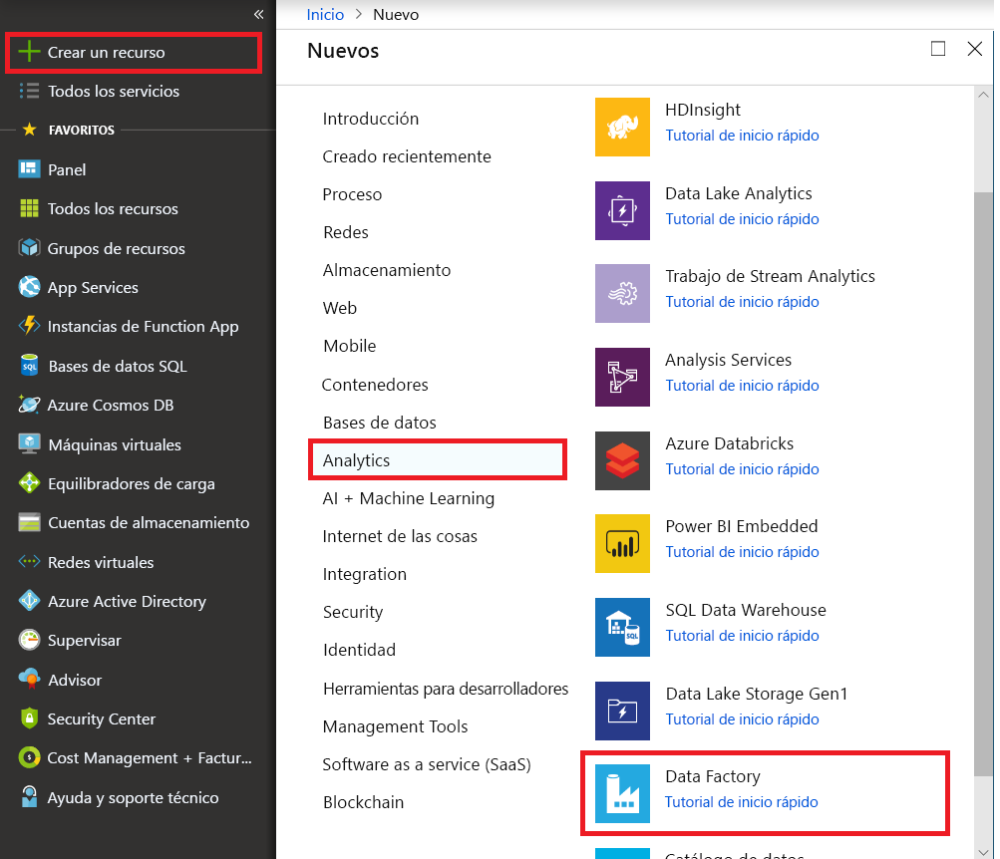
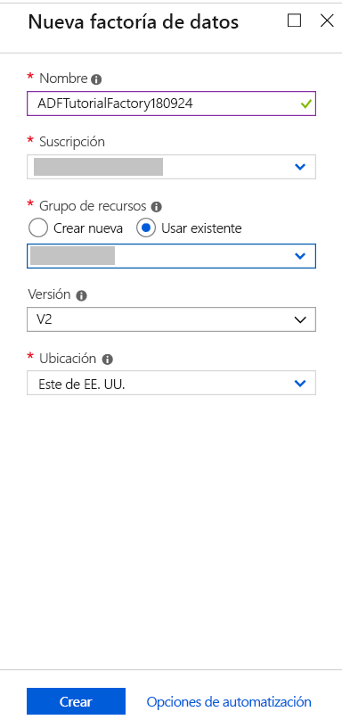
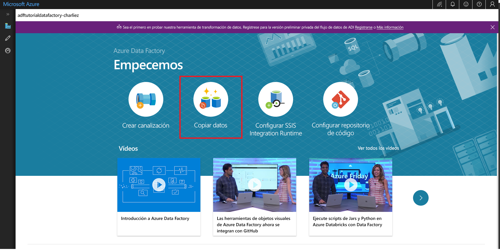

# Usar la herramienta Copy Data para copiar datos 
> [!div class="op_single_selector" title1="Select the version of Data Factory service you are using:"]
> * [Versión 1: Disponibilidad general](v1/data-factory-copy-data-from-azure-blob-storage-to-sql-database.md)
> * [Versión 2: versión preliminar](quickstart-create-data-factory-copy-data-tool.md)

En esta guía de inicio rápido, usará Azure Portal para crear una factoría de datos. A continuación, usará la herramienta Copy Data para crear una canalización que copia datos de una carpeta de una instancia de Azure Blob Storage a otra carpeta. 

> [!NOTE]
> Si no está familiarizado con Azure Data Factory, consulte [Introduction to Azure Data Factory](data-factory-introduction.md) antes de seguir los pasos de esta guía de inicio rápido. 
>
> Este artículo se aplica a la versión 2 de Data Factory, que actualmente se encuentra en versión preliminar. Si usa la versión 1 del servicio Data Factory, que está disponible con carácter general, consulte [Introducción a la versión 1 de Data Factory](v1/data-factory-copy-data-from-azure-blob-storage-to-sql-database.md).

[!INCLUDE [data-factory-quickstart-prerequisites](../../includes/data-factory-quickstart-prerequisites.md)] 

## Crear una factoría de datos

1. En el menú de la izquierda, haga clic en **Nuevo**, **Datos y análisis** y **Factoría de datos**. 
   
   
2. En la página **New data factory** (Nueva factoría de datos), escriba **ADFTutorialDataFactory** en **Name** (Nombre). 
      
     
 
   El nombre de Azure Data Factory debe ser **único de forma global**. Si ve el siguiente error en el campo del nombre, cambie el nombre de la factoría de datos (por ejemplo, yournameADFTutorialDataFactory) e intente crearlo de nuevo. Consulte el artículo [Azure Data Factory: reglas de nomenclatura](naming-rules.md) para conocer las reglas de nomenclatura de los artefactos de Data Factory.
  
     
3. Seleccione la **suscripción** de Azure donde desea crear la factoría de datos. 
4. Para el **grupo de recursos**, realice uno de los siguientes pasos:
     
      - Seleccione en primer lugar **Usar existente**y después un grupo de recursos de la lista desplegable. 
      - Seleccione **Crear nuevo**y escriba el nombre de un grupo de recursos.   
         
      Para obtener más información sobre los grupos de recursos, consulte [Uso de grupos de recursos para administrar los recursos de Azure](../azure-resource-manager/resource-group-overview.md).  
4. Seleccione **V2 (versión preliminar)** como **versión**.
5. Seleccione la **ubicación** de Data Factory. Solo las ubicaciones admitidas se muestran en la lista desplegable. Los almacenes de datos (Azure Storage, Azure SQL Database, etc.) y los procesos (HDInsight, etc.) que usa la factoría de datos pueden encontrarse en otras ubicaciones o regiones.
6. Seleccione **Anclar al panel**.     
7. Haga clic en **Create**(Crear).
8. En el panel, verá el icono siguiente con el estado: **Implementando factoría de datos**. 

    
9. Una vez completada la creación, verá la página **Data Factory** tal como se muestra en la imagen.
   
   
10. Haga clic en el icono **Author & Monitor** (Creación y supervisión) para iniciar la interfaz de usuario de Azure Data Factory en una pestaña independiente. 

## Iniciar la herramienta Copy Data

1. En la página de introducción, haga clic en el icono **Copy Data** (Copiar datos) para iniciar la herramienta Copy Data. 

   
2. En la página **Properties** (Propiedades) de la herramienta Copy Data, haga clic en **Next** (Siguiente). Puede especificar un nombre para la canalización y su descripción en esta página. 

    
3. En la página **Source data store** (Almacén de datos de origen), seleccione **Azure Blob Storage** y haga clic en **Next** (Siguiente).

    
4. En la página **Specify the Azure Blob storage account** (Especificar la cuenta de Azure Blob Storage), seleccione el **nombre de la cuenta de Storage** en la lista desplegable y haga clic en Next (Siguiente). 

    
5. En la página **Choose the input file or folder** (Elegir el archivo o la carpeta de entrada), lleve a cabo los siguientes pasos:

    1. Navegue hasta la carpeta **adftutorial/input**. 
    2. Seleccione el archivo **emp.txt**.
    3. Haga clic en **Choose** (Elegir). Puede hacer doble clic **emp.txt** para omitir este paso. 
    4. Haga clic en **Next**. 

    
6. En la página **File format settings** (Configuración de formato de archivo), observe que la herramienta detecta automáticamente los delimitadores de columna y fila; haga clic en **Next** (Siguiente). También puede obtener una vista previa de los datos y ver el esquema de los datos de entrada en esta página. 

    
7. En la página **Destination data store** (Almacén de datos de destino), seleccione **Azure Blob Storage** y haga clic en **Next** (Siguiente). 

        
8. En la página **Specify the Azure Blob storage account** (Especificar la cuenta de Azure Blob Storage), seleccione la cuenta de Azure Blob Storage y haga clic en **Next** (Siguiente). 

    
9. En la página **Choose the output file or folder** (Elegir el archivo o la carpeta de salida), realice los pasos siguientes: 

    1. Escriba **adftutorial/output** como la **ruta de acceso de la carpeta**.
    2. Escriba **emp.txt** como el **nombre de archivo**. 
    3. Haga clic en **Next**. 

     
10. En la página **File format settings** (Configuración de formato de archivo), haga clic en **Next** (Siguiente). 

    
11. En la página **Settings** (Configuración), haga clic en **Next** (Siguiente). 

    
12. En la página **Summary** (Resumen), revise toda la configuración y haga clic en Next (Siguiente). 

    
13. En la página **Deployment complete** (Implementación finalizada), haga clic en **Monitor** (Supervisión) para supervisar la canalización que ha creado. 

    
14. La aplicación cambia a la pestaña **Monitor** (Supervisión). En esta página verá el estado de la canalización. Haga clic en **Refresh** (Actualizar) para actualizar la lista. 
    
    
15. Haga clic en el vínculo **View Activity Runs** (Ver ejecuciones de actividad) en la columna Actions (Acciones). La canalización tiene una única actividad de tipo **Copy** (Copia). 

    
16. Para más información sobre la operación de copia, haga clic en el vínculo **Details** (Detalles) (imagen de gafas) de la columna **Actions** (Acciones). Para más información sobre las propiedades, consulte [Introducción a la actividad de copia](copy-activity-overview.md). 

    
17. Compruebe que se crea el archivo **emp.txt** en la carpeta **output** del contenedor **adftutorial**. Si no existe la carpeta de salida, el servicio Data Factory la crea automáticamente. 
18. Cambie a la pestaña **Edit** (Editar) para poder editar los servicios vinculados, los conjuntos de datos y las canalizaciones. Para saber cómo editarlos en la interfaz de usuario de Data Factory, consulte [Crear una factoría de datos mediante Azure Portal](quickstart-create-data-factory-portal.md).

    

## pasos siguientes
La canalización de este ejemplo copia los datos de una ubicación a otra en una instancia de Azure Blob Storage. Consulte los [tutoriales](tutorial-copy-data-portal.md) para obtener información acerca del uso de Data Factory en otros escenarios. 