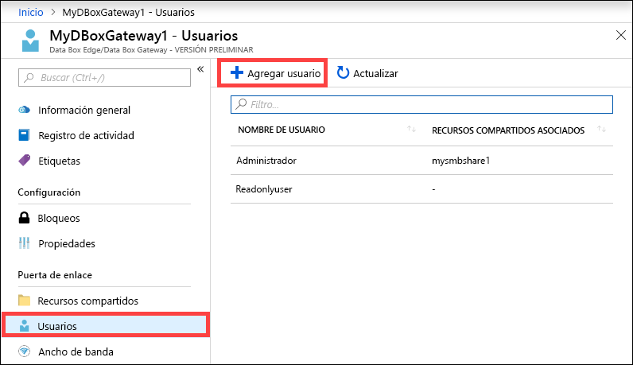
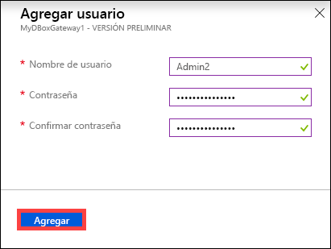
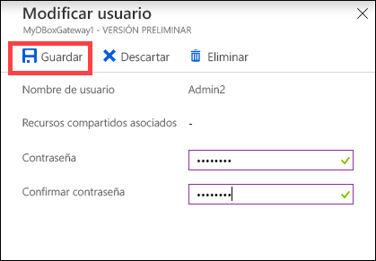
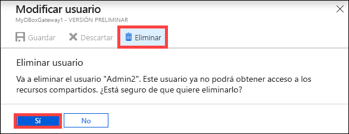
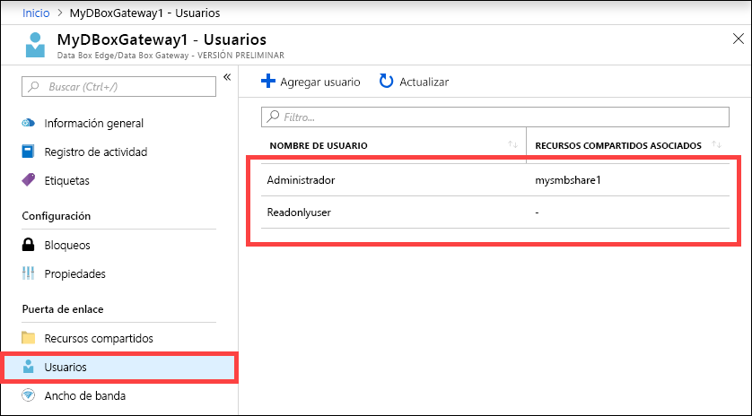

# Uso de Azure Portal para administrar usuarios en Azure Data Box Gateway 

En este artículo se describe cómo administrar usuarios en Azure Data Box Gateway. Azure Data Box Gateway se puede administrar a través de Azure Portal o de la interfaz de usuario web local. Usar Azure Portal para agregar, modificar o eliminar usuarios.

> [!IMPORTANT]
> - Data Box Gateway está en versión preliminar. Antes de solicitar e implementar esta solución revise los [términos del servicio de Azure para la versión preliminar](https://azure.microsoft.com/support/legal/preview-supplemental-terms/).

En este artículo, aprenderá a:

> [!div class="checklist"]
> * Agregar un usuario
> * Modificación de un usuario
> * Eliminar un usuario 

## Acerca de los usuarios

Los usuarios pueden ser de solo lectura o tener privilegios totales. Como indican los nombres, los usuarios de solo lectura solo pueden ver los datos de los recursos compartidos. Los usuarios con privilegios totales pueden leer datos de los recursos compartidos, escribir en estos recursos compartidos y modificar o eliminar los datos de los recursos compartidos. 

 - **Usuario con privilegios totales**: un usuario local con acceso completo. 
 - **Usuario de solo lectura**: un usuario local con acceso de solo lectura. Estos usuarios están asociados a los recursos compartidos que permiten operaciones de solo lectura.

Los permisos del usuario se definen por primera vez cuando se crea el usuario durante la creación de los recursos compartidos. Una vez que se definen los permisos asociados a un usuario, se pueden modificar mediante el Explorador de archivos. 

## Adición de un usuario

Para agregar un usuario siga estos pasos en Azure Portal.

1. En Azure Portal, vaya al recurso Data Box Gateway y, después, a **Información general**. Haga clic en **+ Agregar usuario** en la barra de comandos.

    

2. Especifique el nombre de usuario y la contraseña del usuario que desea agregar. Confirme la contraseña y haga clic en **Agregar**.

    

    > [!IMPORTANT] 
    > Estos usuarios los reserva el sistema y no deben usarse: Administrator, EdgeUser, EdgeSupport, HcsSetupUser, WDAGUtilityAccount, CLIUSR, DefaultAccount, Guest.  

3. Recibirá una notificación tanto cuando comience la creación del usuario como cuando se complete. Una vez que se crea el usuario, en la barra de comandos, haga clic en **Actualizar** para ver la lista actualizada de usuarios.

## Modificación de un usuario

Una vez que se crea un usuario es posible cambiar la contraseña asociada con él. Seleccione y haga clic en la lista de usuarios. Indique y confirme la nueva contraseña. Guarde los cambios.
 

## Eliminación de un usuario

Siga estos pasos en Azure Portal para eliminar un usuario.

1. Seleccione un usuario en la lista de usuarios, haga clic en él y, después, en **Eliminar**.  

   

2. Cuando se le solicite, confirme la eliminación. 

   

La lista de usuarios se actualiza para reflejar el usuario eliminado.

## Pasos siguientes

- Aprenda a [administrar el ancho de banda](data-box-gateway-manage-bandwidth-schedules.md).
