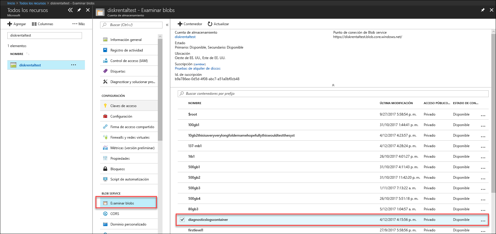
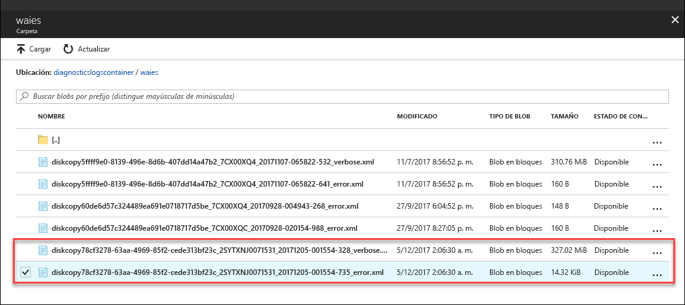

# Solución de problemas de Azure Data Box Disk (versión preliminar)

Este artículo se aplica a la ejecución de Microsoft Azure Data Box en versión preliminar. En este artículo se describen algunos de los flujos de trabajo complejos y tareas de administración que se pueden realizar en Data Box y Data Box Disk. 

Puede administrar Data Box Disk mediante Azure Portal. Este artículo se centra en las tareas que se pueden realizar mediante Azure Portal. Use Azure Portal para administrar pedidos, administrar dispositivos y realizar un seguimiento del estado del pedido mientras continúa hacia la finalización.

Este artículo incluye los siguientes tutoriales:

- Descarga de los registros de diagnóstico
- Consulta de los registros de actividad

> [!IMPORTANT]
> Data Box se encuentra en versión preliminar. Antes de implementar esta solución revise los [términos del servicio de Azure para la versión preliminar](https://azure.microsoft.com/support/legal/preview-supplemental-terms/).

## Descarga de los registros de diagnóstico

Si existen errores durante el proceso de copia de los datos, en el portal se muestra la ruta de acceso a la carpeta donde se encuentran los registros de diagnóstico. 

Los registros de diagnóstico pueden ser:
- Registros de error
- Registros detallados  

Para navegar a la ruta de acceso del registro de copia, vaya a la cuenta de almacenamiento asociada con el pedido de Data Box. 

1.  Vaya a **General > Detalles del pedido** y tome nota de la cuenta de almacenamiento asociada con su pedido.
 

2.  Vaya a **Todos los recursos** y busque la cuenta de almacenamiento identificada en el paso anterior. Seleccione la cuenta de almacenamiento y haga clic en ella.

    

3.  Vaya a **Blob service > Examinar blobs** y busque el blob correspondiente a la cuenta de almacenamiento. Vaya a **diagnosticslogcontainer > waies**. 

    

    Verá los registros de errores y los registros detallados de la copia de los datos. Seleccione cada archivo y haga clic en él y luego descargue una copia local.

## Consulta de los registros de actividad

Use los registros de actividad para encontrar errores al solucionar problemas o para supervisar cómo un usuario de su organización modificó un recurso. Mediante los registros de actividad, puede determinar:

- Qué operaciones se realizaron en los recursos de la suscripción.
- La persona que inicia la operación. 
- Cuándo tuvo lugar la operación.
- Estado de la operación.
- Los valores de otras propiedades que podrían ayudarle en la investigación de la operación.

El registro de actividad contiene todas las operaciones de escritura (por ejemplo, PUT, POST, DELETE) realizadas en los recursos, pero no las operaciones de lectura (por ejemplo, GET). 

Los registros de actividad se conservan 90 días. Puede consultar cualquier intervalo de fechas, siempre que no hayan transcurrido más de 90 días desde la fecha inicial. También puede filtrar por una de las consultas integradas en Insights. Por ejemplo, haga clic en el error y, luego, seleccione y haga clic en los errores específicos para entender la causa.

## Errores de la herramienta Data Box Disk Unlock

| Comportamiento de la herramienta o mensaje de error      | Recomendaciones                                                                                               |
|-------------------------------------------------------------------------------------------------------------------------------------|------------------------------------------------------------------------------------------------------|
| None  La herramienta de desbloqueo de Data Box Disk se bloquea.                                                                            | BitLocker no está instalado. Asegúrese de que el equipo host en el que se ejecuta la herramienta de desbloqueo de Data Box Disk tenga instalado BitLocker.                                                                            |
| No se admite la versión actual de .NET Framework. Las versiones compatibles son 4.5 y posteriores.  La herramienta se cierra con un mensaje.  | .NET 4.5 no está instalado. Instale .NET 4.5 o posterior en el equipo host donde se ejecuta la herramienta de desbloqueo de Data Box Disk.                                                                            |
| No se ha podido desbloquear ni verificar ningún volumen. Póngase en contacto con el soporte técnico de Microsoft    La herramienta no puede desbloquear ni verificar ninguna unidad bloqueada. | La herramienta no ha podido desbloquear ninguna de las unidades bloqueadas con la clave de paso proporcionada. Póngase en contacto con el servicio de soporte técnico de Microsoft para conocer los pasos siguientes.                                                |
| Los siguientes volúmenes están desbloqueados y comprobados.  Letras de unidad de volumen: E: No se ha podido desbloquear ningún volumen con las siguientes claves de paso: werwerqomnf, qwerwerqwdfda.   La herramienta desbloquea algunas unidades y enumera las letras de unidad correctas e incorrectas.| Parcialmente correcto. No se han podido desbloquear algunas de las unidades con la clave de paso proporcionada. Póngase en contacto con el servicio de soporte técnico de Microsoft para conocer los pasos siguientes. |
| No se han podido encontrar los volúmenes bloqueados. Compruebe que el disco recibido de Microsoft está conectado correctamente y se encuentra en estado bloqueado.          | La herramienta no puede encontrar ninguna unidad bloqueada. O las unidades están ya desbloqueadas o no se han detectado. Asegúrese de que las unidades están conectadas y bloqueadas.                                                           |
| Error grave: parámetro no válido Nombre del parámetro: invalid_arg USO: DataBoxDiskUnlock /PassKeys:<passkey_list_separated_by_semicolon>  Ejemplo: DataBoxDiskUnlock /PassKeys:passkey1;passkey2;passkey3 Ejemplo: DataBoxDiskUnlock /SystemCheck Ejemplo: DataBoxDiskUnlock /Help  /PassKeys: obtenga esta clave de paso del pedido de Azure Data Box Disk. La clave de paso desbloquea los discos. /Help: esta opción proporciona ayuda sobre el uso del cmdlet y ejemplos. /SystemCheck: esta opción comprueba si el sistema cumple los requisitos para ejecutar la herramienta.  Presione cualquier tecla para salir. | Parámetro no válido especificado. Los únicos parámetros permitidos son /SystemCheck, /PassKey y /Help.                                                                            |

## Errores de la herramienta Data Box Disk Split Copy

|Mensaje de error o advertencias  |Recomendaciones |
|---------|---------|
|[Información] Recuperación de contraseña de BitLocker del volumen: m  [Error] Excepción detectada al recuperar la clave de BitLocker para el volumen m:  La secuencia no contiene elementos.|Este error se produce si el disco de Data Box Disk de destino está sin conexión.   Use la herramienta `diskmgmt.msc` en discos en línea.|
|[Error] Excepción producida: error en la operación de WMI:  Method=UnlockWithNumericalPassword, ReturnValue=2150694965,  Win32Message=El formato de la contraseña de recuperación que se proporciona no es válida.  Las contraseñas de recuperación de BitLocker son 48 dígitos.  Compruebe que la contraseña de recuperación tiene el formato correcto e inténtelo de nuevo.|Utilice la herramienta Data Box Disk Unlock para desbloquear por primera vez los discos y vuelva a intentar el comando. Para más información, vaya a: <li> [Desbloqueo de Data Box Disk en clientes Windows](data-box-disk-deploy-set-up.md#unlock-disks-on-windows-client). </li><li> [Desbloqueo de Data Box Disk en clientes Linux](data-box-disk-deploy-set-up.md#unlock-disks-on-linux-client). </li>|
|[Error] Excepción producida: existe un archivo DriveManifest.xml existe en la unidad de destino.   Esto indica que la unidad de destino se puede haber preparado con otro archivo de diario.  Para agregar más datos a la misma unidad, use el archivo de diario anterior. Para eliminar los datos existentes y volver a usar la unidad de destino para un nuevo trabajo de importación, elimine DriveManifest.xml de la unidad. Vuelva a ejecutar este comando con un nuevo archivo de diario.| Este error se recibe al intentar utilizar el mismo conjunto de unidades para varias sesiones de importación.   Use un conjunto de unidades solo para una sesión de división y copia.|
|[Error] Excepción producida: CopySessionId importdata-septiembre-test-1 hace referencia a una sesión de copia anterior y no se puede reutilizar para una nueva sesión de copia.|Este error se notifica al intentar usar el mismo nombre para un nuevo trabajo como un trabajo anterior completado correctamente.  Asigne un nombre exclusivo para el trabajo nuevo.|
|[Info] El nombre del directorio o del archivo de destino supera el límite de longitud de NTFS. |Este mensaje se notifica cuando se ha cambiado el archivo de destino porque la ruta de acceso del archivo es larga.  Modifique la opción de disposición en el archivo `config.json` para controlar este comportamiento.|
|[Error] Excepción producida: secuencia de escape JSON incorrecta. |Este mensaje se notifica cuando el archivo config.json tiene un formato que no es válido.   Valide `config.json` mediante [JSONlint](https://jsonlint.com/) antes de guardar el archivo.|

## Pasos siguientes

- Aprenda a [administrar Data Box Disk mediante Azure Portal](data-box-portal-ui-admin.md).
