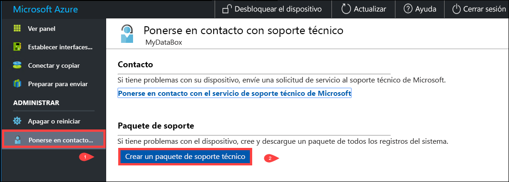
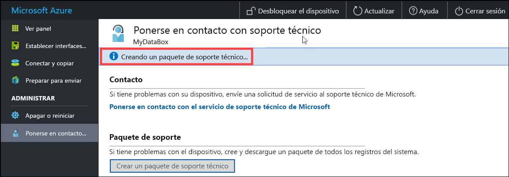
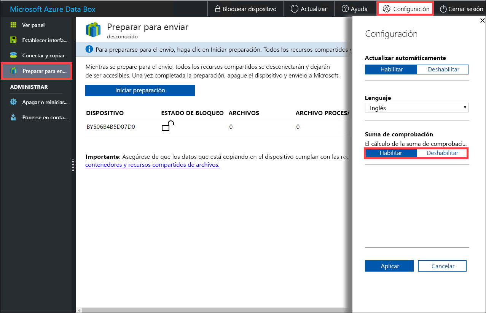

# Usar la interfaz de usuario web local para administrar su Data Box

En este artículo se describen algunas de las tareas de administración y configuración que se pueden realizar en Data Box. Puede administrar Data Box a través de la interfaz de usuario de Azure portal y la interfaz de usuario web local para el dispositivo. En este artículo nos centraremos en las tareas que puede realizar mediante la interfaz de usuario web.

La interfaz de usuario web local para Data Box se usa para la configuración inicial del dispositivo. También puede usar la interfaz de usuario web local para apagar o reiniciar el servicio Data Box, ejecutar pruebas de diagnóstico, actualizar el software, ver registros de copia y generar un paquete de registro para el Soporte técnico de Microsoft.

Este artículo incluye los siguientes tutoriales:

- Generar un paquete de soporte técnico
- Apagar o reiniciar el dispositivo
- Borrar los datos desde un dispositivo de forma segura
- Supervisar la capacidad disponible del dispositivo
- Omitir la validación de la suma de comprobación 

## Generar un paquete de soporte técnico

Si experimenta los problemas con el dispositivo, puede crear un paquete de soporte técnico de los registros del sistema. El Soporte técnico de Microsoft usa este paquete para solucionar el problema. Para generar un paquete de soporte técnico, realice los pasos siguientes:

1. En la interfaz de usuario web local, vaya a **Contacto con soporte técnico** y haga clic en **Crear un paquete de soporte técnico**.

    

2. Se recopila un paquete de soporte técnico. Esta operación tarda unos minutos.

    

3. Una vez completada la creación del paquete de soporte técnico, haga clic en **Descargar el paquete de soporte técnico**. 

    

4. Busque y elija la ubicación de descarga. Abra la carpeta para ver el contenido.

    

## Apagar o reiniciar el dispositivo

Puede apagar o reiniciar el dispositivo Data Box mediante la interfaz de usuario web local. Se recomienda que antes de reiniciar, desconecte los recursos compartidos del host y, luego, el dispositivo. Esto minimizará la posibilidad de daños en los datos. Asegúrese de que la copia de datos no esté en curso al apagar el dispositivo.

Para cerrar su Data Box, realice los pasos siguientes.

1. En la interfaz de usuario web local, vaya a **Apagar o reiniciar**.
2. Haga clic en **Apagar**.

    

3. Cuando se le pida confirmación, haga clic en **Aceptar** para continuar.

    

Una vez que el dispositivo se apague, use el botón de encendido del panel frontal para activar el dispositivo.

Para reiniciar su Data Box, realice los pasos siguientes.

1. En la interfaz de usuario web local, vaya a **Apagar o reiniciar**.
2. Haga clic en **Restart**(Reiniciar).

    

3. Cuando se le pida confirmación, haga clic en **Aceptar** para continuar.

   El dispositivo se apaga y, a continuación, se reinicia.

## Ver la capacidad disponible del dispositivo

Puede usar el panel del dispositivo para ver la capacidad disponible y utilizada del dispositivo. 

1. En la interfaz de usuario web local, vaya a **Ver panel**.
2. En **Conectar y copiar**, se muestra el espacio disponible y utilizado del dispositivo.

    

## Omitir la validación de la suma de comprobación

La suma de comprobación se genera para sus datos de forma predeterminada cuando se prepara para el envío. En algunos casos poco frecuentes, según el tipo de datos (tamaños de archivo reducidos), el rendimiento puede ser muy lento. En tales casos, puede omitir la suma de comprobación. 

Recomendamos encarecidamente que no deshabilite la suma de comprobación, a menos que el rendimiento se vea afectado considerablemente.

1. En la esquina superior derecha de la interfaz de usuario web local del dispositivo, vaya a Configuración.

    

2. **Deshabilite** la validación de la suma de comprobación.
3. Haga clic en **Aplicar**.

## Pasos siguientes

- Obtenga información sobre cómo [administrar Data Box mediante Azure Portal](data-box-portal-admin.md).

