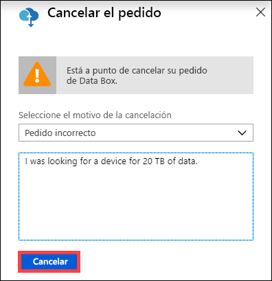
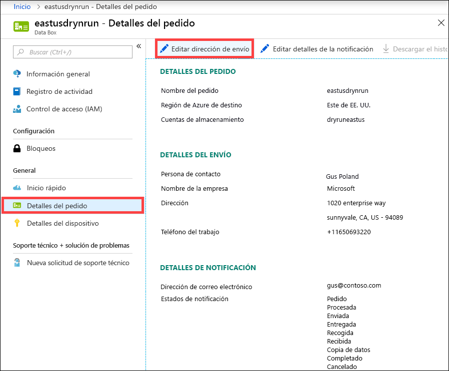
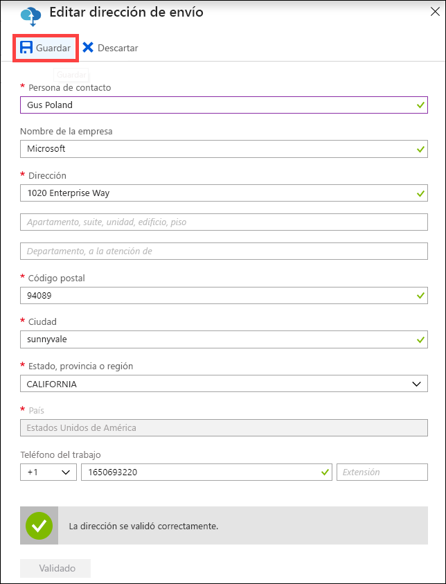
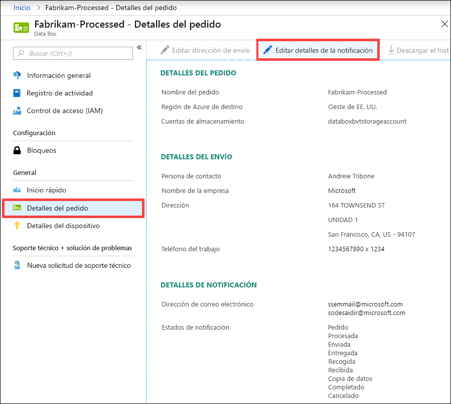
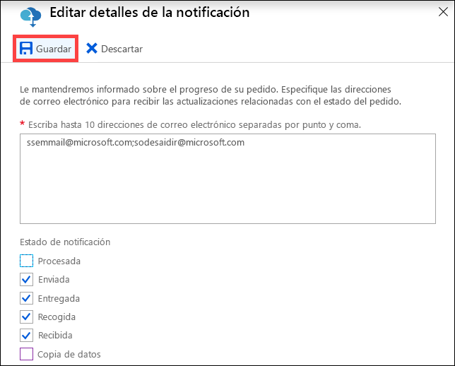

# Use Azure Portal para administrar Data Box

En este artículo se describen algunas de las tareas de administración y los flujos de trabajo complejos que se pueden realizar en Data Box. Puede administrar Data Box a través de Azure Portal y de la interfaz de usuario web local. 

Este artículo se centra en las tareas que se pueden realizar mediante Azure Portal. Use Azure Portal para administrar pedidos, administrar los Data Box y realizar un seguimiento del estado del pedido mientras continúa hacia la finalización.

## Cancelación de un pedido

Es posible que deba cancelar un pedido por diversos motivos después de realizarlo. Solo puede cancelar el pedido antes de que se procese. Una vez que el pedido se haya procesado y Data Box esté preparado, no es posible cancelar el pedido. 

Realice los pasos siguientes para cancelar un pedido.

1.  Vaya a **Overview > Cancel** (Información general > Cancelar). 

    

2.  Indique un motivo para cancelar el pedido.  

    

3.  Una vez que se cancela el pedido, el portal actualiza su estado y lo muestra como **Canceled** (Cancelado). 

## Clonación de un pedido

La clonación es útil en determinadas situaciones. Por ejemplo, un usuario ha usado Data Box para transferir algunos datos. A medida que se generan más datos, se necesita otro Data Box para transferirlos a Azure. En este caso, simplemente se puede clonar el mismo pedido.

Realice los pasos siguientes para clonar un pedido.

1.  Vaya a **Overview > Clone** (Información general > Clonar). 

    

2.  Todos los detalles del pedido permanecen iguales. El nombre del pedido es el del pedido original seguido de *-Clone*. Seleccione la casilla para confirmar que ha revisado la información de privacidad. Haga clic en **Create**(Crear).    

El clon se crea en unos minutos y el portal se actualiza para mostrar el nuevo pedido.

## Eliminación del pedido

Es posible que desee eliminar un pedido cuando se complete. El pedido contiene información personal, como su nombre, dirección e información de contacto. Esta información personal se elimina cuando se elimina el pedido.

Solo se pueden eliminar pedidos completados o cancelados. Realice los siguientes pasos para eliminar un pedido.

1. Vaya a **Todos los recursos**. Busque su pedido.

2. Haga clic en el pedido que desee eliminar y vaya a **Overview** (Información general). En la barra de comandos, haga clic en **Delete** (Eliminar).

    

3. Escriba el nombre del pedido cuando se le pida que confirme su eliminación. Hacer clic en **Eliminar**.

## Descarga de la etiqueta de envío

Deberá descargar la etiqueta de envío si no funciona la pantalla de tinta electrónica de su Data Box y no muestra la etiqueta de envío de devolución. 

Siga estos pasos para descargar una etiqueta de envío.
1.  Vaya a **Overview > Download shipping label** (Información general > Descargar etiqueta de envío). Esta opción está disponible solo una vez enviado el dispositivo. 

    

2.  Se descargará la siguiente etiqueta de envío devuelto. Guarde la etiqueta e imprímala. Doble e inserte la etiqueta en la funda transparente del dispositivo. Asegúrese de que la etiqueta está visible. Quite cualquier etiqueta del envío anterior que aún se encuentre en el dispositivo.

    

## Edición de la dirección de envío

Puede que tenga que editar la dirección de envío, una vez que se haya realizado el pedido. Esta opción solo está disponible hasta que se envía el dispositivo. Después, deja de estarlo.

Realice los pasos siguientes para editar el pedido.

1. Vaya a **Order details > Edit shipping address** (Detalles del pedido > Editar dirección de envío).

    

2. Edite y valide la dirección de envío y, a continuación, guarde los cambios.

    

## Edición de los detalles de la notificación

Es posible que deba cambiar los usuarios que desea que reciban los mensajes de estado del pedido. Por ejemplo, hay que informar a un usuario cuando se entrega o recoge el dispositivo. Otro usuario deba ser informado cuando se completa la copia de datos para que pueda comprobar que están en la cuenta de almacenamiento de Azure antes de eliminarlos del origen. En estos casos, puede editar los detalles de notificación.

Realice los siguientes pasos para editar una plantilla de notificación.

1. Vaya a **Order details > Edit notification details** (Detalles de pedidos > Editar detalles de la notificación).

    

2. Ahora puede editar los detalles de la notificación y, a continuación, guardar los cambios.
 
    

## Visualización del estado del pedido

Cuando cambie el estado del dispositivo en el portal, se le notificará por correo electrónico.

|Estado del pedido |DESCRIPCIÓN |
|---------|---------|
|Ordered (Realizado)     | Se ha realizado correctamente un pedido.  Si el dispositivo está disponible, Microsoft identifica uno para el envío y lo prepara.   Si el dispositivo no está disponible inmediatamente, el pedido se procesará cuando el dispositivo esté disponible. El pedido puede tardar varios días o un par de meses en procesarse. Si el pedido no se puede completar en 90 días, se cancela el pedido y se le notifica.         |
|Processed (Procesado)     | El procesamiento del pedido está completado. Según su pedido, el dispositivo se prepara para su envío en el centro de datos.         |
|Dispatched (Enviado)     | Ha enviado el pedido. Use el identificador de seguimiento que se muestra en el pedido del portal para realizar un seguimiento del envío.        |
|Delivered (Entregado)     | El envío se entregó a la dirección especificada.        |
|Picked up (Recogido)     |El transportista recogió y analizó el envío de devolución.         |
|Received     | El dispositivo se recibió y examinó en el centro de datos de Azure.   Una vez que se inspecciona el envío, se iniciará la carga del dispositivo.      |
|Copia de datos     | La copia de datos está en curso. Realice un seguimiento del progreso de la copia del pedido en Azure Portal.   Espere hasta que se complete. |
|Completed       |El pedido se realizó correctamente.  Compruebe que los datos están en Azure antes de eliminarlos en el entorno local de los servidores.         |
|Completed with errors (Completado con errores)| Se completó la copia de datos pero se produjeron errores durante la copia.   Revise los registros de copia con la ruta de acceso proporcionada en Azure Portal.   |
|Canceled            |El pedido se ha cancelado.   Se canceló el pedido o se produjo un error y el servicio lo canceló. Si el pedido no se puede completar en 90 días, también se cancela el pedido y se le notifica.     |
|Limpieza | Se borran los datos en los discos del dispositivo. La limpieza del dispositivo se completa cuando el informe de registro del pedido está disponible en Azure Portal.|

## Pasos siguientes

- Obtenga información sobre cómo [Solucionar problemas de Data Box](data-box-faq.md).
