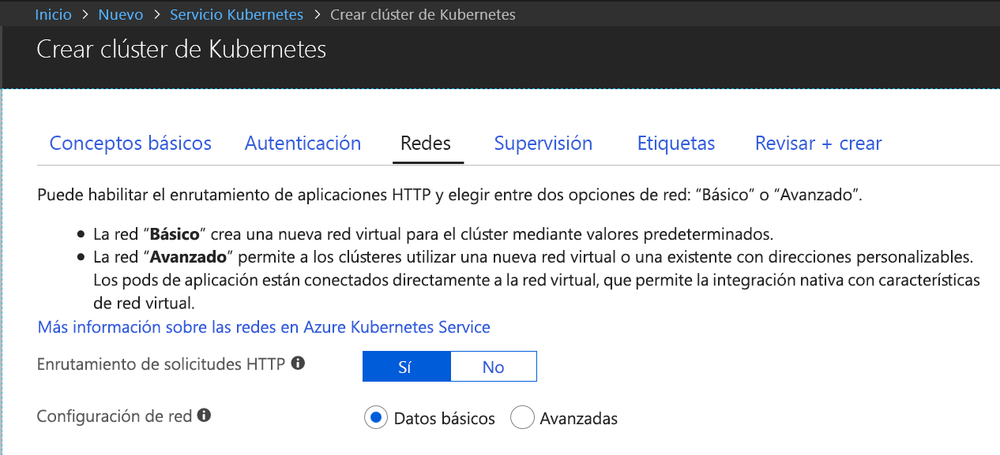
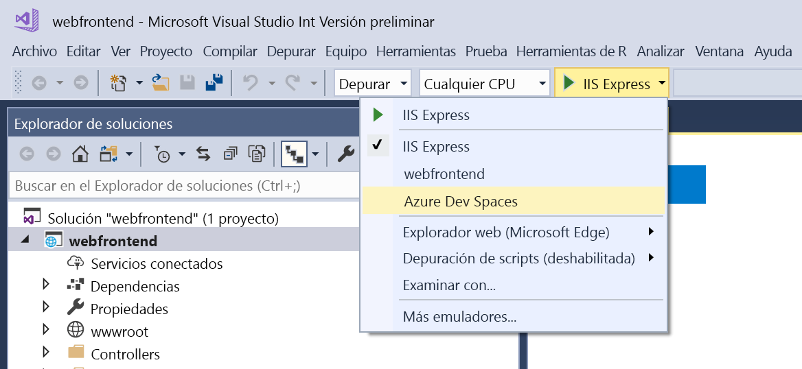

# Inicio rápido: Creación de un espacio de desarrollo de Kubernetes con Azure Dev Spaces (.NET Core y Visual Studio)

En esta guía, aprenderá a:

- Configurar Azure Dev Spaces con un clúster de Kubernetes administrado en Azure.
- Desarrollar código de forma iterativa en contenedores con Visual Studio
- Depurar el código que se ejecuta en un clúster.

> [!Note]
> **Si se queda bloqueado** en cualquier momento, consulte la sección [Solución de problemas](troubleshooting.md) o publique un comentario en esta página. También puede probar con este [tutorial](get-started-netcore-visualstudio.md), que es más detallado.

## Requisitos previos

- Un clúster de Kubernetes que ejecute Kubernetes 1.9.6 o posterior, en las regiones Este de EE. UU., Centro de EE. UU., Oeste de EE. UU. 2, Europa Occidental o Este de Canadá, con Enrutamiento de aplicación HTTP habilitado.

  

- Visual Studio 2017 con la carga de trabajo Desarrollo de Web instalada. Si no está instalada, descárguela [aquí](https://aka.ms/vsdownload?utm_source=mscom&utm_campaign=msdocs).

## Configuración de Azure Dev Spaces

Instale [Visual Studio Tools para Kubernetes](https://aka.ms/get-vsk8stools).

## Conectarse a un clúster

A continuación, creará y configurará un proyecto para Azure Dev Spaces.

### Creación de una aplicación web de ASP.NET

En Visual Studio 2017, cree un nuevo proyecto. Actualmente, el proyecto debe ser una **aplicación web de ASP.NET Core**. Asigne el nombre **webfrontend** al proyecto.

Seleccione la plantilla **Aplicación web (controlador de vista de modelos)** y asegúrese de que apunta a **.NET Core** y **ASP.NET Core 2.0**.

### Habilitación de Dev Spaces para un clúster de AKS

Con el proyecto que acaba de crear, seleccione **Azure Dev Spaces**  en el menú desplegable de configuración de inicio, como se muestra a continuación.

En el cuadro de diálogo que se muestra a continuación, asegúrese de que ha iniciado sesión con la cuenta adecuada y, a continuación, seleccione un clúster existente.

Por ahora, deje en el menú desplegable **Espacio** la opción `default`. Active la casilla **Publicly Accessible** (Acceso público) para que la aplicación web esté accesible mediante un punto de conexión público.

Haga clic en **Aceptar** para seleccionar o crear el clúster.

Si elige un clúster que no ha sido configurado para trabajar con Azure Dev Spaces, verá un mensaje preguntando si desea configurarlo.

Elija **Aceptar**. 

### Examen de los archivos agregados al proyecto
Mientras espera a que se cree el espacio de desarrollo, mire los archivos que se han agregado al proyecto cuando eligió usar Azure Dev Spaces.

- Se ha agregado una carpeta llamada `charts` y, dentro de ella, un [gráfico de Helm](https://docs.helm.sh) para la aplicación a la que se ha aplicado la técnica scaffolding. Estos archivos se usan para implementar la aplicación en el espacio de desarrollo.
- `Dockerfile` contiene la información necesaria para empaquetar la aplicación en el formato estándar de Docker.
- `azds.yaml` contiene la configuración de tiempo de desarrollo necesaria para el espacio de desarrollo.

## Depuración de un contenedor en Kubernetes
Cuando el espacio de desarrollo se haya creado correctamente, puede depurar la aplicación. Establezca un punto de interrupción en el código, por ejemplo, en la línea 20 del archivo `HomeController.cs`, donde se establece la variable `Message`. Pulse **F5** para iniciar la depuración. 

Visual Studio se comunicará con el espacio de desarrollo para compilar e implementar la aplicación y, después, abrirá un explorador con la aplicación web en ejecución. Puede parecer que el contenedor se ejecuta localmente, pero en realidad lo hace en el espacio de desarrollo de Azure. La razón de la dirección de localhost es porque Azure Dev Spaces crea un túnel SSH temporal al contenedor que se ejecuta en AKS.

Haga clic en el vínculo **Acerca de** en la parte superior de la página para desencadenar el punto de interrupción. Tiene acceso completo a la información de depuración, tal como lo haría si el código se ejecutara localmente, como la pila de llamadas, las variables locales o la información de excepción, por ejemplo.

## Desarrollo de código de forma iterativa

Con Azure Dev Spaces no se trata solo de conseguir que el código se ejecute en Kubernetes, sino de permitirle ver rápida e iterativamente que los cambios de código surtan efecto en un entorno de Kubernetes en la nube.

### Actualización de un archivo de contenido
1. Busque el archivo `./Views/Home/Index.cshtml` y realice una edición en el código HTML. Por ejemplo, cambie la línea 70 que dice `<h2>Application uses</h2>` a algo como: `<h2>Hello k8s in Azure!</h2>`
1. Guarde el archivo.
1. Regrese al explorador y actualice la página. Debería ver la página web que muestra el código HTML actualizado.

¿Qué ha ocurrido? Las ediciones de archivos de contenido, como HTML y CSS, no requieren compilarlos de nuevo en una aplicación web de .NET Core, por lo que un sesión de F5 activa sincroniza automáticamente cualquier archivo de contenido modificado en el contenedor que se está ejecutando en AKS, para que pueda ver sus ediciones de contenido de inmediato.

### Actualización de un archivo de código
Actualizar archivos de código requiere un poco más de trabajo, porque una aplicación .NET Core necesita volver a crear y producir archivos binarios de aplicaciones actualizados.

1. Detenga el depurador en Visual Studio.
1. Abra el archivo de código denominado `Controllers/HomeController.cs` y edite el mensaje que se mostrará en la página Acerca de: `ViewData["Message"] = "Your application description page.";`
1. Guarde el archivo.
1. Pulse **F5** para iniciar la depuración de nuevo. 

En lugar de volver a crear e implementar una nueva imagen de contenedor cada vez que se realizan modificaciones en el código, lo que a menudo lleva un tiempo considerable, Azure Dev Spaces volverá a compilar el código de manera incremental dentro del contenedor existente para proporcionar un bucle de modificación/depuración más rápido.

Actualice la aplicación web en el explorador y vaya a la página Acerca de. Verá que aparece el mensaje personalizado en la interfaz de usuario.

## Pasos siguientes

> [!div class="nextstepaction"]
> [Trabajo con varios contenedores y desarrollo en equipo](team-development-netcore-visualstudio.md)
