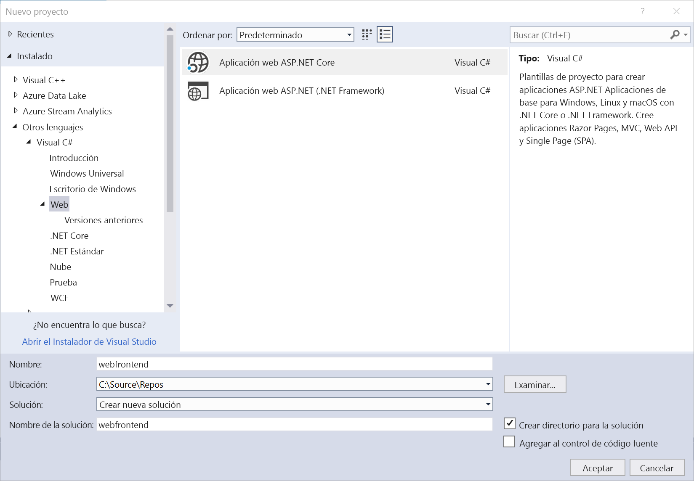
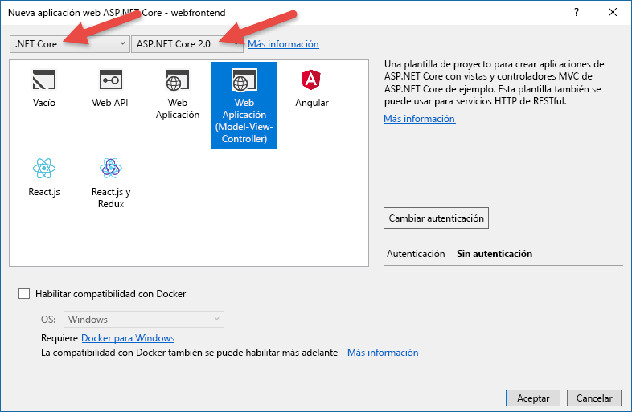
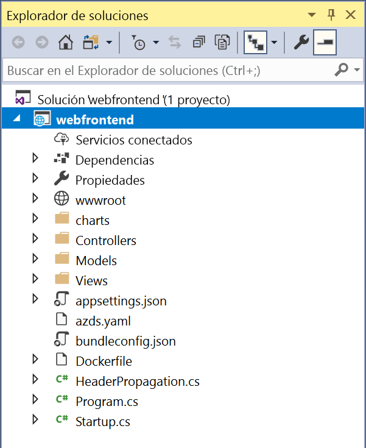

# Guía de inicio rápido: Creación de un entorno de desarrollo de Kubernetes con Azure Dev Spaces (.NET Core y Visual Studio)

En esta guía, aprenderá a:

- Crear un entorno basado en Kubernetes en Azure que está optimizado para el desarrollo.
- Desarrollar código de forma iterativa en contenedores con Visual Studio.

[!INCLUDE]

[!INCLUDE]

## Obtención de herramientas de Visual Studio 
1. Instale la versión más reciente de [Visual Studio 2017](https://www.visualstudio.com/vs/).
1. En el instalador de Visual Studio asegúrese de que está seleccionada la carga de trabajo siguiente:
    * ASP.NET y desarrollo web
1. Instale la [extensión de Visual Studio para Azure Dev Spaces](https://aka.ms/get-azds-visualstudio).

Ahora está preparado para crear una aplicación web ASP.NET con Visual Studio.

## Creación de una aplicación web de ASP.NET

Desde Visual Studio 2017, cree un nuevo proyecto. Actualmente, el proyecto debe ser una **aplicación web de ASP.NET Core**. Llame al proyecto "**webfrontend**".

Seleccione la plantilla **Aplicación web (controlador de vista de modelos)** y asegúrese de que está apuntando a **.NET Core** y **ASP.NET Core 2.0** en los dos menús desplegables en la parte superior del cuadro de diálogo. Haga clic en **Aceptar** para crear el proyecto.

## Creación de un entorno de desarrollo en Azure

Con Azure Dev Spaces, puede crear entornos de desarrollo basados en Kubernetes que están totalmente administrados por Azure y optimizados para el desarrollo. Con el proyecto que acaba de crear abierto, seleccione **Azure Dev Spaces**  en el menú desplegable de configuración de inicio, como se muestra a continuación.

En el cuadro de diálogo que se muestra a continuación, asegúrese de que ha iniciado sesión con la cuenta adecuada y, a continuación, seleccione un clúster existente.

Deje el menú desplegable **Espacio** con un valor predeterminado en `default` por ahora. Más adelante, aprenderá más acerca de esta opción. Active la casilla **Publicly Accessible** (Acceso público) para que la aplicación web esté accesible mediante un punto de conexión público. Esta configuración no es necesaria, pero será útil mostrar algunos conceptos más adelante en este tutorial. Pero no se preocupe, en cualquier caso podrá depurar el sitio web con Visual Studio.

Haga clic en **Aceptar** para seleccionar o crear el clúster.

Si elige un clúster que no ha sido configurado para trabajar con Azure Dev Spaces, verá un mensaje preguntando si desea configurarlo.

Elija **Aceptar**. 

Se iniciará una tarea en segundo plano para realizar esto. Esta operación tardará algunos minutos en completarse. Para ver si todavía se crea, pase el puntero sobre el icono **Tareas en segundo plano**  en la esquina inferior izquierda de la barra de estado, como se muestra en la siguiente imagen.

> [!Note]
Hasta que se haya creado correctamente el entorno de desarrollo, no puede depurar la aplicación.

## Archivos agregados al proyecto
Mientras espera a que se cree el entorno de desarrollo, mire los archivos que se han agregado al proyecto cuando decida utilizar un entorno de desarrollo.

Primero, puede ver que se ha agregado una carpeta con el nombre `charts` y dentro de esta carpeta un [gráfico Helm](https://docs.helm.sh) para la aplicación a la que se ha aplicado la técnica scaffolding. Estos archivos se usan para implementar la aplicación en el entorno de desarrollo.

Verá que se ha agregado un archivo denominado `Dockerfile`. Este archivo contiene la información necesaria para empaquetar la aplicación en el formato estándar de Docker. También se crea un archivo `HeaderPropagation.cs`, que se verá más adelante en el tutorial. 

Por último, verá un archivo denominado `azds.yaml`, que contiene la información de configuración que necesita el entorno de desarrollo, como por ejemplo si la aplicación debe ser accesible mediante un punto de conexión público.

## Depuración de un contenedor en Kubernetes
Cuando el entorno de desarrollo se ha creado correctamente, puede depurar la aplicación. Establezca un punto de interrupción en el código, por ejemplo, en la línea 20 del archivo `HomeController.cs`, donde se establece la variable `Message`. Pulse **F5** para iniciar la depuración. 

Visual Studio se comunica con el entorno de desarrollo para crear e implementar la aplicación y, después, abre un explorador con la aplicación web en ejecución. Puede parecer que el contenedor se está ejecutando localmente, pero en realidad se ejecuta en el entorno de desarrollo de Azure. La razón de la dirección de host local es porque Azure Dev Spaces crea un túnel SSH temporal al contenedor que se ejecuta en Azure.

Haga clic en el vínculo **Acerca de** en la parte superior de la página para desencadenar el punto de interrupción. Tiene acceso completo a la información de depuración, tal como lo haría si el código se ejecutara localmente, como la pila de llamadas, las variables locales o la información de excepción, por ejemplo.

## Pasos siguientes

> [!div class="nextstepaction"]
> [Trabajo con varios contenedores y desarrollo en equipo](get-started-netcore-visualstudio.md#call-another-container)