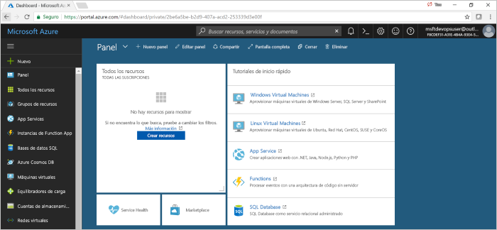
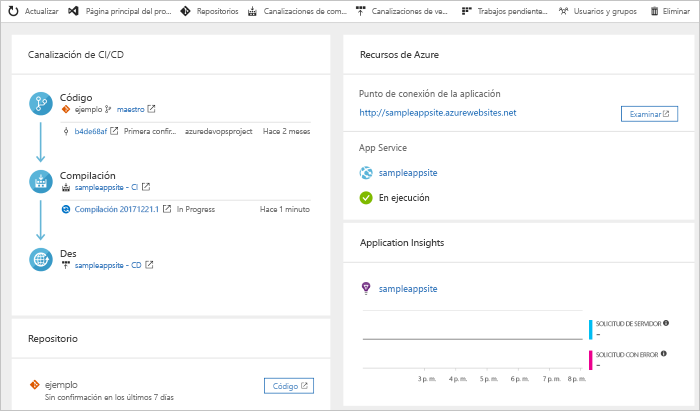

# Creación de una canalización de CI/CD para Ruby on Rails con Azure DevOps Projects

Configure la integración continua (CI) y la entrega continua (CD) para la aplicación Ruby on Rails con **Azure DevOps Projects**.  El proyecto de Azure DevOps simplifica la configuración inicial de una compilación de Azure DevOps Services y la canalización de versión.

Si no tiene una suscripción de Azure, puede obtener una gratuita mediante [Visual Studio Dev Essentials](https://visualstudio.microsoft.com/dev-essentials/).

## Inicio de sesión en Azure Portal

El proyecto de Azure DevOps crea una canalización de CI/CD en Azure DevOps Services.  Puede crear una organización de **Azure DevOps Services nueva** o usar una **existente**.  Azure DevOps Projects también crea **recursos de Azure** en la **suscripción de Azure** de su elección.

1. Inicie sesión en [Microsoft Azure Portal](https://portal.azure.com).

1. Elija el icono **Crear un recurso** en la barra de navegación izquierda y busque **Proyecto de DevOps**.  Seleccione **Create**.

    

## Seleccione una aplicación de ejemplo y el servicio de Azure

1. Seleccione la aplicación de ejemplo de **Ruby**.

1. Seleccione el marco de trabajo de la aplicación **Ruby on Rails**.  Cuando termine, elija **Siguiente**.

1. **Web App on Linux** es el destino de implementación predeterminado.  Si lo desea, puede elegir Web Apps for Containers.  El marco de trabajo de la aplicación que eligió en los pasos anteriores, determina el tipo de destino de implementación del servicio de Azure disponible aquí.  Seleccione el **servicio de destino** de su elección.  Cuando termine, elija **Siguiente**.

## Configuración de Azure DevOps Services y una suscripción de Azure 

1. Cree una **nueva** organización de Azure DevOps Services gratuita o elija una **existente**.  Elija un **nombre** para el proyecto de Azure DevOps.  Seleccione la **suscripción de Azure**, la **ubicación** y elija un **nombre** para la aplicación.  Cuando termine, elija **Listo**.

1. En unos minutos, el **panel de proyectos de Azure DevOps** se carga en Azure Portal.  Una aplicación de ejemplo se configura en un repositorio en la organización de Azure DevOps Services, se ejecuta una compilación y la aplicación se implementa en Azure.  Este panel proporciona visibilidad sobre el **repositorio de código**, la **canalización de CI/CD de Azure** y la **aplicación de Azure**.  En el lado derecho del panel, seleccione **Examinar** para ver la aplicación en ejecución.

     

## Confirmación de los cambios de código y ejecución de CI/CD

El proyecto de Azure DevOps ha creado un repositorio de Git en la organización de Azure DevOps Services o en la cuenta de GitHub.  Siga estos pasos para ver el repositorio y realizar cambios en el código de la aplicación.

1. En el lado izquierdo del panel de proyectos de DevOps, seleccione el vínculo de la rama **maestra**.  Este vínculo abre una vista al repositorio de Git recién creado.

1. Para ver la dirección URL de clonación del repositorio, seleccione **Clonar** en la parte superior derecha del explorador. Puede clonar el repositorio de Git en su IDE favorito.  En los pasos siguientes, puede usar el explorador web para realizar los cambios en el código y confirmarlos directamente en la rama maestra.

1. En el lado izquierdo del explorador, vaya al archivo **app/views/pages/home.html.erb**.

1. Seleccione **Editar** y realice un cambio en algún texto.  Por ejemplo, modifique el texto dentro de una de las etiquetas div.

1. Elija **Confirmar** y, después, guarde los cambios.

1. En el explorador, vaya al **panel de proyectos de Azure DevOps**.  Debería ver que hay una compilación en curso.  Los cambios que acaba de realizar se compilan e implementan automáticamente a través de una canalización de CI/CD de Azure.

## Examen de la canalización de CI/CD de Azure

El proyecto de Azure DevOps configuró automáticamente una canalización de CI/CD de Azure completa en la organización de Azure DevOps Services.  Explore y personalice la canalización según sea necesario.  Siga estos pasos para familiarizarse con la canalización de compilación de Azure DevOps Services y las canalizaciones de versión.

1. Seleccione **Compilar canalizaciones** en la **parte superior** del panel de proyectos de Azure DevOps.  Este vínculo abre una pestaña del explorador y la canalización de compilación de Azure DevOps Services para el nuevo proyecto.

1. Seleccione los **puntos suspensivos**.  Esta acción abre un menú en el que se pueden iniciar varias actividades, como poner en cola una nueva compilación, pausar una compilación y editar la canalización de compilación.

1. Seleccione **Editar**.

1. Desde esta vista, **examine las diversas tareas** de la canalización de compilación.  La compilación ejecuta varias tareas, como capturar códigos fuente del repositorio Git, restaurar dependencias y publicar salidas usadas para implementaciones.

1. En la parte superior de la canalización de compilación, seleccione el **nombre de esta**.

1. Cambie el **nombre** de la canalización de compilación por algo más descriptivo.  Seleccione **Guardar y poner en cola** y, después, seleccione **Guardar**.

1. En el nombre de la canalización de compilación, seleccione **Historial**.  Verá un registro de auditoría de los cambios recientes de la compilación.  Azure DevOps Services realiza un seguimiento de los cambios realizados en la canalización de compilación y permite comparar las versiones.

1. Seleccione **Desencadenadores**.  El proyecto de Azure DevOps ha creado automáticamente un desencadenador de CI y cada confirmación al repositorio da inicio a una nueva compilación.  Si lo desea, puede elegir incluir o excluir ramas del proceso de CI.

1. Seleccione **Retención**.  En función del escenario, puede especificar directivas para conservar o quitar un determinado número de compilaciones.

1. Seleccione **Compilación y versión** y, después, elija **Versiones**.  El proyecto de Azure DevOps creó una canalización de versión de Azure DevOps Services para administrar las implementaciones en Azure.

1. En el lado izquierdo del explorador, seleccione los **puntos suspensivos** junto a la canalización de versión y elija **Editar**.

1. La canalización de versión contiene una **canalización**, que define el proceso de lanzamiento.  En **Artefactos**, seleccione **Colocar**.  La canalización de compilación que ha examinado en los pasos anteriores genera la salida usada por el artefacto. 

1. En el lado derecho del icono **Colocar**, seleccione el **desencadenador de implementación continua**.  Esta canalización de versión tiene un desencadenador de CD habilitado, que ejecuta una implementación cada vez que hay un nuevo artefacto de compilación disponible.  Opcionalmente, puede deshabilitar el desencadenador, por lo que las implementaciones van a requerir una ejecución manual. 

1. En el lado izquierdo del explorador, seleccione **Tareas**.  Las tareas son las actividades que realiza el proceso de implementación.  En este ejemplo, se crea una tarea para implementarse en **Azure App Service**.

1. En el lado derecho del explorador, seleccione **Ver versiones**.  Esta vista muestra un historial de versiones.

1. Seleccione los **puntos suspensivos** junto a una de las versiones y elija **Abrir**.  Hay varios menús para explorar desde esta vista, como un resumen de versiones, elementos de trabajo asociados y pruebas.

1. Seleccione **Confirmaciones**.  Esta vista muestra las confirmaciones de código asociadas a la implementación específica. 

1. Seleccione **Registros**.  Los registros contienen información útil sobre el proceso de implementación.  Pueden verse durante y después de las implementaciones.

## Limpieza de recursos

Cuando ya no sea necesario, puede eliminar el servicio de Azure App y los recursos relacionados creados en esta guía de inicio rápido mediante la función **Eliminar**, en el panel de Azure DevOps Projects.

## Pasos siguientes

Para más información sobre cómo modificar las canalizaciones de compilación y de versión para satisfacer las necesidades de su equipo, consulte este tutorial:

> [!div class="nextstepaction"]
> [Personalización del proceso de CD](https://docs.microsoft.com/azure/devops/pipelines/release/define-multistage-release-process?view=vsts)
