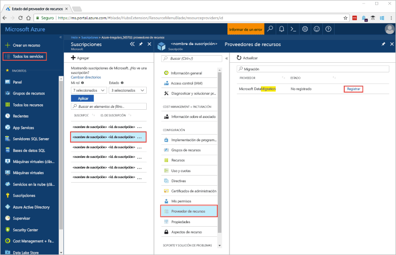
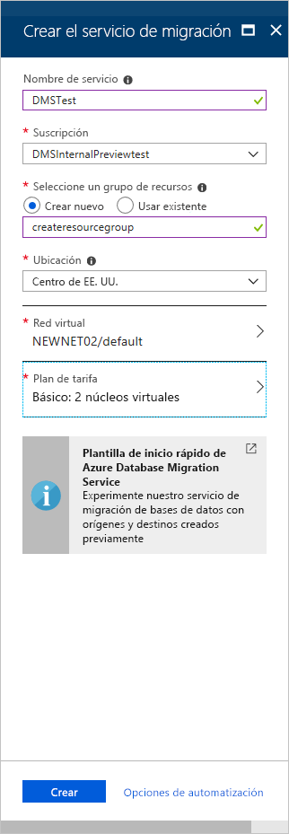

# Inicio rápido: Creación de una instancia de Azure Database Migration Service mediante Azure Portal
En esta guía de inicio rápido, puede usar Azure Portal para crear una instancia de Azure Database Migration Service.  Después de crear el servicio, puede usarlo para migrar datos de SQL Server local a una base de datos de Azure SQL Database.

Si no tiene una suscripción a Azure, cree una cuenta [gratuita](https://azure.microsoft.com/free/) antes de empezar.

## Iniciar sesión en Azure Portal
Abra el explorador web, vaya a [Microsoft Azure Portal](https://portal.azure.com/) y, a continuación, escriba sus credenciales para iniciar sesión en el portal.

La vista predeterminada es el panel del servicio.

## Registrar el proveedor de recursos
Registre el proveedor de recursos Microsoft.DataMigration antes de crear su primera instancia de Database Migration Service.

1. En Azure Portal, seleccione **Todos los servicios** y, después, **Suscripciones**.

2. Seleccione la suscripción en la que quiere crear la instancia de Azure Database Migration Service y después seleccione **Proveedores de recursos**.

3. Busque la migración y después, a la derecha de **Microsoft.DataMigration**, seleccione **Registrar**.

    

## Creación de una instancia del servicio
1. Seleccione **+ Crear un recurso** para crear una instancia de Azure Database Migration Service.

2. Busque "migration" en Marketplace, seleccione **Azure Database Migration Service** y, en la pantalla **Azure Database Migration Service**, seleccione **Crear**.

3. En la pantalla **Crear el servicio de migración**: 

    - Elija un **nombre del servicio** que sea fácil de recordar y único para identificar la instancia de Azure Database Migration Service.
    - Seleccione la **suscripción** de Azure donde desea crear la instancia.
    - Seleccione un **Grupo de recursos** existente o cree uno.
    - Elija la **ubicación** más cercana a su servidor de origen o de destino.
    - Seleccione una **red virtual** (VNET) existente o cree una nueva.

        La VNET proporciona a Azure Database Migration Service acceso a la base de datos de origen y al entorno de destino.

        Para más información sobre cómo crear una VNET en Azure Portal, consulte el artículo [Creación de una red virtual mediante Azure Portal](https://aka.ms/vnet).

    - Seleccione Básico: 1 núcleo virtual para el **plan de tarifa**.

        

4. Seleccione **Crear**.

    Transcurridos unos instantes, se crea la instancia de Azure Database Migration Service y estará lista para usarse. Database Migration Service se muestra tal como aparece en la imagen siguiente:

    

## Limpieza de recursos
Puede limpiar los recursos creados en esta guía de inicio rápido mediante la eliminación del [grupo de recursos de Azure](../azure-resource-manager/resource-group-overview.md). Para eliminar el grupo de recursos, navegue a la instancia de Azure Database Migration Service que creó. Seleccione el nombre del **grupo de recursos** y, luego, seleccione **Eliminar grupo de recursos**. Esta acción elimina todos los activos del grupo de recursos, así como el mismo grupo.

## Pasos siguientes
> [!div class="nextstepaction"]
> [Migración de SQL Server local a Azure SQL Database](tutorial-sql-server-to-azure-sql.md)