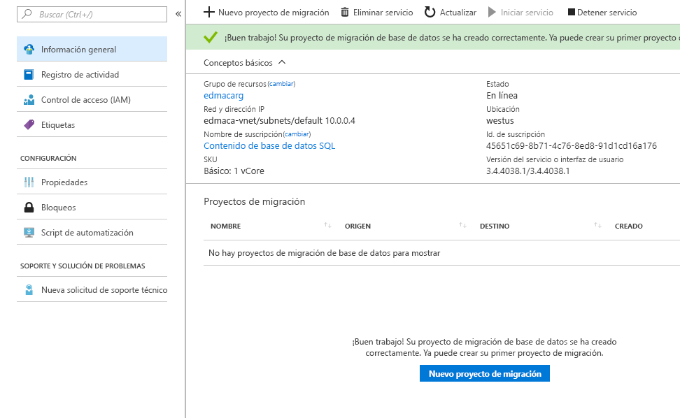

# Creación de una instancia de Azure Database Migration Service mediante Azure Portal
En esta guía de inicio rápido, va a usar Azure Portal para crear una instancia de Azure Database Migration Service.  Después de crear el servicio, podrá usarlo para migrar datos de SQL Server local a una base de datos de Azure SQL Database.

Si no tiene una suscripción a Azure, cree una cuenta [gratuita](https://azure.microsoft.com/free/) antes de empezar.

## Iniciar sesión en Azure Portal
Abra el explorador web y vaya a [Microsoft Azure Portal](https://portal.azure.com/). Introduzca sus credenciales para iniciar sesión en el portal. La vista predeterminada es el panel del servicio.

## Creación de Azure Database Migration Service
1. Haga clic en **+** para crear un nuevo servicio.  Database Migration Service todavía está en versión preliminar.  

1. Busque en Marketplace "migration", seleccione "Database Migration Service (preview)" y haga clic en **Crear**.

    

    - Elija un **nombre del servicio** que sea fácil de recordar y único para identificar la instancia de Azure Database Migration Service.
    - Seleccione la **suscripción** de Azure donde desea crear la instancia de Database Migration Service.
    - Cree una nueva **red** con un nombre único.
    - Elija la **ubicación** más cercana a su servidor de origen o de destino.
    - Seleccione Básico: 1 vCore para el **plan de tarifa**.

1. Haga clic en **Crear**.

Transcurridos unos instantes, el servicio Azure Database Migration Service se crea y estará listo para usarse.  Podrá ver la instancia de Database Migration Service tal como se muestra en la imagen.

## Limpieza de recursos
Puede limpiar los recursos que ha creado en la guía de inicio rápido mediante la eliminación del [grupo de recursos de Azure](../azure-resource-manager/resource-group-overview.md).  Para eliminar el grupo de recursos, navegue a la instancia de Database Migration Service que ha creado, haga clic en el nombre del **grupo de recursos** y después seleccione **Eliminar grupo de recursos**.  Esta acción elimina todos los activos del grupo de recursos, así como el mismo grupo.

## Pasos siguientes
> [!div class="nextstepaction"]
> [Migración de SQL Server local a Azure SQL Database](tutorial-sql-server-to-azure-sql.md)