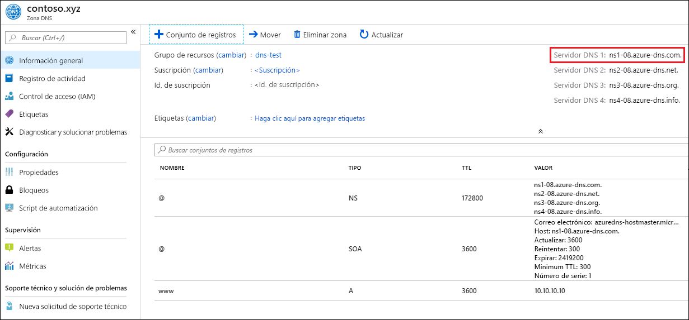

# <a name="quickstart-configure-azure-dns-for-name-resolution-by-using-the-portal"></a>Inicio rápido: Configuración de Azure DNS para la resolución de nombres mediante el portal

Puede configurar Azure DNS para resolver nombres de host en el dominio público. Por ejemplo, si ha adquirido el nombre de dominio *contoso.com* de un registrador de nombres de dominio, puede configurar Azure DNS para hospedar el dominio *contoso.com* y resolver *www.contoso.com* en la dirección IP del servidor web o la aplicación web.

En esta guía de inicio rápido, creará un dominio de prueba y, después, un registro de dirección llamado *www* para resolverlo en la dirección IP *10.10.10.10*.

>[!IMPORTANT]
>Todos los nombres y direcciones IP en esta guía de inicio rápido son ejemplos que no representan escenarios del mundo real. En la guía de inicio rápido también se describen las implicaciones del mundo real cuando procede.

<!---
You can also perform these steps using [Azure PowerShell](dns-getstarted-powershell.md) or the cross-platform [Azure CLI](dns-getstarted-cli.md).
--->

Si no tiene una suscripción a Azure, cree una [cuenta gratuita](https://azure.microsoft.com/free/?WT.mc_id=A261C142F) antes de empezar.

Para todos los pasos de portal, inicie sesión en [Azure Portal](https://portal.azure.com).

## <a name="create-a-dns-zone"></a>Creación de una zona DNS

Una zona DNS contiene las entradas de DNS para un dominio. Para iniciar el hospedaje de su dominio en Azure DNS, debe crear una zona DNS para ese nombre de dominio. 

**Para crear la zona DNS:**

1. En la parte superior izquierda, seleccione **Crear un recurso**, después **Red** y finalmente **Zona DNS**.
   
1. En la página **Crear zona DNS**, escriba o seleccione los siguientes valores:
   
   - **Nombre**: escriba *contoso.xyz* en este ejemplo de inicio rápido. El nombre de la zona DNS puede ser cualquier valor que no esté ya configurado en los servidores de Azure DNS. Un valor del mundo real sería un dominio que haya comprado a un registrador de nombres de dominio.
   - **Grupos de recursos**: seleccione **Crear nuevo**, introduzca *dns-test* y seleccione **Aceptar**. El nombre del grupo de recursos debe ser único dentro de la suscripción de Azure. 
   
1. Seleccione **Crear**.

   
   
La creación de la zona puede tardar unos minutos.

## <a name="create-a-dns-record"></a>Creación de un registro de DNS

Cree entradas o registros DNS para su dominio dentro de la zona DNS. Cree un nuevo registro de dirección o un registro "A" para resolver un nombre de host a una dirección IPv4.

**Para crear un registro "A":**

1. En Azure Portal, en **Todos los recursos**, abra la zona DNS **contoso.xyz** en el grupo de recursos **dns-test**. Puede escribir *contoso.xyz* en el cuadro **Filtrar por nombre** para encontrarlo más fácilmente.

1. En la parte superior de la página **Zona DNS**, seleccione **+ Conjunto de registros**.

1. En la página **Agregar conjunto de registros**, escriba o seleccione los siguientes valores:

   - **Nombre**: escriba *www*. El nombre de registro es el nombre de host que desea resolver en la dirección IP especificada.
   - **Tipo**: seleccione **A**. Los registros "A" son las más comunes, pero hay otros tipos de registros para los servidores de correo (MX), las direcciones IP v6 (AAAA), etc. 
   - **TTL**: escriba *1*. El *período de vida* de la solicitud DNS especifica cuánto tiempo pueden los clientes y servidores DNS almacenar en caché una respuesta.
   - **Unidad de TTL**: seleccione **Horas**. Esta es la unidad de tiempo para el valor **TTL**. 
   - **Dirección IP**: para este ejemplo de inicio rápido, escriba *10.10.10.10*. Este valor es la dirección IP en la que se resuelve el nombre de registro. En un escenario del mundo real, tendría que escribir la dirección IP pública del servidor web.

Como esta guía de inicio rápido no utiliza un dominio real, no es necesario configurar los servidores de nombres de Azure DNS en un registrador de nombres de dominio. Con un dominio real, normalmente querría que todos los usuarios de Internet pudieran resolver el nombre de host para conectarse al servidor o aplicación web. Visitará su registrador de nombres de dominio para reemplazar los registros del servidor de nombres con los servidores de nombres de Azure DNS. Para más información, vea [Tutorial: Hospedaje del dominio en Azure DNS](dns-delegate-domain-azure-dns.md#delegate-the-domain).

## <a name="test-the-name-resolution"></a>Probar la resolución de nombres

Ahora que tiene una zona DNS de prueba, con un registro "A" de prueba, puede probar la resolución de nombres con una herramienta llamada *nslookup*. 

**Para probar la resolución de nombres DNS:**

1. En Azure Portal, en **Todos los recursos**, abra la zona DNS **contoso.xyz** en el grupo de recursos **dns-test**. Puede escribir *contoso.xyz* en el cuadro **Filtrar por nombre** para encontrarlo más fácilmente.

1. Copie uno de los nombres de los servidores de nombres de la lista de servidores de nombres en la página **Introducción**. 
   
   
   
   >[!NOTE]
   >En un escenario real, copia los cuatro nombres de servidores de nombres, incluso los períodos finales, y los utiliza para los nuevos nombres de servidores de nombres de dominio de Azure DNS en su registrador de dominios. Para más información, consulte [Delegación de un dominio en Azure DNS](dns-delegate-domain-azure-dns.md).
   
1. Abra un símbolo del sistema y ejecute el comando siguiente:

   ```
   nslookup <host name> <name server name>
   ```
   
   Por ejemplo: 
   
   ```
   nslookup www.contoso.xyz ns1-08.azure-dns.com.
   ```
   
   Debe ver algo parecido a la pantalla siguiente:
   
   

El nombre de host **www.contoso.xyz** se resuelve en **10.10.10.10**, que es como lo ha configurado. Este resultado confirma que la resolución de nombres funciona correctamente. 

## <a name="clean-up-resources"></a>Limpieza de recursos

Cuando ya no necesite los recursos que creó en esta guía de inicio rápido, quítelos mediante la eliminación del grupo de recursos **dns-test**. Abra el grupo de recursos **dns-test** y seleccione **Eliminar grupo de recursos**.

## <a name="next-steps"></a>Pasos siguientes

> [!div class="nextstepaction"]
> [Creación de registros DNS para una aplicación web en un dominio personalizado](./dns-web-sites-custom-domain.md)