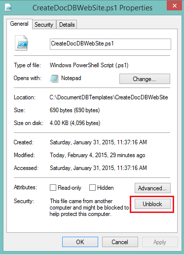
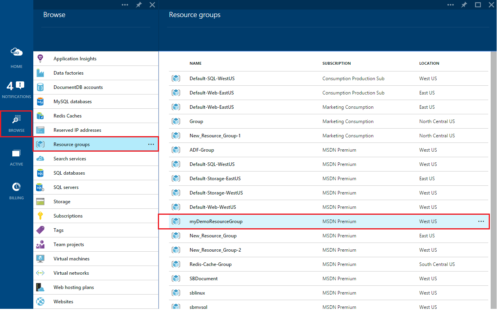
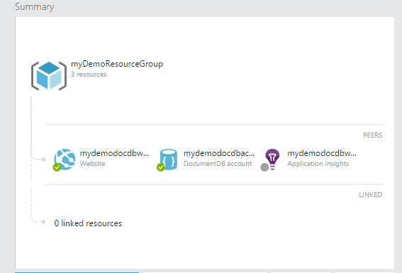

<properties 
	pageTitle="Implementación de DocumentDB y un sitio web de Azure mediante una plantilla del Administrador de recursos de Azure | Azure" 
	description="Aprenda a implementar una cuenta de Base de documentos, un sitio web de Azure y una aplicación web de ejemplo mediante una plantilla del Administrador de recursos de Azure." 
	services="documentdb, websites" 
	authors="stephbaron" 
	manager="johnmac" 
	editor="monicar" 
	documentationCenter=""/>

<tags 
	ms.service="documentdb" 
	ms.workload="data-services" 
	ms.tgt_pltfrm="na" 
	ms.devlang="na" 
	ms.topic="article" 
	ms.date="03/23/2015" 
	ms.author="stbaro"/>

# Implementación de DocumentDB y de un sitio web de Azure mediante una plantilla del Administrador de recursos de Azure #

En este tutorial se muestra cómo usar una plantilla del Administrador de recursos de Azure para implementar e integrar [DocumentDB de Microsoft Azure](http://azure.microsoft.com/services/documentdb/), un [sitio web de Azure](http://azure.microsoft.com/services/websites/) y una aplicación web de ejemplo.

Después de completar este tutorial, podrá responder a las preguntas siguientes:  

-	¿Cómo puedo usar una plantilla del Administrador de recursos de Azure para implementar e integrar una cuenta de DocumentDB y un sitio web de Azure?
-	¿Cómo puedo usar una plantilla del Administrador de recursos de Azure para implementar e integrar una cuenta de DocumentDB, un sitio web de Azure y una aplicación Webdeploy?

##Requisitos previos ##
> [AZURE.TIP] Si bien en este tutorial no se supone que se deba tener experiencia anterior con plantillas del Administrador de recursos de Azure, JSON o Azure PowerShell, si desea modificar las plantillas a las que se hace referencia o las opciones de implementación, sí se requerirá entonces el conocimiento de cada una de estas áreas.

Antes de seguir las instrucciones de este tutorial, asegúrese de contar con lo siguiente:

- Una suscripción de Azure. Azure es una plataforma basada en suscripción.  Para obtener más información acerca de cómo obtener una suscripción, consulte [Opciones de compra](http://azure.microsoft.com/pricing/purchase-options/), [Ofertas para miembros](http://azure.microsoft.com/pricing/member-offers/) o [Prueba gratuita](http://azure.microsoft.com/pricing/free-trial/).
- Una cuenta de almacenamiento de Azure. Para obtener instrucciones, consulte [Cuentas de almacenamiento de Azure](storage-whatis-account.md)
- Una estación de trabajo con Azure PowerShell. Para obtener más información, consulte [Instalación y configuración de Azure PowerShell](install-configure-powershell.md).

##Paso 1: Descarga y extracción de los archivos de ejemplo ##
Vamos a empezar descargando los archivos de ejemplo que usaremos en este tutorial.

1. Descargue el [ejemplo Creación de una cuenta de DocumentDB y un sitio web e implementación de una aplicación de demostración](https://portalcontent.blob.core.windows.net/samples/CreateDocDBWebsiteTodo.zip) en una carpeta local (por ejemplo, C:\DocumentDBTemplates) y extraiga los archivos.  En este ejemplo se implementará una cuenta de DocumentDB, un sitio web de Azure y una aplicación web.  También se configurará automáticamente la aplicación web para conectar con la cuenta de DocumentDB.

2. Descargue el [ejemplo Creación de una cuenta de DocumentDB y un sitio web](https://portalcontent.blob.core.windows.net/samples/CreateDocDBWebSite.zip) en una carpeta local (por ejemplo, C:\DocumentDBTemplates) y extraiga los archivos.  En este ejemplo se implementará una cuenta de DocumentDB y un sitio web de Azure, y se modificará la configuración del sitio web para exponer fácilmente la información de conexión de DocumentDB, pero no se incluye una aplicación web.  

> [AZURE.TIP] Tenga en cuenta que en función de la configuración de seguridad de su equipo, puede que tenga que desbloquear los archivos extraídos; para ello, haga clic en ellos con el botón derecho, haga clic e **Propiedades**y haga clic en **Desbloquear**.

##Paso 2: Implementación del ejemplo de cuenta de documento, sitio web y aplicación de demostración ##

Ahora vamos a implementar nuestra primera plantilla.

> [AZURE.TIP] La plantilla no valida que el nombre del sitio web y el nombre de la cuenta de DocumentDB especificados a continuación sean a) válidos y b) estén disponibles.  Es muy recomendable que compruebe la disponibilidad de los nombres que planea suministrar antes de ejecutar el script de implementación de PowerShell.

1. Abra Microsoft Azure PowerShell y vaya a la carpeta en la que ha descargado y extraído el [ejemplo Creación de una cuenta de DocumentDB y un sitio web, e implementación de una aplicación de demostración](https://portalcontent.blob.core.windows.net/samples/CreateDocDBWebsiteTodo.zip) (por ejemplo, C:\DocumentDBTemplates\CreateDocDBWebsiteTodo).

2. Vamos a ejecutar el script de PowerShell CreateDocDBWebsiteTodo.ps1.  El script toma los siguientes parámetros obligatorios:
	- WebsiteName: Especifica el nombre del sitio web y se usa para crear la URL que se utilizará para el acceso al sitio web (por ejemplo, si especifica "mydemodocdbwebsite", la URL por la que tendrá acceso al sitio web será mydemodocdbwebsite.azurewebsites.net).

	- ResourceGroupName: Especifica el nombre del grupo de recursos de Azure que se implementará. Si el grupo de recursos especificado no existe, se creará.

	- docDBAccountName: Especifica el nombre de la cuenta de DocumentDB que se creará.

	- location: Especifica la ubicación de Azure en la que se crearán los recursos de DocumentDB y del sitio web.  Valores válidos son Asia Oriental, Sudeste de Asia, Este de Estados Unidos, Oeste de Estados Unidos, Europa del Norte, Europa Occidental (tenga en cuenta que el valor de ubicación proporcionado distingue mayúsculas de minúsculas).

3. Este es un comando de ejemplo para ejecutar el script:

    	PS C:\DocumentDBTemplates\CreateDocDBWebsiteTodo> .\CreateDocDBWebsiteTodo.ps1 -WebSiteName "mydemodocdbwebsite" -ResourceGroupName "myDemoResourceGroup" -docDBAccountName "mydemodocdbaccount" -location "West US"

	> [AZURE.TIP] Tenga en cuenta que se le pedirá que escriba su nombre de usuario y contraseña de Azure como parte de la ejecución del script. La implementación completa tardará entre 10 y 15 minutos en completarse.  	

4. A continuación se muestra un ejemplo de la salida resultante: 

		VERBOSE: 1:06:00 PM - Created resource group 'myDemoResourceGroup' in location westus'
		VERBOSE: 1:06:01 PM - Template is valid.
		VERBOSE: 1:06:01 PM - Create template deployment 'Microsoft.DocumentDBWebSiteTodo'.
		VERBOSE: 1:06:08 PM - Resource Microsoft.DocumentDb/databaseAccounts 'mydemodocdbaccount' provisioning status is running
		VERBOSE: 1:06:10 PM - Resource Microsoft.Web/serverFarms 'mydemodocdbwebsite' provisioning status is succeeded
		VERBOSE: 1:06:14 PM - Resource microsoft.insights/alertrules 'CPUHigh mydemodocdbwebsite' provisioning status is succeeded
		VERBOSE: 1:06:16 PM - Resource microsoft.insights/autoscalesettings 'mydemodocdbwebsite-myDemoResourceGroup' provisioning status is succeeded
		VERBOSE: 1:06:16 PM - Resource microsoft.insights/alertrules 'LongHttpQueue mydemodocdbwebsite' provisioning status is succeeded
		VERBOSE: 1:06:21 PM - Resource Microsoft.Web/Sites 'mydemodocdbwebsite' provisioning status is succeeded
		VERBOSE: 1:06:23 PM - Resource microsoft.insights/alertrules 'ForbiddenRequests mydemodocdbwebsite' provisioning status is succeeded
		VERBOSE: 1:06:25 PM - Resource microsoft.insights/alertrules 'ServerErrors mydemodocdbwebsite' provisioning status is succeeded
		VERBOSE: 1:06:25 PM - Resource microsoft.insights/components 'mydemodocdbwebsite' provisioning status is succeeded
		VERBOSE: 1:16:22 PM - Resource Microsoft.DocumentDb/databaseAccounts 'mydemodocdbaccount' provisioning status is succeeded
		VERBOSE: 1:16:22 PM - Resource Microsoft.DocumentDb/databaseAccounts 'mydemodocdbaccount' provisioning status is succeeded
		VERBOSE: 1:16:24 PM - Resource Microsoft.Web/Sites/config 'mydemodocdbwebsite/web' provisioning status is succeeded
		VERBOSE: 1:16:27 PM - Resource Microsoft.Web/Sites/Extensions 'mydemodocdbwebsite/MSDeploy' provisioning status is running
		VERBOSE: 1:16:35 PM - Resource Microsoft.Web/Sites/Extensions 'mydemodocdbwebsite/MSDeploy' provisioning status is succeeded

		ResourceGroupName : myDemoResourceGroup
		Location          : westus
		Resources         : {mydemodocdbaccount, CPUHigh mydemodocdbwebsite, ForbiddenRequests mydemodocdbwebsite, LongHttpQueue mydemodocdbwebsite...}
		ResourcesTable    :
                    Name                                    Type                                   Location
                    ======================================  =====================================  =========
                    mydemodocdbaccount                      Microsoft.DocumentDb/databaseAccounts  westus
                    CPUHigh mydemodocdbwebsite              microsoft.insights/alertrules          eastus
                    ForbiddenRequests mydemodocdbwebsite    microsoft.insights/alertrules          eastus
                    LongHttpQueue mydemodocdbwebsite        microsoft.insights/alertrules          eastus
                    ServerErrors mydemodocdbwebsite         microsoft.insights/alertrules          eastus
                    mydemodocdbwebsite-myDemoResourceGroup  microsoft.insights/autoscalesettings   eastus
                    mydemodocdbwebsite                      microsoft.insights/components          centralus
                    mydemodocdbwebsite                      Microsoft.Web/serverFarms              westus
                    mydemodocdbwebsite                      Microsoft.Web/sites                    westus

		ProvisioningState : Succeeded

5. Antes de examinar nuestra aplicación de ejemplo, es necesario comprender qué hace la implementación de la plantilla:

	- Se ha creado un sitio web de Azure.

	- Se ha creado una cuenta de Microsoft Azure DocumentDB.

	- Un paquete de implementación web se ha implementado en el sitio web de Azure

	- La configuración del sitio web de Azure se ha modificado de forma que el extremo de Microsoft Azure DocumentDB y la clave maestra principal se han expuesto como configuración de la aplicación.

	- Se ha creado una serie de reglas de supervisión predeterminadas.

	
6. Para usar la aplicación, vaya simplemente a la URL del sitio web (en el ejemplo anterior, la URL sería http://mydemodocdbwebsite.azurewebsites.net).  Verá la siguiente aplicación web:

	

7. Siga adelante y cree un par de tareas y luego vamos a abrir el [Portal de vista previa de Azure](https://portal.azure.com).

8. Elija examinar los grupos de recursos y seleccione el grupo de recursos que hemos creado durante la implementación (en el ejemplo anterior, myDemoResourceGroup).

	
9.  Observe que el mapa de recursos del modo Resumen muestra todos nuestros recursos relacionados (cuenta de DocumentDB, Sitio web, Supervisión).

	
10.  Haga clic en su cuenta de DocumentDB e inicie el Explorador de consultas (cerca de la parte inferior de la hoja de la cuenta).

	

11. Ejecute la consulta predeterminada, "SELECT * FROM c" e inspeccione los resultados.  Observe que la consulta ha recuperado la representación JSON de los elementos todo creados en el paso 7 anterior.  No dude en experimentar con las consultas; por ejemplo, intente ejecutar SELECT * FROM c WHERE c.isComplete = true para devolver todos los elementos todo marcados como completos.

	
12. No dude en explorar la experiencia del portal de DocumentDB o modificar la aplicación Todo de ejemplo.  Cuando esté preparado, implementaremos otra plantilla.
	 
##Paso 3: Implementación de la cuenta de documentos y del ejemplo de sitio web ##

Ahora implementaremos nuestra segunda plantilla.

> [AZURE.TIP] La plantilla no valida que el nombre del sitio web y el nombre de la cuenta de DocumentDB especificados a continuación sean a) válidos y b) estén disponibles.  Es muy recomendable que compruebe la disponibilidad de los nombres que planea suministrar antes de ejecutar el script de implementación de PowerShell.

1. Abra Microsoft Azure PowerShell y vaya a la carpeta en la que descargó y extrajo el [ejemplo Creación de una cuenta de DocumentDB y un sitio web](https://portalcontent.blob.core.windows.net/samples/CreateDocDBWebSite.zip) (por ejemplo, C:\DocumentDBTemplates\CreateDocDBWebsite).

2. Vamos a ejecutar el script CreateDocDBWebsite.ps1 de PowerShell.  El script toma los mismos parámetros que la primera plantilla que hemos implementado, a saber:
	- WebsiteName: Especifica el nombre del sitio web y se usa para crear la URL que utilizará para el acceso al sitio web (por ejemplo, si especifica "myotherdocumentdbwebsite", la URL mediante la que accederá al sitio web será myotherdocumentdbwebsite.azurewebsites.net).

	- ResourceGroupName: Especifica el nombre del grupo de recursos de Azure que se implementará.  Si el grupo de recursos especificado no existe, se creará.

	- docDBAccountName: Especifica el nombre de la cuenta de DocumentDB que se creará.

	- 	location: Especifica la ubicación de Azure en la que se crearán los recursos de DocumentDB y del sitio web.  Valores válidos son Asia Oriental, Sudeste de Asia, Este de Estados Unidos, Oeste de Estados Unidos, Europa del Norte, Europa Occidental (tenga en cuenta que el valor de ubicación proporcionado distingue mayúsculas de minúsculas).

3. Este es un comando de ejemplo para ejecutar el script:

    	PS C:\DocumentDBTemplates\CreateDocDBWebSite> .\CreateDocDBWebSite.ps1 -WebSiteName "myotherdocumentdbwebsite" -ResourceGroupName "myOtherDemoResourceGroup" -docDBAccountName "myotherdocumentdbdemoaccount" -location "East US"

	> [AZURE.TIP] Tenga en cuenta que se le pedirá que escriba su nombre de usuario y contraseña de Azure como parte de la ejecución del script.  La implementación completa tardará entre 10 y 15 minutos en completarse.  	

4. El resultado de la implementación será muy parecido al primer ejemplo de plantilla. 
5. Antes de abrir el portal de Azure, debemos comprender qué hace la implementación de esta plantilla:

	- Se ha creado un sitio web de Azure.

	- Se ha creado una cuenta de Microsoft Azure DocumentDB.

	- 	La configuración del sitio web de Azure se ha modificado de forma que el extremo de Microsoft Azure DocumentDB, la clave maestra primaria y la clave maestra secundaria se expusieron como configuración de la aplicación.

	- 	Se ha creado una serie de reglas de supervisión predeterminadas.

6. Vamos a abrir el [Portal de vista previa de Azure](https://portal.azure.com), elija examinar los grupos de recursos y seleccione el grupo de recursos que hemos creado durante la implementación (en el ejemplo anterior, myOtherDemoResourceGroup).
7. En el modo Resumen, haga clic en el sitio web de Azure que acaba de implementar.

	
8. En la hoja Sitio web, haga clic en **Toda la configuración**, luego en **Configuración de la aplicación** y observe que existen valores de configuración de aplicación para el extremo de DocumentDB y para cada una de las claves maestras de DocumentDB.

	
9. No dude en seguir explorando el portal de Azure o siga uno de nuestros [ejemplos](http://go.microsoft.com/fwlink/?LinkID=402386) de DocumentDB para crear su propia aplicación de DocumentDB.

	
	

##Pasos siguientes

¡Enhorabuena! Ha implementado DocumentDB, Sitios web Azure y una aplicación web de ejemplo mediante plantillas del Administrador de recursos de Azure.

- Para obtener más información acerca de DocumentDB, haga clic [aquí](http://azure.com/docdb).
- Para obtener más información sobre Sitios web Azure, haga clic [aquí](http://go.microsoft.com/fwlink/?LinkId=325362).
- Para obtener más información sobre las plantillas del Administrador de recursos de Azure, haga clic [aquí](https://msdn.microsoft.com/library/azure/dn790549.aspx).

<!--HONumber=49-->