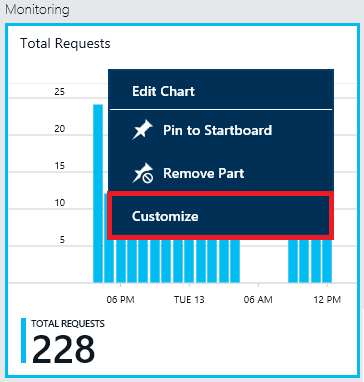
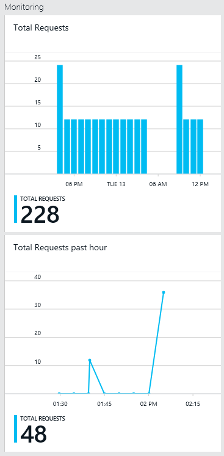
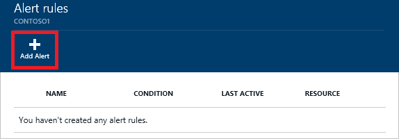

<properties 
	pageTitle="Supervisar una cuenta de Base de datos de documentos | Azure" 
	description="Obtenga información acerca de cómo supervisar la cuenta de Base de datos de documentos para aplicar métricas de rendimiento (como solicitudes y errores de servidor) y métricas de uso (como consumo de almacenamiento)." 
	services="documentdb" 
	documentationCenter="" 
	authors="mimig1" 
	manager="jhubbard" 
	editor="cgronlun"/>

<tags 
	ms.service="documentdb" 
	ms.workload="data-services" 
	ms.tgt_pltfrm="na" 
	ms.devlang="na" 
	ms.topic="article" 
	ms.date="01/13/2015" 
	ms.author="mimig"/>

#Supervisión de una cuenta de Base de datos de documentos  

Puede supervisar sus cuentas de Base de datos de documentos en el [Portal de vista previa de Azure](https://portal.azure.com/). Para cada cuenta de Base de datos de documentos, existen métricas de rendimiento (como solicitudes y errores de servidor) y métricas de uso (como consumo de almacenamiento).

##   Instrucciones acerca de cómo: métricas de rendimiento para una cuenta de Base de datos de documentos
1.	En el [Portal de vista previa de Azure](https://portal.azure.com/), haga clic en **Examinar**, luego en **Cuentas de Base de datos de documentos** y, después, haga clic en el nombre de la cuenta de Base de datos de documentos cuyas métricas de rendimiento desee ver.
2.	En el modo **Supervisión** puede ver estos datos de forma predeterminada:
	*	El total de solicitudes del día actual.
	*	La media de solicitudes por segundo del día actual. 
	
	

3.	Al hacer clic en **Total de solicitudes** o **Promedio de solicitudes por segundo**, se abre una hoja detallada denominada **Métrica**.
4.	La hoja **Métrica** muestra los detalles sobre las métricas que se pueden seleccionar.  En la parte superior de la hoja hay un gráfico y, debajo, una tabla que muestra los valores de agregación de las métricas seleccionadas, como el promedio o el valor máximo y el mínimo.  El cuadro Métrica muestra también la lista de alertas que se han definido, filtrada por las métricas que aparecen en el cuadro actual (de esta forma, si tiene un número de alertas, solo verá aquí las pertinentes).   

	

## Personalización de las vistas de métricas de rendimiento para una cuenta de Base de datos de documentos

1.	Para personalizar las métricas que se muestran en una determinada parte, haga clic con el botón derecho en el gráfico de métricas y, a continuación, elija **Editar gráfico**.  
	

2.	En la hoja **Editar gráfico**, hay opciones para modificar las métricas que se muestran en esa parte, junto con su intervalo de tiempo.  
	

3.	Para cambiar las métricas que se muestran en la parte, solo tiene que marcar o desmarcar las métricas de rendimiento disponibles y luego hacer clic en **Guardar** en la parte inferior de la hoja.  
4.	Para cambiar el intervalo de tiempo, elija un intervalo diferente (por ejemplo, **Hora pasada**) y, acto seguido, haga clic en **Guardar** en la parte inferior de la hoja.  

	 

## Creación de gráficos de métricas de rendimiento paralelos
El Portal de vista previa de Azure le permite crear gráficos de métricas paralelos.  

1.	En primer lugar, haga clic con el botón secundario en el gráfico que desea clonar y modificar. Después, seleccione **Personalizar**. 

	

2.	Haga clic en **Clonar** en el menú para copiar la parte y, a continuación, haga clic en **Personalización efectuada**. 

	  

Ahora puede tratar esta parte como otra parte de métricas y personalizar las métricas y el intervalo de tiempo que se muestra en la parte.  De esta forma, puede ver dos gráficos de métricas diferentes en paralelo al mismo tiempo.  
	  

## Visualización de métricas de uso para una cuenta de Base de datos de documentos
1.	En el [Portal de vista previa de Azure](https://portal.azure.com/), haga clic en **Examinar**, luego en **Cuentas de Base de datos de documentos** y, después, haga clic en el nombre de la cuenta cuyas métricas de uso desee ver.
2.	En el modo **Uso**, puede ver la siguiente información de forma predeterminada:
	*	Coste estimado
	*	Almacenamiento consumido en la cuenta
	*	Máximo almacenamiento disponible en la cuenta
	*	Usuario y permiso de uso
	*	Asignación de la unidad de capacidad (CU)
	*	Uso de datos adjuntos

	
 
## Configuración de alertas de métricas de rendimiento para una cuenta de Base de datos de documentos
1.	En el [Portal de vista previa de Azure](https://portal.azure.com/), haga clic en **Examinar**, luego en **Cuentas de Base de datos de documentos** y, después, haga clic en el nombre de la cuenta de Base de datos de documentos para la que desea configurar alertas de métricas de rendimiento.
2.	En el modo **Operaciones**, haga clic en la parte **Reglas de alerta**.  
	

3.	En la hoja Reglas de alerta, haga clic en **Agregar alerta**.  
	

4.	En la hoja **Agregar una regla de alerta**, especifique:
	*	El nombre de la regla de alerta que va a configurar.
	*	Una descripción de la nueva regla de alerta.
	*	La métrica de la regla de alerta.
	*	La condición, el umbral y el período que determinan cuándo se activa la alerta. Por ejemplo, un número de errores de servidor mayor que cinco durante los últimos 15 minutos.
	*	Si se envía un correo electrónico al administrador del servicio y a los coadministradores cuando la alerta de dispara.
	*	Direcciones de correo electrónico adicionales para las notificaciones de alerta.  
	

 
## Pasos siguientes
Para obtener más información acerca de la capacidad y el rendimiento de Base de datos de documentos, consulte [Administración del rendimiento y la capacidad de Base de datos de documentos](documentdb-manage.md). 

<!--Anchors-->
[Visualización de las métricas de rendimiento para una cuenta de Base de datos de documentos]: #How-to-view-performance-metrics-for-a-DocumentDB-account
[Personalización de las vistas de métricas de rendimiento para una cuenta de Base de datos de documentos]: #Customize-performance-metric-views-for-a-DocumentDB-account
[Creación de gráficos de métricas de rendimiento paralelos]: #How-to-create-side-by-side-performance-metric-charts
[Visualización de las métricas de uso para una cuenta de Base de datos de documentos]: #How-to-view-usage-metrics-for-a-DocumentDB-account
[Configuración de alertas de métricas de rendimiento para una cuenta de Base de datos de documentos]: #How-to-setup-performance-metric-alerts-for-a-DocumentDB-account
[Pasos siguientes]: #Next-steps

<!--HONumber=49-->