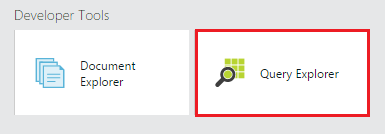
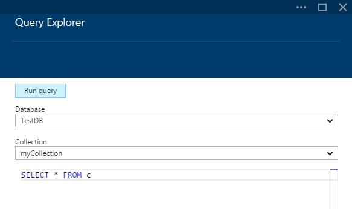
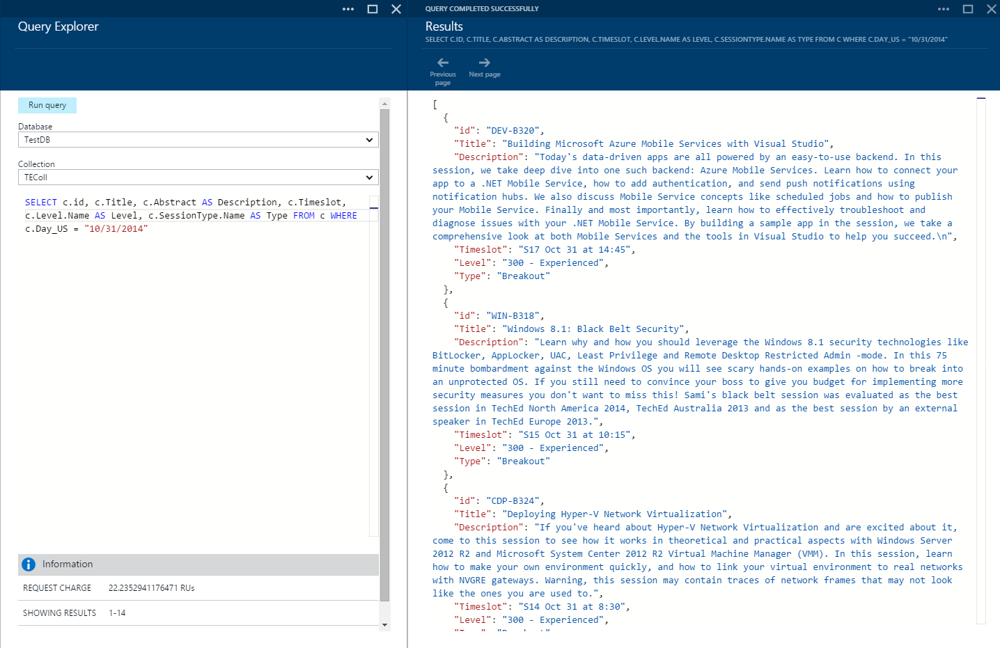
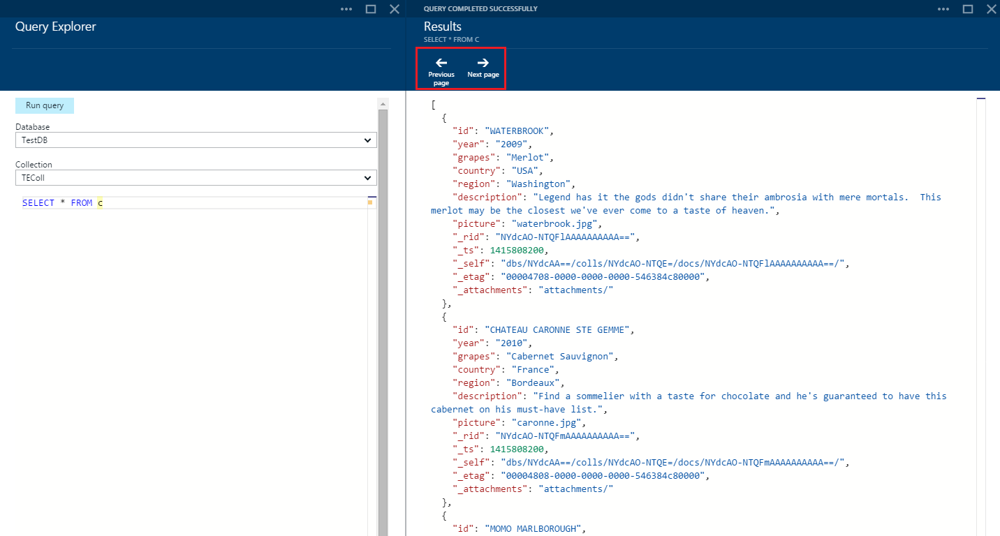
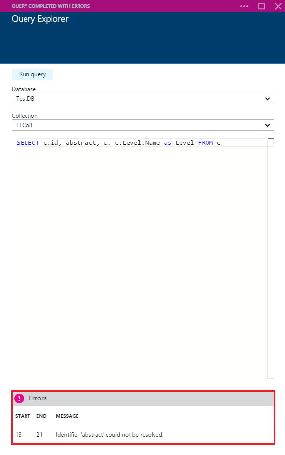

<properties 
	pageTitle="Creación, edición y ejecución de consultas SQL con respecto a una colección de Base de datos de documentos usando el Explorador de consultas | Azure" 
	description="Obtenga información sobre el Explorador de consultas de Base de datos de documentos, una herramienta del Portal de vista previa de Azure que permite crear, editar y ejecutar consultas SQL con respecto a una colección de Base de datos de documentos." 
	services="documentdb" 
	authors="stephbaron" 
	manager="johnmac" 
	editor="monicar" 
	documentationCenter=""/>

<tags 
	ms.service="documentdb" 
	ms.workload="data-services" 
	ms.tgt_pltfrm="na" 
	ms.devlang="na" 
	ms.topic="article" 
	ms.date="2/13/2015" 
	ms.author="stbaro"/>

# Creación, edición y ejecución de consultas SQL con respecto a una colección de Base de datos de documentos usando el Explorador de consultas #

En este artículo se proporciona información general sobre el Explorador de consultas de [Base de datos de documentos de Microsoft Azure](http://azure.microsoft.com/services/documentdb/), una herramienta de Portal de vista previa de Azure que permite crear, editar y ejecutar consultas en una colección de Base de datos de documentos. 

Después de completar este tutorial, podrá responder a las preguntas siguientes:  

-	¿Cómo puedo crear, editar y ejecutar consultas fácilmente en una colección de Base de datos de documentos mediante un explorador web?
-	¿Cómo puedo navegar fácilmente por las páginas de resultados de la consultas de Base de datos de documentos mediante un explorador web?
-	¿Cómo puedo solucionar los errores de sintaxis mediante una consulta de Base de datos de documentos? 

##Explorador de consultas: inicio y navegación##

El Explorador de consulta se puede iniciar desde cualquier hoja, colección, base de datos o cuenta de Base de datos de documentos.
  
1. Casi al final de cada hoja están las **Herramientas de desarrollo**, donde figura el mosaico del **Explorador de consultas**.
	
	 

2. Solo tiene que hacer clic en el icono para iniciar el Explorador de consultas.

	Las listas desplegables **Base de datos** y **Colección** se rellenan previamente según el contexto en el que se ejecute el Explorador de consultas.  Por ejemplo, si efectúa el inicio desde una hoja de base de datos, la base de datos actual se rellena previamente. Si el inicio se realiza desde una hoja de colección, la colección actual será la que se rellene previamente.

	

##Creación, edición y ejecución de consultas con el Explorador de consultas##

El Explorador de consultas permite crear, editar y ejecutar consultas fácilmente en una colección de Base de datos de documentos. Incluye palabras clave básicas y valores destacados para mejorar la experiencia de creación de consultas.  

- Cuando se abre por primera vez el Explorador de consultas, se proporciona una consulta predeterminada de SELECT * FROM c.  Puede aceptar la consulta predeterminada o crear la suya propia. A continuación, haga clic en el botón **Ejecutar consulta** para ver los resultados. El Explorador de consultas es compatible con el lenguaje de consultas SQL de Base de datos de documentos, tal y como se describe en [Base de datos de documentos de consulta](documentdb-sql-query.md).

	 

- De forma predeterminada, el Explorador de consultas devuelve resultados en grupos de 100.  Si la consulta genera más de 100 resultados, utilice los comandos **Página siguiente** y **Página anterior** para desplazarse por el conjunto de resultados.

	

- Las consultas con éxito proporcionan información como la siguiente: la carga de la solicitud, el conjunto de resultados que se muestra actualmente y si hay más resultados, a los que se puede acceder mediante el comando **Página siguiente**, tal y como se indicó anteriormente.

	

- Del mismo modo, si una consulta finaliza con errores, el Explorador de consultas muestra una lista de errores que puede ser útil a la hora de solucionar los problemas.

	

##Pasos siguientes

- Para obtener más información acerca de Base de datos de documentos, haga clic [aquí](http://azure.com/docdb).
- Para obtener más información acerca de la gramática de SQL compatible con Base de datos de documentos en el Explorador de consultas, haga clic [aquí](documentdb-sql-query.md).

<!--HONumber=49-->