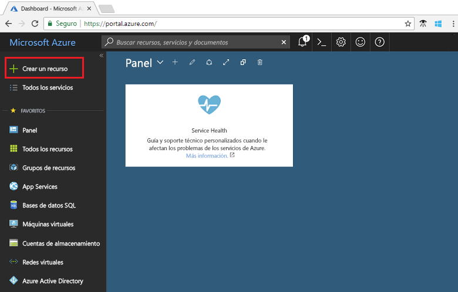
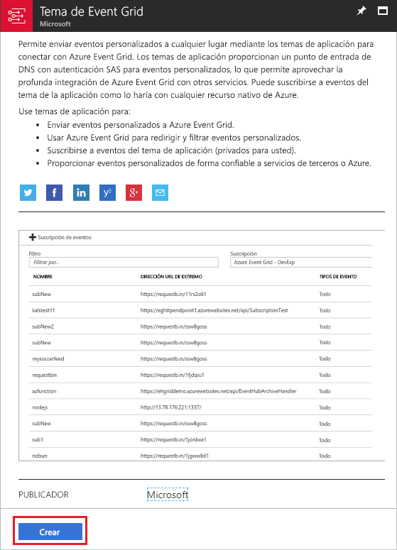
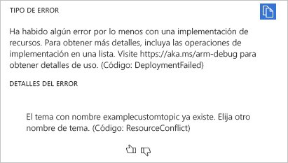

# <a name="create-and-route-custom-events-with-the-azure-portal-and-event-grid"></a>Creación y enrutamiento de eventos personalizados con Azure Portal y Event Grid

Azure Event Grid es un servicio de eventos para la nube. En este artículo, se usa Azure Portal para crear un tema personalizado, suscribirse al tema y desencadenar el evento para ver el resultado. El evento se envía a una función de Azure que registra sus datos. Cuando haya terminado, verá que los datos del evento se han enviado a un punto de conexión y se han registrado.

[!INCLUDE [quickstarts-free-trial-note.md](../../includes/quickstarts-free-trial-note.md)]

## <a name="create-a-custom-topic"></a>Creación de un tema personalizado

Un tema de cuadrícula de eventos proporciona un punto de conexión definido por el usuario en el que se registran los eventos. 

1. Inicie sesión en [Azure Portal](https://portal.azure.com/).

1. Para crear un tema personalizado, seleccione **Crear un recurso**. 

   

1. Busque *Event Grid Topic* y selecciónelo.

   

1. Seleccione **Crear**.

   

1. Escriba un nombre único para el tema personalizado. El nombre del tema debe ser único porque se representa mediante una entrada DNS. No utilice el nombre que se muestra en la imagen. En su lugar, cree un nuevo. Seleccione alguna de las [regiones admitidas](overview.md). Proporcione un nombre para el grupo de recursos. Seleccione **Crear**.

   

1. Cuando se ha creado el tema personalizado, se ve la notificación de que la operación se ha realizado correctamente.

   

   Si la implementación no se ha realizado correctamente, averigüe la causa del error. Seleccione **Error de implementación**.

   

   Seleccione el mensaje de error.

   

   La siguiente imagen muestra una implementación en que se produjo un error porque el nombre del tema personalizado ya estaba en uso. Si ve este error, vuelva a intentar realizar la implementación con otro nombre.

   

## <a name="create-an-azure-function"></a>Creación de una Función de Azure

Antes de suscribirse al tema, vamos a crear el punto de conexión para el mensaje de evento. En este artículo se usa Azure Functions para crear una aplicación de función para el punto de conexión.

1. Para crear una función, seleccione **Crear un recurso**.

   

1. Seleccione **Proceso** y **Function App**.

   

1. Escriba un nombre único para la función de Azure. No utilice el nombre que se muestra en la imagen. Seleccione el grupo de recursos que creó en este artículo. En Plan de hospedaje, seleccione **Plan de consumo**. Use la nueva cuenta de almacenamiento sugerida. Después de especificar los valores, seleccione **Crear**.

   

1. Cuando finalice la implementación, seleccione **Go to resource** (Ir al recurso).

   

1. A la derecha de **Funciones**, seleccione **+**.

   

1. Entre las opciones disponibles, seleccione **Función personalizada**.

   

1. Desplácese hacia abajo hasta que encuentre **Desencadenador de la cuadrícula de eventos**. Seleccione **C#**.

   

1. Acepte los valores predeterminados y haga clic en **Crear**.

   

La función ya está lista para recibir eventos.

## <a name="subscribe-to-a-topic"></a>Suscripción a un tema

Suscríbase a un tema que indique a Event Grid los eventos cuyo seguimiento desea realizar y el lugar al que deben enviarse los eventos.

1. En la función de Azure, seleccione **Agregar suscripción a Event Grid**.

   

1. Especifique los valores de la suscripción. Seleccione **Temas de Event Grid** como tipo de tema. Para la suscripción y el grupo de recursos, seleccione la suscripción y el grupo de recursos en los que creó el tema personalizado. Por ejemplo, seleccione el nombre del tema personalizado. El punto de conexión del suscriptor se rellena previamente con la dirección URL de la función.

   

1. Antes de desencadenar el evento, abra los registros de la función para que pueda ver los datos del evento cuando se envíen. En la parte inferior de la función de Azure, seleccione **Registros**.

   

Ahora, vamos a desencadenar un evento para ver cómo Event Grid distribuye el mensaje al punto de conexión. Para simplificar este artículo, use Cloud Shell para enviar los datos de evento de ejemplo al tema personalizado. Normalmente, una aplicación o servicio de Azure enviaría los datos del evento.

[!INCLUDE [cloud-shell-try-it.md](../../includes/cloud-shell-try-it.md)]

## <a name="send-an-event-to-your-topic"></a>Envío de un evento al tema

Use la CLI de Azure o PowerShell para enviar un evento de prueba a su tema personalizado.

En el primer ejemplo se utiliza la CLI de Azure. Obtiene la dirección URL y la clave del tema, y los datos de evento de ejemplo. Use el nombre de su tema en `<topic_name>`. Para ver el evento completo, use `echo "$body"`. El elemento `data` del archivo JSON es la carga del evento. En este campo, puede usar cualquier archivo JSON bien formado. También puede usar el campo de asunto para realizar enrutamiento y filtrado avanzados. CURL es una utilidad que envía solicitudes HTTP.

```azurecli-interactive
endpoint=$(az eventgrid topic show --name <topic_name> -g myResourceGroup --query "endpoint" --output tsv)
key=$(az eventgrid topic key list --name <topic_name> -g myResourceGroup --query "key1" --output tsv)

body=$(eval echo "'$(curl https://raw.githubusercontent.com/Azure/azure-docs-json-samples/master/event-grid/customevent.json)'")

curl -X POST -H "aeg-sas-key: $key" -d "$body" $endpoint
```

El segundo ejemplo usa PowerShell para realizar pasos similares.

```azurepowershell-interactive
$endpoint = (Get-AzureRmEventGridTopic -ResourceGroupName gridResourceGroup -Name <topic-name>).Endpoint
$keys = Get-AzureRmEventGridTopicKey -ResourceGroupName gridResourceGroup -Name <topic-name>

$eventID = Get-Random 99999

#Date format should be SortableDateTimePattern (ISO 8601)
$eventDate = Get-Date -Format s

#Construct body using Hashtable
$htbody = @{
    id= $eventID
    eventType="recordInserted"
    subject="myapp/vehicles/motorcycles"
    eventTime= $eventDate   
    data= @{
        make="Ducati"
        model="Monster"
    }
    dataVersion="1.0"
}

#Use ConvertTo-Json to convert event body from Hashtable to JSON Object
#Append square brackets to the converted JSON payload since they are expected in the event's JSON payload syntax
$body = "["+(ConvertTo-Json $htbody)+"]"

Invoke-WebRequest -Uri $endpoint -Method POST -Body $body -Headers @{"aeg-sas-key" = $keys.Key1}
```

Ha desencadenado el evento y Event Grid ha enviado el mensaje al punto de conexión que configuró al realizar la suscripción. Examine los registros para ver los datos del evento.


## <a name="clean-up-resources"></a>Limpieza de recursos

Si piensa seguir trabajando con este evento, no limpie los recursos creados en este artículo. De lo contrario, elimine los recursos que ha creado en este artículo.

Seleccione el grupo de recursos y seleccione **Eliminar grupo de recursos**.

## <a name="next-steps"></a>Pasos siguientes

Ahora que sabe cómo crear suscripciones a temas personalizados y eventos, aprenda más acerca de cómo puede ayudarle Event Grid:

- [About Event Grid](overview.md) (Acerca de Event Grid)
- [Enrutamiento de eventos de Blob Storage a un punto de conexión web personalizado](../storage/blobs/storage-blob-event-quickstart.md?toc=%2fazure%2fevent-grid%2ftoc.json)
- [Monitor virtual machine changes with Azure Event Grid and Logic Apps](monitor-virtual-machine-changes-event-grid-logic-app.md) (Supervisión de los cambios en máquinas virtuales con Azure Event Grid y Logic Apps)
- [Transmisión de macrodatos a un almacén de datos](event-grid-event-hubs-integration.md)
