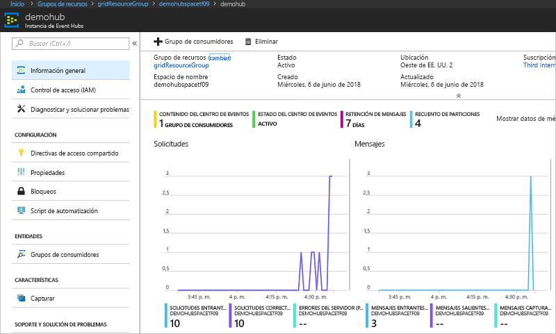

# <a name="route-custom-events-to-azure-event-hubs-with-azure-cli-and-event-grid"></a>Enrutamiento de eventos personalizados a Azure Event Hubs con la CLI de Azure y Event Grid

Azure Event Grid es un servicio de eventos para la nube. Azure Event Hubs es uno de los controladores de eventos compatibles. En este artículo, se usa la CLI de Azure para crear un tema personalizado, suscribirse al tema y desencadenar el evento para ver el resultado. Los eventos se envían a un centro de eventos.

[!INCLUDE [quickstarts-free-trial-note.md](../../includes/quickstarts-free-trial-note.md)]

## <a name="create-a-resource-group"></a>Crear un grupo de recursos

Los temas de Event Grid son recursos de Azure y se deben colocar en un grupo de recursos de Azure. El grupo de recursos de Azure es una colección lógica en la que se implementan y administran los recursos de Azure.

Cree un grupo de recursos con el comando [az group create](/cli/azure/group#az_group_create). 

En el ejemplo siguiente, se crea un grupo de recursos denominado *gridResourceGroup* en la ubicación *westus2*.

```azurecli-interactive
az group create --name gridResourceGroup --location westus2
```

[!INCLUDE [event-grid-register-provider-cli.md](../../includes/event-grid-register-provider-cli.md)]

## <a name="create-a-custom-topic"></a>Creación de un tema personalizado

Un tema de cuadrícula de eventos proporciona un punto de conexión definido por el usuario en el que se registran los eventos. En el ejemplo siguiente se crea el tema personalizado en el grupo de recursos. Reemplace `<your-topic-name>` por un nombre único para el tema. El nombre del tema debe ser único porque se representa mediante una entrada DNS.

```azurecli-interactive
topicname=<your-topic-name>
az eventgrid topic create --name $topicname -l westus2 -g gridResourceGroup
```

## <a name="create-event-hub"></a>Creación de un centro de eventos

Antes de suscribirse al tema, vamos a crear el punto de conexión para el mensaje de evento. Cree un centro de eventos para recopilar los eventos.

```azurecli-interactive
namespace=<unique-namespace-name>
hubname=demohub

az eventhubs namespace create --name $namespace --resource-group gridResourceGroup
az eventhubs eventhub create --name $hubname --namespace-name $namespace --resource-group gridResourceGroup
```

## <a name="subscribe-to-a-topic"></a>Suscripción a un tema

Suscríbase a un tema para indicar a Event Grid los eventos cuyo seguimiento desea realizar. En el ejemplo siguiente se suscribirá al tema que creó y usará el identificador del recurso del centro de eventos en el punto de conexión. El punto de conexión tiene el formato:

`/subscriptions/<subscription-id>/resourceGroups/<resource-group-name>/providers/Microsoft.EventHub/namespaces/<namespace-name>/eventhubs/<hub-name>`

El siguiente script obtiene el identificador del recurso del centro de eventos y se suscribe a un tema de Event Grid. Establece el tipo de punto de conexión en `eventhub` y utiliza el identificador del centro de eventos para el punto de conexión.

```azurecli-interactive
hubid=$(az eventhubs eventhub show --name $hubname --namespace-name $namespace --resource-group gridResourceGroup --query id --output tsv)

az eventgrid event-subscription create \
  --topic-name $topicname \
  -g gridResourceGroup \
  --name subtoeventhub \
  --endpoint-type eventhub \
  --endpoint $hubid
```

## <a name="send-an-event-to-your-topic"></a>Envío de un evento al tema

Vamos a desencadenar un evento para ver cómo Event Grid distribuye el mensaje al punto de conexión. En primer lugar, vamos a obtener la dirección URL y la clave del tema personalizado.

```azurecli-interactive
endpoint=$(az eventgrid topic show --name $topicname -g gridResourceGroup --query "endpoint" --output tsv)
key=$(az eventgrid topic key list --name $topicname -g gridResourceGroup --query "key1" --output tsv)
```

Para simplificar este artículo, va a utilizar datos de evento de ejemplo para enviar al tema. Normalmente, una aplicación o servicio de Azure enviaría los datos del evento. CURL es una utilidad que envía solicitudes HTTP. En este artículo, use CURL para enviar el evento al tema.  En el ejemplo siguiente se envían tres eventos al tema de Event Grid:

```azurecli-interactive
for i in 1 2 3
do
   body=$(eval echo "'$(curl https://raw.githubusercontent.com/Azure/azure-docs-json-samples/master/event-grid/customevent.json)'")
   curl -X POST -H "aeg-sas-key: $key" -d "$body" $endpoint
done
```

Vaya al centro de eventos del portal y tenga en cuenta que Event Grid ha enviado esos tres eventos al centro de eventos.



Normalmente, se crea una aplicación que recupera los eventos del centro de eventos. Para crear una aplicación que reciba mensajes de un centro de eventos, consulte:

* [Introducción a la recepción de mensajes con el Host del procesador de eventos en .NET Standard](../event-hubs/event-hubs-dotnet-standard-getstarted-receive-eph.md)
* [Recepción de eventos desde Azure Event Hubs mediante Java](../event-hubs/event-hubs-java-get-started-receive-eph.md)
* [Recepción de eventos desde Event Hubs mediante Apache Storm](../event-hubs/event-hubs-storm-getstarted-receive.md)

## <a name="clean-up-resources"></a>Limpieza de recursos
Si piensa seguir trabajando con este evento, no limpie los recursos creados en este artículo. En caso contrario, use el siguiente comando para eliminar los recursos creados en este artículo.

```azurecli-interactive
az group delete --name gridResourceGroup
```

## <a name="next-steps"></a>Pasos siguientes

Ahora que sabe cómo crear suscripciones a temas y eventos, aprenda más sobre cómo Event Grid puede ayudarle:

- [Una introducción a Azure Event Grid](overview.md)
- [Enrutamiento de eventos de Blob Storage a un punto de conexión web personalizado](../storage/blobs/storage-blob-event-quickstart.md?toc=%2fazure%2fevent-grid%2ftoc.json)
- [Supervisión de los cambios en máquinas virtuales con Azure Event Grid y Logic Apps](monitor-virtual-machine-changes-event-grid-logic-app.md)
- [Transmisión de macrodatos a un almacén de datos](event-grid-event-hubs-integration.md)
