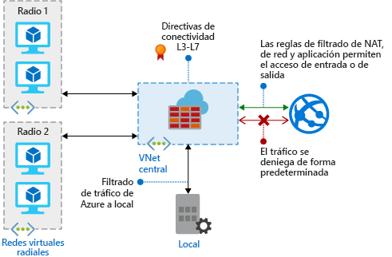

# ¿Qué es Azure Firewall?

Azure Firewall es un servicio de seguridad de red administrado y basado en la nube que protege los recursos de Azure Virtual Network. Se trata de un firewall como servicio con estado completo que incorpora alta disponibilidad y escalabilidad a la nube sin restricciones. 

[!INCLUDE [firewall-preview-notice](../../includes/firewall-preview-notice.md)]

Puede crear, aplicar y registrar directivas de aplicaciones y de conectividad de red a nivel central en suscripciones y redes virtuales. Azure Firewall usa una dirección IP pública estática para los recursos de red virtual, que permite que los firewall externos identifiquen el tráfico procedente de la red virtual.  El servicio está totalmente integrado con Azure Monitor para los registros y análisis.

## Características

La versión preliminar pública de Azure Firewall ofrece las siguientes características:

### Alta disponibilidad integrada
Gracias a la alta disponibilidad integrada, no se necesita ningún equilibrador de carga adicional y no es necesario configurar nada.

### Escalabilidad a la nube sin restricciones 
Azure Firewall puede escalarse verticalmente todo lo que sea necesario para acoger los flujos de tráfico de red cambiantes, por lo que no es necesario elaborar un presupuesto para el tráfico en su momento álgido.

### Filtrado de FQDN 
Puede limitar el tráfico HTTP/S saliente a una lista especificada de nombres de dominio completos (FQDN), lo que incluye caracteres comodín. Esta característica no requiere terminación de SSL.

### Reglas de filtrado de tráfico de red

Puede crear reglas de filtrado de red para *permitir* o *denegar* por dirección IP de origen y destino, puerto y protocolo. Azure Firewall tiene estado completo, de modo que puede distinguir los paquetes legítimos de diferentes tipos de conexiones. Las reglas se aplican y se registran en varias suscripciones y redes virtuales.

### Compatibilidad con SNAT saliente

Todas las direcciones IP de tráfico de red virtual salientes se convierten a direcciones IP públicas de Azure Firewall (traducción de direcciones de red de origen). Puede identificar y permitir el tráfico que se origina en la red virtual y se dirige a los destinos de Internet remotos.

### Registro de Azure Monitor

Todos los eventos se integran con Azure Monitor, lo que permite archivar registros en una cuenta de almacenamiento, transmitir eventos al centro de eventos o enviarlos a Log Analytics.

## Problemas conocidos

La versión preliminar pública de Azure Firewall presenta los siguientes problemas conocidos:

|Problema  |DESCRIPCIÓN  |Mitigación  |
|---------|---------|---------|
|Interoperabilidad con grupos de seguridad de red     |Si se aplica un grupo de seguridad de red (NSG) en la subred de firewall, este puede bloquear la conectividad a Internet saliente incluso si el grupo de seguridad de red está configurado para permitir este acceso. Las conexiones a Internet salientes están marcadas como procedentes de una red virtual y el destino es Internet. Un grupo de seguridad de red tiene de forma predeterminada el *permiso* VirtualNetwork to VirtualNetwork, pero no cuando el destino es Internet.|Para resolver este problema, agregue la siguiente regla de entrada al grupo de seguridad de red que se aplica en la subred de firewall:  Origen: VirtualNetwork Puertos de origen: cualquiera   Destino: cualquiera Puertos de destino: cualquiera   Protocolo: todos Acceso: permitir|
|Conflicto con la característica Just-in-Time (JIT) de Azure Security Center (ASC)|Si se accede a una máquina virtual mediante JIT, y está en una subred con una ruta definida por el usuario que apunta a Azure Firewall como puerta de enlace predeterminada, JIT de ASC no funcionará. Este es el resultado de un enrutamiento asimétrico: un paquete entra por medio de la dirección IP pública de la máquina virtual (JIT abrió el acceso), pero la ruta de vuelta es a través del firewall, que rechaza el paquete porque no se ha establecido una sesión en el firewall.|Para solucionar este problema, coloque las máquinas virtuales JIT en una subred independiente que no tenga una ruta definida por el usuario al firewall.|
|Concentrador y radio con emparejamiento global no funciona|No se admite el modelo de concentrador y radio, donde el concentrador y el firewall están implementados en una región de Azure y los radios en otra, conectados al concentrador mediante el emparejamiento de VNet.|Para más información, consulte [Crear, cambiar o eliminar un emparejamiento de red virtual](https://docs.microsoft.com/en-us/azure/virtual-network/virtual-network-manage-peering#requirements-and-constraints).|
Las reglas de filtrado de red para protocolos que no son TCP/UDP (por ejemplo, ICMP) no funcionan con el tráfico enlazado a Internet|Las reglas de filtrado de red de protocolos que no son TCP/UDP no funcionan con la traducción SNAT a la dirección IP pública. Los protocolos que no son TCP/UDP no se admiten entre subredes de radio y redes virtuales.|Azure Firewall usa Standard Load Balancer, [que actualmente no admite SNAT para los protocolos IP](https://docs.microsoft.com/en-us/azure/load-balancer/load-balancer-standard-overview#limitations). Se están examinando opciones para admitir este escenario en una versión futura.

## Pasos siguientes

- [Tutorial: Implementación y configuración de Azure Firewall mediante Azure Portal](tutorial-firewall-deploy-portal.md)
- [Implementación de Azure Firewall mediante una plantilla](deploy-template.md)
- [Creación de un entorno de prueba de Azure Firewall](scripts/sample-create-firewall-test.md)

