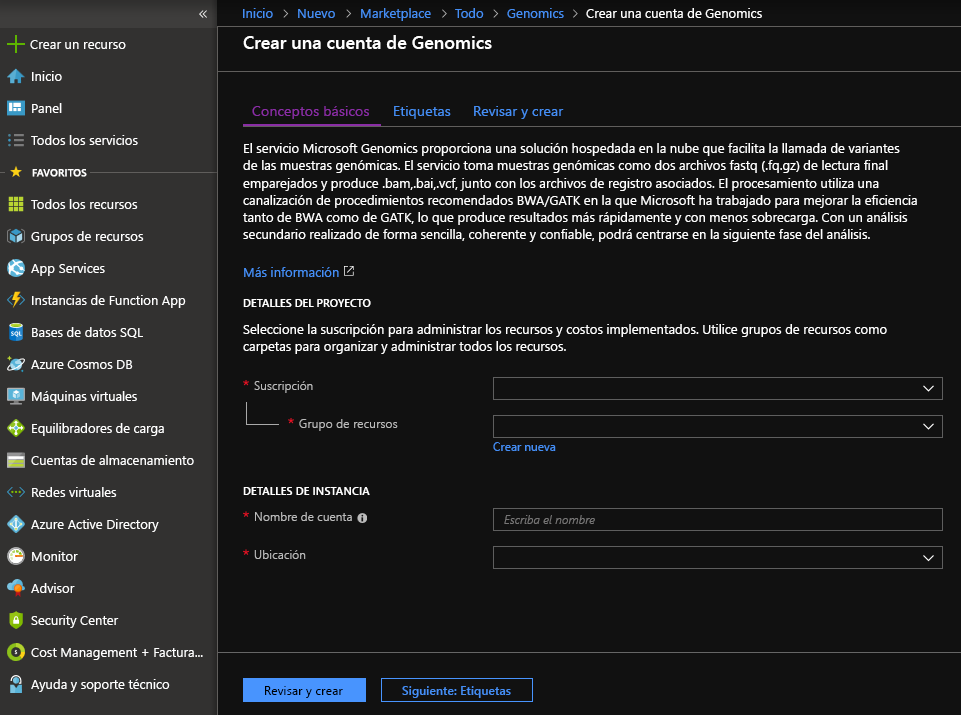
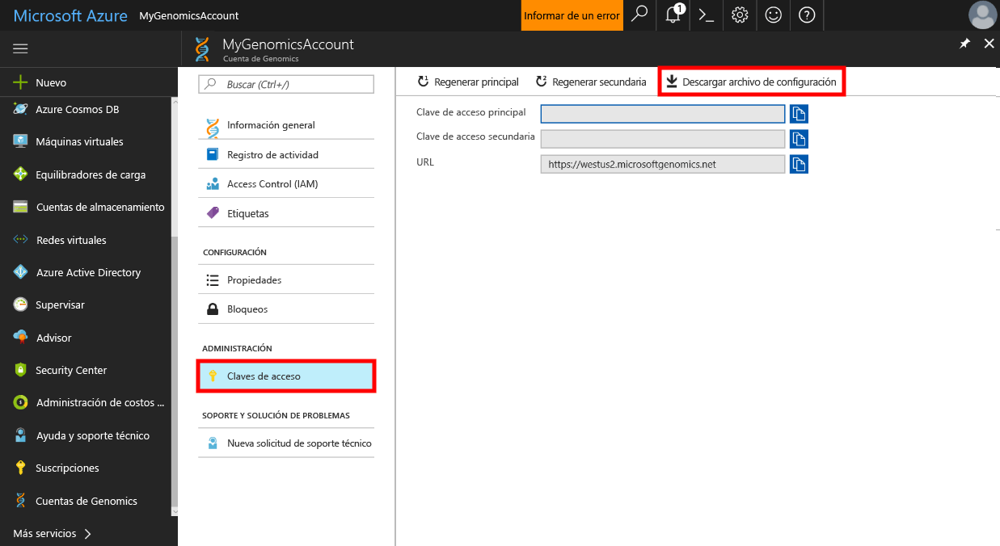

# <a name="quickstart-run-a-workflow-through-the-microsoft-genomics-service"></a>Guía de inicio rápido: ejecución de un flujo de trabajo mediante el servicio Microsoft Genomics

Microsoft Genomics es un servicio escalable y seguro para el análisis secundario que puede procesar rápidamente un genoma; este proceso empieza por lecturas de datos sin formato y produce lecturas alineadas y llamadas a variantes. Empiece a trabajar en unos pocos pasos: 
1.  Configuración: cree una cuenta de Microsoft Genomics mediante Azure Portal e instale el cliente de Python de Microsoft Genomics en su entorno local. 
2.  Carga de datos de entrada: cree una cuenta de Microsoft Azure Storage mediante Azure Portal y cargue los archivos de entrada. Los archivos de entrada deben ser lecturas de extremos emparejados (archivos fastq o bam).
3.  Ejecución: use la interfaz de la línea de comandos de Microsoft Genomics para ejecutar flujos de trabajo mediante el servicio Microsoft Genomics. 

Para más información sobre Microsoft Genomics, consulte [What is Microsoft Genomics?](overview-what-is-genomics.md) (¿Qué es Microsoft Genomics?).

## <a name="set-up-create-a-microsoft-genomics-account-in-the-azure-portal"></a>Configuración: creación de una cuenta de Microsoft Genomics en Azure Portal

Para crear una cuenta de Microsoft Genomics, vaya a [Azure Portal](https://portal.azure.com/#create/Microsoft.Genomics). Si aún no tiene una suscripción a Azure, cree una antes de crear una cuenta de Microsoft Genomics. 




Configure la cuenta de Genomics con la siguiente información, como se muestra en la imagen anterior. 

 |**Configuración**          |  **Valor sugerido**  | **Descripción del campo** |
 |:-------------       |:-------------         |:----------            |
 |Nombre de cuenta         | MyGenomicsAccount     |Elija un identificador de cuenta único. Para ver los nombres válidos, consulte [Reglas de nomenclatura](https://docs.microsoft.com/azure/architecture/best-practices/naming-conventions). |
 |La suscripción         | Nombre de la suscripción|Esta es la unidad de facturación para los servicios de Azure. Para más información sobre su suscripción, consulte el artículo [Suscripciones](https://account.azure.com/Subscriptions). |      
 |Grupos de recursos       | MyResourceGroup       |  Los grupos de recursos le permiten agrupar varios recursos de Azure (cuenta de almacenamiento o cuenta genómica, entre otros) en un único grupo para una administración sencilla. Para más información, consulte [Grupos de recursos] (https://docs.microsoft.com/azure/azure-resource-manager/resource-group-overview#resource-groups). Para conocer cuáles son los nombres de grupo de recursos válidos, consulte el artículo [Convenciones de nomenclatura](https://docs.microsoft.com/azure/architecture/best-practices/naming-conventions). |
 |Ubicación                   | Oeste de EE. UU. 2                    |    El servicio está disponible en Oeste de EE. UU. 2, Europa Occidental y Sudeste Asiático. |


Puede hacer clic en Notificaciones de la barra de menús superior para supervisar el proceso de implementación.


## <a name="set-up-install-the-microsoft-genomics-python-client"></a>Configuración: instalación del cliente de Python de Microsoft Genomics

Los usuarios necesitan instalar tanto Python como el cliente de Python de Microsoft Genomics en su entorno local. 

### <a name="install-python"></a>Instalación de Python

El cliente de Python de Microsoft Genomics es compatible con Python 2.7. 12 o versión posterior a la 2.7.xx; 2.7.15 es la última versión en el momento de escribir este artículo; 2.7.14 es la versión recomendada. Puede encontrar [aquí](https://www.python.org/downloads/) la descarga. 

Nota: Python 3.x no es compatible con Python 2.7.xx.  MSGen es una aplicación de Python 2.7. Al ejecutar MSGen, asegúrese de que su entorno de Python activo usa una versión 2.7.xx de Python. Es posible que reciba errores al intentar usar MSGen con una versión 3.x de Python.


### <a name="install-the-microsoft-genomics-client"></a>Instalación del cliente de Microsoft Genomics

Utilice pip de Python para instalar el cliente de Microsoft Genomics `msgen`. Las siguientes instrucciones asumen que Python ya está instalado en el sistema. Si tiene problemas con una instalación de pip no reconocida, debe agregar Python y la subcarpeta de scripts a la ruta de acceso del sistema.


```
pip install --upgrade --no-deps msgen
pip install msgen
```


Si no desea instalar `msgen` como binario para todo el sistema ni modificar paquetes de Python en todo el sistema, utilice la marca `–-user` con `pip`.
Si utiliza la instalación basada en paquetes o setup.py, se instalan todos los paquetes necesarios. De lo contrario, los paquetes necesarios básicos para msgen son 

 * [Azure-storage](https://pypi.python.org/pypi/azure-storage). 
 * [Requests](https://pypi.python.org/pypi/requests). 


Puede instalar estos paquetes mediante `pip`, `easy_install` o mediante procedimientos `setup.py` estándar. 


### <a name="test-the-microsoft-genomics-client"></a>Prueba del cliente de Microsoft Genomics
Para probar el cliente de Microsoft Genomics, descargue el archivo de configuración de la cuenta de Genomics. Para ir a la cuenta de Genomics, haga clic en **Todos los servicios** en la parte superior izquierda, filtre y seleccione las cuentas de Genomics.


Seleccione la cuenta de Genomics que acaba de crear, vaya a **Claves de acceso** y descargue el archivo de configuración.




Pruebe que el cliente de Python de Microsoft Genomics está trabajando con el siguiente comando:


```
msgen list -f “<full path where you saved the config file>”
```

## <a name="create-a-microsoft-azure-storage-account"></a>Creación de una cuenta de Microsoft Azure Storage 
El servicio Microsoft Genomics espera que las entradas se almacenen como blobs en bloques en una cuenta de almacenamiento de Azure. También escribe archivos de salida como blobs en bloques en un contenedor especificado por el usuario en una cuenta de almacenamiento de Azure. Las entradas y salidas pueden residir en diferentes cuentas de almacenamiento.
Si ya tiene los datos en una cuenta de almacenamiento de Azure, solo tiene que asegurarse de que se encuentran en la misma ubicación que la cuenta de Genomics. En caso contrario, se incurre en cargos de salida al ejecutar el servicio Genomics. Si aún no tiene una cuenta de Microsoft Azure Storage, necesita crear una y cargar sus datos. Puede encontrar más información sobre las cuentas de Azure Storage [aquí](https://docs.microsoft.com/azure/storage/common/storage-create-storage-account), incluido qué es una cuenta de almacenamiento y qué servicios proporciona. Para crear una cuenta de Microsoft Azure Storage, vaya a [Azure Portal](https://portal.azure.com/#create/Microsoft.StorageAccount-ARM ).  


Configure la cuenta de Storage con la siguiente información, como se muestra en la imagen anterior. Utilice la mayoría de las opciones estándar para una cuenta de almacenamiento, especificando únicamente que la cuenta es de almacenamiento de blobs, no de uso general. El almacenamiento de blobs puede ser de dos a cinco veces más rápido para cargas y descargas. 


 |**Configuración**          |  **Valor sugerido**  | **Descripción del campo** |
 |:-------------------------       |:-------------         |:----------            |
 |Nombre         | MyStorageAccount     |Elija un identificador de cuenta único. Para ver los nombres válidos, consulte [Reglas de nomenclatura](https://docs.microsoft.com/azure/architecture/best-practices/naming-conventions). |
 |Modelo de implementación         | Resource Manager| Resource Manager es el modelo de implementación recomendado. Para más información, consulte [Descripción de la implementación de Resource Manager](https://docs.microsoft.com/azure/azure-resource-manager/resource-manager-deployment-model). |      
 |Tipo de cuenta       | Almacenamiento de blobs       |  El almacenamiento de blobs puede ser de dos a cinco veces más rápido que el uso general para cargas y descargas. |
 |Rendimiento                  | Estándar                   | El valor predeterminado es Estándar. Para obtener más detalles sobre las cuentas de almacenamiento estándar y premium, consulte [Introducción a Microsoft Azure Storage](https://docs.microsoft.com/azure/storage/common/storage-introduction).    |
 |Replicación                  | Almacenamiento con redundancia local                  | El almacenamiento con redundancia local replica los datos en el centro de datos de la región en la que creó la cuenta de almacenamiento. Para más información, consulte [Replicación de Azure Storage](https://docs.microsoft.com/azure/storage/common/storage-redundancy).    |
 |Se requiere transferencia segura                  | Disabled                 | ya que está deshabilitada de forma predeterminada. Para más información sobre la seguridad de transferencia de datos, consulte [Requerir transferencia segura](https://docs.microsoft.com/azure/storage/common/storage-require-secure-transfer).    |
 |Nivel de acceso                  | Acceso frecuente                   | Un acceso frecuente indica los objetos a los que se accederá con mayor frecuencia en la cuenta de almacenamiento.    |
 |La suscripción         | Su suscripción de Azure |Para más información acerca la suscripción, consulte [Suscripciones](https://account.azure.com/Subscriptions). |      
 |Grupos de recursos       | MyResourceGroup       |  Puede seleccionar el mismo grupo de recursos que la cuenta de Genomics. Para conocer cuáles son los nombres de grupo de recursos válidos, consulte el artículo [Convenciones de nomenclatura](https://docs.microsoft.com/azure/architecture/best-practices/naming-conventions). |
 |Ubicación                  | Oeste de EE. UU. 2                  | Utilice la misma ubicación que la ubicación de su cuenta de Genomics para reducir los cargos de salida y la latencia. El servicio Genomics está disponible en Oeste de EE. UU.2, Oeste de EE. UU. 2, Europa Occidental y Sudeste Asiático.    |
 |Redes virtuales                | Disabled                   | ya que está deshabilitada de forma predeterminada. Para más información, consulte [Redes virtuales de Azure](https://docs.microsoft.com/azure/storage/common/storage-network-security).    |


Después, haga clic en Crear para crear la cuenta de almacenamiento. Al igual que hizo con la creación de su cuenta de Genomics, puede hacer clic en Notificaciones en la barra de menús superior para supervisar el proceso de implementación. 


## <a name="upload-input-data-to-your-storage-account"></a>Carga de los datos de entrada en la cuenta de almacenamiento

El servicio Microsoft Genomics espera lecturas de extremos emparejados como archivos de entrada. Puede elegir entre cargar sus propios datos o explorarlos mediante los datos de muestra disponibles públicamente que se le proporcionan. Si desea usar los datos de ejemplo disponibles públicamente, se hospedan aquí:


[https://msgensampledata.blob.core.windows.net/small/chr21_1.fq.gz](https://msgensampledata.blob.core.windows.net/small/chr21_1.fq.gz)
[https://msgensampledata.blob.core.windows.net/small/chr21_2.fq.gz](https://msgensampledata.blob.core.windows.net/small/chr21_2.fq.gz)


Dentro de la cuenta de almacenamiento, necesita crear un contenedor de blobs para los datos de entrada y un segundo contenedor de blobs para los datos de salida.  Cargue los datos de entrada en el contenedor de blobs de entrada. Se pueden utilizar varias herramientas para ello, como [Explorador de Microsoft Azure Storage](https://azure.microsoft.com/features/storage-explorer/), [blobporter](https://github.com/Azure/blobporter) o [AzCopy](https://docs.microsoft.com/azure/storage/common/storage-use-azcopy?toc=%2fazure%2fstorage%2fblobs%2ftoc.json). 


## <a name="run-a-workflow-through-the-microsoft-genomics-service-using-the-python-client"></a>Ejecución de un flujo de trabajo con el servicio Microsoft Genomics mediante el cliente de Python 

Para ejecutar un flujo de trabajo mediante el servicio Microsoft Genomics, edite el archivo config.txt para especificar el contenedor de almacenamiento de entrada y salida para los datos.
Abra el archivo config.txt que descargó desde la cuenta de Genomics. Las secciones que necesita especificar son la clave de suscripción y los seis elementos situados en la parte inferior, el nombre de la cuenta de almacenamiento, la clave y el nombre del contenedor tanto para la entrada como para la salida. Para encontrar esta información, navegue por el portal hasta las **claves de acceso** de su cuenta de almacenamiento, o directamente desde el Explorador de Azure Storage.  


### <a name="submit-your-workflow-to-the-microsoft-genomics-service-the-microsoft-genomics-client"></a>Envíe el flujo de trabajo al cliente del servicio Microsoft Genomics

Utilice el cliente de Python de Microsoft Genomics para enviar el flujo de trabajo con el siguiente comando:


```python
msgen submit -f [full path to your config file] -b1 [name of your first paired end read] -b2 [name of your second paired end read]
```


Puede ver el estado de los flujos de trabajo con el siguiente comando: 
```python
msgen list -f c:\temp\config.txt 
```


Una vez completado el flujo de trabajo, puede ver los archivos de salida en la cuenta de Azure Storage, en el contenedor de salida que ha configurado. 


## <a name="next-steps"></a>Pasos siguientes
En este artículo, se van a cargar datos de entrada de ejemplo en Azure Storage y se va a enviar un flujo de trabajo al servicio Microsoft Genomics mediante el cliente de Python `msgen`. Para más información sobre otros tipos de archivo de entrada que pueden utilizarse con el servicio Microsoft Genomics, consulte las páginas siguientes: [Archivos FASTQ emparejados](quickstart-input-pair-FASTQ.md) | [BAM](quickstart-input-BAM.md) | [Varios archivos FASTQ o BAM](quickstart-input-multiple.md). También puede explorar este tutorial utilizando nuestro [tutorial de Notebook de Azure.](http://aka.ms/genomicsnotebook)
