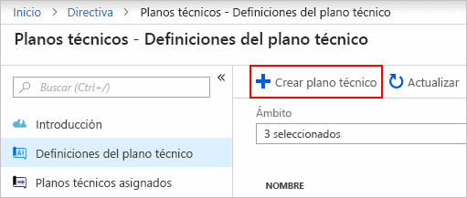
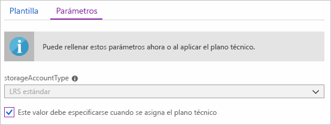
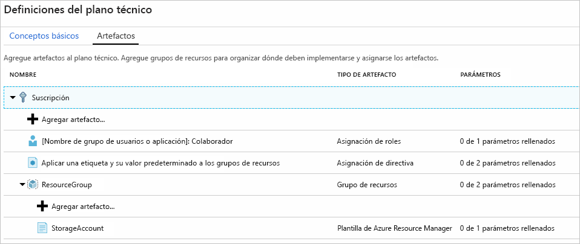
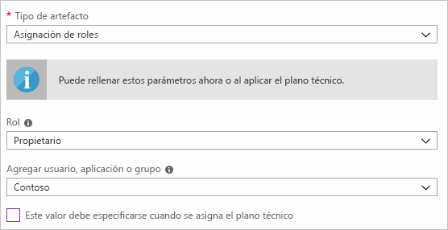
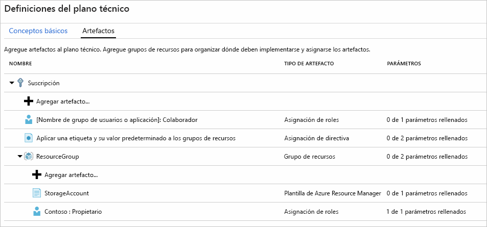

# <a name="define-and-assign-an-azure-blueprint-in-the-portal"></a>Definición y asignación de un plano técnico de Azure Blueprint en el portal

Entender cómo crear y asignar planos técnicos permite la definición de patrones comunes para desarrollar configuraciones reutilizables y de implementación rápida basadas en plantillas de Resource Manager, directivas, seguridad y mucho más. En este tutorial, aprenderá a usar planos técnicos de Azure Blueprint para realizar algunas de las tareas más comunes relacionadas con la creación, asignación y administración de directivas en toda la organización, como, por ejemplo:

> [!div class="checklist"]
> - Creación de un nuevo plano técnico y adición de varios artefactos compatibles
> - Realización de cambios en un plano técnico existente que sigue en **borrador**
> - Marcado de un plano técnico como listo para asignación con el estado **Publicado**
> - Asignación de un plano técnico a una suscripción existente
> - Comprobación del estado y progreso de un plano técnico asignado
> - Eliminación de un plano técnico que se ha asignado a una suscripción

Si no tiene una suscripción a Azure, cree una [cuenta gratuita](https://azure.microsoft.com/free) antes de empezar.

## <a name="create-a-blueprint"></a>Creación de un plano técnico

El primer paso para definir un patrón estándar de cumplimiento es elaborar un plano técnico a partir de los recursos disponibles. En este ejemplo, cree un nuevo plano técnico llamado MyBlueprint para configurar las asignaciones de roles y directivas para la suscripción, agregue un nuevo grupo de recursos y cree una plantilla de Resource Manager y una asignación de roles en el nuevo grupo de recursos.

1. Haga clic en **Todos los servicios** y busque y seleccione **Directiva** en el panel izquierdo. En la página **Directiva**, haga clic en **Planos técnicos**.

1. Seleccione **Definiciones del plano técnico** de la página de la izquierda y haga clic en el botón **+ Crear plano técnico** en la parte superior de la página.

   - También, puede hacer clic en **Crear** en la página **Introducción** para ir directamente a la creación de un plano técnico.

   

1. Proporcione un **nombre del plano técnico** como MiPlanoTécnico (letras y números, hasta 48 caracteres, pero sin espacios ni caracteres especiales) para el plano técnico, pero deje **Descripción del plano técnico** en blanco por ahora.  En el cuadro **Ubicación de definición**, haga clic en el botón de puntos suspensivos de la derecha, seleccione el [grupo de administración](../management-groups/overview.md) donde desea guardar el plano técnico y haga clic en **Seleccionar**.

   > [!NOTE]
   > Solo se pueden guardar las definiciones del plano técnico en los grupos de administración. Para crear el primer grupo de administración, siga [estos pasos](../management-groups/create.md).

1. Compruebe que la información es correcta (los campos **Nombre del plano técnico** y **Ubicación de definición** no se pueden cambiar posteriormente) y haga clic en **Siguiente: Artefactos** en la parte inferior de la página o en la pestaña **Artefactos** en la parte superior de la página.

1. Agregue la asignación de roles en la suscripción: haga clic en la fila **+ Agregar artefacto...** en **Suscripción** y se abrirá la ventana "Agregar artefacto" en el lado derecho del explorador. Seleccione "Asignación de roles" para _Tipo de artefacto_. En _Rol_, seleccione Colaborador y deje el campo _Agregar usuario, aplicación o grupo_ con la casilla que indica un **parámetro dinámico**. Haga clic en **Agregar** para agregar este artefacto al plano técnico.

   

   > [!NOTE]
   > La mayoría de los _artefactos_ admiten parámetros. Un parámetro que se asigna a un valor durante la creación del plano técnico es un **parámetro estático**. Si el parámetro se asigna durante la asignación del plano técnico, es un **parámetro dinámico**. Para más información, consulte el artículo sobre los [parámetros de un plano técnico](./concepts/parameters.md).

1. Agregue la asignación de directiva en la suscripción: haga clic en la fila **+ Agregar artefacto...** directamente bajo **Suscripción**. Seleccione "Asignación de directiva" para _Tipo de artefacto_. Cambie _Tipo_ a Integrado y en _Buscar_ escriba "etiqueta". Haga clic fuera de _Búsqueda_ para que se produzca el filtrado. Seleccione la opción Aplicar una etiqueta y su valor predeterminado a los grupos de recursos haciendo clic en ella. Haga clic en **Agregar** para agregar este artefacto al plano técnico.

1. Haga clic en la fila de la asignación de directiva Aplicar una etiqueta y su valor predeterminado a los grupos de recursos. Se abre la ventana para proporcionar parámetros al artefacto como parte de la definición del plano técnico y permite establecer los parámetros para todas las asignaciones (**parámetros estáticos**) basados en este plano técnico en lugar de durante la asignación (**parámetros dinámicos**). Este ejemplo usa **parámetros dinámicos** durante la asignación del plano técnico, así que deje los valores predeterminados y haga clic en **Cancelar**.

1. Agregue un grupo de recursos en la suscripción: haga clic en la fila **+ Agregar artefacto...** bajo **Suscripción**. Seleccione "Grupo de recursos" para _Tipo de artefacto_. Deje los campos _Nombre del grupo de recursos_ y _Ubicación_ en blanco, pero asegúrese de que la casilla esté activada en cada propiedad para hacerlos **parámetros dinámicos**. Haga clic en **Agregar** para agregar este artefacto al plano técnico.

1. Agregue una plantilla en el grupo de recursos: haga clic en la fila **+ Agregar artefacto...** directamente bajo la entrada **ResourceGroup**. Seleccione "Plantilla de Azure Resource Manager" para _Tipo de artefacto_, establezca _Nombre para mostrar del artefacto_ en "Cuenta de almacenamiento" y deje _Descripción_ en blanco. En la pestaña **Plantilla** en el cuadro del editor, pegue la siguiente plantilla de Resource Manager. Después de pegar la plantilla, haga clic en la pestaña **Parámetros** y observe que el parámetro de plantilla **storageAccountType** y el valor predeterminado **Standard_LRS** se detectaron automáticamente y se rellenaron, pero se configuraron como un **parámetro dinámico**. Quite la marca de la casilla y observe que el menú desplegable solo contiene valores incluidos en la plantilla de Resource Manager en **allowedValues**. Active la casilla para volver a establecer un **parámetro dinámico**. Haga clic en **Agregar** para agregar este artefacto al plano técnico.

   > [!IMPORTANT]
   > Si importa la plantilla, asegúrese de que el archivo es JSON solo y no incluye HTML. Cuando se apunte a una dirección URL en GitHub, asegúrese de que ha hecho clic en **RAW** para obtener el archivo JSON puro y no el que está encapsulado con HTML para mostrarse en GitHub. Si la plantilla importada no tiene formato JSON puro, se producirá un error.

   ```json
   {
       "$schema": "https://schema.management.azure.com/schemas/2015-01-01/deploymentTemplate.json#",
       "contentVersion": "1.0.0.0",
       "parameters": {
           "storageAccountType": {
               "type": "string",
               "defaultValue": "Standard_LRS",
               "allowedValues": [
                   "Standard_LRS",
                   "Standard_GRS",
                   "Standard_ZRS",
                   "Premium_LRS"
               ],
               "metadata": {
                   "description": "Storage Account type"
               }
           }
       },
       "variables": {
           "storageAccountName": "[concat(uniquestring(resourceGroup().id), 'standardsa')]"
       },
       "resources": [{
           "type": "Microsoft.Storage/storageAccounts",
           "name": "[variables('storageAccountName')]",
           "apiVersion": "2016-01-01",
           "location": "[resourceGroup().location]",
           "sku": {
               "name": "[parameters('storageAccountType')]"
           },
           "kind": "Storage",
           "properties": {}
       }],
       "outputs": {
           "storageAccountName": {
               "type": "string",
               "value": "[variables('storageAccountName')]"
           }
       }
   }
   ```

   

1. El plano técnico completado debería tener una apariencia similar a esta. Observe que cada artefacto tiene '_x_ de _y_ parámetros rellenados bajo la columna _Parámetros_. Los **parámetros dinámicos** se establecen durante cada asignación del plano técnico.

   

1. Ahora que se han agregado todos los artefactos planeados, haga clic en **Guardar borrador** en la parte inferior de la página.

## <a name="edit-a-blueprint"></a>Edición de un plano técnico

En [Crear un plano técnico](#create-a-blueprint), no se proporcionó una descripción ni la asignación de roles que se agregó al nuevo grupo de recursos. Ambas cuestiones se pueden solucionar siguiendo estos pasos:

1. Seleccione **Definiciones del plano técnico** en la página de la izquierda.

1. En la lista de planos técnicos, haga clic con el botón derecho en el que creó anteriormente y seleccione **Editar plano técnico**.

1. En **Descripción del plano técnico**, proporcione alguna información sobre el plano técnico y los artefactos que lo componen.  En este caso, introduzca algo como: "Este plano técnico establece la política de etiquetas y la asignación de roles en la suscripción, crea un grupo de recursos e implementa una plantilla de recursos y una asignación de roles a ese grupo de recursos".

1. Haga clic en **Siguiente: Artefactos** en la parte inferior de la página o en la pestaña **Artefactos** en la parte superior de la página.

1. Agregue la asignación de roles en el grupo de recursos: haga clic en la fila **+ Agregar artefacto...** directamente bajo la entrada **ResourceGroup**. Seleccione "Asignación de roles" para _Tipo de artefacto_. En _Rol_, seleccione "Propietario" y quite la marca del campo _Agregar usuario, aplicación o grupo_ y busque y seleccione un usuario, aplicación o grupo para agregar. Este artefacto utiliza un **parámetro estático** que se establece igual en cada asignación de este plano técnico. Haga clic en **Agregar** para agregar este artefacto al plano técnico.

   

1. El plano técnico completado debería tener una apariencia similar a esta. Observe que la nueva asignación de roles agregada muestra **1 de 1 parámetros rellenadas**, lo que significa que es un **parámetro estático**.

   

1. Haga clic en **Guardar borrador** ahora que se ha actualizado.

## <a name="publish-a-blueprint"></a>Publicación de un plano técnico

Ahora que todos los artefactos planeados se han agregado al plano técnico, es momento de publicarlo.
La publicación lo hace disponible para ser asignado a una suscripción.

1. Seleccione **Definiciones del plano técnico** en la página de la izquierda.

1. En la lista de planos técnicos, haga clic con el botón derecho en el que creó anteriormente y seleccione **Publicar plano técnico**.

1. En el cuadro de diálogo que se abre, proporcione una **versión** (letras, números y guiones con una longitud máxima de 20 caracteres) como "v1" y **Notas de cambio** (opcional) como "Primera publicación".

1. Haga clic en **Publicar** en la parte inferior de la página.

## <a name="assign-a-blueprint"></a>Asignación de un plano técnico

Una vez que se publica un plano técnico, se puede asignar a una suscripción. Asigne el plano técnico creado a una de las suscripciones de la jerarquía del grupo de administración.

1. Seleccione **Definiciones del plano técnico** en la página de la izquierda.

1. En la lista de planos técnicos, haga clic con el botón derecho en el que creó anteriormente (o haga clic en los puntos suspensivos) y seleccione **Asignar plano técnico**.

1. En la página **Asignar plano técnico**, seleccione la suscripción o suscripciones en las que desea implementar este plano técnico en el menú desplegable **Subscripción**.

   > [!NOTE]
   > Se creará una asignación para cada suscripción que se seleccione, permitiendo cambios en una sola asignación de suscripción en un momento posterior sin forzar cambios en el resto de las suscripciones seleccionadas.

1. En **Nombre asignado**, proporcione un nombre único para esta asignación.

1. En **Ubicación**, seleccione una región para la identidad administrada que se va a crear. Azure Blueprint usa esta identidad administrada para implementar todos los artefactos del plano técnico asignado. Para más información, consulte [Identidades administradas para recursos de Azure](../../active-directory/managed-identities-azure-resources/overview.md).

1. Deje el menú desplegable **Blueprint definition version** (Versión de definición del plano técnico) de versiones **publicadas** en la entrada "v1" (de forma predeterminada, como la versión **publicada** más reciente).

1. En **Asignación de bloqueo**, deje el valor predeterminado de **No bloquear**. Para más información, consulte [Bloqueo de recursos en planos técnicos](./concepts/resource-locking.md).

1. Para la asignación de roles de nivel de suscripción **[grupo de usuarios o el nombre de la aplicación]: colaborador**, busque y seleccione un usuario, aplicación o grupo.

1. Para la asignación de directivas de nivel de suscripción, establezca el **nombre de etiqueta** en CostCenter y el **valor de etiqueta** en ContosoIT.

1. Para "ResourceGroup", proporcione un **nombre** de StorageAccount y la **ubicación** de "Este de EE. UU. 2" en la lista desplegable.

   > [!NOTE]
   > Por cada artefacto que se ha agregado en el grupo de recursos durante la definición del plano técnico, se aplica una sangría a ese artefacto para alinearlo con el grupo de recursos o con el objeto con el que se implementará. Los artefactos que no toman parámetros o que no tienen parámetros para definirse en la asignación solo se mostrarán para obtener información contextual.

1. En la plantilla de Azure Resource Manager "StorageAccount", seleccione "Standard_GRS" para el parámetro **storageAccountType**.

1. Consulte el cuadro de información en la parte inferior de la página y, a continuación, haga clic en **Asignar**.

## <a name="track-deployment-of-a-blueprint"></a>Realización del seguimiento de la implementación de un plano técnico

Cuando se ha asignado un plano técnico a una o varias suscripciones, suceden dos cosas:

- El plano técnico se agrega a la página **Planos técnicos asignados** por suscripción asignada.
- Comienza el proceso de implementación de todos los artefactos definidos por el plano técnico.

Ahora que el plano técnico se ha asignado a una suscripción, compruebe el progreso de la implementación.

1. Seleccione **Planos técnicos asignados** desde la página de la izquierda.

1. En la lista de planos técnicos, haga clic con el botón derecho en el que asignó anteriormente y seleccione **Ver los detalles de la asignación**.

   

1. En la página **Detalles de la implementación**, compruebe que todos los artefactos se han implementado correctamente y que no ha habido ningún error durante la implementación. Si se han producido errores, consulte la [solución de problemas de planos técnicos](./troubleshoot/general.md) para conocer los pasos necesarios para determinar el motivo del error.

## <a name="unassign-a-blueprint"></a>Cancelación de la asignación de un plano técnico

Si ya no es necesario, puede eliminar una asignación de plano técnico de una suscripción. Es posible que el plano técnico haya sido reemplazado por un plano más reciente con patrones, directivas y diseños actualizados. Cuando se quita un plano técnico, se omiten los artefactos que se asignaron como parte de ese plano técnico. Para eliminar una asignación de plano técnico, siga estos pasos:

1. Seleccione **Planos técnicos asignados** desde la página de la izquierda.

1. En la lista de planos técnicos, seleccione el plano técnico cuya asignación se va a cancelar y, después, haga clic en el botón **Cancelar la asignación del plano técnico** situado en la parte superior de la página.

1. Lea el mensaje de confirmación y haga clic en **Aceptar**.

## <a name="delete-a-blueprint"></a>Eliminación de un plano técnico

1. Seleccione **Definiciones del plano técnico** en la página de la izquierda.

1. Haga clic con el botón derecho en el plano técnico que desea eliminar y seleccione **Eliminar plano técnico**; después, haga clic en **Sí** en el cuadro de diálogo de confirmación.

> [!NOTE]
> En la eliminación de un plano técnico en este método también se eliminarán todas las **versiones publicadas** del plano técnico seleccionado. Para eliminar una única versión, abra el plano técnico, haga clic en la pestaña **Versiones publicadas**, seleccione y haga clic en la versión que desea eliminar y, después, haga clic en **Eliminar esta versión**. Además, un plano técnico con asignaciones no se puede eliminar hasta que se hayan eliminado todas las asignaciones de planos técnicos.

## <a name="next-steps"></a>Pasos siguientes

- Más información sobre el [ciclo de vida del plano técnico](./concepts/lifecycle.md)
- Descubra cómo utilizar [parámetros estáticos y dinámicos](./concepts/parameters.md).
- Aprenda a personalizar el [orden de secuenciación de planos técnicos](./concepts/sequencing-order.md).
- Averigüe cómo usar el [bloqueo de recursos de planos técnicos](./concepts/resource-locking.md).
- Aprenda a [actualizar las asignaciones existentes](./how-to/update-existing-assignments.md).
- Puede consultar la información de [solución de problemas generales](./troubleshoot/general.md) para resolver los problemas durante la asignación de un plano técnico.
