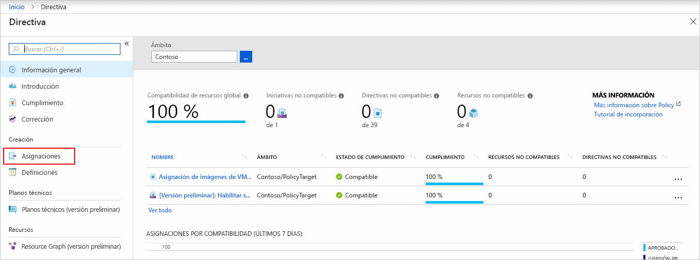
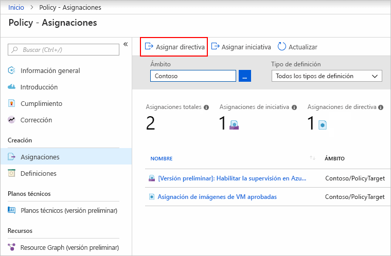
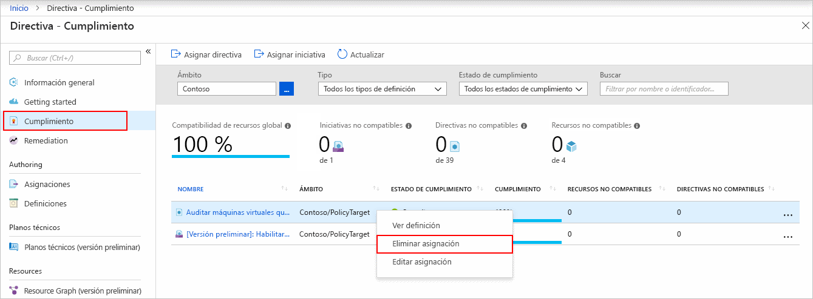

# Creación de una asignación de directiva para identificar recursos no compatibles en el entorno de Azure

El primer paso para entender el cumplimiento en Azure es identificar el estado de sus recursos.
Este inicio rápido lo guiará por el proceso de creación de una asignación de directiva para identificar máquinas virtuales que no están usando discos administrados.

Al finalizar este proceso, habrá identificado correctamente máquinas virtuales que no utilizan discos administrados. No *son compatibles* con la asignación de directiva.

Si no tiene una suscripción a Azure, cree una cuenta [gratuita](https://azure.microsoft.com/free/) antes de empezar.

## Creación de una asignación de directiva

En esta guía de inicio rápido, se crea una asignación de directiva y se le asigna la definición de directiva *Audit VMs that do not use managed disks* (Auditoría de máquinas virtuales sin discos administrados).

1. Inicie el servicio Azure Policy en Azure Portal. Para ello, haga clic en **Todos los servicios** y, a continuación, busque y seleccione **Directiva**.

   

1. Seleccione **Asignaciones** en el panel izquierdo de la página de Azure Policy. Una asignación es una directiva que se asignó para que se lleve a cabo dentro de un ámbito específico.

   

1. Seleccione **Asignar directiva** en la parte superior de la página **Policy - Asignaciones**.

   

1. En la página **Asignar directiva**, haga clic en los puntos suspensivos para seleccionar una opción de **Ámbito** y seleccione una suscripción y un grupo de administración. Opcionalmente, seleccione un grupo de recursos. Un ámbito determina en qué recursos o agrupación de recursos se implementa la asignación de directiva.  Después, haga clic en **Seleccionar** en la parte inferior de la página **Ámbito**.

   En este ejemplo se usa la suscripción de **Contoso**. Su suscripción variará.

1. Los recursos se pueden excluir según el **ámbito**.  Las **exclusiones** comienzan en un nivel inferior al nivel del **ámbito**. Las **exclusiones** son opcionales, así que déjelas en blanco por ahora.

1. Seleccione los puntos suspensivos de **Definición de directiva** para abrir la lista de definiciones disponibles. Azure Policy viene con definiciones de directivas integradas que puede usar. Muchas están disponibles, como:

   - Enforce tag and its value (Forzar una etiqueta y su valor)
   - Apply tag and its value (Aplicar una etiqueta y su valor)
   - Requisito de la versión 12.0 de SQL Server

   Para obtener una lista completa de todas las directivas integradas disponibles, consulte [Ejemplos de Azure Policy](./samples/index.md).

1. En la lista de definiciones de directiva, busque la definición *Auditoría de máquinas virtuales que no usan discos administrados*. Haga clic en esa directiva y después en **Seleccionar**.

   

1. **Nombre de asignación** se rellena automáticamente con el nombre de directiva seleccionado, pero puede cambiarlo. En este ejemplo, se deja *Auditoría de máquinas virtuales que no usan discos administrados*. También puede agregar una **Descripción** opcional. La descripción ofrece detalles sobre esta asignación de directiva. **Asignado por** se rellena automáticamente en función de quién ha iniciado sesión. Este campo es opcional, así que se pueden especificar valores personalizados.

1. Deje desactivada la casilla **Crear una identidad administrada**. Esta casilla se _debe_ activar cuando la directiva o la iniciativa que se asigna incluye una directiva con el efecto [deployIfNotExists](./concepts/effects.md#deployifnotexists). Como no es el caso de la directiva usada en este guía de inicio rápido, déjela en blanco. Para más información, consulte las [identidades administradas](../../active-directory/managed-identities-azure-resources/overview.md) y [cómo funciona la seguridad de corrección](./how-to/remediate-resources.md#how-remediation-security-works).

1. Haga clic en **Asignar**.

Ahora ya está listo para identificar los recursos no compatibles para saber el estado de cumplimiento de su entorno.

## Identificación de recursos no compatibles

Seleccione **Cumplimiento** en el lado izquierdo de la página y busque la asignación de directiva **Auditoría de máquinas virtuales que no usan discos administrados** que ha creado.

Si hay algún recurso existente no compatible con esta nueva asignación, aparecerá en la pestaña **Recursos no compatibles**.

Si una condición se evalúa en todos los recursos existentes y el valor obtenido es true, estos recursos se marcarán como no compatibles con la directiva. En la tabla siguiente se muestra cómo funcionan los distintos efectos de directiva con la evaluación de condición para el estado de cumplimiento resultante. Aunque no se ve la lógica de evaluación en Azure Portal, se muestran los resultados del estado de cumplimiento. El resultado del estado de cumplimiento puede ser compatible o no compatible.

| **Estado del recurso** | **Efecto** | **Evaluación de directiva** | **Estado de cumplimiento** |
| --- | --- | --- | --- |
| Exists | Deny, Audit, Append\*, DeployIfNotExist\*, AuditIfNotExist\* | True | No compatible |
| Exists | Deny, Audit, Append\*, DeployIfNotExist\*, AuditIfNotExist\* | False | Compatible |
| Nuevo | Audit, AuditIfNotExist\* | True | No compatible |
| Nuevo | Audit, AuditIfNotExist\* | False | Compatible |

\* Los efectos Append, DeployIfNotExist y AuditIfNotExist requieren que la instrucción IF sea TRUE. Los efectos requieren también que la condición de existencia sea FALSE para ser no compatibles. Si es TRUE, la condición IF desencadena la evaluación de la condición de existencia de los recursos relacionados.

## Limpieza de recursos

Otras guías de esta colección se basan en esta guía de inicio rápido. Si tiene previsto seguir trabajando con los tutoriales siguientes, no elimine los recursos creados en esta guía de inicio rápido. Si no tiene previsto continuar, siga estos pasos para eliminar todos los recursos creados en esta guía de inicio rápido en Azure Portal.

1. Seleccione **Cumplimiento** (o **Asignaciones**) en el lado izquierdo de página Azure Policy y busque la asignación de directiva **Auditoría de máquinas virtuales que no usan discos administrados** asignación de directiva que ha creado.

1. Haga clic en la asignación de directiva **Auditoría de máquinas virtuales que no usan discos administrados** y seleccione **Eliminar asignación**

   

## Pasos siguientes

En esta guía de inicio rápido, se asigna una definición de directiva a un ámbito y se evalúa su informe de cumplimiento. La definición de la directiva garantiza que todos los recursos del ámbito son compatibles y se identifican cuáles no lo son.

Para obtener información sobre la asignación de directivas para garantizar que los **futuros** recursos creados sean compatibles, continúe con este tutorial para:

> [!div class="nextstepaction"]
> [Crear y administrar directivas](./tutorials/create-and-manage.md)