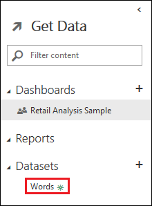
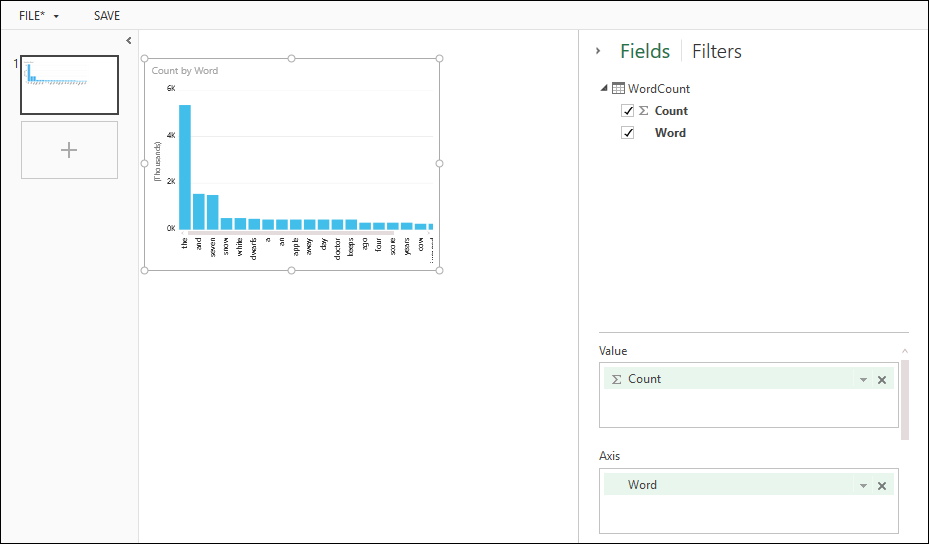

<properties
 pageTitle="Escribir datos en Power BI desde Apache Storm"
 description="Un ejemplo de cómo escribir datos en Power BI desde una topología de C# que se ejecuta en un clúster de Apache Storm en HDInsight. Después de escribir los datos, aprenderá a crear un informe y un panel en tiempo real con Power BI."
 services="hdinsight"
 documentationCenter=""
 authors="Blackmist"
 manager="paulettm"
 editor="cgronlun"/>

<tags
 ms.service="hdinsight"
 ms.devlang="dotnet"
 ms.topic="article"
 ms.tgt_pltfrm="na"
 ms.workload="big-data"
 ms.date="04/28/2015"
 ms.author="larryfr"/>

# Uso de Power BI (vista previa) para visualizar datos de una topología de Storm

La vista previa de Power BI permite mostrar visualmente los datos como informes o paneles. Con la API de REST de Power BI puede usar fácilmente datos de una topología que se ejecuta en clúster de Apache Storm en HDInsight en Power BI.

En este documento, aprenderá a usar Power BI para crear un informe y un panel a partir de datos creados por una topología de Storm.

## Requisitos previos

* Una suscripción de Microsoft Azure válida

* Un usuario de Azure Active Directory con acceso a [Power BI](https://powerbi.com)

* Visual Studio (una de las siguientes versiones)

    * Visual Studio 2012 con [Update 4](http://www.microsoft.com/download/details.aspx?id=39305)

    * Visual Studio 2013 con [Update 4](http://www.microsoft.com/download/details.aspx?id=44921) o [Visual Studio Community 2013](http://go.microsoft.com/fwlink/?linkid=517284&clcid=0x409)

    * Visual Studio 2015  [CTP6](http://visualstudio.com/downloads/visual-studio-2015-ctp-vs)

* Herramientas de HDInsight para Visual Studio: vea [Introducción al uso de Herramientas de HDInsight para Visual Studio](hdinsight-hadoop-visual-studio-tools-get-started.md) para obtener información acerca de la instalación.

## Cómo funciona

Este ejemplo contiene una topología de Storm en C# que genera una oración aleatoriamente, divide la oración en palabras, cuenta las palabras y envía el recuento de palabras a la API de REST de Power BI. El paquete de Nuget [PowerBi.Api.Client](https://github.com/Vtek/PowerBI.Api.Client) se usa para comunicación con Power BI.

Los siguientes archivos de este proyecto implementan la funcionalidad específica de Power BI:

* **PowerBiBolt.cs**: implementa el bolt de Storm, que envía datos a Power BI.

* **Data.cs**: describe el objeto o fila de datos que se enviará a Power BI.

> [AZURE.WARNING]Parece que Power BI permite la creación de varios conjuntos de datos con el mismo nombre. Esto puede ocurrir si el conjunto de datos no existe y la topología crea varias instancias del bolt de Power BI. Para evitar esto, establezca la sugerencia de paralelismo del bolt en 1 (como ocurre en este ejemplo) o cree el conjunto de datos antes de implementar la topología.
>
> La aplicación de consola **CreateDataset** que se incluye en esta solución se proporciona como un ejemplo de cómo crear el conjunto de datos fuera de la topología.

## Registro de una aplicación de Power BI

1. Siga los pasos de la [guía rápida de Power BI](https://msdn.microsoft.com/en-US/library/dn931989.aspx) para suscribirse a Power BI.

2. Siga los pasos de [Registro de una aplicación](https://msdn.microsoft.com/en-US/library/dn877542.aspx) para crear un registro de aplicación. Se utilizará al obtener acceso a la API de REST de Power BI.

    > [AZURE.IMPORTANT]Guarde el **identificador de cliente** para el registro de la aplicación.

## Descarga del ejemplo

Descargue el [ejemplo de Power BI de Storm en C# de HDInsight ]] (https://github.com/Blackmist/hdinsight-csharp-storm-powerbi). Para descargarlo, bifúrquelo o clónelo mediante [git](http://git-scm.com/), o use el vínculo **Descargar** para descargar un archivo .zip del archivo.

## Configuración del ejemplo

1. Abra el ejemplo en Visual Studio. Desde el **Explorador de soluciones**, abra el archivo **SCPHost.exe.config** y, a continuación, busque el elemento **<OAuth .../>**. Escriba valores para las siguientes propiedades de este elemento.

    * **Cliente**: identificador del cliente para el registro de la aplicación que creó anteriormente.

    * **Usuario**: cuenta de Azure Active Directory que tiene acceso a Power BI.

    * **Contraseña**: contraseña de la cuenta de Azure Active Directory.

2. (Opcional). El nombre del conjunto de datos predeterminado usado por este proyecto es **Words**. Para cambiarlo, haga clic con el botón secundario en el proyecto **WordCount** en el **Explorador de soluciones**, seleccione **Propiedades** y, a continuación, seleccione **Configuración**. Cambie la entrada **DatasetName** al valor que desee.

2. Guarde y cierre los archivos.

## Implementación del ejemplo

1. En el **Explorador de soluciones**, haga clic con el botón secundario en el proyecto **WordCount** y seleccione **Enviar a Storm en HDInsight**. Seleccione el clúster de HDInsight desde el cuadro desplegable **Clúster de Storm**.

    > [AZURE.NOTE]El cuadro desplegable **Storm clúster** puede tardar unos segundos en rellenarse con los nombres de servidor.
    >
    > Si se le solicita, escriba las credenciales de inicio de sesión de su suscripción de Azure. Si tiene más de una suscripción, inicie sesión en la que contenga el clúster de Storm en HDInsight.

2. Cuando la topología se envíe correctamente, debe aparecer topologías de Storm para el clúster. Seleccione la topología WordCount en la lista para consultar la información acerca de la topología en ejecución.

    

    > [AZURE.NOTE]También puede ver las topologías de Storm en el Explorador de servidores: expanda Azure, HDInsight, haga clic con el botón secundario en un clúster de Storm en HDInsight y seleccione Ver topologías de Storm.

3. Cuando vea **Resumen de la topología**, desplácese hasta que vea la sección **Bolts**. En esta sección, observe la columna **Ejecutados** columna para el bolt **PowerBI**. Utilice el botón Actualizar situado en la parte superior de la página para actualizar hasta que el valor cambie a un valor distinto de cero. Cuando este número empieza a aumentar, indica que los elementos se escriben en Power BI.

## Creación de un informe

1. En un explorador, visite [https://PowerBI.com](https://powerbi.com). Inicie sesión con su cuenta.

2. En el lado izquierdo de la página, expanda **Conjuntos de datos**. Seleccione la entrada **Words**. Se trata del conjunto de datos creado por la topología de ejemplo.

    

3. En el área **Campos**, expanda **WordCount**. Arrastre las entradas **Recuento** y **Palabra** a la parte central de la página. Esto creará un nuevo gráfico que muestra una barra para cada palabra que indica cuántas veces aparece la palabra.

    

4. En la parte superior izquierda de la página, seleccione **Guardar** para crear un nuevo informe. Escriba **Recuento de palabras** como el nombre del informe.

5. Seleccione el logotipo de Power BI para volver al panel. El informe **Recuento de palabras** aparece ahora en **Informes**.

## Creación de un panel activo

1. Junto a **Panel**, seleccione el icono **+** para crear un nuevo panel. Asigne el nombre **Recuento de palabras activo ** al nuevo panel.

2. Seleccione el informe **Recuento de palabras** que creó anteriormente. Cuando aparezca, seleccione el gráfico y, a continuación, seleccione el icono de chincheta que aparece en la esquina superior derecha del gráfico. Debería recibir una notificación que informa de que se ha fijado al panel.

    

2. Seleccione el logotipo de Power BI para volver al panel. Seleccione el panel **Recuento de palabras activo**. Ahora contiene el gráfico de recuento de palabras y el gráfico se actualiza cuando las entradas nuevas se envían a Power BI desde la topología WordCount que se ejecuta en HDInsight.

    

## Detención de la topología WordCount

La topología continuará ejecutándose hasta que la detenga o elimine el clúster de Storm en HDInsight. Realice los pasos siguientes para detener la topología.

1. En Visual Studio, abra la ventana **Resumen de la topología** para la topología WordCount. Si la ventana Resumen de la topología todavía no está abierta, vaya a **Explorador de servidores**, expanda las entradas **Azure** y **HDInsight**, haga clic con el botón secundario en el clúster de Storm en HDInsight y seleccione **Ver topologías de Storm**. Por último, seleccione la topología **WordCount**.

2. Seleccione el botón **Cerrar** para detener la topología **WordCount**.

    

## Pasos siguientes

En este documento aprendió a enviar datos de una topología de Storm a Power BI mediante REST. Para obtener información sobre cómo trabajar con otras tecnologías de Azure, vea lo siguiente:

* [Topologías de ejemplo para Storm en HDInsight](hdinsight-storm-example-topology.md)

<!--HONumber=52-->
