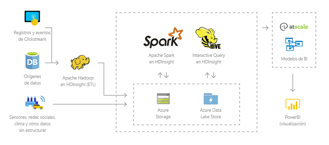
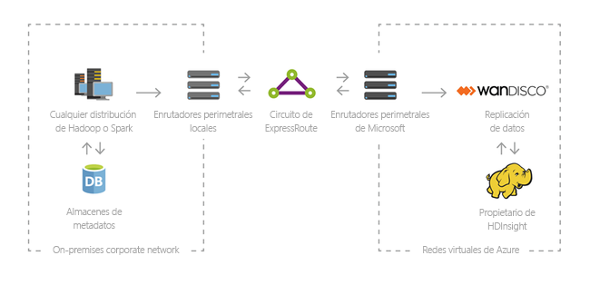

# Qué son Azure HDInsight y la pila de tecnología de Hadoop

En este artículo se proporciona una introducción a Apache Hadoop en Azure HDInsight. Azure HDInsight es un servicio de análisis, de código abierto, espectro completo y totalmente administrado para empresas. Puede usar plataformas de código abierto como Hadoop, Spark, Hive, LLAP, Kafka, Storm, R, etc. 

[!INCLUDE [hdinsight-price-change](../../../includes/hdinsight-enhancements.md)]

## ¿Qué son HDInsight y la pila de tecnología de Hadoop?

[Apache Hadoop](http://hadoop.apache.org/) era el entorno de trabajo de código abierto original para el procesamiento distribuido y análisis de macrodatos en clústeres. La pila de tecnología de Hadoop incluye software relacionado y utilidades, incluidas Apache Hive, HBase, Spark, Kafka y muchas otras.

Azure HDInsight es una distribución en la nube de los componentes de Hadoop de [Hortonworks Data Platform (HDP)](https://hortonworks.com/products/data-center/hdp/). Azure HDInsight hace que sea fácil, rápido y rentable procesar grandes cantidades de datos. Puede usar las plataformas de código abierto más conocidas como Hadoop, Spark, Hive, LLAP, Kafka, Storm, R, etc. Con estas plataformas puede habilitar una amplia gama de escenarios, como la extracción, transformación y carga (ETL), el almacenamiento de datos, el aprendizaje automático e IoT.

Para ver los componentes disponibles de la pila de tecnología de Hadoop en HDInsight, consulte [¿Cuáles son los componentes y versiones de Hadoop disponibles con HDInsight?][component-versioning] Para más información sobre Hadoop en HDInsight, consulte la [página de características de Azure para HDInsight](https://azure.microsoft.com/services/hdinsight/).

## ¿Qué son grandes volúmenes de datos?

Los macrodatos se recopilan en volúmenes de escala a una mayor velocidad y con una variedad de formatos nunca vista. Pueden ser históricos (es decir, almacenados) o en tiempo real (es decir, transferidos directamente desde el origen). Consulte [Escenarios de uso de HDInsight](#scenarios-for-using-hdinsight) para más información sobre los casos de uso más habituales para macrodatos.

## ¿Por qué debo usar Hadoop en HDInsight?

En esta sección se enumeran las funcionalidades de Azure HDInsight.

|Capacidad  |DESCRIPCIÓN  |
|---------|---------|
|Nativo en la nube     |     Azure HDInsight le permite crear clústeres optimizados para [Hadoop](apache-hadoop-linux-tutorial-get-started.md), [Spark](../spark/apache-spark-jupyter-spark-sql.md), [Interactive Query (LLAP)](../interactive-query/apache-interactive-query-get-started.md), [Kafka](../kafka/apache-kafka-get-started.md), [Storm](../storm/apache-storm-tutorial-get-started-linux.md), [HBase](../hbase/apache-hbase-tutorial-get-started-linux.md) y  [ML Services](../r-server/r-server-get-started.md) en Azure. HDInsight también proporciona un Acuerdo de Nivel de Servicio de un extremo a otro en las cargas de trabajo de producción.  |
|Rentable y escalable     | HDInsight le permite [escalar](../hdinsight-administer-use-portal-linux.md) o reducir verticalmente cargas de trabajo. Puede reducir el costo mediante la  [creación de clústeres a petición](../hdinsight-hadoop-create-linux-clusters-adf.md) y pagar solo por lo que se utiliza. También puede compilar canalizaciones de datos para poner en marcha los trabajos. El procesamiento y el almacenamiento desacoplados ofrecen un mejor rendimiento y flexibilidad. |
|Seguro y conforme    | HDInsight le permite proteger los recursos de datos de la empresa mediante [Azure Virtual Network](../hdinsight-extend-hadoop-virtual-network.md), el [cifrado](../hdinsight-hadoop-create-linux-clusters-with-secure-transfer-storage.md) y la integración con [Azure Active Directory](../domain-joined/apache-domain-joined-introduction.md). HDInsight también cumple con los [estándares de cumplimiento normativo](https://azure.microsoft.com/overview/trusted-cloud) más conocidos del sector y de la administración.        |
|Supervisión    | Azure HDInsight se integra con [Azure Log Analytics](../hdinsight-hadoop-oms-log-analytics-tutorial.md) para proporcionar una única interfaz con la que puede supervisar todos los clústeres.        |
|Disponibilidad global | HDInsight está disponible en más [regiones](https://azure.microsoft.com/regions/services/) que ninguna otra oferta de análisis de macrodatos. También está disponible en Azure Government, China y Alemania, lo que le permite satisfacer las necesidades de su empresa en áreas soberanas clave. |  
|Productividad     |  Azure HDInsight le permite usar herramientas de productividad muy completas de Hadoop y Spark con los entornos de desarrollo que prefiera. Estos entornos de desarrollo incluyen [Visual Studio](apache-hadoop-visual-studio-tools-get-started.md), [VSCode](../hdinsight-for-vscode.md), [Eclipse](../spark/apache-spark-eclipse-tool-plugin.md) e [IntelliJ](../spark/apache-spark-intellij-tool-plugin.md) para la compatibilidad con Scala, Python, R, Java y .NET. Los científicos de datos también pueden colaborar mediante cuadernos conocidos como los de [Jupyter](../spark/apache-spark-jupyter-notebook-kernels.md) y [Zeppelin](../spark/apache-spark-zeppelin-notebook.md).    |
|Extensibilidad     |  Puede ampliar los clústeres de HDInsight con componentes instalados (Hue, Presto, etc.) mediante [acciones de script](../hdinsight-hadoop-customize-cluster-linux.md), la [incorporación de nodos perimetrales](../hdinsight-apps-use-edge-node.md) o la [integración con otras aplicaciones certificadas de macrodatos](../hdinsight-apps-install-applications.md). HDInsight le permite una integración sin problemas con las soluciones de macrodatos más conocidas con una implementación [con un solo clic](https://azure.microsoft.com/services/hdinsight/partner-ecosystem/).|

## Escenarios de uso de HDInsight

Azure HDInsight se puede usar para una amplia variedad de escenarios de procesamiento de macrodatos. Pueden ser datos históricos (datos ya recopilados y almacenados) o datos en tiempo real (datos que se transmiten directamente desde el origen). Los escenarios de procesamiento de tales datos se pueden resumir en las siguientes categorías: 

### Procesamiento por lotes (ETL)

El de extracción, transformación y carga (ETL) es un proceso en el que se extraen datos estructurados o no estructurados de orígenes de datos heterogéneos. Estos datos se transforman a un formato estructurado y se cargan en un almacén de datos. Los datos transformados se pueden usar para ciencia de datos o almacenamiento de datos.

### Almacenamiento de datos

Puede usar HDInsight para realizar consultas interactivas a escalas de petabytes sobre datos estructurados o no estructurados en cualquier formato. También puede generar modelos conectándolos a herramientas de BI. Para más información, [lea este caso de cliente](https://customers.microsoft.com/story/milliman). 

### Internet de las cosas (IoT)

Puede usar HDInsight para procesar los datos de streaming recibidos en tiempo real desde varios tipos de dispositivos. Para más información, [lea esta entrada de blog de Azure que anuncia la versión preliminar pública de Apache Kafka en HDInsight con Azure Managed Disks](https://azure.microsoft.com/blog/announcing-public-preview-of-apache-kafka-on-hdinsight-with-azure-managed-disks/).

 

### Ciencia de datos

Puede usar HDInsight para compilar aplicaciones que extraigan información crítica de los datos. También puede usar Azure Machine Learning para predecir tendencias futuras de la empresa. Para más información, [lea este caso de cliente](https://customers.microsoft.com/story/pros).

### Híbrido

Puede usar HDInsight para ampliar la infraestructura local de macrodatos existente en Azure para aprovechar las avanzadas funcionalidades de análisis en la nube.

## Tipos de clúster de HDInsight
HDInsight incluye tipos de clúster concretos y funcionalidades de personalización del clúster, tales como la de agregar componentes, utilidades y lenguajes. HDInsight ofrece los siguientes tipos de clúster:

* **[Apache Hadoop](https://wiki.apache.org/hadoop)**: una plataforma que utiliza HDFS, administración de recursos YARN y un modelo de programación de MapReduce simple para procesar y analizar datos por lotes en paralelo.

* **[Apache Spark](http://spark.apache.org/)**: plataforma de procesamiento paralelo de código abierto que admite el procesamiento en memoria para mejorar el rendimiento de las aplicaciones de análisis de macrodatos. Consulte [¿qué es Apache Spark en HDInsight?](../spark/apache-spark-overview.md)

* **[Apache HBase](http://hbase.apache.org/)**: base de datos NoSQL en Hadoop que proporciona acceso aleatorio y gran coherencia para grandes cantidades de datos no estructurados y semiestructurados; potencialmente miles de millones de filas multiplicadas por millones de columnas. Consulte [¿qué es HBase en HDInsight?](../hbase/apache-hbase-overview.md)

* **[ML Services](https://msdn.microsoft.com/microsoft-r/rserver)**: un servidor para hospedar y administrar procesos de R distribuidos en paralelo. Proporciona a los científicos de datos, estadísticos y programadores de R acceso a petición a métodos escalables y distribuidos para realizar análisis en HDInsight. Consulte [Información general de ML Services en HDInsight](../r-server/r-server-overview.md).

* **[Apache Storm](https://storm.incubator.apache.org/)**: sistema distribuido de cálculo en tiempo real para el procesamiento rápido de grandes transmisiones de datos. Storm se ofrece como clúster administrado en HDInsight. Consulte [Análisis de datos de sensor en tiempo real con Storm y Hadoop](../storm/apache-storm-sensor-data-analysis.md).

* **[Versión preliminar de Apache Interactive Query (también conocido como Live Long and Process)](https://cwiki.apache.org/confluence/display/Hive/LLAP)**: almacenamiento en caché en memoria para consultas de Hive interactivas y más rápidas. Consulte [Uso de Interactive Query en HDInsight](../interactive-query/apache-interactive-query-get-started.md).

* **[Apache Kafka](https://kafka.apache.org/)**: una plataforma de código abierto que se usa para crear canalizaciones y aplicaciones de datos de streaming. Kafka también proporciona funcionalidad de cola de mensajes que le permite publicar flujos de datos y suscribirse a ellos. Consulte [Introducción a Apache Kafka en HDInsight](../kafka/apache-kafka-introduction.md).

## Componentes de código abierto en HDInsight

Azure HDInsight le permite crear clústeres con plataformas de código abierto como Hadoop, Spark, Hive, LLAP, Kafka, Storm, HBase y R. De forma predeterminada, estos clústeres incluyen otros componentes de código abierto como [Ambari](https://github.com/apache/ambari/blob/trunk/ambari-server/docs/api/v1/index.md), [Avro](http://avro.apache.org/docs/current/spec.html), [Hive](http://hive.apache.org), [HCatalog](https://cwiki.apache.org/confluence/display/Hive/HCatalog/), [Mahout](https://mahout.apache.org/), [MapReduce](http://wiki.apache.org/hadoop/MapReduce), [YARN](http://hadoop.apache.org/docs/current/hadoop-yarn/hadoop-yarn-site/YARN.html), [Phoenix](http://phoenix.apache.org/), [Pig](http://pig.apache.org/), [Sqoop](http://sqoop.apache.org/), [Tez](http://tez.apache.org/), [Oozie](http://oozie.apache.org/), [ZooKeeper](http://zookeeper.apache.org/).  

## Lenguajes de programación en HDInsight
Los clústeres de HDInsight, como Spark, HBase, Kafka, Hadoop, etc, admiten muchos lenguajes de programación. Aunque algunos no están instalados de manera predeterminada. En el caso de las bibliotecas, los módulos o los paquetes que no se instalan de manera predeterminada, [instale el componente con una acción de script](../hdinsight-hadoop-script-actions-linux.md).

|Lenguaje de programación  |Información  |
|---------|---------|
|Compatibilidad con lenguajes de programación predeterminados     | De forma predeterminada, los clústeres de HDInsight admiten lo siguiente:<ul><li>Java</li><li>Python</li></ul> Puede instalar lenguajes adicionales mediante [acciones de script](../hdinsight-hadoop-script-actions-linux.md).       |
|Lenguajes de la máquina virtual de Java (JVM)     | Muchos lenguajes distintos de Java se pueden ejecutar en una máquina virtual de Java (JVM). Sin embargo, si ejecuta algunos de estos lenguajes, puede que tenga que instalar componentes adicionales en el clúster. Los siguientes lenguajes basados en JVM son compatibles con clústeres de HDInsight: <ul><li>Clojure</li><li>Jython (Python para Java)</li><li>Scala</li></ul>     |
|Lenguajes específicos de Hadoop     | Los clústeres de HDInsight son compatibles con los siguientes lenguajes específicos de la pila de tecnología de Hadoop: <ul><li>Pig Latin para trabajos de Pig</li><li>HiveQL para trabajos de Hive y SparkSQL</li></ul>        |
 

## Inteligencia empresarial en HDInsight
Las herramientas de Business Intelligence (BI) habituales recuperan, analizan y generan informes de datos que se integran en HDInsight con el complemento Power Query o Microsoft Hive ODBC Driver:

* [Apache Spark BI mediante herramientas de visualización de datos con Azure HDInsight](../spark/apache-spark-use-bi-tools.md)

* [Visualización de datos de Hive con Microsoft Power BI en Azure HDInsight](apache-hadoop-connect-hive-power-bi.md) 

* [Visualización de datos de Interactive Query Hive con Power BI en Azure HDInsight](../interactive-query/apache-hadoop-connect-hive-power-bi-directquery.md)

* [Conexión de Excel a Hadoop con Power Query](apache-hadoop-connect-excel-power-query.md) (requiere Windows) 

* [Conexión de Excel a Hadoop con Microsoft Hive ODBC Driver](apache-hadoop-connect-excel-hive-odbc-driver.md) (requiere Windows) 

* [Uso de SQL Server Analysis Services con HDInsight](https://msdn.microsoft.com/library/dn749857.aspx)

* [Uso de SQL Server Reporting Services con HDInsight](https://msdn.microsoft.com/library/dn749856.aspx)

## Pasos siguientes

En este artículo, ha aprendido qué es Azure HDInsight y cómo proporciona clústeres de Hadoop y de otros tipos en Azure. Continúe con el siguiente artículo para obtener información sobre cómo crear un clúster de Apache Hadoop en HDInsight.

> [!div class="nextstepaction"]
> [Crear un clúster de Hadoop en HDInsight](apache-hadoop-linux-create-cluster-get-started-portal.md)

[component-versioning]: ../hdinsight-component-versioning.md
[zookeeper]: http://zookeeper.apache.org/
