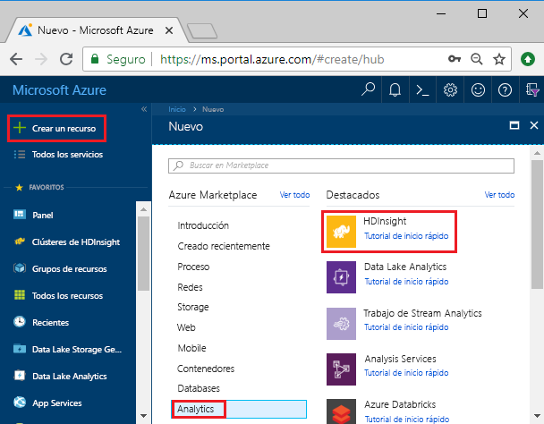
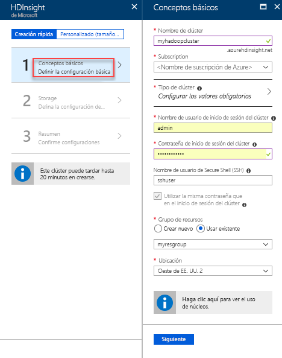
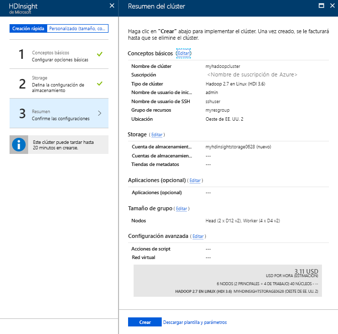
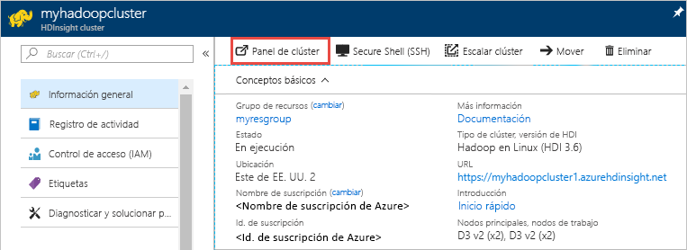
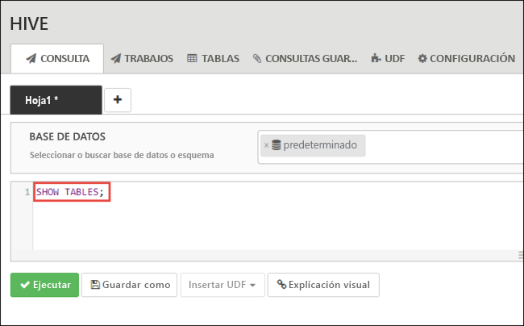
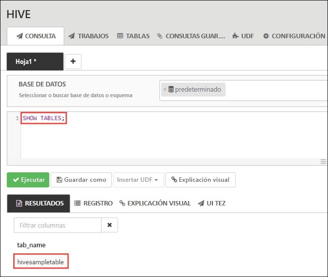

# Inicio rápido: Introducción a Apache Hadoop y Apache Hive en Azure HDInsight con Azure Portal

En este artículo, aprenderá a crear clústeres de [Apache Hadoop](https://hadoop.apache.org/) en HDInsight con Azure Portal y a ejecutar trabajos de Apache Hive en HDInsight. La mayoría de los trabajos de Hadoop son por lotes. Se crea un clúster, se ejecutan algunos trabajos y luego se elimina el clúster. En este artículo, realizará las tres tareas.

En este inicio rápido, usará Azure Portal para crear un clúster de Hadoop de HDInsight. También puede crear un clúster con la [plantilla de Azure Resource Manager](apache-hadoop-linux-tutorial-get-started.md).

Actualmente HDInsight tiene [siete tipos diferentes de clúster](./apache-hadoop-introduction.md#cluster-types-in-hdinsight). Cada uno de estos tipos de clúster es compatible con un conjunto de componentes diferente. Todos los tipos de clúster son compatibles con Hive. Para ver una lista de los componentes compatibles con HDInsight, consulte [Novedades en las versiones de clústeres de Apache Hadoop proporcionadas por HDInsight](../hdinsight-component-versioning.md).  

Si no tiene una suscripción a Azure, cree una [cuenta gratuita](https://azure.microsoft.com/free/) antes de empezar.

## Creación de un clúster de Apache Hadoop

En esta sección, crea un clúster de Hadoop en HDInsight con Azure Portal. 

1. Inicie sesión en [Azure Portal](https://portal.azure.com).

1. En Azure Portal, seleccione **Crear un recurso** > **Datos y análisis** > **HDInsight**. 

    

2. En **HDInsight** > **Creación rápida** > **Conceptos básicos**, proporcione los valores tal como se sugiere en la siguiente captura de pantalla:

    

    Escriba o seleccione los siguientes valores:
    
    |Propiedad  |Descripción  |
    |---------|---------|
    |**Nombre del clúster**     | Escriba el nombre del clúster de Hadoop. Dado que todos los clústeres de HDInsight comparten el mismo espacio de nombres de DNS, este nombre debe ser único. El nombre puede tener un máximo de 59 caracteres, letras, números y guiones incluidos. El primer y el último carácter del nombre no pueden ser guiones. |
    |**Suscripción**     |  Seleccione su suscripción a Azure. |
    |**Tipo de clúster**     | Omítalo por ahora. Proporcione esta entrada en el paso siguiente de este procedimiento.|
    |**Nombre de usuario y contraseña de inicio de sesión del clúster**     | El nombre de inicio de sesión predeterminado es **admin**. La contraseña debe tener un mínimo de 10 caracteres y contener al menos un dígito, una letra mayúscula y una letra minúscula, y un carácter no alfanumérico (excepto los caracteres ' " y `\). Asegúrese de **no proporcionar** contraseñas comunes, como "Pass@word1".|
    |**Nombre de usuario de SSH** | El nombre de usuario predeterminado es **sshuser**.  Puede proporcionar otro nombre para el nombre de usuario de SSH. |
    | **Usar la misma contraseña que en el inicio de sesión del clúster** | Seleccione esta casilla para que el usuario de SSH tenga la misma contraseña que la proporcionada para el usuario de inicio de sesión del clúster.|
    |**Grupos de recursos**     | Cree un grupo de recursos o seleccione uno existente.  Un grupo de recursos es un contenedor de componentes de Azure.  En este caso, el grupo de recursos contiene el clúster de HDInsight y la cuenta de Azure Storage dependiente. |
    |**Ubicación**     | Seleccione una ubicación de Azure en la que quiera crear el clúster.  Elija una ubicación más cercana a usted para mejorar el rendimiento. |
        
3. Seleccione **Tipo de clúster** y proporcione las entradas tal como se indica en la captura de pantalla siguiente:

    

    Seleccione los valores siguientes:
    
    |Propiedad  |Descripción  |
    |---------|---------|
    |**Tipo de clúster**     | Seleccione **Hadoop** |
    |**Sistema operativo**     |  Seleccione su suscripción a Azure. |
    |**Versión**     | Seleccione **Hadoop 2.7.3 (HDI 3.6)**.|

    Haga clic en **Seleccionar** y, a continuación, en **Siguiente**.

4. En la pestaña **Almacenamiento**, proporcione las entradas tal como se indica en la captura de pantalla siguiente:

    

    Seleccione los valores siguientes:
    
    |Propiedad  |Descripción  |
    |---------|---------|
    |**Tipo de almacenamiento principal**     | Para este artículo, seleccione **Azure Storage** para usar Azure Storage Blob como cuenta de almacenamiento predeterminada. También puede usar Azure Data Lake Store como almacenamiento predeterminado. |
    |**Método de selección**     |  Para este artículo, seleccione **Mis suscripciones** para usar una cuenta de almacenamiento de la suscripción de Azure. Para usar una cuenta de almacenamiento de otras suscripciones, seleccione **Clave de acceso** y, a continuación, proporcione la clave de acceso para esa cuenta. |
    |**Creación de una cuenta de almacenamiento nueva**     | Proporcione un nombre para la cuenta de almacenamiento.|

    Acepte todos los demás valores predeterminados y, a continuación, seleccione **Siguiente**.

5. En la pestaña **Resumen**, compruebe los valores seleccionados en los pasos anteriores.

    
      
4. Seleccione **Crear**. Verá un icono nuevo llamado **Submitting deployment for HDInsight** (Enviando implementación para HDInsight) en el panel del portal. Se tarda aproximadamente 20 minutos en crear un clúster.

    

4. Una vez creado el clúster, verá la página de información general del clúster en Azure Portal.
   
        
    
    Cada clúster depende de una [cuenta de Azure Storage](../hdinsight-hadoop-use-blob-storage.md) o de una [cuenta de Azure Data Lake](../hdinsight-hadoop-use-data-lake-store.md). Se conoce como cuenta de almacenamiento predeterminada. El clúster de HDInsight y su cuenta de almacenamiento predeterminada deben estar en la misma región de Azure. Al eliminar los clústeres no se elimina la cuenta de almacenamiento.

    > [!NOTE]  
    > Para conocer otros métodos de creación de clústeres y las propiedades que se usan en este tutorial, consulte [Creación de clústeres de Hadoop basados en Linux en HDInsight](../hdinsight-hadoop-provision-linux-clusters.md).       

## Ejecución de consultas de Apache Hive

[Apache Hive](hdinsight-use-hive.md) es el componente más popular de los que se usan en HDInsight. Hay muchas maneras de ejecutar trabajos de Hive en HDInsight. En este tutorial se usa la vista de Hive de Ambari desde el portal. Para conocer otros métodos para enviar trabajos de Hive, consulte [Uso de Hive en HDInsight](hdinsight-use-hive.md).

1. Para abrir Ambari, desde la captura de pantalla anterior, seleccione **Panel de clúster**.  También puede ir a **https://&lt;NombreDeClúster>.azurehdinsight.net**, donde &lt;NombreDeClúster> es el clúster que creó en la sección anterior.

    

2. Escriba el nombre de usuario de Hadoop y la contraseña que especificó al crear el clúster. El nombre de usuario predeterminado es **admin**.

3. Abra la **vista de Hive** como se muestra en la siguiente captura de pantalla:
   
    

4. En la pestaña **CONSULTA**, pegue las instrucciones HiveQL siguientes en la hoja de cálculo:
   
        SHOW TABLES;

    
   
   > [!NOTE]  
   > Hive requiere un punto y coma.       

5. Seleccione **Execute**(Ejecutar). Aparecerá una pestaña **RESULTADOS** en la pestaña **CONSULTA** que mostrará información sobre el trabajo. 
   
    Cuando haya finalizado la consulta, la pestaña **CONSULTA** muestra los resultados de la operación. Verá una tabla denominada **hivesampletable**. Esta es una tabla de Hive de ejemplo que viene integrada en todos los clústeres de HDInsight.
   
    

6. Repita los pasos 4 y 5 para ejecutar la consulta siguiente:
   
        SELECT * FROM hivesampletable;
   
7. También puede guardar los resultados de la consulta. Seleccione el botón de menú de la derecha y especifique si quiere descargar los resultados como archivo CSV o almacenarlos en la cuenta de almacenamiento asociada al clúster.

    

Después de completar un trabajo de Hive, puede [exportar los resultados a Azure SQL Database o Base de datos SQL Server](apache-hadoop-use-sqoop-mac-linux.md), y también puede [visualizar los resultados con Excel](apache-hadoop-connect-excel-power-query.md). Para más información sobre el uso de Hive en HDInsight, consulte [Uso de Apache Hive y HiveQL con Apache Hadoop en HDInsight para analizar un archivo log4j de Apache de muestra](hdinsight-use-hive.md).

## Solución de problemas

Si experimenta problemas con la creación de clústeres de HDInsight, consulte los [requisitos de control de acceso](../hdinsight-administer-use-portal-linux.md#create-clusters).

## Limpieza de recursos
Después de completar el tutorial, puede ser conveniente eliminar el clúster. Con HDInsight, los datos se almacenan en Azure Storage, por lo que puede eliminar un clúster de forma segura cuando no se esté usando. También se le cobrará por un clúster de HDInsight aunque no se esté usando. Como en muchas ocasiones los cargos por el clúster son mucho más elevados que los cargos por el almacenamiento, desde el punto de vista económico tiene sentido eliminar clústeres cuando no se estén usando. 

> [!NOTE]  
> Si avanza de *inmediato* al siguiente tutorial para aprender a ejecutar operaciones de ETL con Hadoop en HDInsight, es posible que quiera mantener el clúster en ejecución. Esto es porque en el tutorial tendrá que crear un clúster de Hadoop de nuevo. Sin embargo, si no va a continuar con el próximo tutorial de inmediato, debe eliminar el clúster ahora.
> 
>  

**Para eliminar el clúster o la cuenta de almacenamiento predeterminada**

1. Vuelva a la pestaña de explorador en la que tenga Azure Portal. Estará en la página de información general del clúster. Si solo quiere eliminar el clúster, pero desea seguir conservando la cuenta de almacenamiento predeterminada, seleccione **Eliminar**.

    

2. Si quiere eliminar el clúster y la cuenta de almacenamiento predeterminada, seleccione el nombre del grupo de recursos (resaltado en la captura de pantalla anterior) para abrir la página del grupo de recursos.

3. Seleccione **Eliminar grupo de recursos** para eliminar el grupo de recursos, que contiene el clúster y la cuenta de almacenamiento predeterminada. Tenga en cuenta que, al eliminar el grupo de recursos, se elimina también la cuenta de almacenamiento. Si desea mantener la cuenta de almacenamiento, elija eliminar solo el clúster.

## Pasos siguientes
En este tutorial, ha aprendido a crear un clúster de HDInsight basado en Linux mediante una plantilla de Resource Manager y a realizar consultas básicas de Hive. En el siguiente artículo, aprenderá a realizar una operación ETL (extraer, transformar y cargar) con Hadoop en HDInsight.

> [!div class="nextstepaction"]
>[Extracción, transformación y carga de datos mediante Apache Hive en HDInsight ](../hdinsight-analyze-flight-delay-data-linux.md)

Si está preparado para empezar a trabajar con sus propios datos y necesita más información acerca de la forma en que HDInsight almacena los datos o de cómo obtener datos en HDInsight, consulte los siguientes artículos:

* Para más información sobre cómo HDInsight usa Azure Storage, consulte [Uso de Azure Storage con HDInsight](../hdinsight-hadoop-use-blob-storage.md).
* Para obtener información sobre cómo crear un clúster de HDInsight con Data Lake Storage, consulte [Quickstart: Set up clusters in HDInsight](../../storage/data-lake-storage/quickstart-create-connect-hdi-cluster.md) (Inicio rápido: Configuración de clústeres en HDInsight).
* Para más información sobre cómo cargar datos en HDInsight, consulte [Carga de datos en HDInsight](../hdinsight-upload-data.md).

Para más información sobre el análisis de datos con HDInsight, consulte los siguientes artículos:

* Para más información sobre el uso de Hive con HDInsight, como la ejecución de consultas de Hive desde Visual Studio, consulte este artículo sobre el [uso de Apache Hive con HDInsight](hdinsight-use-hive.md).
* Para más información sobre Pig, un lenguaje que se utiliza para transformar datos, consulte este artículo sobre el [uso de Apache Pig con HDInsight](hdinsight-use-pig.md).
* Para más información sobre MapReduce, una manera de escribir programas que procesan datos en Hadoop, consulte [Uso de MapReduce con HDInsight](hdinsight-use-mapreduce.md).
* Para más información sobre el uso de las herramientas de HDInsight para Visual Studio para analizar datos en HDInsight, consulte [Introducción al uso de herramientas de Hadoop en Visual Studio para HDInsight para ejecutar una consulta de Hive](apache-hadoop-visual-studio-tools-get-started.md).

Si desea más información acerca de cómo crear o administrar un clúster de HDInsight, consulte los siguientes artículos:

* Para más información sobre cómo administrar el clúster de HDInsight basado en Linux, consulte [Administración de clústeres de HDInsight con la interfaz de usuario web de Apache Ambari](../hdinsight-hadoop-manage-ambari.md).
* Para más información acerca de las opciones que se pueden seleccionar al crear un clúster de HDInsight, consulte [Creación de clústeres de Hadoop basados en Linux en HDInsight](../hdinsight-hadoop-provision-linux-clusters.md).

[1]: ../HDInsight/apache-hadoop-visual-studio-tools-get-started.md

[hdinsight-provision]: hdinsight-provision-linux-clusters.md
[hdinsight-upload-data]: hdinsight-upload-data.md
[hdinsight-use-hive]: hdinsight-use-hive.md
[hdinsight-use-pig]: hdinsight-use-pig.md

