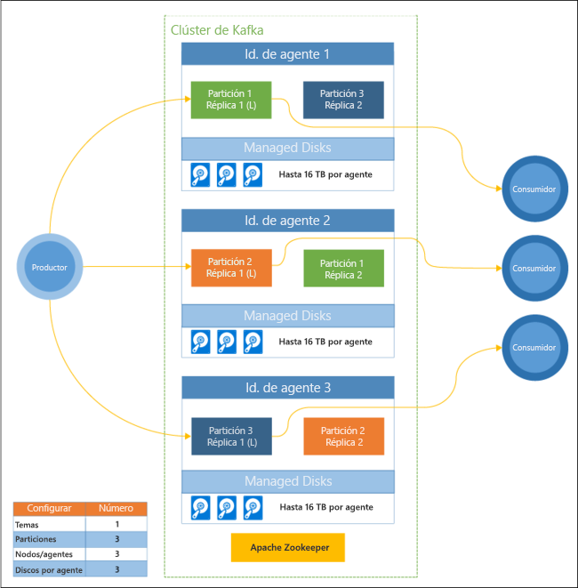

# Introducción a Apache Kafka en HDInsight

[Apache Kafka](https://kafka.apache.org) es una plataforma de streaming distribuido de código abierto que se puede utilizar para compilar canalizaciones de datos de streaming en tiempo real y aplicaciones. Kafka también proporciona funcionalidad de agente de mensajería similar a una cola de mensajes, donde puede publicar y suscribirse a las transmisiones de datos con nombre. Kafka en HDInsight proporciona un servicio administrado, altamente escalable y de alta disponibilidad en la nube de Microsoft Azure.

## ¿Por qué usar Kafka en HDInsight?

Kafka en HDInsight proporciona las siguientes características:

* Acuerdo de Nivel de Servicio (SLA): [información del SLA para HDInsight](https://azure.microsoft.com/support/legal/sla/hdinsight/v1_0/).

* Patrón de mensajería de publicación y suscripción: Kafka proporciona una API de productor para publicar registros a un tema de Kafka. Al suscribirse a un tema, se utiliza la API de consumidor.

* Procesamiento de transmisiones: Kafka se suele utilizar con Apache Storm o Spark para el procesamiento de transmisiones en tiempo real. Kafka 0.10.0.0 (versiones 3.5 y 3.6 de HDInsight) introdujo una API de streaming que permite generar soluciones de streaming sin necesidad de Storm ni Spark.

* Escala horizontal: Kafka particiona las transmisiones en los nodos del clúster de HDInsight. Los procesos del consumidor se pueden asociar con las particiones individuales para proporcionar equilibrio de carga al consumir los registros.

* Entrega en orden: dentro de cada partición, los registros se almacenan en la transmisión en el orden en que se recibieron. Al asociar un proceso de consumidor por partición, puede garantizar que los registros se procesan en orden.

* Tolerancia a errores: las particiones pueden replicarse entre los nodos para proporcionar tolerancia a errores.

* Integración con Azure Managed Disks: Managed Disks proporciona mayor escala y rendimiento a los discos que usan las máquinas virtuales en el clúster de HDInsight.

    Los discos administrados se habilitan de forma predeterminada para Kafka en HDInsight. El número de discos que se utilizan por nodo se puede configurar durante la creación de HDInsight. Para más información acerca de los discos administrados, consulte [Introducción a Azure Managed Disks](../../virtual-machines/windows/managed-disks-overview.md).

    Para obtener información acerca de la configuración de discos administrados con Kafka en HDInsight, consulte [Configure storage and scalability for Apache Kafka on HDInsight](apache-kafka-scalability.md) (Configuración del almacenamiento y la escalabilidad de Apache Kafka en HDInsight).

## Casos de uso

* **Mensajería**: como admite el patrón de publicación de mensajes y suscripción, Kafka a menudo se utiliza como agente de mensajería.

* **Seguimiento de la actividad**: Kafka proporciona un registro en orden, por lo que se puede utilizar para realizar un seguimiento y volver a crear actividades. Por ejemplo, las acciones del usuario en un sitio web o dentro de una aplicación.

* **Agregación**: mediante el procesamiento de las transmisiones, puede agregar información de distintas transmisiones para combinar y centralizar la información en datos operativos.

* **Transformación**: mediante el procesamiento de las transmisiones, puede combinar y enriquecer los datos de varios temas de entrada en uno o más temas de salida.

## Arquitectura

Este diagrama muestra una configuración típica de Kafka que usa grupos de consumidores, particiones y replicación para ofrecer la lectura paralela de eventos con tolerancia a errores. Apache ZooKeeper se genera para las transacciones simultáneas, resistentes y de baja latencia, que administra el estado del clúster Kafka. Kafka almacena los registros en *temas*. Los registros se generan mediante *productores* y se consumen mediante *consumidores*. Los productores recuperan registros de *agentes* de Kafka. Cada nodo de trabajo del clúster de HDInsight es un agente de Kafka. Se crea una partición para cada consumidor, permitiendo el procesamiento paralelo de los datos de streaming. La replicación se emplea para distribuir las particiones en nodos, protegiendo contra las desconexiones de nodos (agente). Una partición con una *(L)* es la líder para la partición dada. El tráfico del productor se enruta al líder de cada nodo, con el estado administrado por ZooKeeper.

Cada agente Kafka utiliza discos administrados de Azure. El número de discos está definido por el usuario y puede proporcionar hasta 16 TB de almacenamiento por agente.

> [!IMPORTANT]
> Kafka no es consciente del hardware subyacente (rack) en el centro de datos de Azure. Para asegurarse de que las particiones están equilibradas correctamente en el hardware subyacente, consulte [configuración de una alta disponibilidad de los datos (Kafka)](apache-kafka-high-availability.md).

## Pasos siguientes

Use los vínculos siguientes para aprender a usar a Apache Kafka en HDInsight:

* [Introducción a Kafka en HDInsight](apache-kafka-get-started.md)

* [Uso de MirrorMaker para crear una réplica de Kafka en HDInsight](apache-kafka-mirroring.md)

* [Uso de Apache Kafka con Storm en HDInsight](../hdinsight-apache-storm-with-kafka.md)

* [Uso de Apache Spark con Kafka en HDInsight](../hdinsight-apache-spark-with-kafka.md)

* [Conexión a Kafka a través de una instancia de Azure Virtual Network](apache-kafka-connect-vpn-gateway.md)