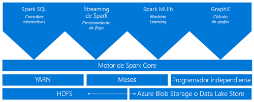
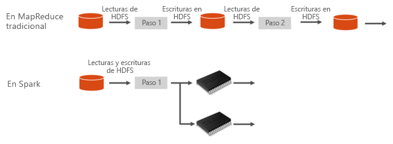
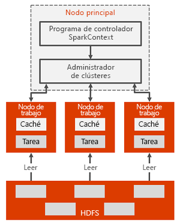

# Qué es Apache Spark en Azure HDInsight

*Apache Spark* es una plataforma de procesamiento paralelo que admite el procesamiento en memoria para mejorar el rendimiento de las aplicaciones de análisis de macrodatos. Apache Spark en Azure HDInsight es la implementación que hace Microsoft de Apache Hadoop en la nube. HDInsight facilita la creación y la configuración de un clúster de Spark en Azure. Los clústeres de Spark en HDInsight son compatibles con Azure Storage y Azure Data Lake Store. Por lo que puede usar clústeres de HDInsight Spark para procesar los datos almacenados en Azure. Para conocer los componentes y la información de versiones, consulte los [componentes y versiones de Hadoop disponibles con Azure HDInsight](../hdinsight-component-versioning.md).

## ¿Qué es Spark?

Spark proporciona primitivas de computación de clúster en memoria. Un trabajo de Spark puede cargar y almacenar en la memoria caché datos, y repetir consultas sobre ellos. La informática en la memoria es mucho más rápida que las aplicaciones basadas en disco, como Hadoop, que comparte datos a través de HDFS. Spark también se integra en el lenguaje de programación de Scala para que pueda manipular conjuntos de datos distribuidos como colecciones locales. No se necesita estructurar todo como operaciones de asignación y reducción.

Los clústeres de Spark en HDInsight ofrecen un servicio de Spark completamente administrado. Aquí se enumeran las ventajas de crear un clúster de Spark en HDInsight.

| Característica | DESCRIPCIÓN |
| --- | --- |
| Creación sencilla |Puede crear un clúster de Spark en HDInsight en cuestión de minutos mediante Azure Portal, Azure PowerShell o el SDK de .NET de HDInsight. Consulte [Introducción al clúster de Spark en HDInsight](apache-spark-jupyter-spark-sql.md) |
| Facilidad de uso |El clúster de Spark en HDInsight incluye notebooks de Jupyter y Zeppelin. Puede usar estos notebooks para el procesamiento y la visualización de datos interactivos.|
| API de REST |Los clústeres de Spark en HDInsight incluyen [Livy](https://github.com/cloudera/hue/tree/master/apps/spark/java#welcome-to-livy-the-rest-spark-server), un servidor de trabajos de Spark basado en una API de REST para enviar y supervisar trabajos de forma remota. |
| Compatibilidad con Almacén de Azure Data Lake | Los clústeres de Spark en HDInsight pueden usar Azure Data Lake Store como almacenamiento principal o almacenamiento adicional. Para más información acerca del Almacén de Data Lake, consulte la página con [información general del Almacén de Azure Data Lake](../../data-lake-store/data-lake-store-overview.md). |
| Integración con servicios de Azure |Un clúster de Spark en HDInsight incluye un conector a Azure Event Hubs. Puede compilar aplicaciones de streaming con Event Hubs, además de con [Kafka](http://kafka.apache.org/), que ya está disponible como parte de Spark. |
| Compatibilidad con ML Server | Se proporciona compatibilidad con ML Server en HDInsight como el tipo de clúster **ML Services**. Puede configurar un clúster de ML Services para ejecutar cálculos R distribuidos con las velocidades prometidas mediante un clúster de Spark. Para más información, consulte [Introducción al uso de ML Server en HDInsight](../r-server/r-server-get-started.md). |
| Integración con IDE de terceros | HDInsight ofrece varios complementos de IDE que son útiles para crear y enviar aplicaciones a un clúster de Spark en HDInsight. Para más información, consulte [Uso de Azure Toolkit for IntelliJ IDEA](apache-spark-intellij-tool-plugin.md), [Uso de HDInsight for VSCode](../hdinsight-for-vscode.md) y [Uso de Azure Toolkit for Eclipse](apache-spark-eclipse-tool-plugin.md).|
| Consultas simultáneas |Los clústeres de Spark en HDInsight admiten consultas simultáneas. Esta funcionalidad permite que varias consultas de un usuario o varias consultas de diversos usuarios y aplicaciones compartan los mismos recursos de clúster. |
| Almacenamiento en caché en SSD |Puede almacenar datos en caché, ya sea en memoria o en SSD conectadas a los nodos del clúster. El almacenamiento en memoria caché ofrece el mejor rendimiento de las consultas, pero también podría ser costoso. El almacenamiento en memoria caché en SSD ofrece una opción excelente para mejorar el rendimiento de las consultas sin necesidad de crear un clúster de un tamaño que admita todo el conjunto de datos en memoria. |
| Integración con herramientas de BI |Los clústeres de Spark en HDInsight ofrecen conectores para herramientas de BI como [Power BI](http://www.powerbi.com/) para el análisis de datos. |
| Bibliotecas de Anaconda precargadas |Los clústeres de Spark en HDInsight incluyen bibliotecas de Anaconda preinstaladas. [Anaconda](http://docs.continuum.io/anaconda/) ofrece prácticamente 200 bibliotecas para el aprendizaje automático, el análisis de datos, la visualización, etc. |
| Escalabilidad | HDInsight le permite cambiar el número de nodos de clúster. Además, se pueden quitar clústeres de Spark sin que se pierdan datos, ya que todos están almacenados en Azure Storage o Data Lake Store. |
| Contrato de nivel de servicio |Los clústeres de Spark en HDInsight incluyen soporte técnico ininterrumpido y un SLA del 99,9 % de tiempo de actividad. |

Los clústeres de Spark en HDInsight incluyen los siguientes componentes que están disponibles en los clústeres de manera predeterminada.

* [Spark Core](https://spark.apache.org/docs/1.5.1/). Incluye Spark Core, Spark SQL, API Spark de streaming, GraphX y MLlib.
* [Anaconda](http://docs.continuum.io/anaconda/)
* [Livy](https://github.com/cloudera/hue/tree/master/apps/spark/java#welcome-to-livy-the-rest-spark-server)
* [Jupyter Notebook](https://jupyter.org)
* [Zeppelin Notebook](http://zeppelin-project.org/)

Los clústeres de Spark en HDInsight también ofrecen un [controlador ODBC](http://go.microsoft.com/fwlink/?LinkId=616229) para la conectividad con clústeres de Spark en HDInsight desde herramientas de inteligencia empresarial, como Microsoft Power BI.

## Arquitectura de clúster de Spark

Los componentes de Spark son fáciles de entender si se entiende la manera en que Spark se ejecuta en clústeres de HDInsight.

Las aplicaciones de Spark se ejecutan como conjuntos de procesos independientes en un clúster, coordinados por el objeto SparkContext en el programa principal (denominado el programa del controlador).

SparkContext puede conectarse a varios tipos de administradores de clúster que asignan los recursos entre las aplicaciones. Estos administradores de clúster incluyen Apache Mesos, Apache YARN y el administrador de clústeres de Spark. En HDInsight, Spark se ejecuta mediante el Administrador de clústeres YARN. Una vez conectado, Spark adquiere los ejecutores en nodos de trabajo en el clúster, que son procesos que ejecutan cálculos y almacenan los datos de la aplicación. A continuación, envía el código de la aplicación (definido por archivos JAR o Python que se pasan a SparkContext) a los ejecutores. Por último, SparkContext envía las tareas a los ejecutores para la ejecución.

SparkContext ejecuta la función principal del usuario y las distintas operaciones paralelas en los nodos de trabajo. A continuación, SparkContext recopila los resultados de las operaciones. Los nodos de trabajo leen y escriben datos del sistema de archivos distribuido de Hadoop (HDFS) y también en él. Además, los nodos de trabajo almacenan en caché datos transformados en memoria como conjuntos de datos distribuidos resistentes (RDD).

SparkContext se conecta al nodo principal de Spark y es responsable de convertir una aplicación en un grafo dirigido (DAG) de las tareas individuales que se ejecutan dentro de un proceso ejecutor en los nodos de trabajo. Cada aplicación obtiene sus propios procesos ejecutores, que permanecen mientras dure la aplicación y ejecutan tareas en varios subprocesos.

## Casos de uso de Spark en HDInsight

Los clústeres de Spark en HDInsight hacen posibles los siguientes escenarios clave:

- Análisis interactivo de datos y BI

    Apache Spark en HDInsight almacena datos en Azure Storage o Azure Data Lake Store. Los expertos de la empresa y los responsables de la toma de decisiones clave pueden analizar esos datos y generar informes con ellos, así como usar Microsoft Power BI para crear informes interactivos a partir de los datos analizados. Los analistas pueden comenzar a partir de datos no estructurados y semiestructurados presentes en el almacenamiento de clúster, definir un esquema de los datos mediante notebooks y luego generar modelos de datos mediante Microsoft Power BI. Los clústeres de Spark en HDInsight también admiten varias herramientas de BI de terceros, como Tableau, lo que resulta más sencillo para analistas de datos, expertos de empresa y responsables de la toma de decisiones clave.

    [Tutorial: Visualizar datos de Spark mediante Power BI](apache-spark-use-bi-tools.md)
- Machine Learning con Spark

    Apache Spark incluye [MLlib](http://spark.apache.org/mllib/), una biblioteca de aprendizaje automático basada en Spark que puede usar desde un clúster de Spark en HDInsight. El clúster de Spark en HDInsight también incluye Anaconda, una distribución de Python con diversos paquetes para aprendizaje automático. Si agregamos a esto la compatibilidad integrada con notebooks de Jupyter y Zeppelin, dispone de un entorno para la creación de aplicaciones de aprendizaje automático.

    [Tutorial: predecir las temperaturas de edificios con datos HVAC](apache-spark-ipython-notebook-machine-learning.md) [Tutorial: predecir los resultados de la inspección de alimentos](apache-spark-machine-learning-mllib-ipython.md)    
- Streaming y análisis de datos en tiempo real con Spark

    Los clústeres de Spark en HDInsight ofrecen amplia compatibilidad para crear soluciones de análisis en tiempo real. Mientras que Spark ya posee conectores para insertar datos de varios orígenes como los sockets TCP, Flume, Twitter, ZeroMQ o Kafka, Spark en HDInsight agrega compatibilidad de primera clase para insertar datos desde Azure Event Hubs. Event Hubs son el servicio de cola más usado de Azure. La disponibilidad inmediata de la compatibilidad con Event Hubs convierte a los clústeres de Spark en HDInsight en una plataforma ideal para crear la canalización de análisis en tiempo real.
    
## ¿Por dónde empiezo?

Puede usar los siguientes artículos para obtener más información sobre Spark en HDInsight:

- [Guía de inicio rápido: Creación de un clúster de Apache Spark en Azure HDInsight](./apache-spark-jupyter-spark-sql.md)
- [Tutorial: Ejecución de consultas interactivas en clústeres de Spark en HDInsight](./apache-spark-load-data-run-query.md)
- [Tutorial: Análisis de datos mediante herramientas de inteligencia empresarial](./apache-spark-use-bi-tools.md)
- [Tutorial: Compilación de aplicaciones de aprendizaje automático de Apache Spark en Azure HDInsight](./apache-spark-ipython-notebook-machine-learning.md)
- [Tutorial: Creación de una aplicación de Scala Maven para su ejecución en un clúster de Apache Spark en HDInsight](./apache-spark-create-standalone-application.md)

## Pasos siguientes

En esta introducción, obtendrá cierto conocimiento básico de Apache Spark en Azure HDInsight. Vaya al siguiente artículo para aprender a crear un clúster de HDInsight Spark y ejecutar algunas consultas SQL de Spark:

- [Creación de un clúster de Apache Spark en Azure HDInsight](./apache-spark-jupyter-spark-sql.md)

