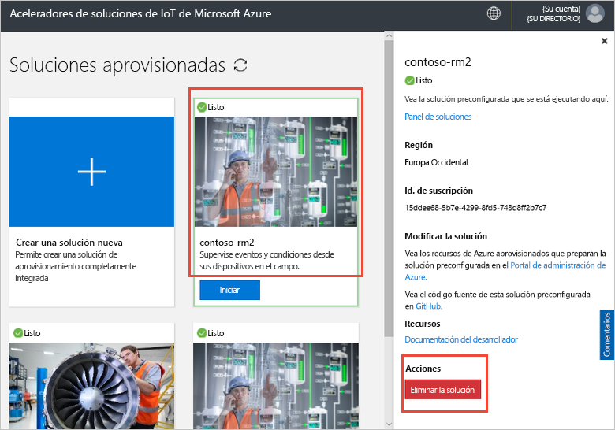

# Conexión de MXChip IoT DevKit AZ3166 al acelerador de la solución Supervisión remota de IoT

[!INCLUDE [iot-suite-selector-connecting](../../includes/iot-suite-selector-connecting.md)]

Aprenderá a ejecutar una aplicación de ejemplo en el IoT DevKit para enviar datos de sensor al acelerador de la solución.

[MXChip IoT DevKit](https://aka.ms/iot-devkit) es una placa integral compatible de Arduino con periféricos y sensores varios. Se puede desarrollar para ella con [Azure IoT Workbench](https://marketplace.visualstudio.com/items?itemName=vsciot-vscode.vscode-iot-workbench) para Visual Studio Code. Incluye un [catálogo de proyectos](https://microsoft.github.io/azure-iot-developer-kit/docs/projects/) cada vez mayor que sirve de guía para crear prototipos de soluciones de Internet de las cosas (IoT) que aprovechen los servicios de Microsoft Azure.

## Lo que necesita

Repase la [Guía de introducción](https://docs.microsoft.com/azure/iot-hub/iot-hub-arduino-iot-devkit-az3166-get-started) y **finalice las siguientes secciones**:

* Preparar el hardware
* Configuración de Wi-Fi
* Empezar a usar el DevKit
* Preparación del entorno de desarrollo

## Abra el ejemplo de supervisión remota en VS Code

1. Asegúrese de que IoT DevKit **no está conectado** al equipo. Primero, inicie VS Code y luego conecte DevKit al equipo.

2. Presione `F1` para abrir la paleta de comandos y escriba y seleccione **IoT Workbench: Examples** (IoT Workbench: Ejemplos). A continuación, seleccione **IoT DevKit** como placa.

3. Busque **Supervisión remota** y haga clic en **Open Sample** (Abrir ejemplo). Se abre una nueva ventana de VS Code con la carpeta del proyecto.
  

## Configuración de la cadena de conexión de un dispositivo IoT Hub

1. Cambie el IoT DevKit al **modo de configuración**. Para ello:
   * Mantenga presionado el botón **A**.
   * Presione y suelte el botón de **restablecimiento**.

2. La pantalla muestra el identificador de DevKit y "Configuration" (Configuración).
   
  

3. Presione `F1` para abrir la paleta de comandos y escriba y seleccione **IoT Workbench: Device > Config Device Settings** (IoT Workbench: Dispositivo > Configurar opciones de dispositivo).

4. Pegue la cadena de conexión que acaba de copiar y haga clic en `Enter` para configurarla.

## Creación y carga del código del dispositivo

1. Presione `F1` para abrir la paleta de comandos y escriba y seleccione **IoT Workbench: Device > Device Upload** (IoT Workbench: Dispositivo > Carga de dispositivo).
  

1. A continuación, VS Code comienza a compilar y cargar el código en DevKit.
  

El DevKit se reinicia y comienza a ejecutar el código.

## Prueba del proyecto

### Visualización de los datos de telemetría enviados a la solución de Supervisión remota

Cuando se ejecuta la aplicación de ejemplo, DevKit envía datos de sensor vía Wi-Fi a la solución de Supervisión remota. Para ver el resultado, siga estos pasos:

1. Vaya al panel de la solución y haga clic en **Devices** (Dispositivos).

2. Haga clic en el nombre del dispositivo, en la pestaña de la derecha, puede ver el estado del sensor de DevKit en tiempo real.
  

### Envío de un mensaje C2D

La solución de Supervisión remota permite invocar un método remoto en el dispositivo. El código de ejemplo publica tres métodos que se pueden ver en la sección **Method** (Método) cuando se selecciona el sensor.

Probemos cambiar el color de uno de los LED de DevKit con el método "LedColor".

1. Seleccione el nombre del dispositivo en la lista de dispositivos y haga clic en **Jobs** (Trabajos).

  

2. Configure los trabajos como se indica a continuación y haga clic en **Apply** (Aplicar).
  * Select Job (Seleccionar trabajo): **Run method** (Método de ejecución)
  * Method name (Nombre del método): **LedColor**
  * Job Name (Nombre del trabajo): **ChangeLedColor**
  
  

En unos segundos, el LED RGB de DevKit debería cambiar de color (debajo del botón A).

## Limpieza de recursos

Si va a pasar a los tutoriales, deje el acelerador de soluciones de supervisión remota implementado.

Si ya no necesita el acelerador de soluciones, elimínelo de la página Soluciones aprovisionadas. Para ello, selecciónelo y, a continuación, haga clic en Eliminar solución:

## Problemas y comentarios

Si tiene problemas, consulte las [preguntas frecuentes de IoT DevKit](https://microsoft.github.io/azure-iot-developer-kit/docs/faq/) o póngase en contacto con nosotros mediante los siguientes canales:

* [Gitter.im](http://gitter.im/Microsoft/azure-iot-developer-kit)
* [Stackoverflow](https://stackoverflow.com/questions/tagged/iot-devkit)

## Pasos siguientes

Ahora que ha aprendido cómo conectar un dispositivo DevKit al acelerador de la solución de supervisión remota de Azure IoT y visualizar los datos de sensor, estos son los siguientes pasos sugeridos:

* [Introducción a los aceleradores de la solución de Azure IoT](https://docs.microsoft.com/azure/iot-suite/)
* [Personalización de la interfaz de usuario](../iot-accelerators/iot-accelerators-remote-monitoring-customize.md)
* [Conexión de IoT DevKit a una aplicación de Azure IoT Central](../iot-central/howto-connect-devkit.md)