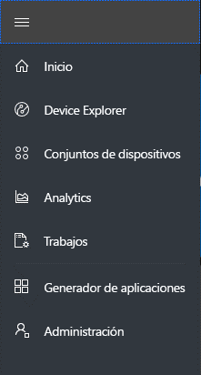
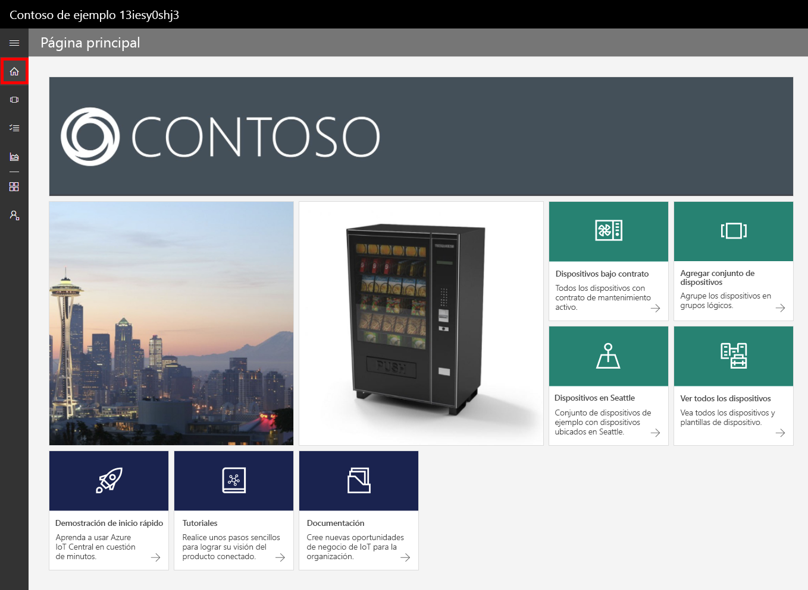
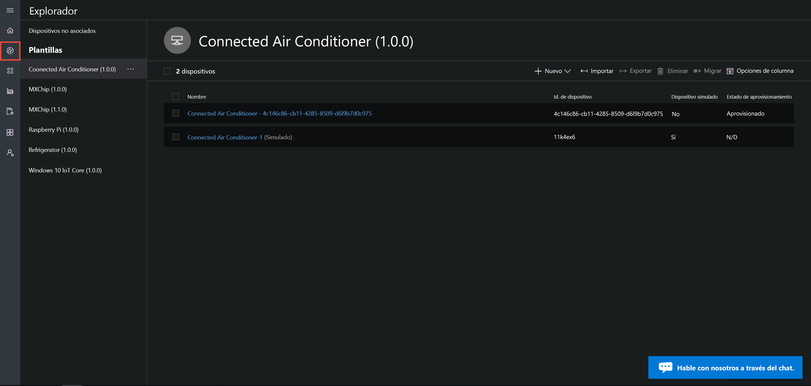
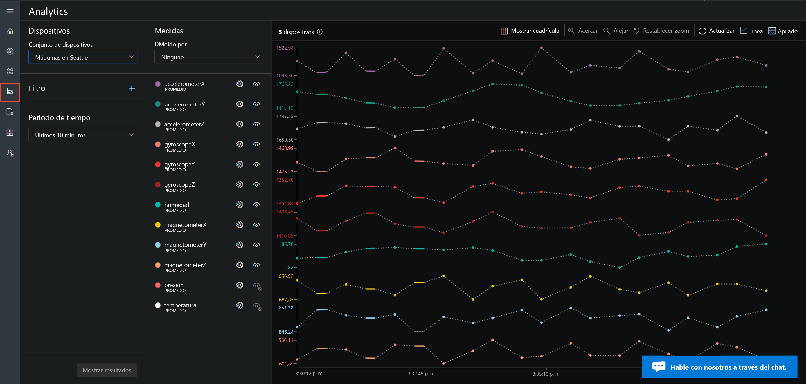

# Un paseo por la interfaz de usuario de Azure IoT Central

Este artículo presenta la interfaz de usuario de Microsoft Azure IoT Central. Puede usar la interfaz de usuario para crear, administrar y usar una solución de Azure IoT Central y sus dispositivos conectados.

Como _compilador_, usará la interfaz de usuario de Azure IoT Central para definir la solución de Azure IoT Central. Puede usar la interfaz de usuario para:

- Definir los tipos de dispositivos que se conectan a la solución.
- Configurar las reglas y las acciones para sus dispositivos.
- Personalizar la interfaz de usuario para un _operador_ que utiliza la solución.

Como _operador_, usará la interfaz de usuario de Azure IoT Central para administrar la solución de Azure IoT Central. Puede usar la interfaz de usuario para:

- Supervisar los dispositivos.
- Configurar los dispositivos.
- Solucionar los problemas y errores de los dispositivos.
- Aprovisionar dispositivos nuevos.

[!INCLUDE [iot-central-experimental-note](../../includes/iot-central-experimental-note.md)]

## Uso del menú de navegación izquierdo

Use el menú de navegación izquierdo para acceder a las diferentes áreas de la aplicación:

| Menú | DESCRIPCIÓN |
| ---- | ----------- |
|  | <ul><li>El botón **Home** (Inicio) muestra la página principal de la aplicación. Como compilador, puede personalizar esta página de inicio para los operadores.</li><li>El botón **Device Explorer** (Explorador de dispositivos) muestra tanto las plantillas de dispositivo definidas en la aplicación como los dispositivos simulados y reales asociados a cada plantilla de dispositivo. Como operador, usará **Device Explorer** (Explorador de dispositivos) para administrar los dispositivos conectados.</li><li>El botón **Device Sets** (Conjuntos de dispositivos) permite ver y crear conjuntos de dispositivos. Como operador, puede crear conjuntos de dispositivos como una colección lógica de los dispositivos especificados por una consulta.</li><li>El botón **Analytics** (Análisis) muestra los análisis derivados de los datos de telemetría de los dispositivos y conjuntos de dispositivos. Como operador, puede crear vistas personalizadas a partir de los datos de los dispositivos para obtener información detallada de la aplicación.</li><li>El botón **Trabajos** habilita la administración masiva de dispositivos al tener que crear y ejecutar trabajos para llevar a cabo actualizaciones a escala.</li><li>El botón **Application Builder** (Compilador de aplicaciones) muestra las herramientas que un compilador utiliza, como la herramienta **Create Device Template** (Crear plantilla de dispositivo).</li><li>El botón **Administration** (Administración) muestra las páginas de administración de aplicaciones donde un administrador puede administrar la configuración de la aplicación, los usuarios y los roles.</li></ul> |

## Búsqueda, ayuda y soporte técnico

El menú superior aparece en todas las páginas:

- Para buscar plantillas de dispositivos y dispositivos, elija el icono **Buscar**.
- Para obtener ayuda y soporte técnico, elija el menú desplegable **Ayuda** para obtener una lista de recursos.
- Para controlar los tutoriales, cambiar el tema de la interfaz de usuario o cerrar sesión en la aplicación, elija el icono **Account** (Cuenta).

Puede elegir entre un tema claro o un tema oscuro para la interfaz de usuario:

## Página de inicio

La página principal es la primera página que verá cuando inicie sesión en la aplicación de Azure IoT Central. Como compilador, puede agregar iconos para personalizar la página principal de otros usuarios de la aplicación. Para más información, consulte el tutorial [Customize the Azure IoT Central operator's view](tutorial-customize-operator.md) (Personalización de la vista del operador de Azure IoT Central).

## Explorador de dispositivos

La página del explorador muestra las _plantillas de dispositivo_ y los _dispositivos_ que hay en la aplicación de Azure IoT Central.

* Una plantilla de dispositivo define un tipo de dispositivo que se puede conectar a la aplicación. Para más información, consulte [Define a new device type in your Azure IoT Central application](tutorial-define-device-type.md) (Definición de un nuevo tipo de dispositivo en la aplicación de Azure IoT Central).
* Un dispositivo representa un dispositivo real o simulado en la aplicación. Para más información, consulte [Add a real device to your Azure IoT Central application](tutorial-add-device.md) (Adición de un nuevo dispositivo a la aplicación de Azure IoT Central).

## Conjuntos de dispositivos

La página _Device Sets_ (Conjuntos de dispositivos) muestra los conjuntos de dispositivos creados por el compilador. Un conjunto de dispositivos es una colección de dispositivos relacionados. Un compilador define una consulta para identificar los dispositivos que se incluyen en un conjunto de dispositivos. Los conjuntos de dispositivos se utilizan para personalizar el análisis en la aplicación. Para más información, consulte el artículo [Use device sets in your Azure IoT Central application](howto-use-device-sets.md) (Uso de conjuntos de dispositivos en la aplicación de Azure IoT Central).

## Análisis

La página de análisis muestra gráficos que le ayudarán a entender cómo se comportan los dispositivos conectados a la aplicación. Un operador usará esta página para supervisar e investigar los problemas de los dispositivos conectados. El compilador puede definir los gráficos que se muestran en esta página. Para más información, consulte el artículo [Create custom analytics for your Azure IoT Central application](howto-create-analytics.md) (Creación de análisis personalizados para la aplicación de Azure IoT Central).

## Trabajos

La página de trabajos le permite realizar operaciones de administración en los dispositivos de forma masiva. El compilador usa esta página para actualizar los comandos, la configuración y las propiedades del dispositivo. Para obtener más información, consulte el artículo [Run a job](howto-run-a-job.md) (Ejecución de un trabajo).

## Generador de aplicaciones

La página Application Builder contiene vínculos a las herramientas que un compilador utiliza para crear una aplicación de Azure IoT Central, por ejemplo, para crear plantillas de dispositivos y configurar la página principal. Para más información, consulte el tutorial [Define a new device type in your Azure IoT Central application](tutorial-define-device-type.md) (Definición de un nuevo tipo de dispositivo en la aplicación de Azure IoT Central).

## Administración

La página Administration contiene vínculos a las herramientas de administrador que se utiliza como definir usuarios y roles en la aplicación. Para más información, consulte el artículo [Administer your Azure IoT Central application](howto-administer.md) (Administración de la aplicación de Azure IoT Central).

## Pasos siguientes

Ahora que ya tiene información general sobre Azure IoT Central y está familiarizado con el diseño de la interfaz de usuario, el siguiente paso sugerido es completar la guía de inicio rápido [Create an Azure IoT Central application](quick-deploy-iot-central.md) (Creación de una aplicación de Azure IoT Central).