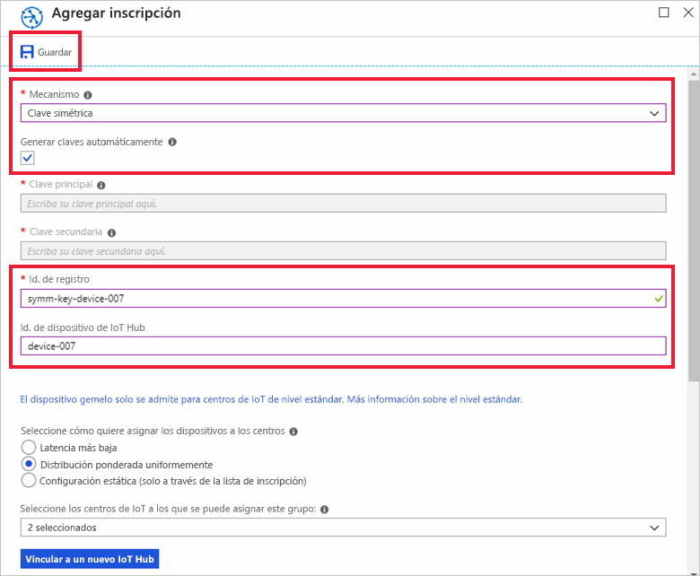
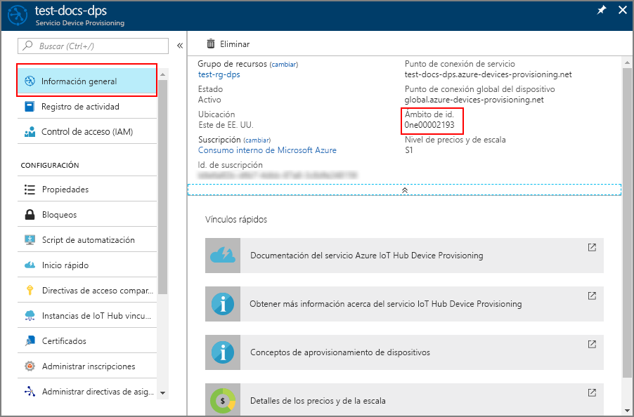

# <a name="quickstart-provision-a-simulated-device-with-symmetric-keys"></a>Guía de inicio rápido: Aprovisionamiento de un dispositivo simulado con claves simétricas

En esta guía de inicio rápido, obtendrá información sobre cómo crear y ejecutar un simulador de dispositivos en una máquina de desarrollo Windows. Configurará este dispositivo simulado para utilizar una clave simétrica a fin de autenticarse con una instancia del Device Provisioning Service y recibir la asignación a un IoT Hub. Se usará código de ejemplo del [SDK para C de Azure IoT](https://github.com/Azure/azure-iot-sdk-c) para simular una secuencia de arranque para el dispositivo que inicia el aprovisionamiento. El dispositivo se reconocerá en función de una inscripción individual en una instancia del servicio de aprovisionamiento y se asignará a un IoT Hub.

Aunque en este artículo se muestra el aprovisionamiento con una inscripción individual, puede usar los mismos procedimientos con grupos de inscripción. La única diferencia es que debe usar una clave de dispositivo derivada con un identificador de registro único para el dispositivo. Con los grupos de inscripción, no se usa directamente la clave simétrica en la inscripción. Aunque los grupos de inscripción de clave simétrica no se limitan a los dispositivos heredados, en [Cómo aprovisionar dispositivos heredados con la atestación de clave simétrica](how-to-legacy-device-symm-key.md) se proporciona un ejemplo de grupo de inscripción. Para obtener más información, consulte [Inscripciones de grupo para la atestación de clave simétrica](concepts-symmetric-key-attestation.md#group-enrollments).

Si no está familiarizado con el proceso de aprovisionamiento automático, revise los [conceptos sobre aprovisionamiento automático](concepts-auto-provisioning.md). 

Además, asegúrese de completar los pasos descritos en [Configuración del servicio Azure IoT Hub Device Provisioning con Azure Portal](./quick-setup-auto-provision.md) antes de continuar con este inicio rápido. Para seguir esta guía de inicio rápido, ya debe haber creado la instancia del Device Provisioning Service.

En este artículo está orientado a una estación de trabajo basada en Windows. No obstante, también puede realizar los procedimientos en Linux. Para obtener un ejemplo de Linux, consulte [Cómo aprovisionar para varios inquilinos](how-to-provision-multitenant.md).


[!INCLUDE [quickstarts-free-trial-note](../../includes/quickstarts-free-trial-note.md)]


## <a name="prerequisites"></a>Requisitos previos

* Visual Studio 2015 o [Visual Studio 2017](https://www.visualstudio.com/vs/) con la carga de trabajo de [desarrollo de escritorio con C++](https://www.visualstudio.com/vs/support/selecting-workloads-visual-studio-2017/) habilitada.
* Tener instalada la versión más reciente de [Git](https://git-scm.com/download/).


<a id="setupdevbox"></a>

## <a name="prepare-an-azure-iot-c-sdk-development-environment"></a>Preparación de un entorno de desarrollo del SDK de Azure IoT para C

En esta sección, preparará un entorno de desarrollo para compilar el [SDK para C de Azure IoT](https://github.com/Azure/azure-iot-sdk-c). 

El SDK incluye el código de ejemplo para un dispositivo simulado. Este dispositivo simulado tratará de aprovisionarse durante la secuencia de arranque del dispositivo.

1. Descargue la versión 3.11.4 del [sistema de compilación CMake](https://cmake.org/download/). Compruebe el archivo binario descargado mediante el valor de hash criptográfico correspondiente. En el ejemplo siguiente se usa Windows PowerShell para comprobar el hash criptográfico de la versión 3.11.4 de la distribución de MSI x64:

    ```PowerShell
    PS C:\Downloads> $hash = get-filehash .\cmake-3.11.4-win64-x64.msi
    PS C:\Downloads> $hash.Hash -eq "56e3605b8e49cd446f3487da88fcc38cb9c3e9e99a20f5d4bd63e54b7a35f869"
    True
    ```
    
    Los siguientes valores de hash para la versión 3.11.4 estaban incluidos en el sitio de CMake en el momento en que se redactó este artículo:

    ```
    6dab016a6b82082b8bcd0f4d1e53418d6372015dd983d29367b9153f1a376435  cmake-3.11.4-Linux-x86_64.tar.gz
    72b3b82b6d2c2f3a375c0d2799c01819df8669dc55694c8b8daaf6232e873725  cmake-3.11.4-win32-x86.msi
    56e3605b8e49cd446f3487da88fcc38cb9c3e9e99a20f5d4bd63e54b7a35f869  cmake-3.11.4-win64-x64.msi
    ```

    **Antes** de comenzar la instalación de `CMake`, es importante que los requisitos previos de Visual Studio (Visual Studio y la carga de trabajo de desarrollo de escritorio con C++) estén instalados en la máquina. Una vez que los requisitos previos están en su lugar, y se ha comprobado la descarga, instale el sistema de compilación de CMake.

2. Abra un símbolo del sistema o el shell de Bash de Git. Ejecute el siguiente comando para clonar el repositorio de GitHub del SDK de Azure IoT para C:
    
    ```cmd/sh
    git clone https://github.com/Azure/azure-iot-sdk-c.git --recursive
    ```
    Actualmente, el tamaño de este repositorio es de unos 220 MB. Esta operación puede tardar varios minutos en completarse.


3. Cree un subdirectorio `cmake` en el directorio raíz del repositorio de Git y vaya a esa carpeta. 

    ```cmd/sh
    cd azure-iot-sdk-c
    mkdir cmake
    cd cmake
    ```

4. Ejecute el siguiente comando para compilar una versión del SDK específica para su plataforma de cliente de desarrollo. Se generará una solución de Visual Studio para el dispositivo simulado en el directorio `cmake`. 

    ```cmd
    cmake -Dhsm_type_symm_key:BOOL=ON -Duse_prov_client:BOOL=ON  ..
    ```
    
    Si `cmake` no encuentra el compilador de C++, es posible que obtenga errores de compilación durante la ejecución del comando anterior. Si sucede, intente ejecutar este comando en el [símbolo del sistema de Visual Studio](https://docs.microsoft.com/dotnet/framework/tools/developer-command-prompt-for-vs). 

    Una vez realizada la compilación, las últimas líneas de salida tendrán un aspecto similar al siguiente:

    ```cmd/sh
    $ cmake -Dhsm_type_symm_key:BOOL=ON -Duse_prov_client:BOOL=ON  ..
    -- Building for: Visual Studio 15 2017
    -- Selecting Windows SDK version 10.0.16299.0 to target Windows 10.0.17134.
    -- The C compiler identification is MSVC 19.12.25835.0
    -- The CXX compiler identification is MSVC 19.12.25835.0

    ...

    -- Configuring done
    -- Generating done
    -- Build files have been written to: E:/IoT Testing/azure-iot-sdk-c/cmake
    ```


## <a name="create-a-device-enrollment-entry-in-the-portal"></a>Creación de una entrada de inscripción de dispositivo en el portal

1. Inicie sesión en Azure Portal, haga clic en el botón **Todos los recursos** situado en el menú izquierdo y abra el servicio Device Provisioning.

2. Seleccione la pestaña **Administrar inscripciones** y luego haga clic en el botón **Add individual enrollment** (Agregar inscripción individual) de la parte superior. 

3. En **Agregar inscripción**, escriba la información siguiente y haga clic en el botón **Guardar**.

    - **Mecanismo**: Seleccione **Clave simétrica** como el *mecanismo* de atestación de identidad.

    - **Generar claves automáticamente**: Active esta casilla.

    - **Identificador de registro**: Escriba un identificador de registro para identificar la inscripción. Use únicamente caracteres alfanuméricos en minúsculas y guiones (“-”). Por ejemplo, `symm-key-device-007`.

    - **Id. de dispositivo IoT Hub:** Escriba un identificador de dispositivo. Por ejemplo, **dispositivo-007**.

    

4. Una vez guardada la inscripción, la **clave principal** y la **clave secundaria** se generarán y se agregarán a la entrada de la inscripción. La inscripción del dispositivo con clave simétrica se muestra como **symm-key-device-007** en la columna *Identificador de registro* de la pestaña *Inscripciones individuales*. 

    Abra la inscripción y copie el valor de su **clave principal** generada.


<a id="firstbootsequence"></a>

## <a name="simulate-first-boot-sequence-for-the-device"></a>Simulación de la primera secuencia de arranque para el dispositivo

En esta sección, actualizará el código de ejemplo para enviar la secuencia de arranque del dispositivo a la instancia del servicio Device Provisioning. Esta secuencia de arranque hará que el dispositivo se reconozca y se asigne a un centro de IoT vinculado a la instancia del servicio Device Provisioning.


1. En Azure Portal, seleccione la pestaña **Información general** para su servicio Device Provisioning y anote el valor de **_Ámbito de id_**.

     

2. En Visual Studio, abra el archivo de solución **azure_iot_sdks.sln** que se ha generado al ejecutar CMake. El archivo de solución debe estar en la siguiente ubicación:

    ```
    \azure-iot-sdk-c\cmake\azure_iot_sdks.sln
    ```

3. En la ventana del *Explorador de soluciones* de Visual Studio, desplácese hasta la carpeta **Aprovisionar\_Ejemplos**. Expanda el proyecto de ejemplo denominado **prov\_dev\_client\_sample**. Expanda **Archivos de código fuente** y abra **prov\_dev\_cliente\_sample.c**.

4. Busque la constante `id_scope` y reemplace el valor por el valor de **Ámbito de id.** que copió anteriormente. 

    ```c
    static const char* id_scope = "0ne00002193";
    ```

5. Busque la definición de la función `main()` en el mismo archivo. Asegúrese de que la variable `hsm_type` está establecida en `SECURE_DEVICE_TYPE_SYMMETRIC_KEY`, tal como se muestra a continuación:

    ```c
    SECURE_DEVICE_TYPE hsm_type;
    //hsm_type = SECURE_DEVICE_TYPE_TPM;
    //hsm_type = SECURE_DEVICE_TYPE_X509;
    hsm_type = SECURE_DEVICE_TYPE_SYMMETRIC_KEY;
    ```

6. Encuentre la llamada a `prov_dev_set_symmetric_key_info()` en **prov\_dev\_client\_sample.c** que se marcó como comentario.

    ```c
    // Set the symmetric key if using they auth type
    //prov_dev_set_symmetric_key_info("<symm_registration_id>", "<symmetric_Key>");
    ```

    Quite la marca de comentario de la llamada de función y reemplace los valores de marcador de posición (incluidos los corchetes angulares) con el identificador de registro y los valores de clave principal.

    ```c
    // Set the symmetric key if using they auth type
    prov_dev_set_symmetric_key_info("symm-key-device-007", "your primary key here");
    ```
   
    Guarde el archivo.

7. Haga clic con el botón derecho en el proyecto **prov\_dev\_client\_sample** y seleccione **Set as Startup Project** (Establecer como proyecto de inicio). 

8. En el menú de Visual Studio, seleccione **Depurar** > **Iniciar sin depurar** para ejecutar la solución. En la solicitud para volver a compilar el proyecto, haga clic en **Sí** para recompilar el proyecto antes de ejecutarlo.

    La salida siguiente es un ejemplo de arranque correcto del dispositivo simulado y su conexión a la instancia del servicio de aprovisionamiento para que se asigne a un IoT Hub:

    ```cmd
    Provisioning API Version: 1.2.8

    Registering Device

    Provisioning Status: PROV_DEVICE_REG_STATUS_CONNECTED
    Provisioning Status: PROV_DEVICE_REG_STATUS_ASSIGNING
    Provisioning Status: PROV_DEVICE_REG_STATUS_ASSIGNING

    Registration Information received from service: 
    test-docs-hub.azure-devices.net, deviceId: device-007    
    Press enter key to exit:
    ```

9. En el portal, vaya al centro de IoT al que se ha asignado el dispositivo simulado y haga clic en la pestaña **Dispositivos IoT**. Si el dispositivo simulado se aprovisiona correctamente en el centro, su identificador de dispositivo aparecerá en la hoja **Dispositivos de IoT** con el *ESTADO* **habilitado**. Puede que tenga que hacer clic en el botón **Actualizar** en la parte superior. 

     


## <a name="clean-up-resources"></a>Limpieza de recursos

Si piensa seguir trabajando con el ejemplo de cliente de dispositivo y explorándolo, no limpie los recursos que se crean en esta guía de inicio rápido. Si no va a continuar, use el siguiente comando para eliminar todos los recursos creados.

1. Cierre la ventana de salida de ejemplo del cliente del dispositivo en su máquina.
1. Desde el menú de la izquierda en Azure Portal, haga clic en **Todos los recursos** y seleccione el servicio Device Provisioning. Abra la hoja **Administrar inscripciones** de su servicio y, a continuación, haga clic en la pestaña **Inscripciones individuales**. Seleccione el *ID. DE REGISTRO* del dispositivo que inscribió en esta guía de inicio rápido y haga clic en el botón **Eliminar** situado en la parte superior. 
1. Desde el menú de la izquierda en Azure Portal, haga clic en **Todos los recursos** y seleccione su centro de IoT. Abra la hoja **Dispositivos IoT** de su centro, seleccione el *ID. DE DISPOSITIVO* del dispositivo que registró en este inicio rápido y, luego, haga clic en el botón **Eliminar** situado en la parte superior.

## <a name="next-steps"></a>Pasos siguientes

En esta guía de inicio rápido, ha creado un dispositivo simulado en su máquina Windows y lo ha aprovisionado con IoT Hub mediante una clave simétrica con el Azure IoT Hub Device Provisioning Service en el portal. Para obtener información sobre cómo inscribir el dispositivo mediante programación, siga la guía de inicio rápido para la inscripción de dispositivos X.509 mediante programación. 

> [!div class="nextstepaction"]
> [Guía de inicio rápido de Azure: Inscripción de dispositivos X.509 al servicio Azure IoT Hub Device Provisioning](quick-enroll-device-x509-java.md)
