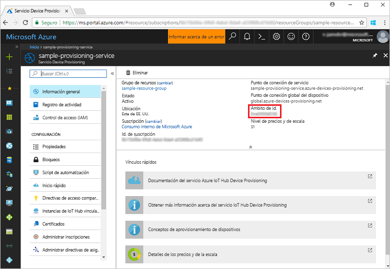
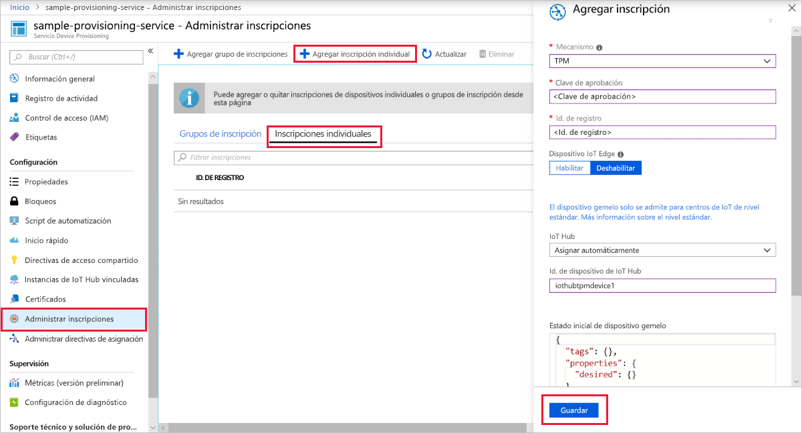
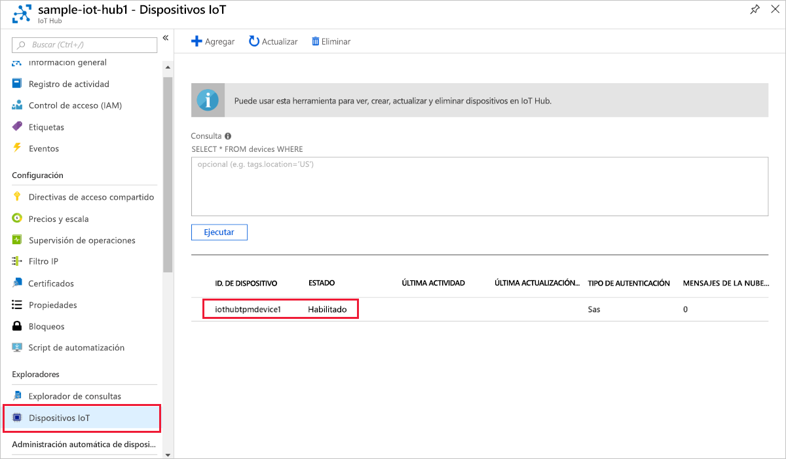

# <a name="create-and-provision-a-simulated-tpm-device-using-c-device-sdk-for-iot-hub-device-provisioning-service"></a>Creación y aprovisionamiento de un dispositivo de TPM simulado mediante el SDK de dispositivos C# para el servicio Azure IoT Hub Device Provisioning

[!INCLUDE [iot-dps-selector-quick-create-simulated-device-tpm](../../includes/iot-dps-selector-quick-create-simulated-device-tpm.md)]

Estos pasos muestra cómo usar los [ejemplos de Azure IoT para C#](https://github.com/Azure-Samples/azure-iot-samples-csharp) para simular un dispositivo de TPM en un equipo de desarrollo con el sistema operativo Windows. El ejemplo también conecta el dispositivo simulado a una instancia de IoT Hub mediante el servicio Device Provisioning. 

El código de ejemplo utiliza el simulador de TPM de Windows como [módulo de seguridad de hardware (HSM)](https://azure.microsoft.com/blog/azure-iot-supports-new-security-hardware-to-strengthen-iot-security/) del dispositivo. 

Si no está familiarizado con el proceso de aprovisionamiento automático, no olvide revisar los [Conceptos sobre aprovisionamiento automático](concepts-auto-provisioning.md). Asegúrese de completar los pasos descritos en [Configuración del servicio Azure IoT Hub Device Provisioning con Azure Portal](./quick-setup-auto-provision.md) antes de continuar. 

Azure IoT Hub Device Provisioning Service admite dos tipos de inscripciones:
- [Grupos de inscripción](concepts-service.md#enrollment-group): usados para inscribir varios dispositivos relacionados.
- [Inscripciones individuales](concepts-service.md#individual-enrollment): usadas para inscribir un solo dispositivo.

En este artículo se mostrarán las inscripciones individuales.

[!INCLUDE [IoT Device Provisioning Service basic](../../includes/iot-dps-basic.md)]

<a id="setupdevbox"></a>
## <a name="prepare-the-development-environment"></a>Preparación del entorno de desarrollo 

1. Asegúrese de que tiene el [SDK de .Net Core 2.1 o posterior](https://www.microsoft.com/net/download/windows) instalado en la máquina. 

1. Asegúrese de que `git` está instalado en su máquina y se agrega a las variables de entorno accesibles para la ventana de comandos. Consulte las [herramientas de cliente de Git de Software Freedom Conservancy](https://git-scm.com/download/) para instalar la versión más reciente de las herramientas `git`, lo que incluye **Git Bash**, la aplicación de línea de comandos que puede usar para interactuar con su repositorio de Git local. 

1. Abra un símbolo del sistema o Git Bash. Clone el repositorio de GitHub de los ejemplos de Azure IoT para C#:
    
    ```cmd
    git clone https://github.com/Azure-Samples/azure-iot-samples-csharp.git
    ```

## <a name="provision-the-simulated-device"></a>Aprovisionamiento del dispositivo simulado


1. Inicie sesión en el Portal de Azure. Haga clic en el botón **Todos los recursos** situado en el menú izquierdo y abra el servicio Device Provisioning. Desde la hoja **Información general**, anote el valor de **_Identificador de ámbito_**.

     


2. En un símbolo del sistema, cambie los directorios al directorio del proyecto del ejemplo de aprovisionamiento de dispositivo de TPM.

    ```cmd
    cd .\azure-iot-samples-csharp\provisioning\Samples\device\TpmSample
    ```

2. Escriba el siguiente comando para compilar y ejecutar el ejemplo de aprovisionamiento de dispositivo de TPM. Reemplace el valor de `<IDScope>` por el ámbito de id. de su servicio de aprovisionamiento. 

    ```cmd
    dotnet run <IDScope>
    ```

    Este comando iniciará el simulador de chip de TPM en un símbolo del sistema independiente.  

1. La ventana de comandos muestra la **_clave de aprobación_**, el **_id. de registro_** y un **_id. de dispositivo_** sugerido necesarios para la inscripción del dispositivo. Anote estos valores. Usará estos valores para crear una inscripción individual en la instancia del servicio Device Provisioning. 
   > [!NOTE]
   > No confunda la ventana que contiene la salida del comando con la ventana que contiene la salida desde el simulador de TPM. Es posible que tenga que hacer clic en la ventana de comandos para pasarla al primer plano.

     

4. En Azure Portal, en la hoja de resumen del servicio Device Provisioning, seleccione **Administrar inscripciones**. Seleccione la pestaña **Inscripciones individuales** y haga clic en el botón **Agregar inscripción individual** de la parte superior. 

5. En **Agregar inscripción**, escriba la siguiente información:
    - Seleccione **TPM** como *Mecanismo* de atestación de identidad.
    - Escriba los valores de *Id. de registro* y *Clave de aprobación* del dispositivo de TPM que anotó anteriormente.
    - De manera opcional, seleccione una instancia de IoT Hub vinculada con el servicio de aprovisionamiento.
    - Escriba un identificador de dispositivo único. Puede especificar el id. de dispositivo que se sugiere en la salida de ejemplo o escribir uno propio. Si usa uno propio, asegúrese de evitar datos confidenciales al asignar un nombre al dispositivo. 
    - Si lo desea, actualice la información para **Estado inicial del dispositivo gemelo** con la configuración inicial deseada para el dispositivo.
    - Una vez completado, haga clic en el botón **Guardar**. 

      

   Al inscribir el dispositivo correctamente, el *id. del registro* del dispositivo aparecerá en la lista de la pestaña *Individual Enrollments* (Inscripciones individuales). 

6. Presione Entrar en la ventana de comandos (que muestra la **_clave de aprobación_**, el **_identificador de registro_** y un **_identificador de dispositivo_**) para la inscripción del dispositivo simulado. Tenga en cuenta los mensajes que simulan el arranque del dispositivo y la conexión al servicio Device Provisioning para obtener la información del centro de IoT. 

1. Compruebe que el dispositivo se haya aprovisionado. Si se aprovisiona correctamente el dispositivo simulado para la instancia de IoT Hub vinculada con el servicio de aprovisionamiento, el id. de dispositivo se muestra en la hoja **IoT Devices** (Dispositivos IoT) del centro. 

     

    Si ha cambiado el valor predeterminado de *Estado inicial del dispositivo gemelo* en la entrada de inscripción para el dispositivo, el dispositivo puede extraer el estado gemelo deseado desde el centro y actuar en consecuencia. Para más información, consulte [Información y uso de dispositivos gemelos en IoT Hub](../iot-hub/iot-hub-devguide-device-twins.md)


## <a name="clean-up-resources"></a>Limpieza de recursos

Si piensa seguir trabajando con el ejemplo de cliente de dispositivo y explorándolo, no limpie los recursos que se crean en esta guía de inicio rápido. Si no va a continuar, use el siguiente comando para eliminar todos los recursos creados.

1. Cierre la ventana de salida de ejemplo del cliente del dispositivo en su máquina.
1. Cierre la ventana del simulador de TPM en su máquina.
1. Desde el menú de la izquierda en Azure Portal, haga clic en **Todos los recursos** y seleccione el servicio Device Provisioning. En la parte superior de la hoja **Todos los recursos**, haga clic en **Eliminar**.  
1. Desde el menú de la izquierda en Azure Portal, haga clic en **Todos los recursos** y seleccione su centro de IoT. En la parte superior de la hoja **Todos los recursos**, haga clic en **Eliminar**.  

## <a name="next-steps"></a>Pasos siguientes

En este tutorial, ha creado un dispositivo de TPM simulado en su máquina y lo ha aprovisionado con IoT Hub mediante el servicio Azure IoT Hub Device Provisioning. Para obtener información sobre cómo inscribir el dispositivo de TPM mediante programación, siga la guía de inicio rápido para la inscripción de un dispositivo de TPM mediante programación. 

> [!div class="nextstepaction"]
> [Guía de inicio rápido de Azure: Inscripción de dispositivos de TPM al Servicio Azure IoT Hub Device Provisioning](quick-enroll-device-tpm-csharp.md)
