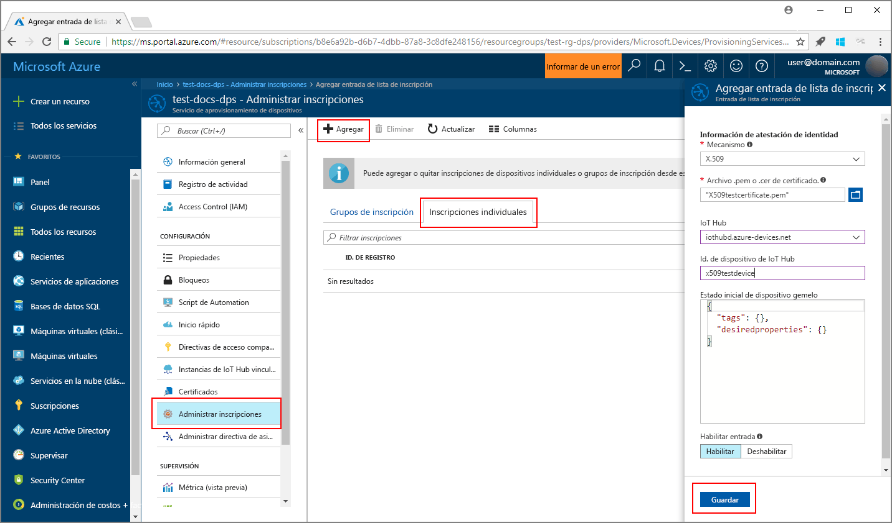
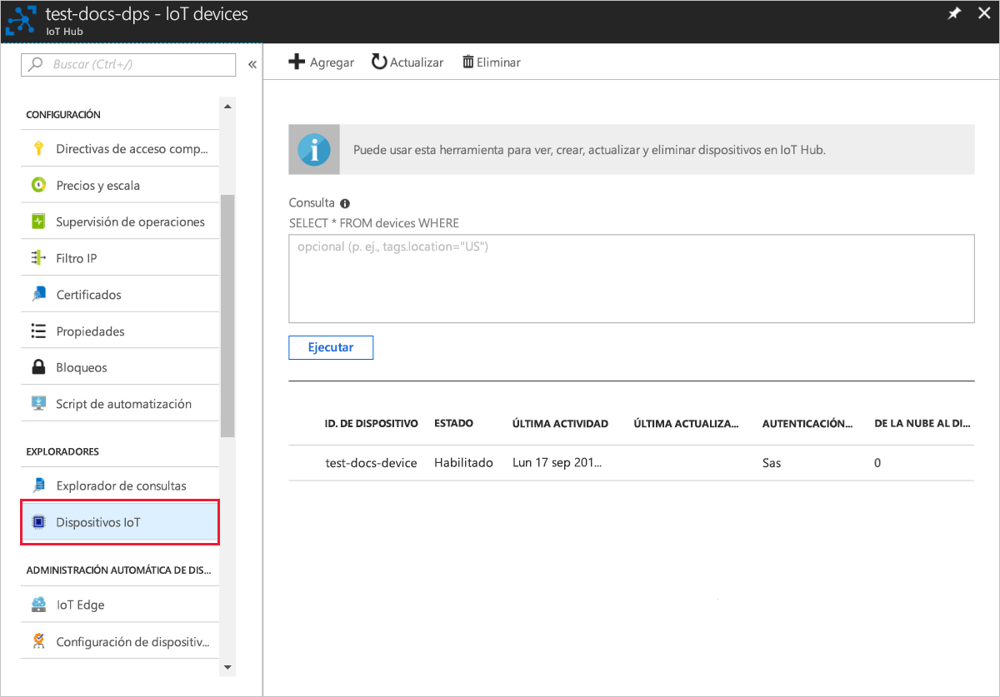

# <a name="create-and-provision-an-x509-simulated-device-using-c-device-sdk-for-iot-hub-device-provisioning-service"></a>Creación y aprovisionamiento de un dispositivo X.509 simulado mediante el SDK de dispositivos C para el servicio IoT Hub Device Provisioning
[!INCLUDE [iot-dps-selector-quick-create-simulated-device-x509](../../includes/iot-dps-selector-quick-create-simulated-device-x509.md)]

Estos pasos muestran cómo simular un dispositivo X.509 en la máquina de desarrollo en la que se ejecuta el sistema operativo Windows, y usar un ejemplo de código para conectar este dispositivo simulado con el servicio Device Provisioning y IoT Hub. 

Asegúrese de completar los pasos descritos en [Configuración de un servicio Azure IoT Hub Device Provisioning con Azure Portal](./quick-setup-auto-provision.md) antes de continuar.

[!INCLUDE [IoT DPS basic](../../includes/iot-dps-basic.md)]

<a id="setupdevbox"></a>

## <a name="prepare-the-development-environment"></a>Preparación del entorno de desarrollo 

1. Asegúrese de tener instalados Visual Studio 2015 o [Visual Studio 2017 ](https://www.visualstudio.com/vs/) en la máquina. Debe tener la carga de trabajo ["Desarrollo para el escritorio con C++"](https://www.visualstudio.com/vs/support/selecting-workloads-visual-studio-2017/) habilitada para la instalación de Visual Studio.

2. Descargue e instale el [sistema de compilación CMake](https://cmake.org/download/). Es importante que el entorno de Visual Studio con la carga de trabajo "Desarrollo para el escritorio con C++" esté instalado en su máquina **antes de** la instalación de `cmake`. 

3. Asegúrese de que `git` está instalado en su máquina y se agrega a las variables de entorno accesibles para la ventana de comandos. Consulte las [herramientas de cliente de Git de Software Freedom Conservancy](https://git-scm.com/download/) para instalar la versión más reciente de las herramientas `git`, lo que incluye **Git Bash**, la aplicación de línea de comandos que puede usar para interactuar con su repositorio de Git local. 

4. Abra un símbolo del sistema o Git Bash. Clone el repositorio GitHub para el ejemplo de código de simulación de dispositivo:
    
    ```cmd
    git clone https://github.com/Azure/azure-iot-sdk-c.git --recursive
    ```

5. Cree una carpeta en su copia local de este repositorio GitHub para el proceso de compilación de CMake. 

    ```cmd
    cd azure-iot-sdk-c
    mkdir cmake
    cd cmake
    ```

6. Ejecute el siguiente comando para crear la solución de Visual Studio para el cliente de aprovisionamiento.

    ```cmd
    cmake -Duse_prov_client:BOOL=ON ..
    ```
    
    Si `cmake` no encuentra el compilador de C++, es posible que obtenga errores de compilación durante la ejecución del comando anterior. Si sucede, intente ejecutar este comando en el [símbolo del sistema de Visual Studio](https://docs.microsoft.com/dotnet/framework/tools/developer-command-prompt-for-vs). 


<a id="portalenroll"></a>

## <a name="create-a-device-enrollment-entry-in-the-device-provisioning-service"></a>Creación de una entrada de inscripción de dispositivos en el servicio Device Provisioning

1. Abra la solución generada en la carpeta *cmake* denominada `azure_iot_sdks.sln` y compílela en Visual Studio.

2. Haga clic con el botón derecho en el proyecto **dice\_device\_enrollment** en la carpeta **Provision\_Tools** y seleccione **Establecer como proyecto de inicio**. Ejecute la solución. En la ventana de salida, escriba **i** para la inscripción individual cuando se le solicite. La ventana de salida muestra un certificado X.509 generado localmente para el dispositivo simulado. Copie en el portapapeles la salida desde *---BEGIN CERTIFICATE---* hasta *-----END CERTIFICATE-----* y asegúrese de incluir ambas líneas. Tenga en cuenta que solo necesita el primer certificado de la ventana de salida.
 
3. Cree un archivo denominado **_X509testcert.pem_** en su máquina Windows, ábralo en el editor que desee y copie el contenido del portapapeles en este archivo. Guarde el archivo. 

4. Inicie sesión en Azure Portal, haga clic en el botón **Todos los recursos** situado en el menú izquierdo y abra el servicio de aprovisionamiento.

4. Abra la hoja **Administrar inscripciones** del servicio. Seleccione la pestaña **Inscripciones individuales** y haga clic en el botón **Agregar** de la parte superior. 

5. En **Agregar entrada de la lista de inscripción**, escriba la siguiente información:
    - Seleccione **X.509** como *Mecanismo* de atestación de identidad.
    - En el *archivo de certificado .pem o .cer*, seleccione el archivo de certificado **_X509testcert.pem_** creado en los pasos anteriores con el widget *Explorador de archivos*.
    - De forma opcional, puede proporcionar la siguiente información:
        - Seleccione un centro de IoT vinculado con el servicio de aprovisionamiento.
        - Escriba un identificador de dispositivo único. Asegúrese de evitar datos confidenciales al asignar nombre al dispositivo. 
        - Actualice el **Estado inicial del dispositivo gemelo** con la configuración inicial deseada para el dispositivo.
    - Una vez completado, haga clic en el botón **Guardar**. 

      

   Al inscribir el dispositivo correctamente, el dispositivo X.509 aparece como **riot-device-cert** en la columna *Id. de registro* de la pestaña *Individual Enrollments* (Inscripciones individuales). 


<a id="firstbootsequence"></a>

## <a name="simulate-first-boot-sequence-for-the-device"></a>Simulación de la primera secuencia de arranque para el dispositivo

1. En Azure Portal, seleccione la hoja **Información general** para su servicio Device Provisioning y anote los valores del **_Ámbito de id_**.

     

2. En Visual Studio en su equipo, navegue hasta el proyecto de ejemplo denominado **prov\_dev\_client\_sample** en la carpeta **Provision\_Samples** y abra el archivo **prov\_dev\_client\_sample.c**.

3. Asigne el valor _Ámbito de id._ a la variable `id_scope`. 

    ```c
    static const char* id_scope = "[ID Scope]";
    ```

4. En la función **main()** del mismo archivo, asegúrese de que **SECURE_DEVICE_TYPE** esté establecido en X.509.

    ```c
    SECURE_DEVICE_TYPE hsm_type;
    hsm_type = SECURE_DEVICE_TYPE_X509;
    ```

   Elimine o convierta en comentario la instrucción `hsm_type = SECURE_DEVICE_TYPE_TPM;`, si existe. 

5. Haga clic con el botón derecho en el proyecto **prov\_dev\_client\_sample** y seleccione **Set as Startup Project** (Establecer como proyecto de inicio). Ejecute el ejemplo. Tenga en cuenta los mensajes que simulan el arranque del dispositivo y la conexión al servicio Device Provisioning para obtener la información del centro de IoT. Busque el mensaje que indica que el registro se efectuó correctamente con el hub: *Registration Information received from service: yourhuburl!* (Información del registro recibida desde el servicio: yourhuburl!). Cierre la ventana cuando se le solicite.

6. En el portal, navegue hasta el centro de IoT Hub vinculado a su servicio de aprovisionamiento y abra la hoja **IoT Devices** (Dispositivos IoT). Si el dispositivo X.509 simulado se aprovisiona correctamente con el centro, su identificador de dispositivo aparecerá en la hoja **IoT Devices** (Dispositivos IoT) con el *ESTADO* **habilitado**. Tenga en cuenta que debe hacer clic en el botón **Actualizar** situado en la parte superior si ya ha abierto la hoja antes de ejecutar la aplicación de ejemplo del dispositivo. 

     

    Si ha cambiado el valor predeterminado de *Estado inicial del dispositivo gemelo* en la entrada de inscripción para el dispositivo, el dispositivo puede extraer el estado gemelo deseado desde el centro y actuar en consecuencia. Para más información, consulte [Información y uso de dispositivos gemelos en IoT Hub](../iot-hub/iot-hub-devguide-device-twins.md).


> [!IMPORTANT]
> También puede hacer una *inscripción de grupo* de los dispositivos X.509. Para ello, realice las siguientes modificaciones en los pasos de esta guía de inicio rápido:
>    1. Para configurar la máquina Windows para que use la biblioteca **OpenSSL** en lugar del valor **SChannel** predeterminado, siga la sección de **WebSockets** en la guía [Set up a Windows development environment](https://github.com/Azure/azure-iot-sdk-c/blob/master/doc/devbox_setup.md#windows) (Configurar un entorno de desarrollo de Windows). Tenga en cuenta que las máquinas Linux usan OpenSSL de forma predeterminada. 
>    2. En el paso 2 de la sección [Creación de una entrada de inscripción de dispositivos en el servicio Device Provisioning](#portalenroll) anterior, escriba **g** en la inscripción del grupo.
>    3. En los pasos 4 y 5 de la [misma sección](#portalenroll), seleccione **Grupos de inscripción** y escriba la información necesaria para la entrada del grupo.  
>

## <a name="clean-up-resources"></a>Limpieza de recursos

Si piensa seguir trabajando con el ejemplo de cliente de dispositivo y explorándolo, no limpie los recursos que se crean en esta guía de inicio rápido. Si no va a continuar, use el siguiente comando para eliminar todos los recursos creados.

1. Cierre la ventana de salida de ejemplo del cliente del dispositivo en su máquina.
1. Desde el menú de la izquierda en Azure Portal, haga clic en **Todos los recursos** y seleccione el servicio Device Provisioning. Abra la hoja **Administrar inscripciones** de su servicio y, a continuación, haga clic en la pestaña **Inscripciones individuales**. Seleccione el *ID. DE REGISTRO* del dispositivo que inscribió en esta guía de inicio rápido y haga clic en el botón **Eliminar** situado en la parte superior. 
1. Desde el menú de la izquierda en Azure Portal, haga clic en **Todos los recursos** y seleccione su centro de IoT. Abra la hoja **IoT Devices** (Dispositivos IoT) de su centro, seleccione el *ID. DE DISPOSITIVO* del dispositivo que registró en esta guía de inicio rápido y, a continuación, haga clic en el botón **Eliminar** situado en la parte superior.

## <a name="next-steps"></a>Pasos siguientes

En esta guía de inicio rápido, creó un dispositivo simulado X.509 en su máquina Windows y lo aprovisionó con IoT Hub mediante el servicio Azure IoT Hub Device Provisioning en el portal. Para obtener información sobre cómo inscribir el dispositivo X.509 mediante programación, siga la guía de inicio rápido para la inscripción de dispositivos X.509 mediante programación. 

> [!div class="nextstepaction"]
> [Guía de inicio rápido de Azure: Inscripción de dispositivos X.509 al servicio Azure IoT Hub Device Provisioning](quick-enroll-device-x509-java.md)
