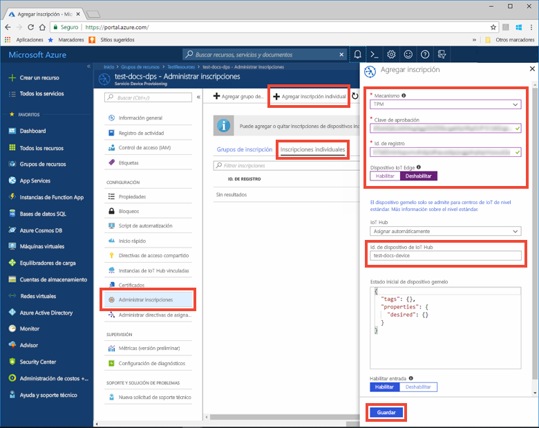
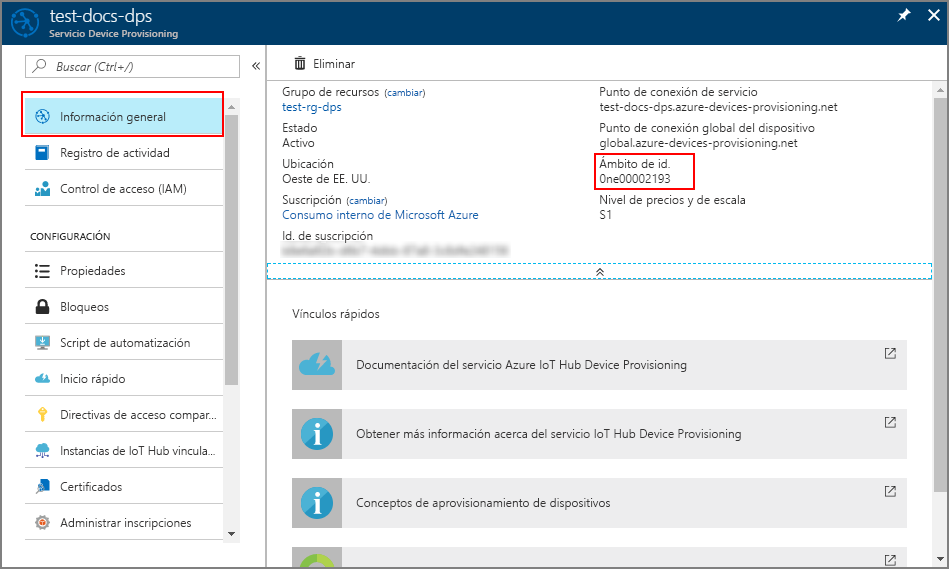

# <a name="create-and-provision-a-simulated-device-using-iot-hub-device-provisioning-service-preview"></a>Creación y aprovisionamiento de un dispositivo simulado con el servicio Azure IoT Hub Device Provisioning (versión preliminar)

Estos pasos muestran cómo crear un dispositivo simulado en la máquina de desarrollo en la que se ejecuta el sistema operativo Windows, ejecutar el simulador de Windows TPM como el [módulo de seguridad de Hardware (HSM)](https://azure.microsoft.com/blog/azure-iot-supports-new-security-hardware-to-strengthen-iot-security/) del dispositivo y usar el ejemplo de código para conectar este dispositivo simulado con el servicio Device Provisioning y un centro de IoT. 

Asegúrese de completar los pasos descritos en [Configuración de un servicio Azure IoT Hub Device Provisioning con Azure Portal](./quick-setup-auto-provision.md) antes de continuar.

<a id="setupdevbox"></a>
## <a name="prepare-the-development-environment"></a>Preparación del entorno de desarrollo 

1. Asegúrese de tener instalados Visual Studio 2015 o [Visual Studio 2017 ](https://www.visualstudio.com/vs/) en la máquina. 

2. Descargue e instale el [sistema de compilación CMake](https://cmake.org/download/).

3. Asegúrese de que `git` está instalado en su máquina y se agrega a las variables de entorno accesibles para la ventana de comandos. Consulte las [herramientas de cliente de Git de Software Freedom Conservancy](https://git-scm.com/download/) para instalar la versión más reciente de las herramientas `git`, lo que incluye **Git Bash**, la aplicación de línea de comandos que puede usar para interactuar con su repositorio de Git local. 

4. Abra un símbolo del sistema o Git Bash. Clone el repositorio GitHub para el ejemplo de código de simulación de dispositivo:
    
    ```cmd/sh
    git clone https://github.com/Azure/azure-iot-sdk-c.git --recursive
    ```

5. Cree una carpeta en su copia local de este repositorio GitHub para el proceso de compilación de CMake. 

    ```cmd/sh
    cd azure-iot-sdk-c
    mkdir cmake
    cd cmake
    ```

6. El ejemplo de código utiliza un simulador de Windows TPM. Ejecute el siguiente comando para habilitar la autenticación de token SAS. También genera una solución de Visual Studio para el dispositivo simulado.

    ```cmd/sh
    cmake -Ddps_auth_type=tpm_simulator ..
    ```

7. En un símbolo del sistema independiente, vaya a la carpeta raíz de GitHub y ejecute el simulador de [TPM](https://docs.microsoft.com/windows/device-security/tpm/trusted-platform-module-overview). Atiende en un socket en los puertos 2321 y 2322. No cierre esta ventana de comandos; debe mantener este simulador ejecutándose hasta el final de esta guía de inicio rápido. 

    ```cmd/sh
    .\azure-iot-sdk-c\dps_client\deps\utpm\tools\tpm_simulator\Simulator.exe
    ```

## <a name="create-a-device-enrollment-entry-in-the-device-provisioning-service"></a>Creación de una entrada de inscripción de dispositivos en el servicio Device Provisioning

1. Abra la solución generada en la carpeta *cmake* denominada `azure_iot_sdks.sln` y compílela en Visual Studio.

2. Haga clic con el botón derecho en el proyecto **tpm_device_provision** y seleccione **Establecer como proyecto de inicio**. Ejecute la solución. La ventana de salida muestra la ** _clave de aprobación_ ** y el ** _id. de registro_ ** necesarios para la inscripción del dispositivo. Anote estos valores. 

3. Inicie sesión en Azure Portal, haga clic en el botón **Todos los recursos** situado en el menú izquierdo y abra el servicio Device Provisioning.

4. En la hoja de resumen del servicio Device Provisioning, seleccione **Manage enrollments** (Administrar inscripciones). Seleccione la pestaña **Individual Enrollments** (Inscripciones individuales) y haga clic en el botón **Add** (Agregar) de la parte superior. 

5. En **Agregar entrada de la lista de inscripción**, escriba la siguiente información:
    - Seleccione **TPM** como *Mecanismo* de atestación de identidad.
    - Escriba el *Identificador de registro* y la *Clave de aprobación* del dispositivo TPM. 
    - Seleccione un centro de IoT vinculado con el servicio de aprovisionamiento.
    - Escriba un identificador de dispositivo único. Asegúrese de evitar datos confidenciales al asignar nombre al dispositivo.
    - Actualice el **Estado inicial del dispositivo gemelo** con la configuración inicial deseada para el dispositivo.
    - Una vez completado, haga clic en el botón **Guardar**. 

      

   Al inscribir el dispositivo correctamente, el *id. del registro* del dispositivo aparecerá en la lista de la pestaña *Individual Enrollments* (Inscripciones individuales). 


<a id="firstbootsequence"></a>
## <a name="simulate-first-boot-sequence-for-the-device"></a>Simulación de la primera secuencia de arranque para el dispositivo

1. En Azure Portal, seleccione la hoja **Información general** para su servicio Device Provisioning y anote los valores del ** _punto de conexión de dispositivo global_ ** y del ** _ámbito de identificador_ **.

     

2. En Visual Studio en su máquina, seleccione el proyecto de ejemplo denominado **dps_client_sample** y abra el archivo **dps_client_sample.c**.

3. Asigne el valor _Ámbito de id._ a la variable `dps_scope_id`. Tenga en cuenta que la variable `dps_uri` tiene el mismo valor que el _punto de conexión de dispositivo global_. 

    ```c
    static const char* dps_uri = "global.azure-devices-provisioning.net";
    static const char* dps_scope_id = "[DPS Id Scope]";
    ```

4. Haga clic con el botón derecho en el proyecto **dps_client_sample** y seleccione **Establecer como proyecto de inicio**. Ejecute el ejemplo. Tenga en cuenta los mensajes que simulan el arranque del dispositivo y la conexión al servicio Device Provisioning para obtener la información del centro de IoT. Si se aprovisiona correctamente el dispositivo simulado para el centro de IoT vinculado con el servicio de aprovisionamiento, el identificador de dispositivo aparece en la hoja **Device Explorer** del centro. 

     

    Si ha cambiado el valor predeterminado de *Estado inicial del dispositivo gemelo* en la entrada de inscripción para el dispositivo, el dispositivo puede extraer el estado gemelo deseado desde el centro y actuar en consecuencia. Para más información, consulte [Información y uso de dispositivos gemelos en IoT Hub](../iot-hub/iot-hub-devguide-device-twins.md)


## <a name="clean-up-resources"></a>Limpieza de recursos

Si piensa seguir trabajando con el ejemplo de cliente de dispositivo y explorándolo, no limpie los recursos que se crean en esta guía de inicio rápido. Si no va a continuar, use el siguiente comando para eliminar todos los recursos creados.

1. Cierre la ventana de salida de ejemplo del cliente del dispositivo en su máquina.
1. Cierre la ventana del simulador de TPM en su máquina.
1. Desde el menú de la izquierda en Azure Portal, haga clic en **Todos los recursos** y seleccione el servicio Device Provisioning. En la parte superior de la hoja **Todos los recursos**, haga clic en **Eliminar**.  
1. Desde el menú de la izquierda en Azure Portal, haga clic en **Todos los recursos** y seleccione su centro de IoT. En la parte superior de la hoja **Todos los recursos**, haga clic en **Eliminar**.  

## <a name="next-steps"></a>Pasos siguientes

En este tutorial, ha creado un dispositivo simulado de TPM en su máquina y lo ha aprovisionado con el centro de IoT mediante el servicio Azure IoT Hub Device Provisioning. Para más información acerca del aprovisionamiento de dispositivos, continúe con el tutorial para instalar el servicio Device Provisioning en Azure Portal. 

> [!div class="nextstepaction"]
> [Tutoriales del servicio Azure IoT Hub Device Provisioning](./tutorial-set-up-cloud.md)

