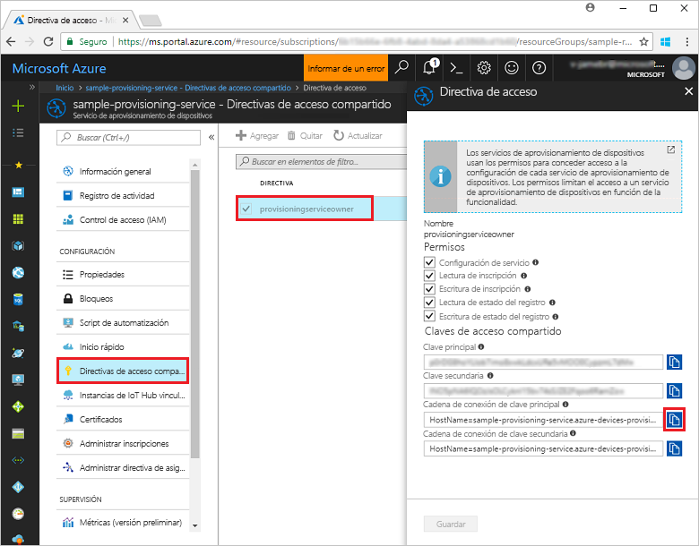
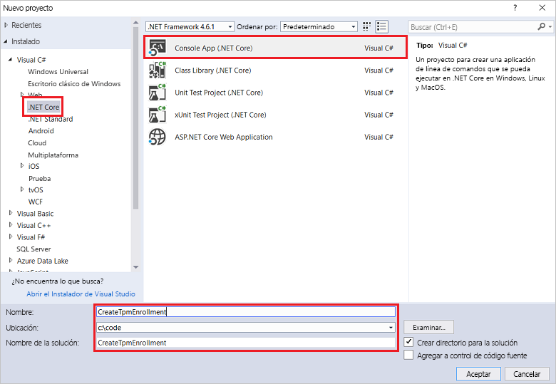
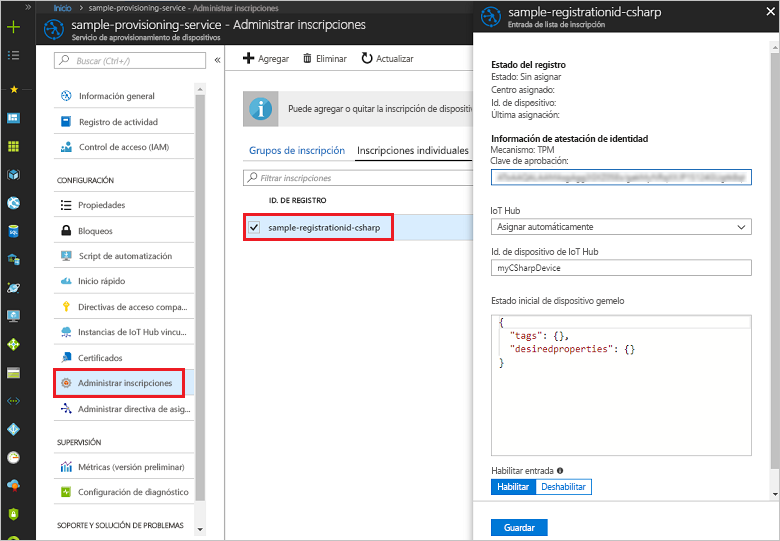

# <a name="enroll-tpm-device-to-iot-hub-device-provisioning-service-using-c-service-sdk"></a>Inscripción de un dispositivo de TPM al servicio Azure IoT Hub Device Provisioning mediante el SDK del servicio de C#

[!INCLUDE [iot-dps-selector-quick-enroll-device-tpm](../../includes/iot-dps-selector-quick-enroll-device-tpm.md)]


En estos pasos se muestra cómo crear una inscripción individual para un dispositivo de TPM mediante programación en el servicio Azure IoT Hub Device Provisioning mediante el [SDK del servicio de C#](https://github.com/Azure/azure-iot-sdk-csharp) y una aplicación de ejemplo de NET Core en C#. Si lo desea, puede inscribir un dispositivo de TPM simulado en el servicio de aprovisionamiento mediante esta entrada de inscripción individual. Aunque estos pasos funcionan en máquinas Windows y Linux, en este artículo se usa una máquina de desarrollo de Windows.

## <a name="prepare-the-development-environment"></a>Preparación del entorno de desarrollo

1. Asegúrese de tener instalado [Visual Studio 2017](https://www.visualstudio.com/vs/) en la máquina. 
2. Asegúrese de que tiene el [SDK de .NET Core](https://www.microsoft.com/net/download/windows) instalado en la máquina. 
3. Asegúrese de completar los pasos descritos en [Configuración de un servicio Azure IoT Hub Device Provisioning con Azure Portal](./quick-setup-auto-provision.md) antes de continuar.
4. (Opcional) Si quiere inscribir un dispositivo simulado al final de esta guía de inicio rápido, siga los pasos descritos en [Creación y aprovisionamiento de un dispositivo de TPM simulado mediante el SDK de dispositivos C#](quick-create-simulated-device-tpm-csharp.md) hasta el paso donde obtiene una clave de aprobación para el dispositivo. Anote la clave de aprobación, el identificador del registro y, opcionalmente, el identificador del dispositivo, que necesitará más adelante en esta guía de inicio rápido. **No siga los pasos para crear una inscripción individual mediante Azure Portal.**

## <a name="get-the-connection-string-for-your-provisioning-service"></a>Obtención de la cadena de conexión para el servicio de aprovisionamiento

En el ejemplo de esta guía de inicio rápido, necesitará la cadena de conexión del servicio de aprovisionamiento.
1. Inicie sesión en Azure Portal, haga clic en el botón **Todos los recursos** situado en el menú izquierdo y abra el servicio Device Provisioning. 
2. Haga clic en **Directivas de acceso compartido** y, a continuación, haga clic en la directiva de acceso que quiere usar para abrir sus propiedades. En la ventana **Directiva de acceso**, copie y tome nota de la cadena de conexión de la clave principal. 

    

## <a name="create-the-individual-enrollment-sample"></a>Creación del ejemplo de inscripción individual 

En los pasos de esta sección se muestra cómo crear una aplicación de consola de .NET Core que agrega una inscripción individual para un dispositivo de TPM al servicio de aprovisionamiento. Con algunas modificaciones, también puede seguir estos pasos para crear una aplicación de consola de [Windows IoT Core](https://developer.microsoft.com/en-us/windows/iot) para agregar la inscripción individual. Para más información sobre el desarrollo con IoT Core, consulte la [documentación para desarrolladores de Windows IoT Core](https://docs.microsoft.com/windows/iot-core/).
1. En Visual Studio, agregue un proyecto de aplicación de consola de Visual C# .NET Core a una nueva solución mediante la plantilla de proyecto **Aplicación de consola (.NET Core)**. Asegúrese de que la versión de .NET Framework sea 4.5.1 o una posterior. Asigne al proyecto el nombre **CreateTpmEnrollment**.

    

2. En el Explorador de soluciones, haga clic con el botón derecho en el proyecto **CreateTpmEnrollment** y luego haga clic en **Administrar paquetes NuGet**.
3. En la ventana **Administrador de paquetes NuGet**, seleccione **Examinar**, busque **Microsoft.Azure.Devices.Provisioning.Service**, seleccione **Instalar** para instalar el paquete **Microsoft.Azure.Devices.Provisioning.Service** y acepte los términos de uso. Este procedimiento descarga, instala y agrega una referencia al paquete NuGet del [SDK de cliente del servicio de aprovisionamiento de Azure IoT](https://www.nuget.org/packages/Microsoft.Azure.Devices.Provisioning.Service/) y sus dependencias.

    

4. Agregue las siguientes instrucciones `using` después de las demás instrucciones `using` en la parte superior del archivo **Program.cs**:
   
   ```csharp
   using System.Threading.Tasks;
   using Microsoft.Azure.Devices.Provisioning.Service;
   ```
    
5. Agregue los campos siguientes a la clase **Program** .  
   - Reemplace el valor del marcador de posición **ProvisioningConnectionString** por la cadena de conexión del servicio de aprovisionamiento para el que quiere crear la inscripción.
   - También puede cambiar el identificador de registro, la clave de aprobación, el identificador del dispositivo y el estado de aprovisionamiento. 
   - Si usa esta guía de inicio rápido junto con la guía de inicio rápido [Creación y aprovisionamiento de un dispositivo de TPM simulado mediante el SDK de dispositivos C#](quick-create-simulated-device-tpm-csharp.md) para aprovisionar un dispositivo simulado, reemplace la clave de aprobación y el identificador de registro por los valores que anotó en esa guía de inicio rápido. Puede reemplazar el identificador del dispositivo por el valor sugerido en esa guía de inicio rápido, usar su propio valor o utilizar el valor predeterminado en este ejemplo.
        
   ```csharp
   private static string ProvisioningConnectionString = "{Your provisioning service connection string}";
   private const string RegistrationId = "sample-registrationid-csharp";
   private const string TpmEndorsementKey =
       "AToAAQALAAMAsgAgg3GXZ0SEs/gakMyNRqXXJP1S124GUgtk8qHaGzMUaaoABgCAAEMAEAgAAAAAAAEAxsj2gUS" +
       "cTk1UjuioeTlfGYZrrimExB+bScH75adUMRIi2UOMxG1kw4y+9RW/IVoMl4e620VxZad0ARX2gUqVjYO7KPVt3d" +
       "yKhZS3dkcvfBisBhP1XH9B33VqHG9SHnbnQXdBUaCgKAfxome8UmBKfe+naTsE5fkvjb/do3/dD6l4sGBwFCnKR" +
       "dln4XpM03zLpoHFao8zOwt8l/uP3qUIxmCYv9A7m69Ms+5/pCkTu/rK4mRDsfhZ0QLfbzVI6zQFOKF/rwsfBtFe" +
       "WlWtcuJMKlXdD8TXWElTzgh7JS4qhFzreL0c1mI0GCj+Aws0usZh7dLIVPnlgZcBhgy1SSDQMQ==";
       
   // Optional parameters
   private const string OptionalDeviceId = "myCSharpDevice";
   private const ProvisioningStatus OptionalProvisioningStatus = ProvisioningStatus.Enabled;
   ```
    
6. Agregue el método siguiente a la clase **Program**.  Este código crea una entrada de inscripción individual y luego llama al método **CreateOrUpdateIndividualEnrollmentAsync** en **ProvisioningServiceClient** para agregar la inscripción individual al servicio de aprovisionamiento.
   
   ```csharp
   public static async Task RunSample()
   {
       Console.WriteLine("Starting sample...");

       using (ProvisioningServiceClient provisioningServiceClient =
               ProvisioningServiceClient.CreateFromConnectionString(ProvisioningConnectionString))
       {
           #region Create a new individualEnrollment config
           Console.WriteLine("\nCreating a new individualEnrollment...");
           Attestation attestation = new TpmAttestation(TpmEndorsementKey);
           IndividualEnrollment individualEnrollment =
                   new IndividualEnrollment(
                           RegistrationId,
                           attestation);

           // The following parameters are optional. Remove them if you don't need them.
           individualEnrollment.DeviceId = OptionalDeviceId;
           individualEnrollment.ProvisioningStatus = OptionalProvisioningStatus;
           #endregion

           #region Create the individualEnrollment
           Console.WriteLine("\nAdding new individualEnrollment...");
           IndividualEnrollment individualEnrollmentResult =
               await provisioningServiceClient.CreateOrUpdateIndividualEnrollmentAsync(individualEnrollment).ConfigureAwait(false);
           Console.WriteLine("\nIndividualEnrollment created with success.");
           Console.WriteLine(individualEnrollmentResult);
           #endregion
        
       }
   }
   ```
       
7. Por último, reemplace el cuerpo del método **Main** por las siguientes líneas:
   
   ```csharp
   RunSample().GetAwaiter().GetResult();
   Console.WriteLine("\nHit <Enter> to exit ...");
   Console.ReadLine();
   ```
        
8. Compile la solución.

## <a name="run-the-individual-enrollment-sample"></a>Ejecución del ejemplo de inscripción individual
  
1. Ejecute el ejemplo en Visual Studio para crear la inscripción individual para el dispositivo de TPM.
 
2. Tras una creación correcta, la ventana de comandos muestra las propiedades de la inscripción individual nueva.

    

3. Para comprobar que se ha creado la inscripción individual, en la hoja de resumen del servicio Device Provisioning de Azure Portal, seleccione **Administrar inscripciones** y luego la pestaña **Inscripciones individuales**. Verá una nueva entrada de inscripción que corresponde al identificador de registro usado en el ejemplo. Haga clic en la entrada para comprobar la clave de aprobación y otras propiedades de la entrada.

    
 
4. (Opcional) Si ha seguido los pasos descritos en la guía de inicio rápido [Creación y aprovisionamiento de un dispositivo de TPM simulado mediante el SDK de dispositivos C#](quick-create-simulated-device-tpm-csharp.md), puede continuar con los pasos restantes de esa guía de inicio rápido para inscribir el dispositivo simulado. No siga los pasos para crear una inscripción individual mediante Azure Portal.

## <a name="clean-up-resources"></a>Limpieza de recursos
Si tiene previsto explorar el ejemplo del servicio de C#, no elimine los recursos que se crearon con esta guía de inicio rápido. Si no va a continuar, use el siguiente comando para eliminar todos los recursos creados.

1. Cierre la ventana de salida de ejemplo de C# en su máquina.
2. Vaya a su servicio de Device Provisioning en Azure Portal, haga clic en **Administrar inscripciones** y, a continuación, seleccione la pestaña **Inscripciones individuales**. Seleccione el *id. de registro* de la entrada de inscripción que creó en esta guía de inicio rápido y haga clic en el botón **Eliminar** situado en la parte superior de la hoja. 
3. Si ha seguido los pasos de la guía de inicio rápido [Creación y aprovisionamiento de un dispositivo de TPM simulado mediante el SDK de dispositivos C#](quick-create-simulated-device-tpm-csharp.md) para crear un dispositivo de TPM simulado: 

    1. Cierre la ventana del simulador de TPM y la ventana de salida de ejemplo para el dispositivo simulado.
    2. En Azure Portal, vaya a la instancia de IoT Hub donde se aprovisionó el dispositivo. En el menú izquierdo bajo **Exploradores**, haga clic en **Dispositivos IoT**, active la casilla situada junto a su dispositivo y, a continuación, haga clic en **Eliminar** en la parte superior de la ventana.
 
## <a name="next-steps"></a>Pasos siguientes
En esta guía de inicio rápido, creó una entrada de inscripción individual mediante programación para un dispositivo de TPM y, opcionalmente, creó un dispositivo de TPM simulado en su máquina y lo aprovisionó con IoT Hub mediante el servicio Azure IoT Hub Device Provisioning. Para más información acerca del aprovisionamiento de dispositivos, continúe con el tutorial para instalar el servicio Device Provisioning en Azure Portal. 
 
> [!div class="nextstepaction"]
> [Tutoriales del servicio Azure IoT Hub Device Provisioning](./tutorial-set-up-cloud.md)

