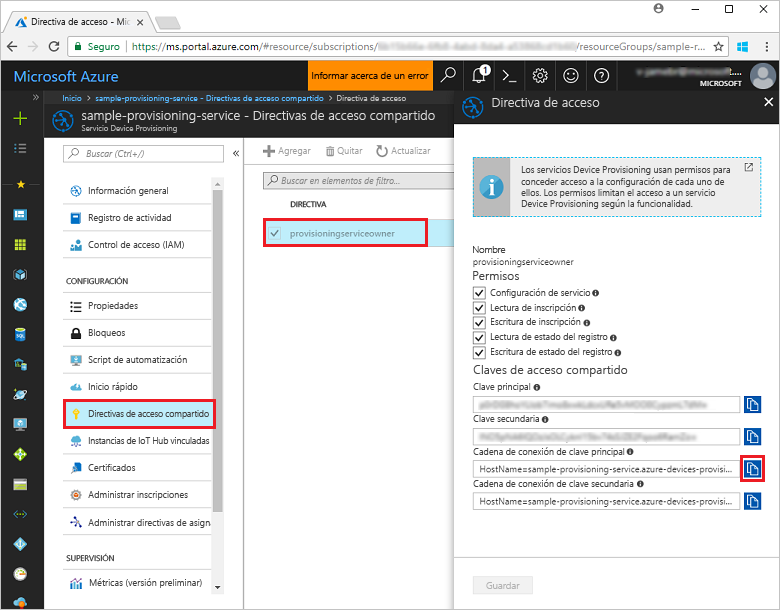
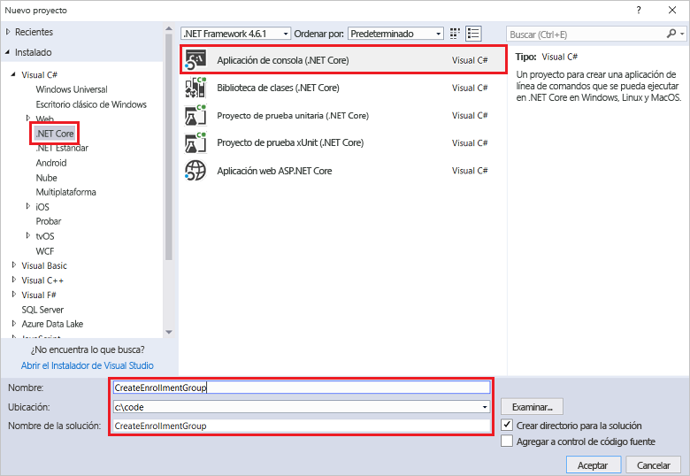
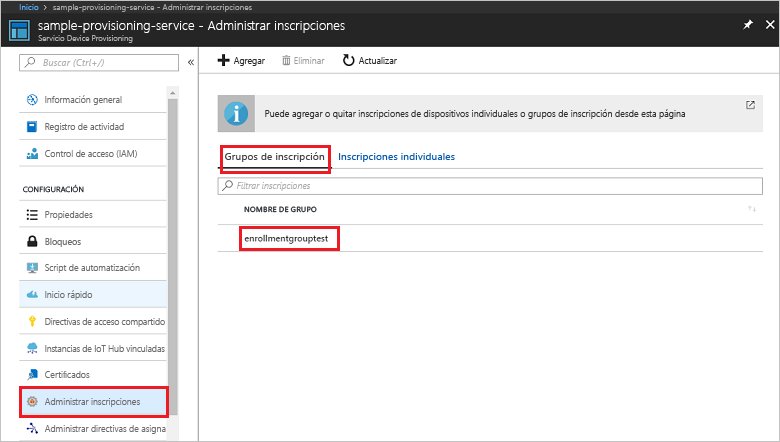

# <a name="quickstart-enroll-x509-devices-to-the-device-provisioning-service-using-c"></a>Guía de inicio rápido: Inscripción de dispositivos X.509 en el servicio Device Provisioning con C#

[!INCLUDE [iot-dps-selector-quick-enroll-device-x509](../../includes/iot-dps-selector-quick-enroll-device-x509.md)]


En esta guía de inicio rápido se muestra cómo usar C# para crear mediante programación un [grupo de inscripción](concepts-service.md#enrollment-group) que usa certificados X.509 intermedios o raíces de una entidad de certificación. El grupo de inscripción se crea utilizando el [SDK de Microsoft Azure IoT para .NET](https://github.com/Azure/azure-iot-sdk-csharp) y una aplicación de .NET Core en C# de ejemplo. Un grupo de inscripción controla el acceso al servicio de aprovisionamiento de los dispositivos que comparten un certificado de firma común en su cadena de certificados. Para más información, consulte [Control del acceso de dispositivo al servicio de aprovisionamiento con certificados X.509](./concepts-security.md#controlling-device-access-to-the-provisioning-service-with-x509-certificates). Para más información sobre el uso de la infraestructura de clave pública (PKI) basada en certificados X.509 con Azure IoT Hub y el servicio Device Provisioning, consulte [Introducción a la seguridad mediante certificados de entidades de certificación X.509](https://docs.microsoft.com/azure/iot-hub/iot-hub-x509ca-overview). 

En esta guía de inicio rápido se asume que ya ha creado un centro de IoT y una instancia de Device Provisioning Service. Si aún no ha creado estos recursos, complete la guía de inicio rápido [Configuración del servicio Azure IoT Hub Device Provisioning con Azure Portal](./quick-setup-auto-provision.md) antes de continuar con este artículo.

Aunque los pasos de este artículo funcionan en máquinas Windows y Linux, este artículo se ha desarrollado para una máquina de desarrollo de Windows.

[!INCLUDE [quickstarts-free-trial-note](../../includes/quickstarts-free-trial-note.md)]


## <a name="prerequisites"></a>Requisitos previos

* Instalación de [Visual Studio 2017](https://www.visualstudio.com/vs/).
* Instalación del [SDK de .NET Core](https://www.microsoft.com/net/download/windows).
* Instale [Git](https://git-scm.com/download/).


## <a name="prepare-test-certificates"></a>Preparación de los certificados de prueba

En esta guía de inicio rápido debe tener un archivo .pem o .cer que contenga la porción pública de un certificado X.509 intermedio o raíz de entidad de certificación. Se debe cargar este certificado en el servicio de aprovisionamiento y que este lo compruebe. 

El [SDK de Azure IoT para C](https://github.com/Azure/azure-iot-sdk-c) contiene herramientas de prueba que pueden ayudarle a crear una cadena de certificados X.509, cargar un certificado raíz o intermedio a partir de esa cadena y realizar la prueba de posesión con el servicio para comprobar el certificado. Los certificados creados con las herramientas del SDK están diseñados para su uso en las **pruebas de desarrollo únicamente**. Estos certificados **no se deben usar en producción**. Contienen contraseñas codificadas de forma rígida ("1234") que expiran después de 30 días. Para saber cómo obtener certificados adecuados para el código de producción, consulte [Cómo obtener un certificado de entidad de certificación X.509](https://docs.microsoft.com/azure/iot-hub/iot-hub-x509ca-overview#how-to-get-an-x509-ca-certificate) en la documentación de Azure IoT Hub.

Para usar estas herramientas de prueba para generar certificados, realice los pasos siguientes: 
 
1. Abra un símbolo del sistema o el shell de Git Bash y cambie a una carpeta de trabajo de la máquina. Ejecute el siguiente comando para clonar el repositorio de GitHub del [SDK para C de Azure IoT](https://github.com/Azure/azure-iot-sdk-c):
    
  ```cmd/sh
  git clone https://github.com/Azure/azure-iot-sdk-c.git --recursive
  ```

  Actualmente, el tamaño de este repositorio es de unos 220 MB. Esta operación puede tardar varios minutos en completarse.

  Las herramientas de prueba se encuentran en el directorio *azure-iot-sdk-c/tools/CACertificates* del repositorio que clonó.    

2. Siga los pasos descritos en [Managing test CA certificates for samples and tutorials](https://github.com/Azure/azure-iot-sdk-c/blob/master/tools/CACertificates/CACertificateOverview.md) (Administración de certificados de entidad de certificación de prueba para ejemplos y tutoriales). 

Además de las herramientas del SDK de C, el [ejemplo de comprobación del certificado de grupo](https://github.com/Azure/azure-iot-sdk-csharp/tree/master/provisioning/service/samples/GroupCertificateVerificationSample) del *SDK de Microsoft Azure IoT para .NET* muestra cómo realizar la prueba de posesión en C# con un certificado X.509 de entidad de certificación raíz o intermedio. 


## <a name="get-the-connection-string-for-your-provisioning-service"></a>Obtención de la cadena de conexión para el servicio de aprovisionamiento

En el ejemplo de esta guía de inicio rápido, necesitará la cadena de conexión del servicio de aprovisionamiento.
1. Inicie sesión en Azure Portal, haga clic en el botón **Todos los recursos** situado en el menú izquierdo y abra el servicio Device Provisioning. 
2. Haga clic en **Directivas de acceso compartido** y, a continuación, haga clic en la directiva de acceso que quiere usar para abrir sus propiedades. En la ventana **Directiva de acceso**, copie y tome nota de la cadena de conexión de la clave principal. 

    

## <a name="create-the-enrollment-group-sample"></a>Crear el ejemplo del grupo de inscripción 

En los pasos de esta sección se muestra cómo crear una aplicación de consola de .NET Core que agrega un grupo de inscripción al servicio de aprovisionamiento. Con algunas modificaciones, también puede seguir estos pasos para crear una aplicación de consola de [Windows IoT Core](https://developer.microsoft.com/en-us/windows/iot) para agregar el grupo de inscripción. Para más información sobre el desarrollo con IoT Core, consulte la [documentación para desarrolladores de Windows IoT Core](https://docs.microsoft.com/windows/iot-core/).
1. En Visual Studio, agregue un proyecto de aplicación de consola de Visual C# .NET Core a una nueva solución mediante la plantilla de proyecto **Aplicación de consola (.NET Core)**. Asegúrese de que la versión de .NET Framework sea 4.5.1 o una posterior. Asigne al proyecto el nombre **CreateEnrollmentGroup**.

    

2. En el Explorador de soluciones, haga clic con el botón derecho en el proyecto **CreateEnrollmentGroup** y, a continuación, haga clic en **Administrar paquetes NuGet**.
3. En la ventana **Administrador de paquetes NuGet**, seleccione **Examinar**, busque **Microsoft.Azure.Devices.Provisioning.Service**, seleccione **Instalar** para instalar el paquete **Microsoft.Azure.Devices.Provisioning.Service** y acepte los términos de uso. Este procedimiento descarga, instala y agrega una referencia al paquete NuGet del [SDK de cliente del servicio de aprovisionamiento de Azure IoT](https://www.nuget.org/packages/Microsoft.Azure.Devices.Provisioning.Service/) y sus dependencias.

    

4. Agregue las siguientes instrucciones `using` después de las demás instrucciones `using` en la parte superior del archivo **Program.cs**:
   
   ```csharp
   using System.Security.Cryptography.X509Certificates;
   using System.Threading.Tasks;
   using Microsoft.Azure.Devices.Provisioning.Service;
   ```
    
5. Agregue los campos siguientes a la clase **Program** .  
   - Reemplace el valor del marcador de posición **ProvisioningConnectionString** por la cadena de conexión del servicio de aprovisionamiento para el que quiere crear la inscripción.
   - Reemplace el valor del marcador de posición **X509RootCertPath** por la ruta de acceso a un archivo .pem o .cer que representa la parte pública de un certificado X.509 de entidad de certificación raíz o intermedio que ha cargado anteriormente y comprobado en el servicio de aprovisionamiento.
   - También puede cambiar el valor de **EnrollmentGroupId**. La cadena solo puede contener caracteres en minúsculas y guiones. 

   > [!IMPORTANT]
   > En el código de producción, tenga en cuenta las consideraciones de seguridad siguientes:
   >
   > - La codificación de forma rígida de la cadena de conexión para el administrador del servicio de aprovisionamiento va contra los procedimientos recomendados de seguridad. En su lugar, la cadena de conexión debe mantenerse de forma segura, como en un archivo de configuración seguro o en el registro.
   > - Asegúrese de cargar solo la parte pública del certificado de firma. No cargue nunca archivos .pfx (PKCS12) o .pem que contengan claves privadas en el servicio de aprovisionamiento.
        
   ```csharp
   private static string ProvisioningConnectionString = "{Your provisioning service connection string}";
   private static string EnrollmentGroupId = "enrollmentgrouptest";
   private static string X509RootCertPath = @"{Path to a .cer or .pem file for a verified root CA or intermediate CA X.509 certificate}";
   ```
    
6. Agregue el método siguiente a la clase **Program**. Este código crea una entrada de grupo de inscripción y luego llama al método **CreateOrUpdateEnrollmentGroupAsync** en **ProvisioningServiceClient** para agregar el grupo de inscripción al servicio de aprovisionamiento.
   
   ```csharp
   public static async Task RunSample()
   {
       Console.WriteLine("Starting sample...");
 
       using (ProvisioningServiceClient provisioningServiceClient =
               ProvisioningServiceClient.CreateFromConnectionString(ProvisioningConnectionString))
       {
           #region Create a new enrollmentGroup config
           Console.WriteLine("\nCreating a new enrollmentGroup...");
           var certificate = new X509Certificate2(X509RootCertPath);
           Attestation attestation = X509Attestation.CreateFromRootCertificates(certificate);
           EnrollmentGroup enrollmentGroup =
                   new EnrollmentGroup(
                           EnrollmentGroupId,
                           attestation)
                   {
                       ProvisioningStatus = ProvisioningStatus.Enabled
                   };
           Console.WriteLine(enrollmentGroup);
           #endregion
 
           #region Create the enrollmentGroup
           Console.WriteLine("\nAdding new enrollmentGroup...");
           EnrollmentGroup enrollmentGroupResult =
               await provisioningServiceClient.CreateOrUpdateEnrollmentGroupAsync(enrollmentGroup).ConfigureAwait(false);
           Console.WriteLine("\nEnrollmentGroup created with success.");
           Console.WriteLine(enrollmentGroupResult);
           #endregion
 
       }
   }
   ```

7. Por último, reemplace el cuerpo del método **Main** por las siguientes líneas:
   
   ```csharp
   RunSample().GetAwaiter().GetResult();
   Console.WriteLine("\nHit <Enter> to exit ...");
   Console.ReadLine();
   ```
        
8. Compile la solución.

## <a name="run-the-enrollment-group-sample"></a>Ejecutar el ejemplo del grupo de inscripción
  
1. Ejecute el ejemplo en Visual Studio para crear el grupo de inscripción.
 
2. Tras una creación correcta, la ventana de comandos muestra las propiedades del grupo de inscripción nuevo.

    

3. Para comprobar que se ha creado el grupo de inscripción, en la hoja de resumen del servicio Device Provisioning de Azure Portal, seleccione **Administrar inscripciones** y luego la pestaña **Grupos de inscripción**. Verá una nueva entrada de inscripción que corresponde al identificador de registro usado en el ejemplo. Haga clic en la entrada para comprobar la huella digital del certificado y otras propiedades de la entrada.

    
 
## <a name="clean-up-resources"></a>Limpieza de recursos
Si tiene previsto explorar el ejemplo del servicio de C#, no elimine los recursos que se crearon con esta guía de inicio rápido. Si no va a continuar, use el siguiente comando para eliminar todos los recursos creados.

1. Cierre la ventana de salida de ejemplo de C# en su máquina.
2. Navegue a su servicio Device Provisioning en Azure Portal, haga clic en **Administrar inscripciones** y, a continuación, seleccione la pestaña **Grupos de inscripción**. Seleccione el *id. de registro* para la entrada de inscripción que creó en esta guía de inicio rápido y haga clic en el botón **Eliminar** situado en la parte superior de la hoja.  
3. Desde el servicio Device Provisioning en Azure Portal, haga clic en **Certificados**, en el certificado que cargó para esta guía de inicio rápido y en el botón **Eliminar** situado en la parte superior de la ventana **Detalles del certificado**.  
 
## <a name="next-steps"></a>Pasos siguientes
En esta guía de inicio rápido, ha creado un grupo de inscripción para un certificado X.509 de entidad de certificación intermedio o raíz mediante el servicio Azure IoT Hub Device Provisioning. Para más información acerca del aprovisionamiento de dispositivos, continúe con el tutorial para instalar el servicio Device Provisioning en Azure Portal. 
 
> [!div class="nextstepaction"]
> [Tutoriales del servicio Azure IoT Hub Device Provisioning](./tutorial-set-up-cloud.md)
