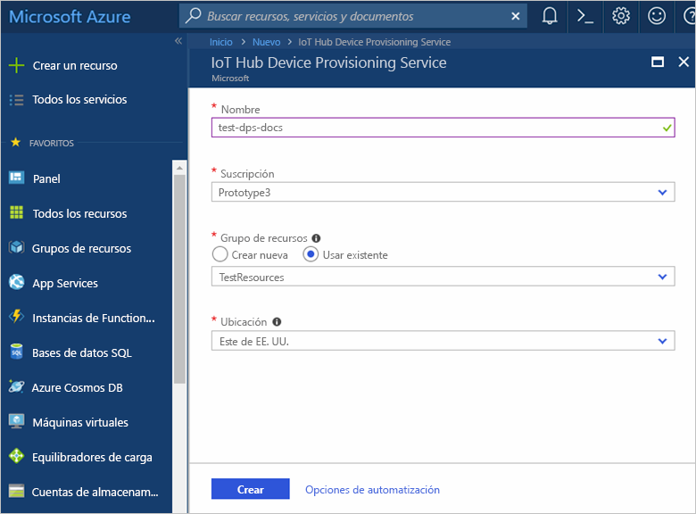

# Configuración de Azure IoT Hub Device Provisioning Service con Azure Portal

Estos pasos le enseñan a configurar los recursos de nube de Azure en el portal para el aprovisionamiento de los dispositivos. Esto incluye la creación de un centro de IoT, de un nuevo servicio Azure IoT Hub Device Provisioning, y la vinculación de los dos servicios. 

Si no tiene una suscripción a Azure, cree una [cuenta gratuita](https://azure.microsoft.com/free/?WT.mc_id=A261C142F) antes de empezar.

## Iniciar sesión en Azure Portal

Inicie sesión en [Azure Portal](https://portal.azure.com/).

## Crear un centro de IoT

1. Haga clic en el botón **Crear un recurso** de la esquina superior izquierda de Azure Portal.

2. Seleccione **Internet de las cosas**, seleccione **IoT Hub** y haga clic en el botón **Crear**. 

3. **Asigne un nombre** al centro de IoT. Seleccione una de las opciones disponibles para los precios, escriba las [unidades de IoT Hub](https://azure.microsoft.com/pricing/details/iot-hub/), seleccione el número de particiones para los mensajes del dispositivo a la nube y la suscripción que se utilizaría para este recurso. Escriba el nombre de un grupo de recursos nuevo o existente, y seleccione la ubicación. Cuando haya terminado, haga clic en **Cerrar**.

      

4. Una vez que el centro de IoT se implementa de forma correcta, se abre automáticamente la hoja de resumen del centro.

## Creación de una nueva instancia para el servicio Azure IoT Hub Device Provisioning

1. Haga clic en el botón **Crear un recurso** de la esquina superior izquierda de Azure Portal.

2. *Busque en Marketplace* el **servicio Device Provisioning**. Seleccione **Servicio IoT Hub Device Provisioning** y haga clic en el botón **Crear**. 

3. **Asigne un nombre** a la instancia del servicio Device Provisioning. Seleccione la suscripción que se utilizaría para esta instancia y el nombre de un grupo de recursos nuevo o existente. Seleccione la ubicación. Cuando haya terminado, haga clic en **Cerrar**.

      

4. Una vez que el servicio se implementa de forma correcta, se abre automáticamente la hoja de resumen.

## Vínculo del centro de IoT y el servicio Device Provisioning

1. Haga clic en el botón **Todos los recursos** en el menú izquierdo de Azure Portal. Seleccione la instancia del servicio Device Provisioning que creó en la sección anterior.  

2. En la hoja de resumen del servicio Device Provisioning, seleccione **Linked IoT hubs** (Centros de IoT vinculados). Haga clic en el botón **+ Agregar** que aparece en la parte superior. 

3. En la hoja del portal **Agregar vínculo a IoT Hub**, seleccione la suscripción actual o escriba el nombre y la cadena de conexión de otra suscripción. Seleccione el nombre del centro en la lista desplegable. Cuando haya terminado, haga clic en **Guardar**. 

      

3. Ahora debería ver el centro seleccionado en la hoja **Linked IoT hubs** (Centros de IoT vinculados). Puede que deba hacer clic en **Actualizar** para mostrar **Instancias de IoT Hub vinculadas**.

## Limpieza de recursos

Otras guías de inicio rápido de esta colección se basan en los valores de esta. Si tiene previsto seguir trabajando con las siguientes guías de inicio rápido o tutoriales, no elimine los recursos creados en esta guía de inicio rápido. Si no tiene previsto continuar, siga estos pasos para eliminar todos los recursos creados en esta guía de inicio rápido en Azure Portal.

1. Desde el menú de la izquierda en Azure Portal, haga clic en **Todos los recursos** y seleccione el servicio Device Provisioning. En la parte superior de la hoja **Todos los recursos**, haga clic en **Eliminar**.  
2. Desde el menú de la izquierda en Azure Portal, haga clic en **Todos los recursos** y seleccione su centro de IoT. En la parte superior de la hoja **Todos los recursos**, haga clic en **Eliminar**.  

## Pasos siguientes

En esta guía de inicio rápido, ha implementado un centro de IoT y una instancia del servicio Device Provisioning, y ha vinculado los dos recursos. Para aprender a usar esta configuración para aprovisionar un dispositivo simulado, siga la guía de inicio rápido que permite crear un dispositivo simulado.

> [!div class="nextstepaction"]
> [Guía de inicio rápido para crear el dispositivo simulado](./quick-create-simulated-device.md)
