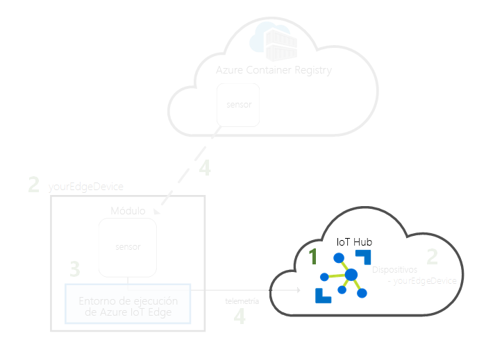
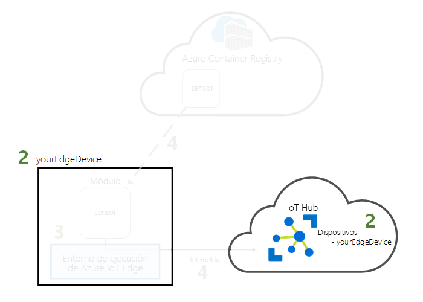
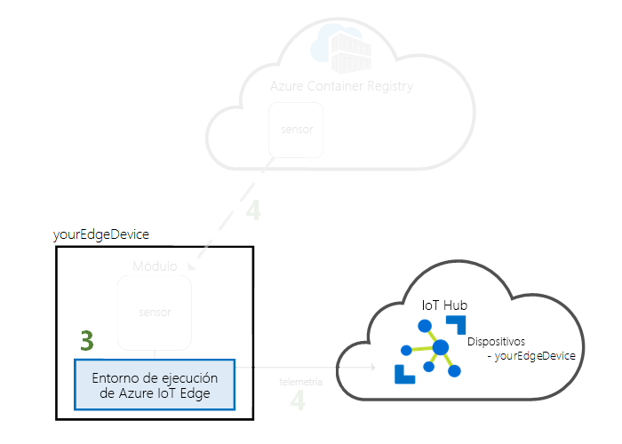
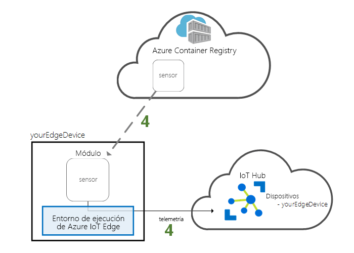

# <a name="quickstart-deploy-your-first-iot-edge-module-to-a-linux-x64-device"></a>Guía de inicio rápido: Implementación del primer módulo de IoT Edge en un dispositivo Linux x64

Azure IoT Edge traslada la eficacia de la nube a los dispositivos de Internet de las cosas. En esta guía de inicio rápido, aprenda a usar la interfaz de nube para implementar código creado previamente de manera remota en un dispositivo IoT Edge.

En esta guía de inicio rápido, aprenderá a hacer lo siguiente:

1. Cree un centro de IoT Hub.
2. Registre un dispositivo IoT Edge en su instancia de IoT Hub.
3. Instale e inicie el entorno de ejecución de Azure IoT Edge en el dispositivo.
4. Implemente un módulo de manera remota en un dispositivo IoT Edge.


Esta guía de inicio rápido convierte su equipo o maquina virtual Linux en un dispositivo IoT Edge. Después, puede implementar un módulo desde Azure Portal en el dispositivo. El módulo que se implementa en esta guía de inicio rápido es un sensor simulado que genera datos de temperatura, humedad y presión. Los otros tutoriales de Azure IoT Edge se basan en el trabajo que se realiza aquí mediante la implementación de módulos que analizan los datos simulados para obtener información empresarial.

Si no tiene una suscripción activa a Azure, cree una [cuenta gratuita](https://azure.microsoft.com/free) antes de comenzar.

[!INCLUDE [cloud-shell-try-it.md](../../includes/cloud-shell-try-it.md)]

Usará la CLI de Azure para completar muchos de los pasos de esta guía de inicio rápido; además, Azure IoT cuenta con una extensión para habilitar funcionalidad adicional. 

Agregue la extensión de Azure IoT a la instancia de Cloud Shell.

   ```azurecli-interactive
   az extension add --name azure-cli-iot-ext
   ```

## <a name="prerequisites"></a>Requisitos previos

Recursos en la nube: 

* Un grupo de recursos para administrar todos los recursos que se van a usar en esta guía de inicio rápido. 

   ```azurecli-interactive
   az group create --name IoTEdgeResources --location westus2
   ```

Dispositivo de IoT Edge:

* Una máquina virtual o dispositivo de Linux que actúa como dispositivo de IoT Edge. Si desea crear una máquina virtual en Azure, use el siguiente comando para empezar a trabajar rápidamente:

   ```azurecli-interactive
   az vm create --resource-group IoTEdgeResources --name EdgeVM --image Canonical:UbuntuServer:16.04-LTS:latest --admin-username azureuser --generate-ssh-keys --size Standard_DS1_v2
   ```

   La creación e inicio de la nueva máquina virtual puede tardar varios minutos. 

   Cuando cree una nueva máquina virtual, tome nota del valor de **publicIpAddress**, que se proporciona como parte de la salida del comando create. Utilice esta dirección IP pública para conectarse a la máquina virtual más adelante en la guía de inicio rápido.

## <a name="create-an-iot-hub"></a>Crear un centro de IoT

Para empezar el inicio rápido, cree un centro de IoT con la CLI de Azure.



El nivel gratuito de IoT Hub funciona para esta guía de inicio rápido. Si ha usado IoT Hub en el pasado y ya tiene un centro gratis creado, puede usar ese centro de IoT. Cada suscripción no puede tener más de un centro de IoT gratuito. 

El código siguiente crea un centro **F1** gratis en el grupo de recursos **IoTEdgeResources**. Reemplace *{hub_name}* por un nombre único para el centro de IoT.

   ```azurecli-interactive
   az iot hub create --resource-group IoTEdgeResources --name {hub_name} --sku F1 
   ```

   Si se produce un error porque ya hay un centro gratis en la suscripción, cambie la SKU a **S1**. Si recibe un error que le indica que el nombre de IoT Hub no está disponible, significa que alguien más ya tiene un centro con ese nombre. Pruebe con uno nuevo. 

## <a name="register-an-iot-edge-device"></a>Registro de un dispositivo de IoT Edge

Registre un dispositivo de IoT Edge con la instancia de IoT Hub recién creada.


Cree una identidad para el dispositivo simulado, con el fin de que pueda comunicarse con su centro de IoT. La identidad del dispositivo reside en la nube, y se usa una cadena de conexión de dispositivo única para asociar un dispositivo físico a una identidad de dispositivo. 

Dado que los dispositivos de IoT Edge se comportan y se pueden administrar de manera diferente a los dispositivos de IoT típicos, declare que esta identidad es para un dispositivo de IoT Edge con la marca `--edge-enabled`. 

1. En Azure Cloud Shell, escriba el comando siguiente para crear un dispositivo denominado **myEdgeDevice** en el centro.

   ```azurecli-interactive
   az iot hub device-identity create --hub-name {hub_name} --device-id myEdgeDevice --edge-enabled
   ```

   Si recibe un error acerca de las claves de directiva de iothubowner, asegúrese de que Cloud Shell está ejecutando la versión más reciente de la extensión azure-cli-iot-ext. 

2. Recupere la cadena de conexión del dispositivo, que vincula el dispositivo físico con su identidad en IoT Hub. 

   ```azurecli-interactive
   az iot hub device-identity show-connection-string --device-id myEdgeDevice --hub-name {hub_name}
   ```

3. Copie la cadena de conexión desde la salida JSON y guárdela. Este valor se usará para configurar el runtime de IoT Edge en la sección siguiente.

   

## <a name="install-and-start-the-iot-edge-runtime"></a>Instale e inicie el runtime de IoT Edge

Instale e inicie el entorno de ejecución de Azure IoT Edge en el dispositivo IoT Edge. 


El runtime de IoT Edge se implementa en todos los dispositivos de IoT Edge. Tiene tres componentes. El **demonio de seguridad de IoT Edge** se inicia cada vez que se inicia un dispositivo perimetral y arranca el dispositivo mediante el inicio del agente de IoT Edge. El **agente de IoT Edge** facilita la implementación y supervisión de los módulos en el dispositivo IoT Edge, incluido el centro de IoT Edge. El **centro de IoT Edge** administra las comunicaciones entre los módulos del dispositivo de IoT Edge y entre el dispositivo y la instancia de IoT Hub. 

Durante la configuración del entorno en tiempo de ejecución, tendrá que proporcionar una cadena de conexión del dispositivo. Use la cadena que recuperó de la CLI de Azure. Esta cadena asocia el dispositivo físico con la identidad del dispositivo IoT Edge en Azure. 

### <a name="connect-to-your-iot-edge-device"></a>Conexión al dispositivo IoT Edge

Todos los pasos descritos en esta sección tienen lugar en el dispositivo IoT Edge. Si usa su propia máquina como dispositivo IoT Edge, puede continuar a la sección siguiente. Si va a usar una máquina virtual o hardware secundario, puede que desee conectarse ahora a esa máquina. 

Si ha creado una máquina virtual de Azure para esta guía de inicio rápido, recupere la dirección IP pública que se generó mediante el comando de creación. También puede encontrar la dirección IP pública en la página de información general de la máquina virtual en Azure Portal. Use el siguiente comando para conectarse a la máquina virtual. Reemplace **{publicIpAddress}** por la dirección de su máquina. 

```azurecli-interactive
ssh azureuser@{publicIpAddress}
```

### <a name="register-your-device-to-use-the-software-repository"></a>Registro del dispositivo para que use el repositorio de software

Los paquetes necesarios para ejecutar el entorno de ejecución de Azure IoT Edge se administran en un repositorio de software. Configure el dispositivo IoT Edge para acceder a este repositorio. 

Los pasos de esta sección son para dispositivos basados en x64 que ejecutan **Ubuntu 16.04**. Para acceder al repositorio de software en otras versiones de Linux o arquitecturas de dispositivo, consulte [Instalar el entorno de ejecución de Azure IoT Edge en Linux (x64)](how-to-install-iot-edge-linux.md) o [Linux (ARM32v7/armhf)](how-to-install-iot-edge-linux-arm.md).

1. En la máquina que está utilizando como dispositivo IoT Edge, instale la configuración del repositorio.

   ```bash
   curl https://packages.microsoft.com/config/ubuntu/16.04/prod.list > ./microsoft-prod.list
   sudo cp ./microsoft-prod.list /etc/apt/sources.list.d/
   ```

2. Instale una clave pública para acceder al repositorio.

   ```bash
   curl https://packages.microsoft.com/keys/microsoft.asc | gpg --dearmor > microsoft.gpg
   sudo cp ./microsoft.gpg /etc/apt/trusted.gpg.d/
   ```

### <a name="install-a-container-runtime"></a>Instalación de un entorno de ejecución del contenedor

El entorno de ejecución de IoT Edge es un conjunto de contenedores y la lógica que implementa en el dispositivo IoT Edge se empaqueta en forma de contenedores. Prepare el dispositivo para estos componentes mediante la instalación de un entorno de ejecución del contenedor.

1. Actualice **apt-get**.

   ```bash
   sudo apt-get update
   ```

2. Instale **Moby**, un entorno de ejecución de contenedor.

   ```bash
   sudo apt-get install moby-engine
   ```

3. Instale los comandos de la CLI para Moby. 

   ```bash
   sudo apt-get install moby-cli
   ```

### <a name="install-and-configure-the-iot-edge-security-daemon"></a>Instalación y configuración del demonio de seguridad de IoT Edge

El demonio de seguridad se instala como un servicio del sistema para que el entorno de ejecución de IoT Edge se inicie cada vez que arranca el dispositivo. La instalación también incluye una versión de **hsmlib** que permite que el demonio de seguridad interactúe con la seguridad del hardware del dispositivo. 

1. Descargue e instale el demonio de seguridad de IoT Edge. 

   ```bash
   sudo apt-get update
   sudo apt-get install iotedge
   ```

2. Abra el archivo de configuración de IoT Edge. Es un archivo protegido por lo que puede que tenga que usar privilegios elevados para acceder a él.
   
   ```bash
   sudo nano /etc/iotedge/config.yaml
   ```

3. Agregue la cadena de conexión del dispositivo IoT Edge. Busque la variable **device_connection_string** y actualice su valor con la cadena que ha copiado después de registrar el dispositivo. Esta cadena de conexión asocia el dispositivo físico con la identidad del dispositivo que creó en Azure.

4. Guarde y cierre el archivo. 

   `CTRL + X`, `Y`, `Enter`

5. Reinicie el demonio de seguridad de IoT Edge para aplicar los cambios.

   ```bash
   sudo systemctl restart iotedge
   ```

### <a name="view-the-iot-edge-runtime-status"></a>Visualización del estado del entorno de ejecución de Azure IoT Edge

Compruebe que el entorno de ejecución se ha instalado y configurado correctamente.

>[!TIP]
>Necesita privilegios elevados para ejecutar comandos `iotedge`. Cuando cierre la sesión en su máquina y la inicie de nuevo por primera vez después de instalar el entorno de ejecución de IoT Edge, sus permisos se actualizarán automáticamente. Hasta entonces, use **sudo** delante de los comandos. 

1. Compruebe que el demonio de seguridad de Edge se ejecuta como un servicio del sistema.

   ```bash
   sudo systemctl status iotedge
   ```

   

2. Si necesita solucionar problemas del servicio, recupere los registros del servicio. 

   ```bash
   journalctl -u iotedge
   ```

3. Vea los módulos que se ejecutan en el dispositivo. 

   ```bash
   sudo iotedge list
   ```

   

El dispositivo de IoT Edge está ya configurado. Está preparado para ejecutar módulos implementados en la nube. 

## <a name="deploy-a-module"></a>Implementación de un módulo

Administre el dispositivo Azure IoT Edge desde la nube para implementar un módulo que enviará datos de telemetría a IoT Hub.


[!INCLUDE [iot-edge-deploy-module](../../includes/iot-edge-deploy-module.md)]

## <a name="view-generated-data"></a>Visualización de datos generados

En esta guía de inicio rápido, ha creado un nuevo dispositivo de IoT Edge y ha instalado el runtime de IoT Edge en él. Luego, ha usado Azure Portal para insertar un módulo de IoT Edge para que se ejecute en el dispositivo sin tener que realizar cambios en el propio dispositivo. En este caso, el módulo que ha insertado crea datos del entorno que se pueden usar para los tutoriales.

Vuelva a abrir el símbolo del sistema en el dispositivo de IoT Edge. Confirme que el módulo implementado desde la nube se está ejecutando en el dispositivo IoT Edge:

   ```bash
   sudo iotedge list
   ```

   

Vea los mensajes que se envían desde el módulo de sensor de temperatura:

   ```bash
   sudo iotedge logs SimulatedTemperatureSensor -f
   ```

   >[!TIP]
   >Los comandos de IoT Edge distinguen mayúsculas de minúsculas en los nombres de los módulos.

   

Puede que el módulo del sensor de temperatura esté esperando para conectarse al centro de Edge si la última línea que se ve en el registro es **Using transport Mqtt_Tcp_Only** (Usando transporte Mqtt_Tcp_Only). Intente detener el módulo y dejar que el agente de Edge lo reinicie. Puede detenerlo mediante el comando `sudo docker stop SimulatedTemperatureSensor`.

También puede ver los mensajes que llegan a su centro de IoT mediante la [extensión de Azure IoT Hub Toolkit para Visual Studio Code](https://marketplace.visualstudio.com/items?itemName=vsciot-vscode.azure-iot-toolkit). 

## <a name="clean-up-resources"></a>Limpieza de recursos

Si desea continuar con los tutoriales de IoT Edge, puede usar el dispositivo que ha registrado y configurado en esta guía de inicio rápido. De lo contrario, puede eliminar los recursos de Azure que ha creado y quitar el entorno de ejecución de Azure IoT Edge del dispositivo.

### <a name="delete-azure-resources"></a>Eliminación de recursos de Azure

Si ha creado una máquina virtual y un centro de IoT en un nuevo grupo de recursos, puede eliminar dicho grupo y todos los recursos asociados. Vuelva a comprobar el contenido del grupo de recursos para asegurarse de que no haya nada que desee conservar. Si no desea eliminar todo el grupo, puede eliminar recursos individuales en su lugar.

Quite el grupo **IoTEdgeResources**.

   ```azurecli-interactive
   az group delete --name IoTEdgeResources 
   ```

### <a name="remove-the-iot-edge-runtime"></a>Eliminación del entorno de ejecución de Azure IoT Edge

Si desea quitar las instalaciones desde su dispositivo, use los siguientes comandos.  

Quite el entorno de ejecución de Azure IoT Edge.

   ```bash
   sudo apt-get remove --purge iotedge
   ```

Cuando se quita el entorno de ejecución de Azure IoT Edge, los contenedores que se han creado se detienen, pero siguen existiendo en el dispositivo. Vea todos los contenedores.

   ```bash
   sudo docker ps -a
   ```

Elimine los contenedores que se crearon en el dispositivo por el entorno de ejecución de Azure IoT Edge. 

   ```bash
   sudo docker rm -f SimulatedTemperatureSensor
   sudo docker rm -f edgeHub
   sudo docker rm -f edgeAgent
   ```

Quite el entorno de ejecución del contenedor.

   ```bash
   sudo apt-get remove --purge moby-cli
   sudo apt-get remove --purge moby-engine
   ```

## <a name="next-steps"></a>Pasos siguientes

Esta guía de inicio rápido es el requisito previo para todos los demás tutoriales de IoT Edge. Puede continuar con cualquiera de los demás tutoriales para obtener información acerca de la forma en que Azure IoT Edge puede ayudarle a transformar estos datos en información empresarial en el perímetro.

> [!div class="nextstepaction"]
> [Filtrado de los datos del sensor mediante una función de Azure](tutorial-deploy-function.md)
