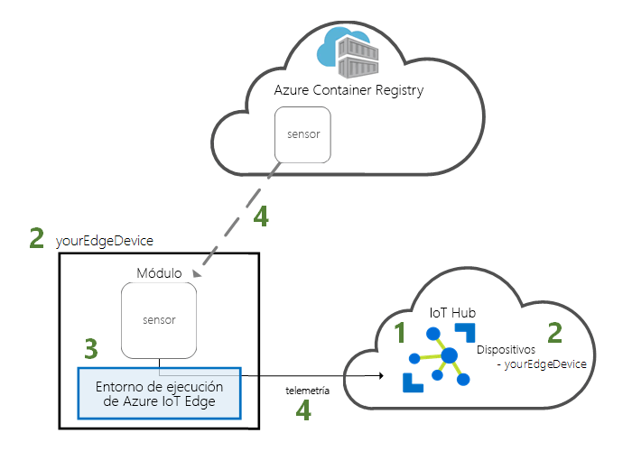
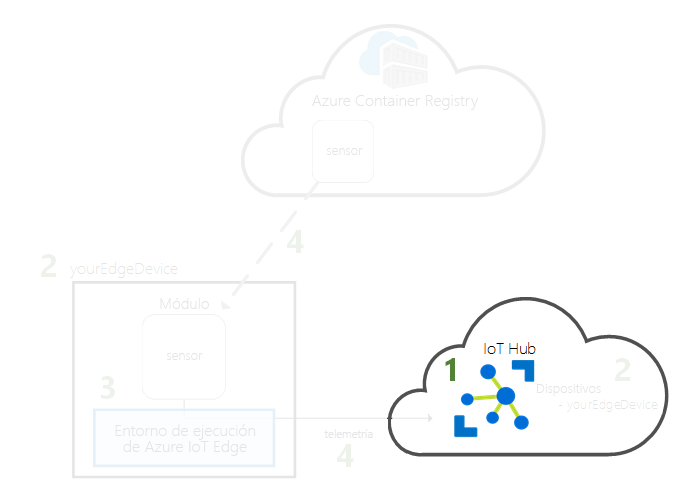
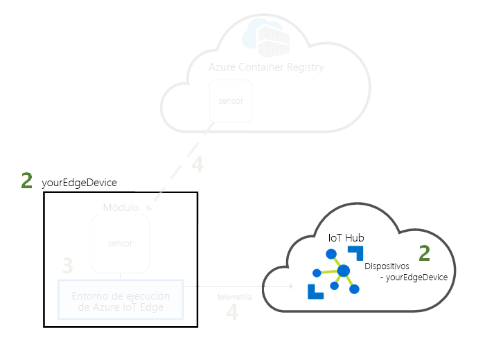
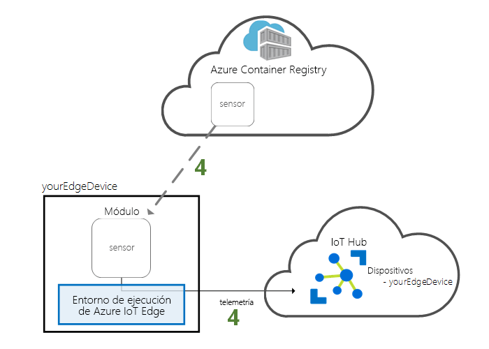

# <a name="quickstart-deploy-your-first-iot-edge-module-from-the-azure-portal-to-a-windows-device---preview"></a>Guía de inicio rápido: implementación del primer módulo de IoT Edge desde Azure Portal a un dispositivo Windows (versión preliminar)

En esta guía de inicio rápido, use la interfaz en la nube de Azure IoT Edge para implementar código creado previamente de manera remota en un dispositivo de IoT Edge. Para realizar esta tarea, en primer lugar, use un dispositivo de Windows para simular un dispositivo de IoT Edge y, posteriormente, puede implementar un módulo en él.

En esta guía de inicio rápido, aprenderá a hacer lo siguiente:

1. Cree un centro de IoT Hub.
2. Registre un dispositivo IoT Edge en su instancia de IoT Hub.
3. Instale e inicie el entorno de ejecución de Azure IoT Edge en el dispositivo.
4. Implemente un módulo de forma remota en un dispositivo IoT Edge y envíe telemetría a IoT Hub.



El módulo que se implementa en esta guía de inicio rápido es un sensor simulado que genera datos de temperatura, humedad y presión. Los otros tutoriales de Azure IoT Edge se basan en el trabajo que se realiza aquí mediante la implementación de módulos que analizan los datos simulados para obtener información empresarial.

>[!NOTE]
>El entorno de ejecución de Azure IoT Edge en Windows se encuentra en [versión preliminar pública](https://azure.microsoft.com/support/legal/preview-supplemental-terms/).

Si no tiene una suscripción activa a Azure, cree una [cuenta gratuita](https://azure.microsoft.com/free) antes de comenzar.

[!INCLUDE [cloud-shell-try-it.md](../../includes/cloud-shell-try-it.md)]

Usará la CLI de Azure para completar muchos de los pasos de esta guía de inicio rápido; además, Azure IoT cuenta con una extensión para habilitar funcionalidad adicional.

Agregue la extensión de Azure IoT a la instancia de Cloud Shell.

   ```azurecli-interactive
   az extension add --name azure-cli-iot-ext
   ```

## <a name="prerequisites"></a>Requisitos previos

Recursos en la nube:

* Un grupo de recursos para administrar todos los recursos que se van a usar en esta guía de inicio rápido.

   ```azurecli-interactive
   az group create --name IoTEdgeResources --location westus
   ```

Dispositivo de IoT Edge:

* Un equipo o máquina virtual Windows que actúe como dispositivo de IoT Edge. Use una versión de Windows compatible:
  * Windows 10 o posterior
  * Windows Server 2016 o posterior
* Si es un equipo Windows, asegúrese de que cumple los [requisitos del sistema](https://docs.microsoft.com/virtualization/hyper-v-on-windows/reference/hyper-v-requirements) para Hyper-V.
* Si es una máquina virtual, habilite la [virtualización anidada](https://docs.microsoft.com/virtualization/hyper-v-on-windows/user-guide/nested-virtualization) y asigne al menos 2 GB de memoria.
* Instale [Docker para Windows](https://docs.docker.com/docker-for-windows/install/) y asegúrese de que se ejecuta.

> [!TIP]
> Hay una opción durante la instalación de Docker que permite elegir entre contenedores de Windows o de Linux. En esta guía de inicio rápido se describe como configurar el entorno de ejecución de IoT Edge para usarlo con contenedores Linux.

## <a name="create-an-iot-hub"></a>Crear un centro de IoT

Para comenzar la guía de inicio rápido, cree su centro de IoT con la CLI de Azure.



El nivel gratuito de IoT Hub funciona para esta guía de inicio rápido. Si ha usado IoT Hub en el pasado y ya tiene un centro gratis creado, puede usar ese centro de IoT. Cada suscripción no puede tener más de un centro de IoT gratuito.

El código siguiente crea un centro **F1** gratis en el grupo de recursos **IoTEdgeResources**. Reemplace *{hub_name}* por un nombre único para el centro de IoT.

   ```azurecli-interactive
   az iot hub create --resource-group IoTEdgeResources --name {hub_name} --sku F1
   ```

   Si se produce un error porque ya hay un centro gratis en la suscripción, cambie la SKU a **S1**.

## <a name="register-an-iot-edge-device"></a>Registro de un dispositivo de IoT Edge

Registre un dispositivo de IoT Edge con la instancia de IoT Hub recién creada.


Cree una identidad para el dispositivo simulado, con el fin de que pueda comunicarse con su centro de IoT. La identidad del dispositivo reside en la nube, y se usa una cadena de conexión de dispositivo única para asociar un dispositivo físico a una identidad de dispositivo.

Dado que los dispositivos de IoT Edge se comportan y se pueden administrar de manera diferente a los dispositivos de IoT típicos, declare que este es un dispositivo de IoT Edge desde el principio.

1. En Azure Cloud Shell, escriba el comando siguiente para crear un dispositivo denominado **myEdgeDevice** en el centro.

   ```azurecli-interactive
   az iot hub device-identity create --device-id myEdgeDevice --hub-name {hub_name} --edge-enabled
   ```

1. Recupere la cadena de conexión del dispositivo, que vincula el dispositivo físico con su identidad en IoT Hub.

   ```azurecli-interactive
   az iot hub device-identity show-connection-string --device-id myEdgeDevice --hub-name {hub_name}
   ```

1. Copie la cadena de conexión y guárdela. Este valor se usará para configurar el runtime de IoT Edge en la sección siguiente.

## <a name="install-and-start-the-iot-edge-runtime"></a>Instale e inicie el runtime de IoT Edge

Instale el entorno de ejecución de Azure IoT Edge en el dispositivo IoT Edge y configúrelo con una cadena de conexión del dispositivo.


El runtime de IoT Edge se implementa en todos los dispositivos de IoT Edge. Tiene tres componentes. El **demonio de seguridad de IoT Edge** se inicia cada vez que se inicia un dispositivo perimetral y arranca el dispositivo mediante el inicio del agente de IoT Edge. El **agente de IoT Edge** facilita la implementación y supervisión de los módulos en el dispositivo IoT Edge, incluido el centro de IoT Edge. El **centro de IoT Edge** administra las comunicaciones entre los módulos del dispositivo de IoT Edge y entre el dispositivo y la instancia de IoT Hub.

Durante la instalación en tiempo de ejecución, se le pedirá una cadena de conexión del dispositivo. Use la cadena que recuperó de la CLI de Azure. Esta cadena asocia el dispositivo físico con la identidad del dispositivo IoT Edge en Azure.

Las instrucciones de esta sección configuran el entorno de ejecución de Azure IoT Edge con contenedores de Linux. Si quiere usar contenedores de Windows, consulte [Install Azure IoT Edge runtime on Windows to use with Windows containers](how-to-install-iot-edge-windows-with-windows.md) (Instalación del entorno de ejecución de Azure IoT Edge en Windows para usar con contenedores de Windows).

Complete los pasos siguientes en la máquina o máquina virtual Windows que está preparada para funcionar como un dispositivo IoT Edge.

### <a name="download-and-install-the-iot-edge-service"></a>Descarga e instalación del servicio IoT Edge

Use PowerShell para descargar e instalar el entorno de ejecución de IoT Edge. Use la cadena de conexión de dispositivo que recuperó de IoT Hub para configurar el dispositivo.

1. En el dispositivo IoT Edge, ejecute PowerShell como administrador.

2. Descargue e instale el servicio IoT Edge en el dispositivo.

   ```powershell
   . {Invoke-WebRequest -useb aka.ms/iotedge-win} | Invoke-Expression; `
   Install-SecurityDaemon -Manual -ContainerOs Linux
   ```

3. Cuando se le pida una **DeviceConnectionString**, proporcione la cadena que ha copiado en la sección anterior. No incluya comillas para la cadena de conexión.

### <a name="view-the-iot-edge-runtime-status"></a>Visualización del estado del entorno de ejecución de Azure IoT Edge

Compruebe que el entorno de ejecución se ha instalado y configurado correctamente.

1. Compruebe el estado del servicio IoT Edge.

   ```powershell
   Get-Service iotedge
   ```

2. Si necesita solucionar problemas del servicio, recupere los registros del servicio.

   ```powershell
   # Displays logs from today, newest at the bottom.

   Get-WinEvent -ea SilentlyContinue `
    -FilterHashtable @{ProviderName= "iotedged";
      LogName = "application"; StartTime = [datetime]::Today} |
    select TimeCreated, Message |
    sort-object @{Expression="TimeCreated";Descending=$false} |
    format-table -autosize -wrap
   ```

3. Vea todos los módulos que se ejecutan en el dispositivo IoT Edge. Como el servicio se acaba de iniciar por primera vez, solo verá la ejecución del módulo **edgeAgent**. El módulo edgeAgent se ejecuta de forma predeterminada, y le ayuda a instalar e iniciar módulos adicionales que puede implementar en el dispositivo.

   ```powershell
   iotedge list
   ```

   

El dispositivo de IoT Edge está ya configurado. Está preparado para ejecutar módulos implementados en la nube.

## <a name="deploy-a-module"></a>Implementación de un módulo

Administre el dispositivo Azure IoT Edge desde la nube para implementar un módulo que enviará datos de telemetría a IoT Hub.


[!INCLUDE [iot-edge-deploy-module](../../includes/iot-edge-deploy-module.md)]

## <a name="view-generated-data"></a>Visualización de datos generados

En esta guía de inicio rápido, ha creado un nuevo dispositivo de IoT Edge y ha instalado el runtime de IoT Edge en él. Luego, ha usado Azure Portal para insertar un módulo de IoT Edge para que se ejecute en el dispositivo sin tener que realizar cambios en el propio dispositivo. En este caso, el módulo que ha insertado crea datos del entorno que se pueden usar para los tutoriales.

Confirme que el módulo implementado desde la nube se está ejecutando en el dispositivo IoT Edge.

```powershell
iotedge list
```

   

Vea los mensajes que se envían desde el módulo tempSensor a la nube.

```powershell
iotedge logs tempSensor -f
```

  

También puede ver los mensajes recibidos por su centro de IoT mediante la [extensión de Azure IoT Toolkit para Visual Studio Code](https://marketplace.visualstudio.com/items?itemName=vsciot-vscode.azure-iot-toolkit).

## <a name="clean-up-resources"></a>Limpieza de recursos

Si desea continuar con los tutoriales de IoT Edge, puede usar el dispositivo que ha registrado y configurado en esta guía de inicio rápido. De lo contrario, puede eliminar los recursos de Azure que ha creado y quitar el entorno de ejecución de Azure IoT Edge del dispositivo.

### <a name="delete-azure-resources"></a>Eliminación de recursos de Azure

Si ha creado una máquina virtual y un centro de IoT en un nuevo grupo de recursos, puede eliminar dicho grupo y todos los recursos asociados. Si hay algo en ese grupo de recursos que desee mantener, solo hay que eliminar los recursos individuales que se quieran limpiar.

Quite el grupo **IoTEdgeResources**.

   ```azurecli-interactive
   az group delete --name IoTEdgeResources
   ```

### <a name="remove-the-iot-edge-runtime"></a>Eliminación del entorno de ejecución de Azure IoT Edge

Si planea usar el dispositivo de IoT Edge para futuras pruebas, pero quiere hacer que el módulo tempSensor deje de enviar datos a la instancia de IoT Hub mientras no esté en uso, utilice el siguiente comando para detener el servicio IoT Edge.

   ```powershell
   Stop-Service iotedge -NoWait
   ```

Puede reiniciar el servicio cuando esté listo para empezar las pruebas de nuevo.

   ```powershell
   Start-Service iotedge
   ```

Si desea quitar las instalaciones desde su dispositivo, use los siguientes comandos.  

Quite el entorno de ejecución de Azure IoT Edge.

   ```powershell
   . {Invoke-WebRequest -useb aka.ms/iotedge-win} | Invoke-Expression; `
   Uninstall-SecurityDaemon
   ```

Cuando se quita el entorno de ejecución de Azure IoT Edge, los contenedores que se han creado se detienen, pero siguen existiendo en el dispositivo. Vea todos los contenedores.

   ```powershell
   docker ps -a
   ```

Elimine los contenedores que se crearon en el dispositivo por el entorno de ejecución de Azure IoT Edge. Cambie el nombre del contenedor tempSensor si lo llama de otra manera.

   ```powershell
   docker rm -f tempSensor
   docker rm -f edgeHub
   docker rm -f edgeAgent
   ```
   
## <a name="next-steps"></a>Pasos siguientes

En esta guía de inicio rápido, ha creado un nuevo dispositivo IoT Edge y ha usado la interfaz en la nube de Azure IoT Edge para implementar el código en el dispositivo. Ahora tiene un dispositivo de prueba que genera datos sin procesar acerca de su entorno.

Está listo para continuar con cualquiera de los demás tutoriales para saber cómo Azure IoT Edge puede ayudarlo a transformar estos datos en información empresarial en el perímetro.

> [!div class="nextstepaction"]
> [Filtrado de los datos del sensor mediante una función de Azure](tutorial-deploy-function.md)
