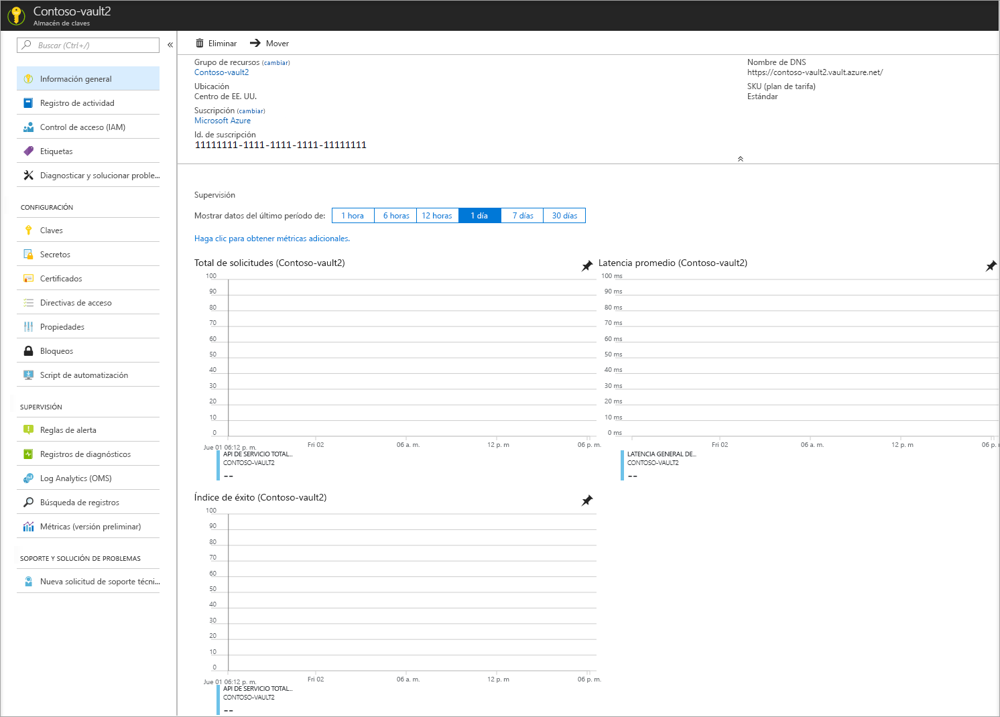

# Inicio rápido: Establecimiento y recuperación de un secreto de Azure Key Vault mediante Azure Portal

Azure Key Vault es un servicio en la nube que funciona como un almacén de secretos seguro. Puede almacenar de forma segura claves, contraseñas, certificados y otros secretos. Para más información sobre Key Vault, puede consultar esta [introducción](key-vault-overview.md). Las instancias de Azure Key Vault se pueden crear y administrar a través de Azure Portal. En esta guía de inicio rápido, va a crear un almacén de claves. Una vez que haya terminado, almacenará un secreto.

Si no tiene una suscripción a Azure, cree una [cuenta gratuita](https://azure.microsoft.com/free/?WT.mc_id=A261C142F) antes de empezar.

## Inicio de sesión en Azure

Inicie sesión en Azure Portal en http://portal.azure.com.

## Creación de un almacén

1. Seleccione la opción **Crear un recurso** de la esquina superior izquierda de Azure Portal.

    
2. En el cuadro de búsqueda, escriba **Key Vault**.
3. En la lista de resultados, elija **Key Vault**.
4. En la sección Key Vault, elija **Crear**.
5. En la sección **Crear Key Vault**, proporcione la siguiente información:
    - **Nombre**: en esta guía de inicio rápido se usará **Contoso-vault2**. Debe proporcionar un nombre exclusivo en las pruebas.
    - **Suscripción**: elija la suscripción que va a usar para esta guía de inicio rápido.
    - En **Grupo de recursos** elija **Crear nuevo** y escriba un nombre para el grupo de recursos.
    - En el menú desplegable **Ubicación** elija una ubicación.
    - Seleccione la casilla **Anclar al panel**.
    - Deje las restantes opciones con sus valores predeterminados.
6. Después de proporcionar la información descrita anteriormente, seleccione **Crear**.

Tome nota de las dos propiedades siguientes:

* **Nombre de almacén**: en este ejemplo es **Contoso-Vault2**. Utilizará este nombre para otros pasos.
* **URI de almacén**: en el ejemplo, es https://contoso-vault2.vault.azure.net/. Las aplicaciones que utilizan el almacén a través de su API de REST deben usar este identificador URI.

En este momento, su cuenta de Azure es la única autorizada para realizar operaciones en este nuevo almacén.

## Incorporación de un secreto a Key Vault

Para agregar un secreto al almacén, simplemente debe realizar un par de pasos adicionales. En este caso, se ha agregado una contraseña que una aplicación podría usar. La contraseña se denomina **ExamplePassword** y se almacena el valor de **Pa$$w0rd** en ella.

1. En la página de propiedades de Key Vault seleccione **Secretos**.
2. Haga clic en **Generar o Importar**.
3. En la pantalla **Crear un secreto** elija lo siguiente:
    - **Opciones de carga**: Manual.
    - **Nombre**: ExamplePassword.
    - **Valor**: Pa$$w0rd.
    - Deje las restantes opciones con sus valores predeterminados. Haga clic en **Create**(Crear).

Una vez que reciba el mensaje de que el secreto se ha creado correctamente, puede hacer clic en él en la lista. A continuación, puede ver algunas de las propiedades. Si hace clic en la versión actual puede ver el valor especificado en el paso anterior.

## Limpieza de recursos

Otras guías de inicio rápido y tutoriales de Key Vault se basan en esta. Si tiene pensado seguir trabajando en otras guías de inicio rápido y tutoriales, considere la posibilidad de dejar estos recursos activos.
Cuando ya no lo necesite, elimine el grupo de recursos y con esto eliminará Key Vault y los recursos relacionados. Para eliminar el grupo de recursos mediante el portal:

1. Escriba el nombre del grupo de recursos en el cuadro de búsqueda de la parte superior del portal. Cuando vea el grupo de recursos que se utiliza en esta guía de inicio rápido en los resultados de búsqueda, selecciónelo.
2. Seleccione **Eliminar grupo de recursos**.
3. En el cuadro **ESCRIBA EL NOMBRE DEL GRUPO DE RECURSOS:** escriba el nombre del grupo de recursos y seleccione **Eliminar**.

## Pasos siguientes

En esta guía de inicio rápido, ha creado una instancia de Key Vault y almacenado un secreto. Para más información sobre Key Vault y cómo lo puede utilizar con sus aplicaciones, siga con el tutorial sobre aplicaciones web que funcionan con Key Vault.

> [!div class="nextstepaction"]
> Para obtener más información sobre cómo leer un secreto desde Key Vault mediante una aplicación web con una identidad de servicio administrada, consulte el siguiente tutorial: [Configure an Azure web application to read a secret from Key vault](tutorial-web-application-keyvault.md) (Configurar una aplicación web de Azure para que lea un secreto desde el almacén de claves).
