# Inicio rápido: Creación y automatización de tareas, procesos y flujos de trabajo con Azure Logic Apps en Visual Studio

Con [Azure Logic Apps](../logic-apps/logic-apps-overview.md) y Visual Studio, puede crear flujos de trabajo que automaticen las tareas y los procesos de integración de aplicaciones, datos, sistemas y servicios a través de empresas y organizaciones. Este tutorial rápido muestra cómo puede diseñar y compilar estos flujos de trabajo mediante la creación de aplicaciones lógicas en Visual Studio y la implementación de esas aplicaciones en <a href="https://docs.microsoft.com/azure/guides/developer/azure-developer-guide" target="_blank">Azure</a> en la nube. Aunque puede realizar estas tareas en <a href="https://portal.azure.com" target="_blank">Azure Portal</a>, Visual Studio le permite agregar aplicaciones lógicas para el control de código fuente, publicar versiones diferentes y crear plantillas de Azure Resource Manager para distintos entornos de implementación. 

Si no está familiarizado con Azure Logic Apps y solo desea conocer los conceptos básicos, pruebe en su lugar con el [inicio rápido para crear una aplicación lógica en Azure Portal](../logic-apps/quickstart-create-first-logic-app-workflow.md). El Diseñador de aplicación lógica, tanto en Azure Portal como en Visual Studio, funciona de forma similar. 

En este caso, crea la misma aplicación lógica que en el inicio rápido de Azure Portal pero con Visual Studio. Esta aplicación lógica supervisa la fuente RSS de un sitio web y envía un correo electrónico para cada nuevo elemento publicado en el sitio. Cuando haya terminado, la aplicación lógica se parecerá a este flujo de trabajo general:

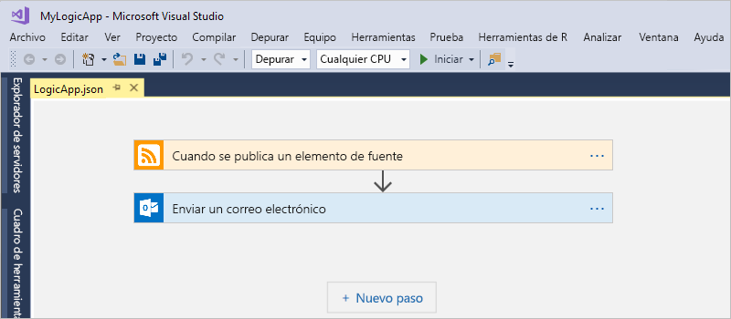

Antes de empezar, asegúrese de que dispone de estos elementos:

* Si no tiene una suscripción de Azure, <a href="https://azure.microsoft.com/free/" target="_blank">regístrese para obtener una cuenta gratuita de Azure</a>.

* Descargue e instale estas herramientas si no las tiene aún: 

  * <a href="https://www.visualstudio.com/downloads" target="_blank">Visual Studio 2017 o Visual Studio 2015 - Community Edition o superior</a>. 
  Este inicio rápido usa Visual Studio Community 2017, que es gratuito.

  * <a href="https://azure.microsoft.com/downloads/" target="_blank">Microsoft Azure SDK para .NET (2.9.1 o versiones posteriores)</a> y <a href="https://github.com/Azure/azure-powershell#installation" target="_blank">Azure PowerShell</a>. 
  Más información sobre <a href="https://docs.microsoft.com/dotnet/azure/dotnet-tools?view=azure-dotnet">Azure SDK for .NET</a>.

  * <a href="https://marketplace.visualstudio.com/items?itemName=VinaySinghMSFT.AzureLogicAppsToolsforVisualStudio-18551" target="_blank">Herramientas de Azure Logic Apps para Visual Studio de 2017</a> o la <a href="https://marketplace.visualstudio.com/items?itemName=VinaySinghMSFT.AzureLogicAppsToolsforVisualStudio" target="_blank">versión de Visual Studio 2015</a>
  
    Puede descargar e instalar Herramientas de Azure Logic Apps directamente desde Visual Studio Marketplace o aprender <a href="https://docs.microsoft.com/visualstudio/ide/finding-and-using-visual-studio-extensions" target="_blank">a instalar esta extensión desde Visual Studio</a>. 
    Asegúrese de reiniciar Visual Studio después de finalizar la instalación.

* Una cuenta de correo electrónico que sea compatible con Logic Apps, como Office 365 Outlook, Outlook.com o Gmail. En el caso de otros proveedores, <a href="https://docs.microsoft.com/connectors/" target="_blank">consulte la lista de conectores que se muestra aquí</a>. Esta aplicación lógica usa Office 365 Outlook. Si usa otro proveedor distinto, los pasos generales serán los mismos pero su interfaz de usuario puede ser ligeramente distinta.

* Acceso a la web al usar el Diseñador de aplicación lógica integrado

  El diseñador requiere una conexión a Internet para crear recursos en Azure y leer las propiedades y los datos de los conectores de la aplicación lógica. 
  Por ejemplo, si usa el conector de Dynamics CRM Online, el diseñador comprueba en la instancia de CRM si hay propiedades predeterminadas y propiedades personalizadas disponibles.

## Creación de un proyecto de grupo de recursos de Azure

Para empezar, cree un [proyecto de grupo de recursos de Azure](../azure-resource-manager/vs-azure-tools-resource-groups-deployment-projects-create-deploy.md). Más información sobre [grupos de recursos y recursos de Azure](../azure-resource-manager/resource-group-overview.md).

1. Inicie Visual Studio e inicie sesión con su cuenta de Azure.

2. En el menú **Archivo**, seleccione **Nuevo** > **Proyecto**. (Teclado: Ctrl+Mayús+N)

   

3. En **Instalado**, seleccione **Visual C#** o **Visual Basic**. Seleccione **Nube** > **Grupo de recursos de Azure**. Asigne un nombre al proyecto, por ejemplo:

   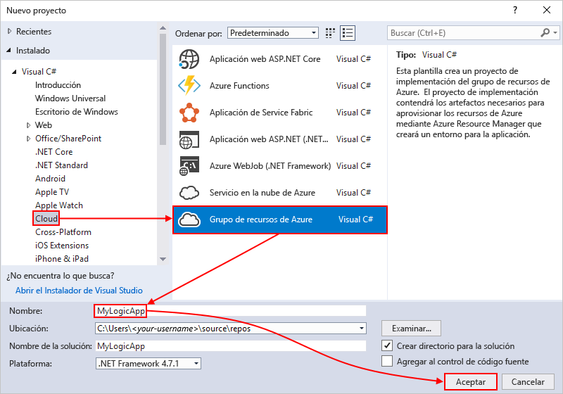

4. Seleccione la plantilla **Logic App**. 

   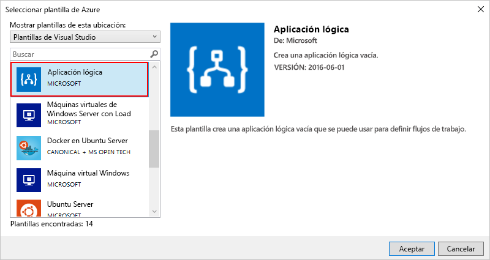

   Después de que Visual Studio cree el proyecto, el Explorador de soluciones se abre y muestra la solución. 

   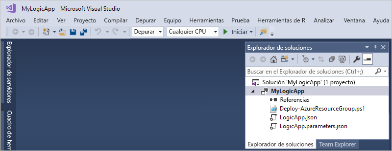

   En la solución, el archivo**LogicApp.json** no solo almacena la definición de la aplicación lógica sino que también es una plantilla de Azure Resource Manager que puede configurar para la implementación.

## Creación de una aplicación lógica en blanco

Después de crear el proyecto del grupo de recursos de Azure, cree y compile la aplicación lógica a partir de la plantilla **Blank Logic App**.

1. En el Explorador de soluciones, abra el menú contextual para el archivo **LogicApp.json**. Seleccione **Open with Logic App Designer** (Abrir con Diseñador de aplicación lógica). (Teclado: Ctrl+L)

   

2. En **Suscripción**, seleccione la suscripción de Azure que quiera usar. Para **Grupo de recursos**, seleccione **Crear nuevo...**, que crea un nuevo grupo de recursos de Azure. 

   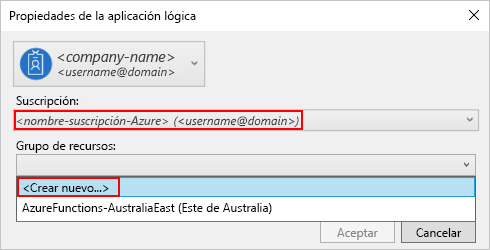

   Visual Studio necesita su suscripción de Azure y un grupo de recursos para crear e implementar recursos asociados con la aplicación lógica y las conexiones. 

   | Configuración | Valor de ejemplo | DESCRIPCIÓN | 
   | ------- | ------------- | ----------- | 
   | Lista de perfil de usuario | Contoso   jamalhartnett@contoso.com | De forma predeterminada, la cuenta que usó para iniciar sesión. | 
   | **Suscripción** | Pay-As-You-Go   (jamalhartnett@contoso.com) | Nombre de la suscripción de Azure y cuenta asociada |
   | **Grupo de recursos** | MyLogicApp-RG   (Oeste de EE. UU.) | Grupo de recursos de Azure y ubicación para almacenar e implementar recursos para la aplicación lógica | 
   | **Ubicación** | MyLogicApp-RG2   (Oeste de EE. UU.) | Ubicación diferente si no desea usar la ubicación del grupo de recursos |
   ||||

3. El Diseñador de aplicación lógica se abre y muestra una página con un vídeo de introducción y desencadenadores utilizados frecuentemente. Desplácese más allá del vídeo y los desencadenadores. En **Plantillas**, elija **Blank Logic App**.

   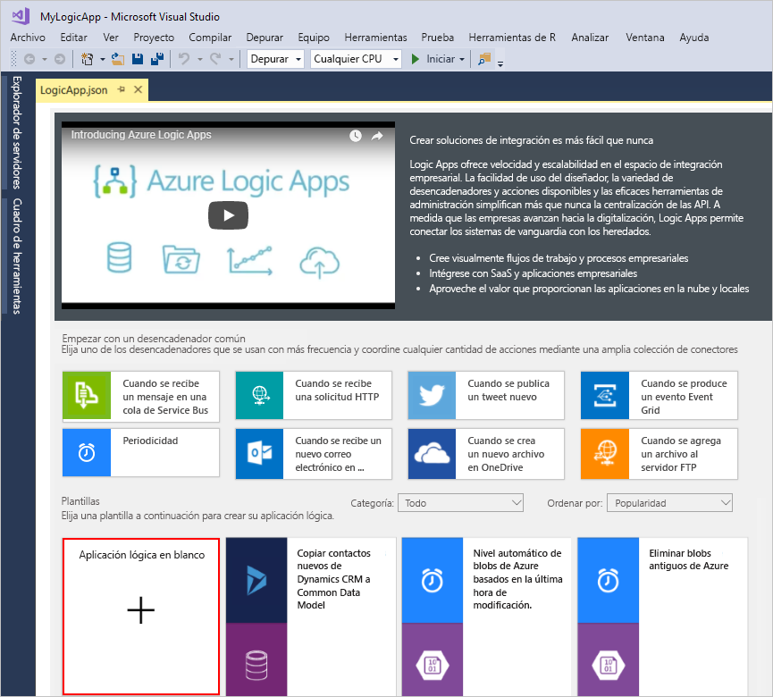

## Creación de un flujo de trabajo de aplicación lógica

A continuación, añada un [desencadenador](../logic-apps/logic-apps-overview.md#logic-app-concepts) que se active cuando aparezca un nuevo elemento en la fuente RSS. Cada aplicación lógica debe comenzar con un desencadenador, que se desencadena cuando se cumplen criterios específicos. Cada vez que el desencadenador se activa, el motor de Logic Apps crea una instancia de aplicación lógica que ejecuta el flujo de trabajo.

1. En el Diseñador de aplicación lógica, escriba "rss" en el cuadro de búsqueda. Seleccione este desencadenador: **When a feed item is published** (Cuando se publica un elemento de fuente)

   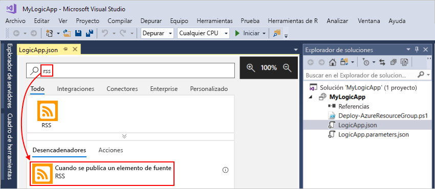

   El desencadenador aparece ahora en el diseñador:

   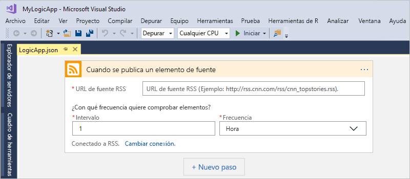

2. Para terminar de crear la aplicación lógica, siga los pasos del flujo de trabajo en el [Inicio rápido de Azure Portal](../logic-apps/quickstart-create-first-logic-app-workflow.md#add-rss-trigger) y, después, vuelva a este artículo.

   Cuando haya terminado, la aplicación lógica se parecerá a este ejemplo: 

   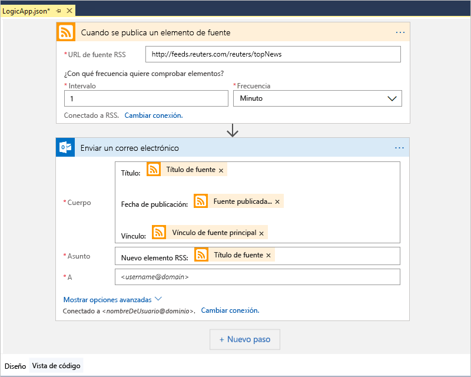

3. Para guardar la aplicación lógica, guarde la solución de Visual Studio. (Teclado: Ctrl+S)

Antes de poder probar la aplicación lógica, implemente la aplicación en Azure.

## Implementación de la aplicación lógica en Azure

Antes de poder ejecutar la aplicación lógica, implemente la aplicación desde Visual Studio en Azure, lo que solo le llevará unos pasos.

1. En el Explorador de soluciones, en el menú contextual del proyecto, seleccione **Implementar** > **Nuevo**. Si se le pide, inicie sesión en su cuenta de Azure.

   

2. Para esta implementación, mantenga la suscripción de Azure, el grupo de recursos y otras configuraciones predeterminadas. Cuando esté preparado, elija **Implementar**. 

   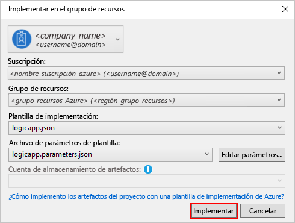

3. Si aparece el cuadro **Editar parámetros**, proporcione el nombre de recurso para la aplicación lógica que va a usar en la implementación y guarde la configuración, por ejemplo:

   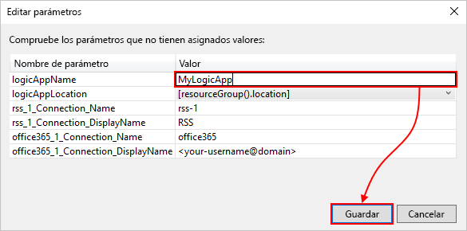

   Cuando se inicia la implementación, aparece el estado de la implementación de la aplicación en la ventana **Salida** de Visual Studio. 
   Si no aparece el estado, abra la lista **Mostrar salida de** y seleccione el grupo de recursos de Azure.

   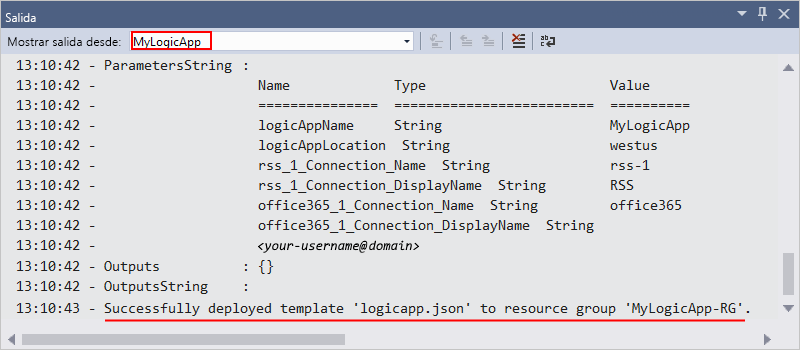

   Una vez finalizada la implementación, la aplicación lógica está activa en Azure Portal y comprueba la fuente RSS en función de la programación especificada (cada minuto). 
   Si la fuente RSS tiene nuevos elementos, la aplicación lógica envía un correo electrónico para cada uno de ellos. 
   En caso contrario, la aplicación lógica espera hasta el siguiente intervalo antes de volver a comprobar. 

   Por ejemplo, estos son correos electrónicos de ejemplo que envía esta aplicación lógica. 
   Si no obtiene los mensajes de correo electrónico, compruebe la carpeta de correo electrónico no deseado. 

   

   Técnicamente, cuando el desencadenador comprueba la fuente RSS y encuentra nuevos elementos, el desencadenador se activa y el motor de Logic Apps crea una instancia de flujo de trabajo de la aplicación lógica que ejecuta las acciones en el flujo de trabajo.
   Si el desencadenador no encuentra nuevos elementos, no se activa y "omite" crear instancias de flujo de trabajo.

Ya ha generado e implementado correctamente la aplicación lógica con Visual Studio. Para administrar la aplicación lógica y revisar su historial de ejecución, consulte [Administración de aplicaciones lógicas con Visual Studio](../logic-apps/manage-logic-apps-with-visual-studio.md).

## Limpieza de recursos

Cuando ya no lo necesite, elimine el grupo de recursos que contiene la aplicación lógica y los recursos relacionados.

1. Inicie sesión en <a href="https://portal.azure.com" target="_blank">Azure Portal</a> con la misma cuenta utilizada para crear la aplicación lógica. 

2. En el menú principal de Azure, seleccione **Grupos de recursos**.
Seleccione el grupo de recursos para la aplicación lógica, y luego **Información general**.

3. En la página **Información general**, elija **Eliminar grupo de recursos**. Escriba el nombre del grupo de recursos como confirmación y elija **Eliminar**.

   

4. Elimine la solución de Visual Studio del equipo local.

## Obtención de soporte técnico

* Si tiene alguna duda, visite el <a href="https://social.msdn.microsoft.com/Forums/en-US/home?forum=azurelogicapps" target="_blank">foro de Azure Logic Apps</a>.
* Para enviar ideas sobre características o votar sobre ellas, visite el <a href="http://aka.ms/logicapps-wish" target="_blank">sitio de comentarios de los usuarios de Logic Apps</a>.

## Pasos siguientes

En este artículo, se compila, implementa y ejecuta la aplicación lógica con Visual Studio. Para más información acerca de cómo administrar y realizar la implementación avanzada de aplicaciones lógicas con Visual Studio, consulte estos artículos:

> [!div class="nextstepaction"]
> * [Administración de aplicaciones lógicas con Visual Studio](../logic-apps/manage-logic-apps-with-visual-studio.md)
> * [Creación de plantillas de implementación para aplicaciones lógicas con Visual Studio](../logic-apps/logic-apps-create-deploy-template.md)
