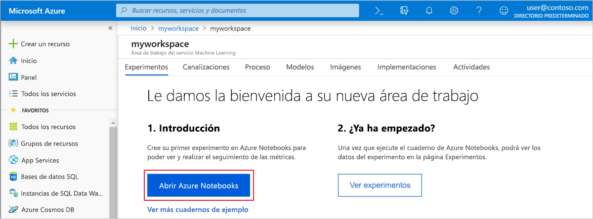
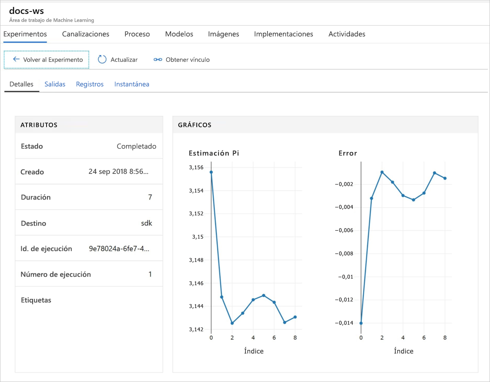

# <a name="quickstart-use-the-azure-portal-to-get-started-with-azure-machine-learning-service"></a>Guía de inicio rápido: Uso de Azure Portal para empezar a trabajar con el servicio Azure Machine Learning

En esta guía de inicio rápido aprenderá a usar Azure Portal para crear un área de trabajo para el servicio Azure Machine Learning. Esta área de trabajo se encuentra en la nube y es el bloque fundamental para experimentar, entrenar e implementar modelos de aprendizaje automático con el servicio Azure Machine Learning. 

En este tutorial, aprenderá lo siguiente:

* Crear un área de trabajo en la suscripción de Azure
* Probarla con Python en una instancia de Azure Notebooks y registrar los valores de varias iteraciones
* Ver los valores registrados en el área de trabajo

Para su comodidad, los siguientes recursos de Azure se agregarán automáticamente al área de trabajo cuando estén disponibles de forma regional: [Container Registry](https://azure.microsoft.com/services/container-registry/), [Storage](https://azure.microsoft.com/services/storage/), [Application Insights](https://azure.microsoft.com/services/application-insights/) y [Key Vault](https://azure.microsoft.com/services/key-vault/).

Los recursos que cree se pueden usar como requisitos previos para otros tutoriales y artículos de procedimientos de Azure Machine Learning. Al igual que en otros servicios de Azure, existen límites en determinados recursos; por ejemplo, el tamaño del clúster de BatchAI) asociados con el servicio Azure Machine Learning. Lea [este](how-to-manage-quotas.md) artículo sobre los límites predeterminados y cómo solicitar una cuota mayor.

Si no tiene una suscripción a Azure, cree una [cuenta gratuita](https://azure.microsoft.com/free/?WT.mc_id=A261C142F) antes de empezar.


## <a name="create-a-workspace"></a>Crear un área de trabajo 

[!INCLUDE [aml-create-portal](../../../includes/aml-create-in-portal.md)]

En la página del área de trabajo, haga clic en `Explore your Azure Machine Learning service workspace`.

 


## <a name="use-the-workspace"></a>Uso del área de trabajo

Vea ahora cómo un área de trabajo lo ayuda a administrar los scripts de aprendizaje automático. En esta sección hará lo siguiente:

* Abrir un cuaderno en Azure Notebooks
* Ejecutar código que cree algunos valores registrados
* Ver los valores registrados en el área de trabajo

Esto es un ejemplo de cómo el área de trabajo puede ayudarlo a realizar un seguimiento de la información generada en un script. 

### <a name="open-a-notebook"></a>Abra un cuaderno. 

Azure Notebooks proporciona una plataforma de nube gratuita para cuadernos de Jupyter Notebook configurados previamente con todo lo que necesita para ejecutar el servicio Azure Machine Learning.  

Haga clic en el botón `Open Azure Notebooks` para probar su primer experimento.

 

Después de iniciar sesión, se abrirá una nueva pestaña y un aviso `Clone Library`.  Haga clic en `Clone`


### <a name="run-the-notebook"></a>Ejecución del cuaderno

Además de los dos cuadernos, verá un archivo `config.json`.  Este archivo de configuración contiene información sobre el área de trabajo que acaba de crear.  

Haga clic en `01.run-experiment.ipynb` para abrir el cuaderno.

Puede ejecutar las celdas de una en una mediante `Shift`+`Enter`.  También puede usar el menú `Cells` > `Run All` para ejecutar todo el cuaderno.  Cuando vea un [*] junto a una celda, significa que se está ejecutando.  Cuando se complete el código de esa celda, aparecerá un número.

Es posible que se le pida que inicie sesión.  Copie el código en el mensaje y, a continuación, haga clic en el vínculo y pegue el código en la nueva ventana.  Asegúrese de no copiar un espacio antes o después del código.  Inicie sesión con la misma cuenta que usó en Azure Portal.

 

En el cuaderno, la segunda celda lee los datos de `config.json` para conectarse a su área de trabajo.
```
ws = Workspace.from_config()
```

La tercera celda de código inicia un experimento con el nombre "my-first-experiment".  Utilizará este nombre para buscar información de la ejecución de nuevo en el área de trabajo.

```
experiment = Experiment(workspace_object=ws, name = "my-first-experiment")
```

Observe en la última celda del cuaderno que los valores se escriben en un archivo de registro.

```
# Log final results
run.log("Final estimate: ",pi_estimate)
run.log("Final error: ",math.pi-pi_estimate)
```

Puede ver estos valores en el área de trabajo después de ejecutar el código.

## <a name="view-logged-values"></a>Visualización de los datos registrados

Cuando se hayan completado todas las celdas del cuaderno, vuelva a la página del portal.  

Haga clic en `View Experiments`.


Cierre la ventana emergente `Reports`.

Haga clic en `my-first-experiment`.

Consulte la información sobre la ejecución que acaba de realizar.  Desplácese hacia abajo hasta encontrar la tabla de ejecuciones y haga clic en el vínculo del número de ejecución.

 

Consulte los trazados que se crearon automáticamente de los valores registrados:

   

## <a name="clean-up-resources"></a>Limpieza de recursos 

[!INCLUDE [aml-delete-resource-group](../../../includes/aml-delete-resource-group.md)]

También puede mantener el grupo de recursos, pero elimine un área de trabajo mostrando las propiedades del área de trabajo y seleccionando el botón Eliminar.

## <a name="next-steps"></a>Pasos siguientes

Ya ha creado los recursos necesarios para comenzar a experimentar e implementar modelos. También ha ejecutado código en un cuaderno y ha explorado el historial de ejecución de ese código en el área de trabajo en la nube.

Para ver de forma detallada la experiencia de flujo de trabajo, siga los tutoriales de Azure Machine Learning para entrenar e implementar un modelo.  

> [!div class="nextstepaction"]
> [Tutorial: Train an image classification model](tutorial-train-models-with-aml.md) (Tutorial: Entrenamiento de un modelo de clasificación de imágenes)
