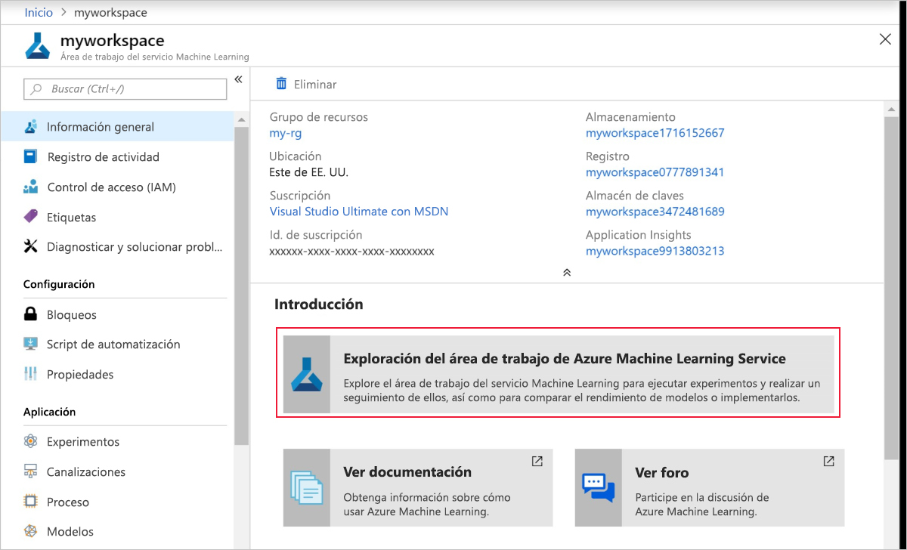
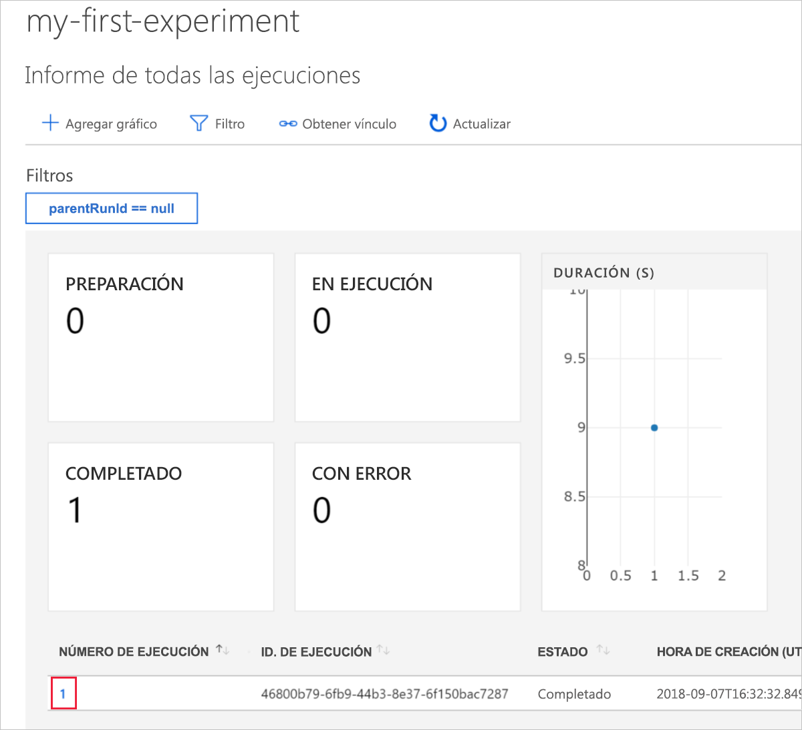

# Guía de inicio rápido: Uso de Azure Portal para empezar a trabajar con Azure Machine Learning

En esta guía de inicio rápido, aprenderá a usar Azure Portal para crear un área de trabajo de Azure Machine Learning. Esta área de trabajo se encuentra en la nube y es el bloque fundamental que se utiliza para experimentar, entrenar e implementar modelos de aprendizaje automático con Machine Learning. Esta guía de inicio rápido usa recursos en la nube y no requiere ninguna instalación. Si prefiere configurar su propio servidor de Jupyter Notebook, consulte [Guía de inicio rápido: Uso de Python para empezar a trabajar con Azure Machine Learning](quickstart-create-workspace-with-python.md).

> [!VIDEO https://www.microsoft.com/en-us/videoplayer/embed/RE2F9Ad]

En esta guía de inicio rápido:

* Crear un área de trabajo en la suscripción de Azure.
* Probarla con Python en cuaderno de Azure y registrar los valores de varias iteraciones.
* Ver los valores registrados en el área de trabajo.

Los siguientes recursos de Azure se agregan automáticamente al área de trabajo cuando estén disponibles por regiones:

  - [Azure Container Registry](https://azure.microsoft.com/services/container-registry/)
  - [Azure Storage](https://azure.microsoft.com/services/storage/)
  - [Azure Application Insights](https://azure.microsoft.com/services/application-insights/) 
  - [Azure Key Vault](https://azure.microsoft.com/services/key-vault/)

Los recursos que cree se pueden usar como requisitos previos para otros tutoriales y artículos de procedimientos de Machine Learning. Al igual que en otros servicios de Azure, existen límites en determinados recursos asociados con Machine Learning. Un ejemplo es el tamaño del clúster de Azure Batch AI. Para más información sobre los límites predeterminados y cómo aumentar la cuota, consulte [este artículo](how-to-manage-quotas.md).

Si no tiene una suscripción a Azure, cree una [cuenta gratuita](https://azure.microsoft.com/free/?WT.mc_id=A261C142F) antes de empezar.

## Crear un área de trabajo 

[!INCLUDE [aml-create-portal](../../../includes/aml-create-in-portal.md)]

En la página del área de trabajo, seleccione `Explore your Azure Machine Learning service workspace`.

 

## Uso del área de trabajo

Vea ahora cómo un área de trabajo lo ayuda a administrar los scripts de aprendizaje automático. En esta sección:

* Va a abrir un cuaderno en Azure Notebooks.
* Ejecutará código que cree algunos valores registrados.
* Verá los valores registrados en el área de trabajo.

En este ejemplo se muestra cómo el área de trabajo puede ayudarle a realizar un seguimiento de la información generada en un script. 

### Abra un cuaderno. 

Azure Notebooks proporciona una plataforma de nube gratuita para cuadernos de Jupyter Notebook, configurados previamente con todo lo que necesita para ejecutar Machine Learning.  

Seleccione `Open Azure Notebooks` para probar su primer experimento.

 

Su organización puede requerir el [consentimiento del administrador](https://notebooks.azure.com/help/signing-up/work-or-school-account/admin-consent) para poder iniciar sesión.

Después de iniciar sesión, se abrirá una nueva pestaña y un aviso `Clone Library`. Seleccionar `Clone`

### Ejecución del cuaderno

Además de los dos cuadernos, se ve un archivo `config.json`. Este archivo de configuración contiene información sobre el área de trabajo que ha creado.  

Seleccione `01.run-experiment.ipynb` para abrir el cuaderno.

Para ejecutar las celdas de una en una, utilice `Shift`+`Enter`. O bien, seleccione `Cells` > `Run All` para ejecutar todo el cuaderno. Cuando vea un asterisco [*] junto a una celda, significa que se está ejecutando. Cuando finalice el código de esa celda, aparece un número. 

Después de haber completado la ejecución de todas las celdas del cuaderno, puede ver los valores registrados en el área de trabajo.

## Visualización de los datos registrados

Cuando se hayan ejecutado todas las celdas del cuaderno, vuelva a la página del portal.  

Seleccione `View Experiments`.

Cierre la ventana emergente `Reports`.

Seleccione `my-first-experiment`.

Consulte la información sobre la ejecución que acaba de realizar. Desplácese hacia abajo en la página para encontrar la tabla de ejecuciones. Seleccione el vínculo del número de ejecución.

 

Consulte los trazados que se crearon automáticamente de los valores registrados. Cada vez que registre varios valores con el mismo parámetro de nombre, se genera automáticamente un trazado.

   

Como el código para la aproximación de pi usa valores aleatorios, los trazados mostrarán otros valores.  

## Limpieza de recursos 

[!INCLUDE [aml-delete-resource-group](../../../includes/aml-delete-resource-group.md)]

También puede mantener el grupo de recursos pero eliminar una única área de trabajo. Muestre las propiedades del área de trabajo y seleccione **Eliminar**.

## Pasos siguientes

Ha creado los recursos necesarios para experimentar con modelos e implementarlos. También ha ejecutado algún código en un cuaderno. Y ha explorado el historial de ejecución desde dicho código en el área de trabajo en la nube.

Para ver de forma detallada la experiencia de flujo de trabajo, siga los tutoriales de Machine Learning para entrenar e implementar un modelo.  

> [!div class="nextstepaction"]
> [Tutorial: Train an image classification model](tutorial-train-models-with-aml.md) (Tutorial: Entrenamiento de un modelo de clasificación de imágenes)
