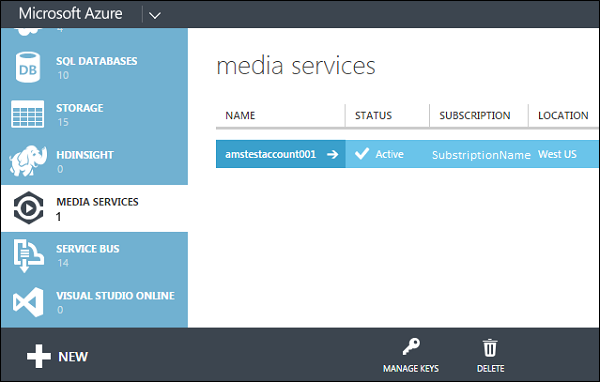

<properties urlDisplayName="How to create" pageTitle="Creación de una cuenta de Servicios multimedia - Azure" metaKeywords="" description="Describes how to create a new Media Services account in Azure." metaCanonical="" services="media-services" documentationCenter="" title="How to Create a Media Services Account" authors="juliako" solutions="" manager="dwrede" editor="" />

<tags ms.service="media-services" ms.workload="media" ms.tgt_pltfrm="na" ms.devlang="na" ms.topic="article" ms.date="10/30/2014" ms.author="juliako" />

#Creación de una cuenta de Servicios multimedia

El Portal de administración de Azure proporciona una forma rápida de crear una cuenta de Servicios multimedia de Azure. Puede usar la cuenta para obtener acceso a Servicios multimedia que le permiten almacenar, cifrar, codificar, administrar y transmitir contenido multimedia en Azure. En el momento en el que crea una cuenta de Servicios multimedia, también crea una cuenta de almacenamiento asociada (o usa una ya existente) en la misma región geográfica que la cuenta de Servicios multimedia. 

En este tema se explica cómo usar el método Quick Create para crear una nueva cuenta de Servicios multimedia y, a continuación, asociarla a una cuenta de almacenamiento. 

##Tabla de contenido

-  [Conceptos][]
-  [Creación de una cuenta de Servicios multimedia mediante Creación rápida][]

<h2>Conceptos</h2>
El acceso a Servicios multimedia requiere dos cuentas asociadas:

-   **Una cuenta de Servicios multimedia**. La cuenta le proporciona acceso a un conjunto de Servicios multimedia basados en la nube que están disponibles en Azure. Una cuenta de Servicios multimedia no almacena el contenido multimedia real, sino que almacena metadatos sobre el contenido multimedia y trabajos de procesamiento multimedia en su cuenta. En el momento en el que cree la cuenta, seleccione una región de Servicios multimedia disponible. La región que selecciona es un centro de datos que almacena los registros de metadatos para su cuenta. 
    > [WACOM.NOTE]
    > Entre las regiones de Servicios multimedia disponibles se encuentran las siguientes: **Norte de Europa**, **Oeste de Europa**, **Oeste de EE. UU.**, **Este de EE. UU.**, **Sudeste de Asia**, **Este de Asia**, **Oeste de Japón** y **Este de Japón**. Servicios multimedia no usa grupos de afinidad. 
-   **Una cuenta de almacenamiento asociada**. La cuenta de almacenamiento es una cuenta de almacenamiento de Azure asociada a una cuenta de Servicios multimedia. La cuenta de almacenamiento proporciona almacenamiento de blobs para archivos multimedia y debe ubicarse en la misma región geográfica que la cuenta de Servicios multimedia. Cuando cree una cuenta de Servicios multimedia, podrá elegir una cuenta de almacenamiento existente en la misma región o crear una nueva cuenta de almacenamiento en la misma región. Si elimina una cuenta de Servicios multimedia, no se eliminarán los blobs de la cuenta de almacenamiento relacionada. 

<h2>Reproducción de una cuenta de Servicios multimedia mediante Creación rápida</h2>

1. En el [Portal de administración][], haga clic en **Nuevo**, después en **Servicios multimedia** y, finalmente, en **Creación rápida**.
   
	

2. En **NOMBRE**, especifique el nombre de la cuenta nueva. El nombre de cuenta de Servicios multimedia debe estar compuesto de números o letras en minúscula, sin espacios y con una longitud de entre 3 y 24 caracteres. 

3. In **REGIÓN**, seleccione la región geográfica que se usará para almacenar los registros de metadatos para la cuenta de Servicios multimedia. Solo las regiones de Servicios multimedia disponibles aparecen en el cuadro desplegable. 

4. En **CUENTA DE ALMACENAMIENTO**, seleccione una cuenta de almacenamiento para proporcionar almacenamiento de blobs del contenido multimedia desde la cuenta de Servicios multimedia. Puede seleccionar una cuenta de almacenamiento existente en la misma región geográfica que la cuenta de Servicios multimedia o crear una nueva cuenta de almacenamiento. Se crea una nueva cuenta de almacenamiento en la misma región. 

5. Si ha creado una nueva cuenta de almacenamiento, en **NOMBRE DE NUEVA CUENTA DE ALMACENAMIENTO**, especifique un nombre para la cuenta de almacenamiento. Las reglas para los nombres de cuenta de almacenamiento son las mismas que para las cuentas de Servicios multimedia.

6. Haga clic en **Creación rápida** en la parte inferior del formulario.

	Puede supervisar el estado del proceso en el área de mensajes situada en parte inferior de la ventana.

	Se abrirá la página **Servicios multimedia** con la nueva cuenta. Cuando el estado cambie a Active, la cuenta se habrá creado correctamente.

	

	Cuando haga doble clic en el nombre de cuenta, se mostrará la página de inicio rápido de forma predeterminada. La página le permite realizar algunas tareas de administración que también están disponibles en otras páginas del portal. Por ejemplo, puede cargar un archivo de vídeo desde esta página o hacerlo desde la página CONTENT.

	Además, puede ver el código que usa el SDK de Servicios multimedia de Azure para realizar las siguientes tareas: cargar, codificar y publicar vídeos. Puede hacer clic en uno de los vínculos en la sección WRITE SOME CODE, copiar el código y usarlo en su aplicación. 

<!-- Reusable paths. -->

<!-- Anchors. -->
  [Conceptos]: #concepts
  [Antes de empezar]: #begin
  [Creación de una cuenta de Servicios multimedia mediante Creación rápida]: #quick

<!-- URLs. -->
  [Instalador de plataforma web]: http://go.microsoft.com/fwlink/?linkid=255386
  
  [Portal de administración]: http://manage.windowsazure.com/

<!--HONumber=35.1-->
