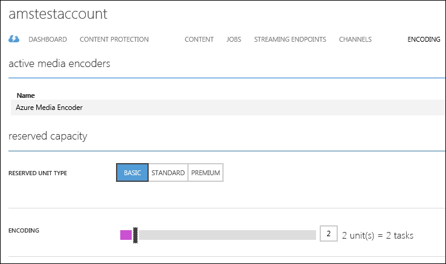

<properties urlDisplayName="How to scale" pageTitle="Escalación de un servicio multimedia | Documentación de Azure" metaKeywords="" description="Learn how to scale Media Services by specifying the number of On-Demand Streaming Reserved Units and Encoding Reserved Units that you would like your account to be provisioned with." metaCanonical="" services="media-services" documentationCenter="" title="How to Scale a Media Service" authors="juliako" solutions="" manager="dwrede" editor="" />

<tags ms.service="media-services" ms.workload="media" ms.tgt_pltfrm="na" ms.devlang="na" ms.topic="article" ms.date="10/30/2014" ms.author="juliako" />

#Escalación de un Servicio multimedia  

[WACOM.INCLUDE [disclaimer](../includes/disclaimer.md)]

Es posible escalar Servicios multimedia mediante la especificación del número de **unidades reservadas de streaming a petición** y **unidades reservadas de codificación** con las que desea aprovisionar la cuenta. 

<h2>Unidades reservadas de streaming a petición</h2>

Las unidades reservadas de streaming a petición ofrecen una capacidad de salida dedicada que puede adquirirse en incrementos de 200 Mbps y una funcionalidad adicional que incluye [capacidades de empaquetado dinámico].(http://go.microsoft.com/fwlink/?LinkId=276874). De manera predeterminada, el streaming a petición está configurado en un modelo de instancias compartidas para el que se comparten recursos de servidor (por ejemplo, proceso, capacidad de salida, entre otros) con los demás usuarios. Para mejorar el resultado del streaming a petición, se recomienda adquirir unidades reservadas de streaming a petición. 

Para cambiar el número de dichas unidades, haga lo siguiente:

1. En el [Portal de administración](https://manage.windowsazure.com/), haga clic en **Servicios multimedia**. A continuación, haga clic en el nombre del servicio multimedia.

2. Seleccione la página EXTREMOS DE STREAMING. Luego, haga clic en el extremo de streaming que quiere modificar.

3. Para especificar el número de unidades de streaming, seleccione la pestaña ESCALA y desplace el control deslizante de **capacidad reservada**.

	

4. Presione el botón SAVE para guardar los cambios.

	La asignación de cualquier nueva unidad de streaming a petición puede tardar unos 20 minutos en finalizarse. 

	 
	>[Azure.Note] Actualmente, pasar de cualquier valor positivo de unidades de streaming a petición a ninguno puede deshabilitar el streaming a petición hasta una hora.

	>[Azure.Note] Se utiliza el número más elevado de unidades especificadas durante el período de 24 horas al calcular el coste. Para obtener más información acerca del precio, consulte la página sobre [información del precio de Servicios multimedia].(http://go.microsoft.com/fwlink/?LinkId=275107).

<h2>Unidades reservadas de codificación</h2>

El número de unidades reservadas de codificación aprovisionadas es igual al número de tareas multimedia que se pueden procesar simultáneamente en una cuenta específica. Por ejemplo, si la cuenta tiene cinco unidades reservadas, se ejecutarán simultáneamente cinco tareas multimedia siempre que haya tareas para procesar. Las tareas restantes esperarán en la cola y se elegirán para el procesamiento secuencialmente tan pronto como finalice la tarea en ejecución. Si una cuenta no tiene ninguna unidad reservada aprovisionada, las tareas se elegirán de manera secuencial. En este caso, el tiempo de espera entre la finalización de una tarea y el inicio de la siguiente dependerá de la disponibilidad de los recursos del sistema.

Para cambiar el número de unidades reservadas de codificación, haga lo siguiente:

1. En el [Portal de administración](https://manage.windowsazure.com/), haga clic en **Servicios multimedia**. A continuación, haga clic en el nombre del servicio multimedia.

2. Seleccione la página CODIFICACIÓN. 
	
	La página Codificación le permite seleccionar entre tres tipos diferentes de unidades reservadas de codificación.  Basic, Standard y Premium (como se muestra a continuación).

	

	Puede cambiar el número de unidades reservadas del TIPO DE UNIDAD RESERVADA seleccionada mediante el control deslizante de CODIFICACIÓN.  
	
	La diferencia principal entre los tipos de unidades reservadas es la velocidad. Por ejemplo, el mismo trabajo de codificación se ejecuta más rápido cuando se usa el tipo de unidad reservada Standard en comparación con el tipo Basic. Para obtener más información, consulte el blog acerca de los tipos de unidades reservadas de codificación escrito por [Milan Gada](http://azure.microsoft.com/blog/author/milanga/).

	>[Azure.Note] Los siguientes datos se centran en no ofrecer el tipo de unidad reservada Premium: Singapur, Hong Kong, Osaka, Beijing, Shanghai.

3. Presione el botón SAVE para guardar los cambios.

	Las nuevas unidades reservadas de codificación se asignan en cuanto presiona GUARDAR.

	>[Azure.Note] Se utiliza el número más elevado de unidades especificadas durante el período de 24 horas al calcular el coste.

<h2>Apertura de una incidencia de soporte técnico</h2>

De manera predeterminada las cuentas de Servicios multimedia pueden escalar hasta 25 unidades reservadas de codificación y 5 de streaming a petición. Si desea solicitar un límite mayor, abra una incidencia de soporte técnico.

Para abrir una incidencia de soporte técnico, haga lo siguiente: 

1. Inicie sesión su cuenta de Azure en [Portal de administración](http://manage.windowsazure.com).
2. Vaya a [Soporte técnico](http://www.windowsazure.com/en-us/support/contact/).
3. Haga clic en "Get Support".
4. Seleccione su suscripción.
5. En el tipo de soporte, seleccione "Técnico".
6. Haga clic en "Crear incidencia".
7. Seleccione "Servicios multimedia de Microsoft Azure" en la lista de productos que se muestran en la página siguiente.
8. Seleccione "Media Processing" como "Problem type" y, a continuación, seleccione "Reservation Units" en categoría.
9. Haga clic en Continue.
10. Siga las instrucciones de la página siguiente y, a continuación, especifique los detalles sobre cuántas unidades reservadas de streaming a petición o de codificación necesita.
11. Haga clic en Submit para abrir la incidencia.

 

<!--HONumber=35.1-->
