<properties linkid="develop-mobile-tutorials-dotnet-backend-get-started-with-data-wp8" urlDisplayName="Get Started with Data" pageTitle="Get started with data (Windows Phone) | Mobile Dev Center" metaKeywords="" description="Learn how to get started using Mobile Services to leverage data in your Windows Phone app." metaCanonical="" services="" documentationCenter="Mobile" title="Get started with data in Mobile Services" authors="wesmc" solutions="" manager="" editor="" />

Introducción a los datos en Servicios móviles
=============================================

[C\# para Tienda Windows](/en-us/documentation/articles/mobile-services-dotnet-backend-windows-store-dotnet-get-started-data/ "C# para Tienda Windows") [JavaScript para Tienda Windows](/en-us/documentation/articles/mobile-services-dotnet-backend-windows-store-javascript-get-started-data/ "JavaScript para Tienda Windows") [Windows Phone](/en-us/documentation/articles/mobile-services-dotnet-backend-windows-phone-get-started-data/ "Windows Phone")

[Back-end de .NET](/en-us/documentation/articles/mobile-services-dotnet-backend-windows-phone-get-started-data/ "Back-end de .NET") | [Back-end de JavaScript](/en-us/documentation/articles/mobile-services-windows-phone-get-started-data/ "Back-end de JavaScript")

Este tema muestra cómo utilizar Servicios móviles de Azure como fuente de datos back-end para una aplicación de Windows Phone 8. En este tutorial descargará un proyecto de Visual Studio 2012 para una aplicación que almacena datos en memoria, creará un nuevo servicio móvil, integrará el servicio móvil en la aplicación y verá los cambios que se hicieron en los datos durante la ejecución de la aplicación.

El servicio móvil que cree en este tutorial admitirá el tiempo de ejecución .NET. Esto le permitirá utilizar lenguajes .NET y Visual Studio para la lógica de negocios de servidor en el servicio móvil. Si desea crear un servicio móvil que le permita escribir su lógica de negocios de servidor en JavaScript, consulte la [versión back-end de JavaScript](/en-us/develop/mobile/tutorials/get-started-with-data-wp8) de este tema.

Este tutorial le guiará a través de estos pasos básicos:

1.  [Descarga del proyecto de la aplicación de Windows Phone 8](#download-app)
2.  [Creación de un servicio móvil](#create-service)
3.  [Descarga del servicio móvil de manera local](#download-the-service-locally)
4.  [Actualización de la aplicación de Windows Phone para que utilice el servicio móvil](#update-app)
5.  [Prueba de la aplicación de Windows Phone con el servicio hospedado de manera local](#test-locally-hosted)
6.  [Publicación del servicio móvil en Azure](#publish-mobile-service)
7.  [Prueba de la aplicación de Windows Phone con el servicio hospedado en Azure](#test-azure-hosted)

Este tutorial requiere Visual Studio 2012 y el [SDK de Windows Phone 8](http://go.microsoft.com/fwlink/p/?linkid=268374) en Windows 8.

**Nota:**

Para completar este tutorial, también deberá tener una cuenta de Azure. En caso de no tener ninguna, puede crear una cuenta de evaluación gratuita en tan solo unos minutos. Para obtener más información, consulte [Evaluación gratuita de Azure](http://www.windowsazure.com/en-us/pricing/free-trial/?WT.mc_id=AE564AB28&returnurl=http%3A%2F%2Fwww.windowsazure.com%2Fen-us%2Fdocumentation%2Farticles%2Fmobile-services-dotnet-backend-windows-store-dotnet-get-started-data%2F).

Descarga del proyectoDescarga del proyecto GetStartedWithData
-------------------------------------------------------------

Este tutorial se basa en la [aplicación GetStartedWithMobileServices (en inglés)](http://go.microsoft.com/fwlink/p/?linkid=271146), que es un proyecto de aplicación de Windows Phone 8 en Visual Studio 2012. La interfaz de usuario de esta aplicación es similar a la aplicación generada por el inicio rápido de Servicios móviles, excepto en que los elementos agregados se almacenan de manera local en la memoria.

1.  Descargue la versión de C\# de la aplicación de muestra GetStartedWithMobileServices desde el [sitio de Muestras de código para desarrollador (en inglés)](http://go.microsoft.com/fwlink/p/?linkid=271146).

       ![][1]

2.  Ejecute Visual Studio 2012 con privilegios administrativos haciendo clic con el botón secundario en Visual Studio y, a continuación, haciendo clic en **Ejecutar como administrador**.

3.  En Visual Studio 2012, abra el proyecto descargado y examine el archivo MainPage.xaml.cs.

     Observe que los objetos **TodoItem** agregados se almacenan en **ObservableCollection<TodoItem>** en memoria.

4.  En Visual Studio, elija un tipo de implementación para la aplicación. Puede implementarla en un dispositivo con Windows Phone o en uno de los emuladores incluidos en el SDK de Windows Phone. En este tutorial demostraremos cómo implementarla en un emulador.

    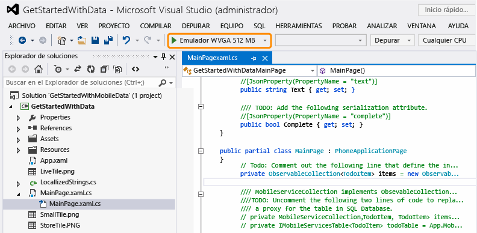

5.  Presione la tecla **F5**. De este modo, se creará, implementará e iniciará la aplicación para la depuración.

6.  En la aplicación, escriba cualquier texto en el cuadro de texto y, a continuación, haga clic en **Guardar** para guardar unos cuantos elementos en la memoria de la aplicación.

      ![][0]  

      Observe que el texto correspondiente a cada “TodoItem” aparece debajo del botón de actualización, junto con una casilla para marcar el elemento como completado.

Creación de un servicio móvilCreación de un servicio móvil
----------------------------------------------------------

[WACOM.INCLUDE [mobile-services-dotnet-backend-create-new-service](../includes/mobile-services-dotnet-backend-create-new-service.md)]

Descarga del servicio de manera localDescarga del proyecto de servicio móvil e incorporación del mismo a la solución
--------------------------------------------------------------------------------------------------------------------

1.  En el [Portal de administración de Azure](https://manage.windowsazure.com/), haga clic en el nuevo servicio móvil o en la pestaña del icono de nube para ir a la página de información general.

    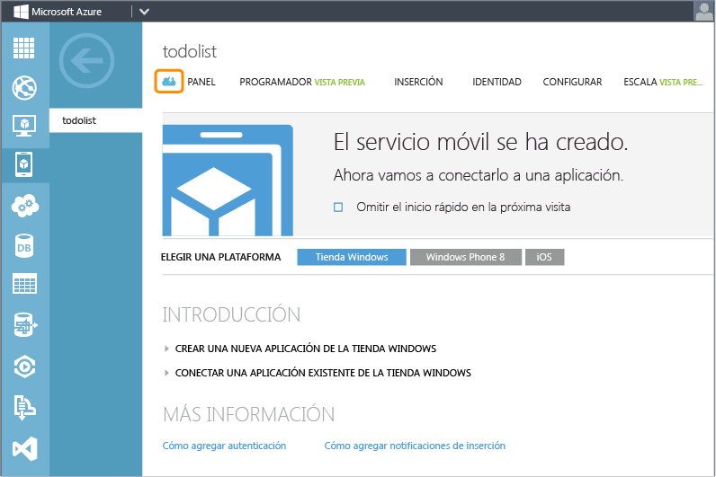

2.  Haga clic en la plataforma **Windows Phone 8**. En la sección **Get Started**, expanda **Conectar una aplicación Windows Phone 8 existente** y haga clic en el botón **Download** para descargar un proyecto inicial personalizado para el servicio móvil.

    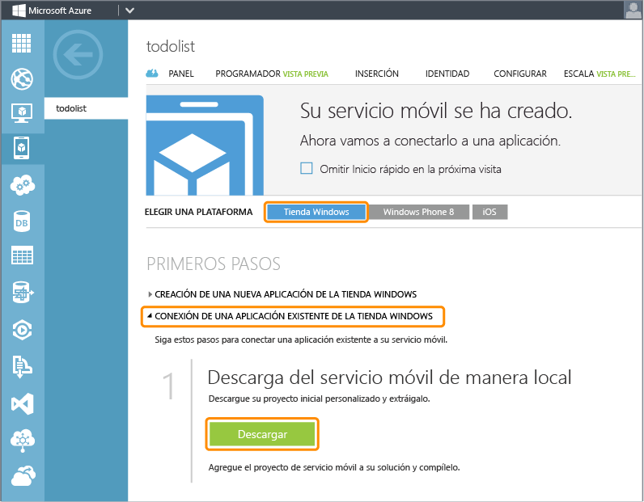

3.  También en esa sección, haga clic en el vínculo que aparece en la captura de pantalla siguiente para descargar un archivo de perfil de publicación para el servicio móvil que acaba de descargar.

    > [WACOM.NOTE] Guarde el archivo en un lugar seguro, ya que contiene información confidencial correspondiente a su cuenta de Azure. Más adelante en este tutorial, eliminará este archivo una vez publicado el servicio móvil.

    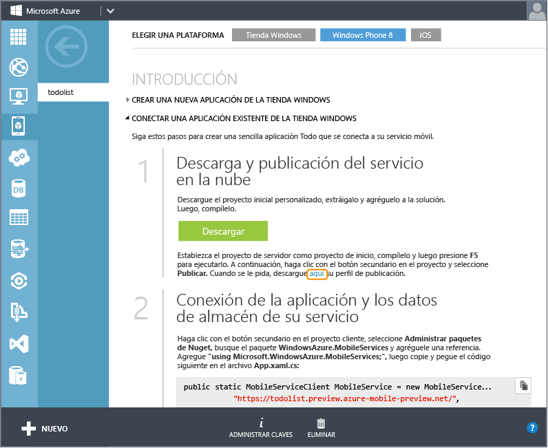

4.  Descomprima el proyecto inicial personalizado de servicio descargado. Copie las carpetas incluidas en el archivo zip en el mismo directorio **C\#** donde se encuentra el archivo de la solución Get Started with Data (.sln). Esto permitirá al Administrador de paquetes NuGet mantener todos los paquetes sincronizados más fácilmente.

    

5.  En el Explorador de soluciones de Visual Studio, haga clic con el botón secundario en la solución correspondiente a la aplicación de la Tienda Windows Getting Started with Data. Haga clic en **Agregar** y, a continuación, en **Proyecto existente**.

    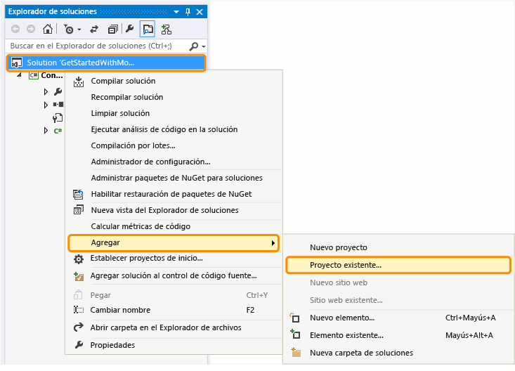

6.  En el cuadro de diálogo Agregar proyecto existente, desplácese hasta la carpeta del proyecto de servicio móvil que movió al directorio **C\#**. Seleccione el archivo de proyecto C\# (.csproj) en el subdirectorio del servicio. Haga clic en **Abrir** para agregar el proyecto a la solución.

    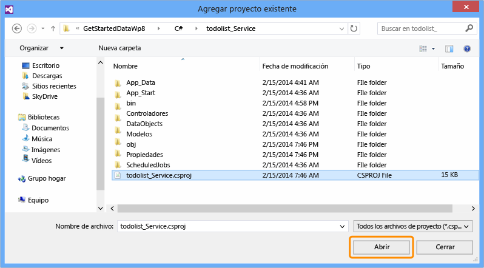

7.  En el Explorador de soluciones de Visual Studio, haga clic con el botón secundario en el proyecto de servicio que acaba de agregar y, a continuación, haga clic en **Compilar** para comprobar que se compile sin errores. Durante la compilación, el Administrador de paquetes NuGet puede necesitar restaurar algunos paquetes NuGet a los que se hace referencia en el proyecto.

    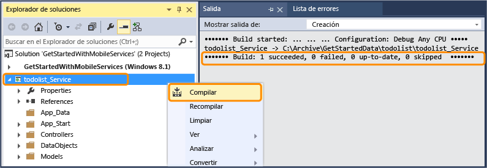

8.  Haga clic con el botón secundario de nuevo en el proyecto de servicio. En esta ocasión, haga clic en **Iniciar nueva instancia** en el menú contextual **Depurar**.

    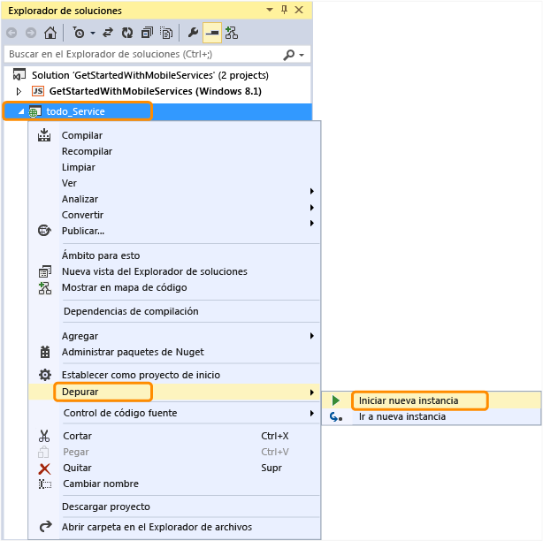

    Visual Studio abre la página web predeterminada del servicio. Puede hacer clic en **try it now** para probar los métodos del servicio móvil desde la página web predeterminada.

    

    De forma predeterminada, Visual Studio hospedó el servicio móvil de manera local en IIS Express. Puede verlo haciendo clic con el botón secundario en el icono de bandeja correspondiente a IIS Express de la barra de tareas.

    

Actualización de la aplicación de Windows PhoneActualización de la aplicación de Windows Phone para que utilice el servicio móvil
---------------------------------------------------------------------------------------------------------------------------------

En esta sección, actualizará la aplicación de Windows Phone para utilizar el servicio móvil como servicio back-end de la aplicación.

1.  En el Explorador de soluciones de Visual Studio, haga clic con el botón secundario en el proyecto de aplicación de Windows Phone y, a continuación, haga clic en **Administrar paquetes de NuGet**.

    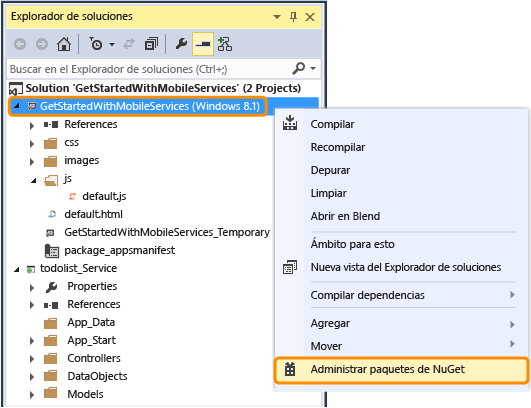

2.  En el cuadro de diálogo Administrar paquetes de NuGet, busque **WindowsAzure.MobileServices** en la colección de paquetes en línea y haga clic para instalar el paquete NuGet de Servicios móviles de Azure. A continuación, cierre el cuadro de diálogo.

    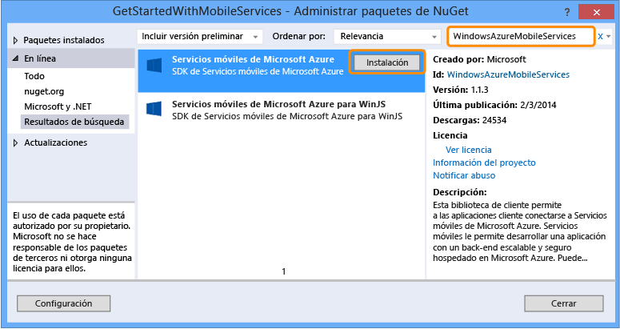

3.  De vuelta en el Portal de administración de Azure, busque el paso con la etiqueta **Conectar la aplicación y almacenar datos en el servicio**. Copie el fragmento de código que crea la conexión `MobileServiceClient`.

    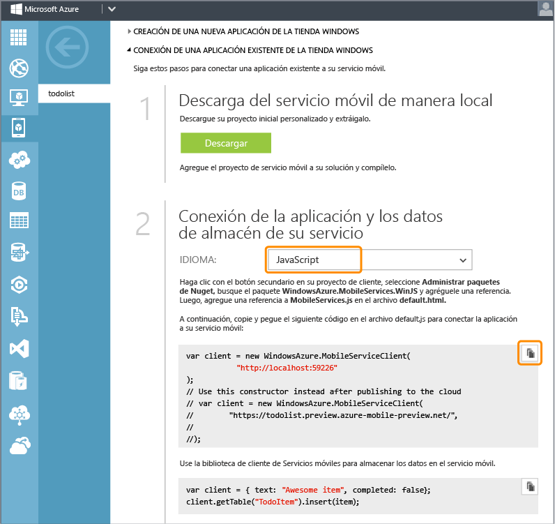

4.  En Visual Studio, abra App.xaml.cs y copie el fragmento de código al principio de la definición de clase `App`. Además, agregue la siguiente instrucción `using` en la parte superior de ese archivo y, a continuación, guarde el archivo.

         using Microsoft.WindowsAzure.MobileServices;

    

5.  En Visual Studio, abra MainPage.xaml.cs y agregue la instrucción using en la parte superior del archivo:

         using Microsoft.WindowsAzure.MobileServices;

6.  En Visual Studio, en MainPage.xaml.cs, reemplace la definición de clase `MainPage` por la definición siguiente y guarde el archivo.

    Este código utiliza el SDK de Servicios móviles a fin de habilitar la aplicación para almacenar los datos en una tabla proporcionada por el servicio en lugar de en la memoria local. Los tres principales métodos son `InsertTodoItem`, `RefreshTodoItems` y `UpdateCheckedTodoItem`. Estos tres métodos permiten, de forma asíncrona, insertar la colección de datos en una tabla de Azure, consultarla y actualizarla.

         public sealed partial class MainPage : PhoneApplicationPage
         {
             private MobileServiceCollection<TodoItem, TodoItem> items;
             private IMobileServiceTable<TodoItem> todoTable = 
                 App.MobileService.GetTable<TodoItem>();            
             public MainPage()
             {
                 this.InitializeComponent();
             }
             private async void InsertTodoItem(TodoItem todoItem)
             {
                 await todoTable.InsertAsync(todoItem); 
                 items.Add(todoItem);
             }
             private async void RefreshTodoItems()
             {
                 items = await todoTable 
                     .ToCollectionAsync(); 
                 ListItems.ItemsSource = items;
             }
             private async void UpdateCheckedTodoItem(TodoItem item)
             {
                 await todoTable.UpdateAsync(item);      
             }
             private void ButtonRefresh_Click(object sender, RoutedEventArgs e)
             {
                 RefreshTodoItems();
             }
             private void ButtonSave_Click(object sender, RoutedEventArgs e)
             {
                 var todoItem = new TodoItem { Text = InputText.Text };
                 InsertTodoItem(todoItem);
             }
             private void CheckBoxComplete_Checked(object sender, RoutedEventArgs e)
             {
                 CheckBox cb = (CheckBox)sender;
                 TodoItem item = cb.DataContext as TodoItem;
                 item.Complete = (bool)cb.IsChecked;
                 UpdateCheckedTodoItem(item);
             }
             protected override void OnNavigatedTo(NavigationEventArgs e)
             {
                 RefreshTodoItems();
             }
         }

Prueba de la aplicación de Windows Phone de manera localPrueba de la aplicación de Windows Phone con el servicio hospedado de manera local
------------------------------------------------------------------------------------------------------------------------------------------

En esta sección, utilizará Visual Studio para probar la aplicación y el servicio móvil de manera local en la estación de trabajo de desarrollo. Para probar el servicio móvil hospedado de manera local en IIS Express desde un dispositivo con Windows Phone o uno de los emuladores de Windows Phone, debe configurar IIS Express y la estación de trabajo para permitir las conexiones a la dirección IP y el puerto de la estación de trabajo. Los dispositivos con Windows Phone y los emuladores de Windows Phone se conectan como clientes de red no locales.

#### Configuración de IIS Express para permitir las conexiones remotas

[WACOM.INCLUDE [mobile-services-how-to-configure-iis-express](../includes/mobile-services-how-to-configure-iis-express.md)]

#### Prueba de la aplicación con el servicio móvil en IIS Express

1.  En Visual Studio, abra el archivo App.xaml.cs y convierta en comentario la definición `MobileService` que recientemente pegó en el archivo. Agregue una nueva definición para realizar la conexión en función de la dirección IP y el puerto que configuró en la estación de trabajo. A continuación, guarde el archivo. El código debe ser similar al siguiente...

         public static MobileServiceClient MobileService = new MobileServiceClient(
             "http://192.168.137.72:58203");

         //public static MobileServiceClient MobileService = new MobileServiceClient(
         //    "https://todolist.preview.azure-mobile-preview.net/",
         //    "XXXXXXXXXXXXXXXXXXXXXXXXXXXXXXXX"
         //);        

2.  En Visual Studio, presione la tecla F7 o haga clic en **Compilar solución** en el menú Compilar para compilar tanto la aplicación de Windows Phone como el servicio móvil. Compruebe que ambos proyectos se compilen sin errores en la ventana de resultados de Visual Studio.

    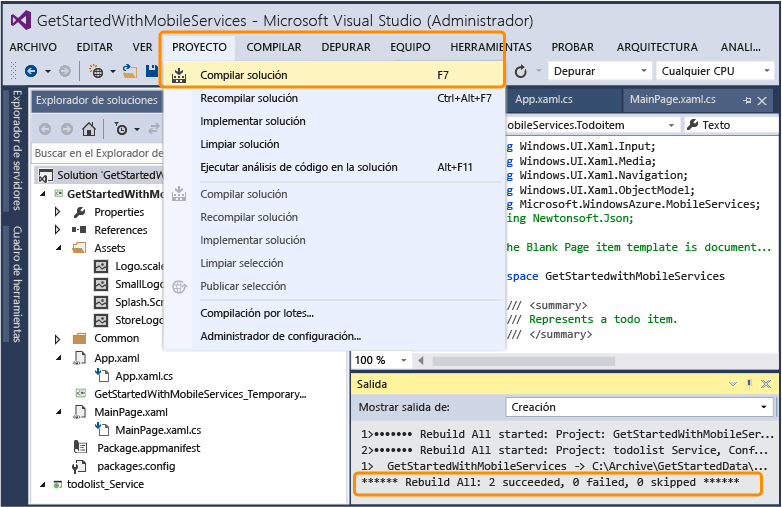

3.  En Visual Studio, presione la tecla F5 o haga clic en **Iniciar depuración** en el menú Depurar para ejecutar la aplicación y hospedar el servicio móvil de manera local en IIS Express.

    > [WACOM.NOTE] Asegúrese de ejecutar Visual Studio con la opción **Ejecutar como administrador**. De lo contrario, puede que IIS Express no cargue los cambios de applicationhost.config.

    

4.  Escriba el texto de un nuevo TodoItem. A continuación, haga clic en **Save**. De este modo, se inserta un nuevo TodoItem en la base de datos creada por el servicio móvil hospedado de manera local en IIS Express. Haga clic en la casilla correspondiente a uno de los elementos para marcarlo como completado.

    

5.  En Visual Studio, detenga la depuración de la aplicación. Puede ver los cambios en la base de datos creada para el servicio back-end abriendo el Explorador de servidores y expandiendo las conexiones de datos. Haga clic con el botón secundario en la tabla de TodoItems situada debajo de **MS\_TableConnectionString** y, a continuación, haga clic en **Mostrar datos de tabla**.

    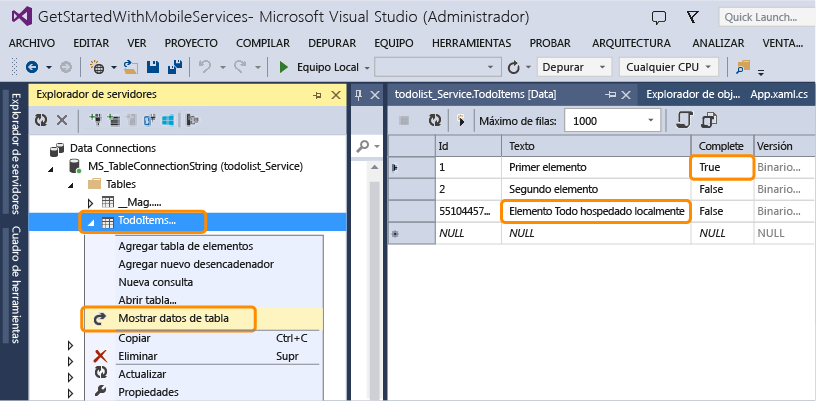

6.  Cuando acabe de probar el servicio móvil hospedado de manera local, elimine la regla del Firewall de Windows que creó para abrir el puerto de la estación de trabajo.

Publicación del servicio móvil en AzurePublicación del servicio móvil en Azure
------------------------------------------------------------------------------

[WACOM.INCLUDE [mobile-services-dotnet-backend-publish-service](../includes/mobile-services-dotnet-backend-publish-service.md)]

Prueba del servicio móvil en AzurePrueba del servicio móvil publicado en Azure
------------------------------------------------------------------------------

1.  En Visual Studio, abra App.xaml.cs. Convierta en comentario el código que crea el cliente `MobileServiceClient` que se conecta al servicio móvil hospedado de manera local. Quite la marca de comentario del código que crea el cliente `MobileServiceClient` que se conecta al servicio de Azure. Guarde los cambios del archivo.

         sealed partial class App : Application
         {
             //public static MobileServiceClient MobileService = new MobileServiceClient(
             //          "http://192.168.137.72:58203");

             // Utilizar este constructor tras la publicación en la nube
             public static MobileServiceClient MobileService = new MobileServiceClient(
                  "https://todolist.preview.azure-mobile-preview.net/",
                  "XXXXXXXXXXXXXXXXXXXXXXXXXXXXXXXX"
             );        
             ....

2.  En Visual Studio, presione la tecla F5 o haga clic en **Iniciar depuración** en el menú Depurar. De este modo, la aplicación se volverá a compilar con el cambio anterior antes de ejecutarla para establecer conexión con el servicio móvil hospedado de manera remota en Azure.

    

3.  Escriba algunos TodoItems nuevos y haga clic en **Guardar** para cada uno de ellos. Haga clic en la casilla para completar algunos de los nuevos elementos. Cada nuevo TodoItem se almacenará y actualizará en la base de datos SQL que configuró previamente para el servicio móvil en el Portal de administración de Azure.

    

    Puede reiniciar la aplicación para ver si los cambios se aplicaron en la base de datos de Azure. También puede examinar la base de datos utilizando el Portal de administración de Azure o el Explorador de objetos de SQL Server de Visual Studio. En los dos pasos siguientes se utilizará el Portal de administración de Azure para ver los cambios en la base de datos.

4.  En el Portal de administración de Azure, haga clic en la opción Manage correspondiente a la base de datos asociada con el servicio móvil.

    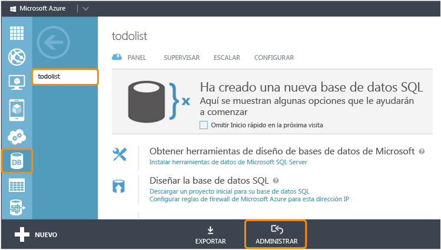

5.  En el Portal de administración, ejecute una consulta para ver los cambios realizados por la aplicación. La consulta será similar a la siguiente, pero con el nombre de la base de datos en lugar de `todolist`.

         SELECT * FROM [todolist].[todoitems]

    

Con esto concluye el tutorial **Introducción a los datos**.

Pasos siguientes
----------------

En este tutorial se demostraron los aspectos básicos de la habilitación de una aplicación de Windows Phone 8 para trabajar con datos en servicios móviles creados utilizando el tiempo de ejecución .NET. A continuación, considere la realización de uno de los siguientes tutoriales que se basan en la aplicación GetStartedWithData que creó en este tutorial:

-   [Validación y modificación de datos con scripts](/en-us/develop/mobile/tutorials/validate-modify-and-augment-data-wp8)
    Obtenga más información acerca del uso de scripts de servidor en Servicios móviles para validar y cambiar datos enviados desde su aplicación.

-   [Limitación de consultas con paginación](/en-us/develop/mobile/tutorials/add-paging-to-data-wp8)
    Aprenda a utilizar la paginación en consultas para controlar la cantidad de datos que se manejan en una única solicitud.

Una vez que haya completado la serie de datos, intente con uno de estos otros tutoriales:

-   [Introducción a la autenticación](/en-us/documentation/articles/mobile-services-dotnet-backend-windows-phone-get-started-users/)
    Aprenda a autenticar a los usuarios de su aplicación.

-   [Referencia conceptual de Servicios móviles con .NET](/en-us/develop/mobile/how-to-guides/work-with-net-client-library)
    Obtenga más información sobre cómo utilizar Servicios móviles con .NET.

<!-- Images. -->
[0]: ./media/mobile-services-dotnet-backend-windows-phone-get-started-data/app-view.png
[1]: ./media/mobile-services-dotnet-backend-windows-phone-get-started-data/mobile-data-sample-download-wp8-vs12.png
[2]: ./media/mobile-services-dotnet-backend-windows-phone-get-started-data/mobile-service-overview-page.png
[3]: ./media/mobile-services-dotnet-backend-windows-phone-get-started-data/download-service-project.png
[4]: ./media/mobile-services-dotnet-backend-windows-phone-get-started-data/add-service-project-to-solution.png
[5]: ./media/mobile-services-dotnet-backend-windows-phone-get-started-data/download-publishing-profile.png
[6]: ./media/mobile-services-dotnet-backend-windows-phone-get-started-data/add-existing-project-dialog.png
[7]: ./media/mobile-services-dotnet-backend-windows-phone-get-started-data/vs-manage-nuget-packages.png
[8]: ./media/mobile-services-dotnet-backend-windows-phone-get-started-data/manage-nuget-packages.png
[9]: ./media/mobile-services-dotnet-backend-windows-phone-get-started-data/copy-mobileserviceclient-snippet.png
[10]: ./media/mobile-services-dotnet-backend-windows-phone-get-started-data/vs-pasted-mobileserviceclient.png
[11]: ./media/mobile-services-dotnet-backend-windows-phone-get-started-data/vs-build-solution.png
[12]: ./media/mobile-services-dotnet-backend-windows-phone-get-started-data/vs-run-solution.png
[13]: ./media/mobile-services-dotnet-backend-windows-phone-get-started-data/new-local-todoitem.png
[14]: ./media/mobile-services-dotnet-backend-windows-phone-get-started-data/vs-show-local-table-data.png
[15]: ./media/mobile-services-dotnet-backend-windows-phone-get-started-data/local-item-checked.png
[16]: ./media/mobile-services-dotnet-backend-windows-phone-get-started-data/azure-items.png
[17]: ./media/mobile-services-dotnet-backend-windows-phone-get-started-data/manage-sql-azure-database.png
[18]: ./media/mobile-services-dotnet-backend-windows-phone-get-started-data/sql-azure-query.png
[19]: ./media/mobile-services-dotnet-backend-windows-phone-get-started-data/vs-deployment-target.png
[20]: ./media/mobile-services-dotnet-backend-windows-phone-get-started-data/vs-build-service-project.png
[21]: ./media/mobile-services-dotnet-backend-windows-phone-get-started-data/vs-start-debug-service-project.png
[22]: ./media/mobile-services-dotnet-backend-windows-phone-get-started-data/service-welcome-page.png
[23]: ./media/mobile-services-dotnet-backend-windows-phone-get-started-data/iis-express-tray.png
[26]: ./media/mobile-services-dotnet-backend-windows-phone-get-started-data/copy-service-and-packages-folder.png
