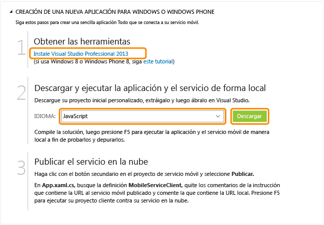

<properties linkid="develop-mobile-tutorials-get-started" urlDisplayName="Get Started" pageTitle="Get Started with Mobile Services for Windows Store apps | Mobile Dev Center" metaKeywords="" description="Follow this tutorial to get started using Azure Mobile Services for Windows Store development in C#, VB, or JavaScript. " metaCanonical="" services="" documentationCenter="Mobile" title="Get started with Mobile Services" authors="glenga" solutions="" manager="" editor="" />

Introducción a los Servicios móviles
====================================

[C\# para Tienda Windows](/en-us/documentation/articles/mobile-services-dotnet-backend-windows-store-dotnet-get-started "C# para Tienda Windows")[JavaScript para Tienda Windows](/en-us/documentation/articles/mobile-services-dotnet-backend-windows-store-javascript-get-started "JavaScript para Tienda Windows")[Windows Phone](/en-us/documentation/articles/mobile-services-dotnet-backend-windows-phone-get-started "Windows Phone")[iOS](/en-us/documentation/articles/mobile-services-dotnet-backend-ios-get-started "iOS") [Android](/en-us/documentation/articles/mobile-services-dotnet-backend-android-get-started "Android")

[Back-end de .NET](/en-us/documentation/articles/mobile-services-dotnet-backend-windows-store-javascript-get-started/ "Back-end de .NET") | [Back-end de JavaScript](/en-us/documentation/articles/mobile-services-windows-store-get-started/ "Back-end de JavaScript")

En este tutorial se muestra cómo agregar un servicio de back-end basado en la nube para una aplicación de la Tienda Windows con Servicios móviles de Azure. Con este tutorial creará tanto un servicio móvil nuevo como una aplicación simple de *Lista de pendientes* en HTML y JavaScript que almacena datos de la aplicación en el servicio móvil nuevo. El servicio móvil que va a crear utiliza los lenguajes compatibles de .NET con Visual Studio para la lógica de negocios de servidor y para administrar el servicio móvil. Si desea crear un servicio móvil que le permita escribir su lógica de negocios de servidor en JavaScript, consulte la [versión de JavaScript](/en-us/documentation/articles/mobile-services-windows-store-get-started) de este tema.

La siguiente captura de pantalla muestra la aplicación final:


Completar este tutorial es un requisito previo para todos los tutoriales de Servicios móviles para aplicaciones de la Tienda Windows.

> [WACOM.NOTE] Necesita una cuenta de Azure para completar este tutorial. En caso de no tener ninguna, puede crear una cuenta de evaluación gratuita en tan solo unos minutos. Para obtener detalles, consulte [Evaluación gratuita de Azure](http://www.windowsazure.com/en-us/pricing/free-trial/?WT.mc_id=A0E0E5C02&returnurl=http%3A%2F%2Fwww.windowsazure.com%2Fen-us%2Fdocumentation%2Farticles%2Fmobile-services-dotnet-backend-windows-store-javascript-get-started%2F).
> Este tutorial requiere [Visual Studio Professional 2013](https://go.microsoft.com/fwLink/p/?LinkID=257546). Hay disponible una versión de prueba gratuita.

Creación de un servicio móvil
-----------------------------

[WACOM.INCLUDE [mobile-services-dotnet-backend-create-new-service](../includes/mobile-services-dotnet-backend-create-new-service.md)]

Creación de una aplicación de la Tienda Windows
-----------------------------------------------

Una vez que haya creado el servicio móvil, podrá seguir una introducción rápida en el Portal de administración para crear una nueva aplicación o modificar una ya existente a fin de conectarla a dicho servicio.

En esta sección, creará una aplicación de Tienda Windows que se conecta al servicio móvil.

1.  En el Portal de administración, haga clic en **Servicios móviles** y, a continuación, en el servicio móvil que acaba de crear.

2.  En la pestaña de inicio rápido, haga clic en **Windows** en **Choose platform** y, a continuación, expanda **Crear una nueva aplicación de la Tienda Windows**.

      ![][6]

      Con esto se muestran los tres sencillos pasos requeridos para crear una aplicación de la Tienda Windows conectada al servicio móvil.

  

1.  Si todavía no lo ha hecho, descargue e instale [Visual Studio Professional 2013](https://go.microsoft.com/fwLink/p/?LinkID=257546) en el equipo local o máquina virtual.

2.  En **Descargar y ejecutar la aplicación y el servicio localmente**, seleccione un idioma para la aplicación de la Tienda Windows y, a continuación, haga clic en **Download**.

  De esta forma, se descarga una solución que contiene proyectos tanto para el servicio móvil como para la aplicación *Lista de pendientes* de ejemplo que se conecta al servicio móvil. Guarde el archivo comprimido del proyecto en el equipo local y anote dónde lo guardó.

1.  En **Publicar su servicio en la nube**, haga clic para descargar el perfil de publicación. Guarde el archivo descargado en el equipo local y anote dónde lo guardó.

    **Nota de seguridad**

    Después de importar el perfil de publicación, podría ser conveniente eliminar el archivo descargado dado que contiene información que otros usuarios podrían emplear para tener acceso a sus servicios.

Prueba de la aplicación con el servicio móvil local
---------------------------------------------------

[WACOM.INCLUDE [mobile-services-dotnet-backend-test-local-service-dotnet](../includes/mobile-services-dotnet-backend-test-local-service-dotnet.md)]

> [WACOM.NOTE]Puede revisar el código de acceso al servicio móvil para consultar e insertar datos; este se encuentra en el archivo default.js.

Publicación del servicio móvil
------------------------------

[WACOM.INCLUDE [mobile-services-dotnet-backend-publish-service](../includes/mobile-services-dotnet-backend-publish-service.md)]

1.  En el proyecto de la aplicación de la Tienda Windows, abra el archivo App.xaml.cs, ubique el código que crea una instancia [MobileServiceClient](http://msdn.microsoft.com/en-us/library/Windowsazure/microsoft.windowsazure.mobileservices.mobileserviceclient.aspx), convierta en comentario el código que crea a este cliente con *localhost* y quite la marca de comentario del código que crea al cliente con la dirección URL del servicio móvil remoto, que debe presentar la siguiente apariencia:

    ``` {}
    var client = new WindowsAzure.MobileServiceClient(
                "https://todolist.azure-mobile.net/",
                "XXXXXX-APPLICATION-KEY-XXXXXX"
            );
    ```

    El cliente ahora tendrá acceso al servicio móvil publicado en Azure.

2.  Presione la tecla **F5** para recompilar el proyecto e iniciar la aplicación.

3.  En la aplicación, escriba un texto significativo, como *Realice el tutorial*, en **Insert a TodoItem** y, a continuación, haga clic en **Save**.

    Esta acción envía una solicitud POST al nuevo servicio móvil hospedado en Azure.


Pasos siguientes
----------------

Ahora que completó el inicio rápido, aprenda a realizar importantes tareas adicionales en los Servicios móviles:

-   [Introducción a los datos](/en-us/documentation/articles/mobile-services-dotnet-backend-windows-store-javascript-get-started-data)
    Obtenga más información sobre cómo almacenar y consultar datos con los Servicios móviles.

-   [Introducción a la autenticación](/en-us/documentation/articles/mobile-services-dotnet-backend-windows-store-javascript-get-started-users)
    Aprenda a autenticar a los usuarios de su aplicación con un proveedor de identidades.

-   [Introducción a las notificaciones de inserción](/en-us/documentation/articles/mobile-services-dotnet-backend-windows-store-javascript-get-started-push)
    Aprenda a enviar una notificación de inserción muy básica a la aplicación.


<!-- Images. -->
[0]: ./media/mobile-services-dotnet-backend-windows-store-javascript-get-started/mobile-quickstart-completed.png

[6]: ./media/mobile-services-dotnet-backend-windows-store-javascript-get-started/mobile-portal-quickstart.png
[7]: ./media/mobile-services-dotnet-backend-windows-store-javascript-get-started/mobile-quickstart-steps.png
[8]: ./media/mobile-services-dotnet-backend-windows-store-javascript-get-started/mobile-service-startup.png

[10]: ./media/mobile-services-dotnet-backend-windows-store-javascript-get-started/mobile-quickstart-startup.png
[11]: ./media/mobile-services-dotnet-backend-windows-store-javascript-get-started/mobile-quickstart-publish.png
[12]: ./media/mobile-services-dotnet-backend-windows-store-javascript-get-started/mobile-data-browse.png