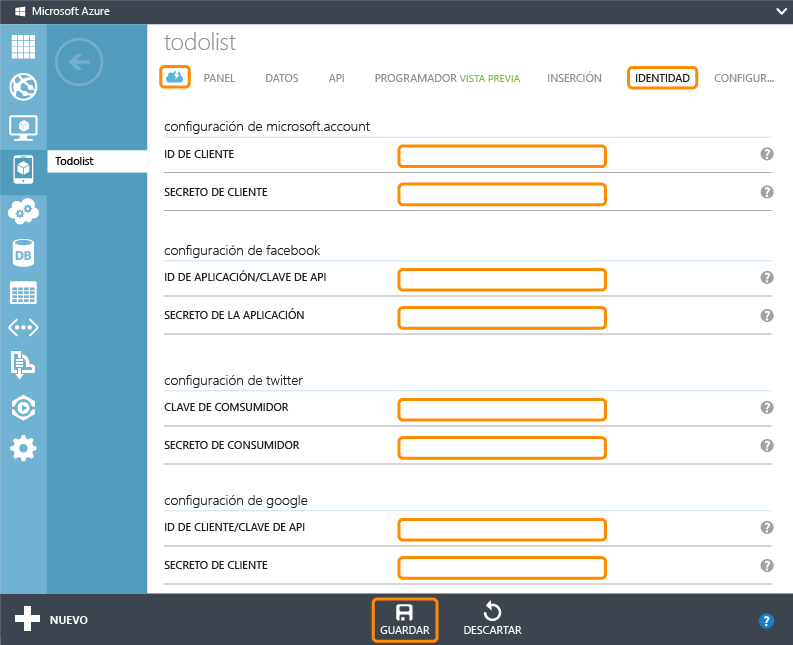
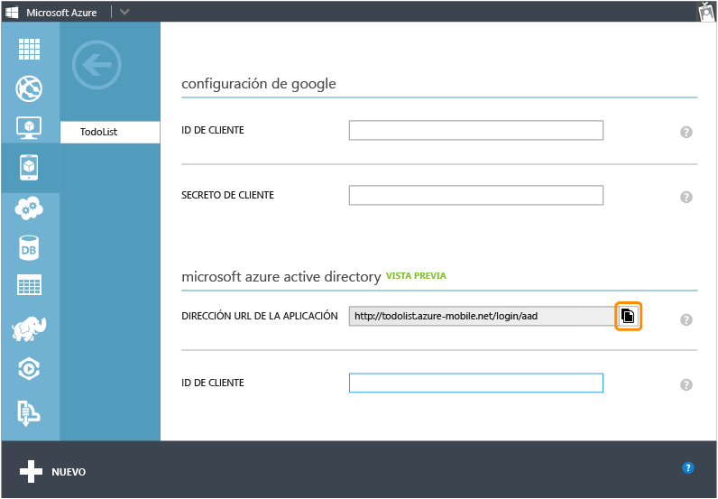
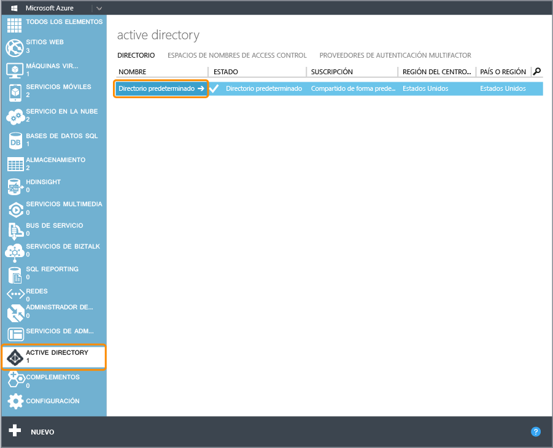
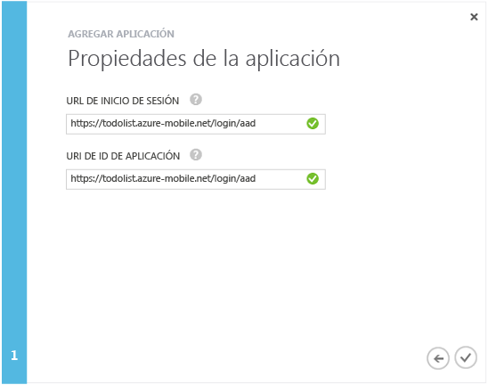
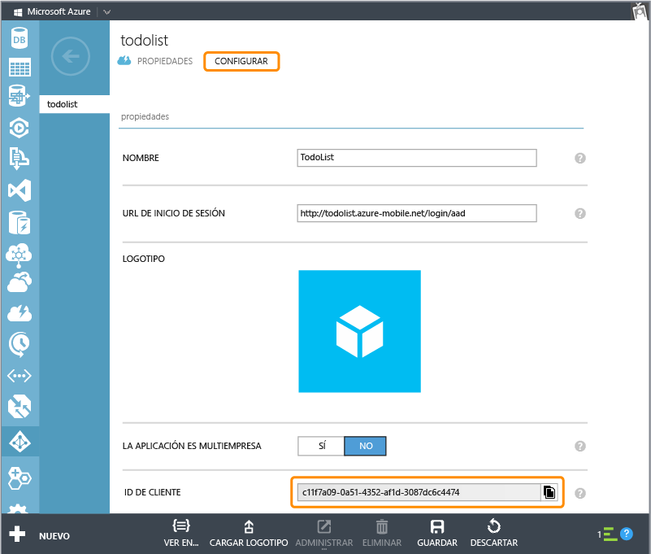
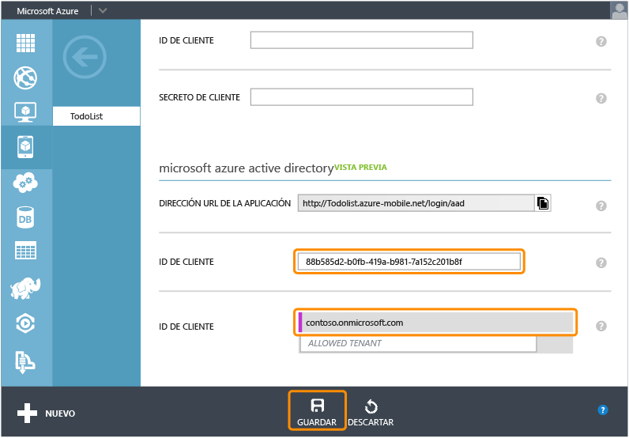

<properties linkid="develop-mobile-how-to-guides-register-for-active-directory-authentication" urlDisplayName="Register for Azure Active Directory Authentication" pageTitle="Register for Azure Active Directory authentication - Mobile Services" metaKeywords="Azure registering application, Azure Active Directory authentication, application authenticate, authenticate mobile services" description="Learn how to register for Azure Active Directory authentication in your Mobile Services application." title="Register your account to use an Azure Active Directory account login" authors="" />

Registro de las aplicaciones para usar un inicio de sesión de la cuenta de Azure Active Directory
=================================================================================================

Este tema indica cómo registrar las aplicaciones para que puedan usar Azure Active Directory como proveedor de autenticación para los Servicios móviles de Azure.

> [WACOM.NOTE] El proveedor de autenticación de Azure Active Directory para Servicios móviles actualmente está en vista previa. Si desea inscribirse en la vista previa, póngase en contacto con <mobileservices@microsoft.com>. De lo contrario, el proveedor de autenticación no estará visible en la pestaña `Identity` del servicio móvil.

> [WACOM.NOTE] Si desea proporcionar autenticación centrada en el cliente para inicio de sesión único (SSO) o insertar notificaciones de una aplicación de la Tienda Windows, considere la opción de registrar su aplicación con la Tienda Windows. Para obtener más información, consulte [Registro de sus aplicaciones de la Tienda Windows para la autenticación de Live Connect de Windows](/en-us/develop/mobile/how-to-guides/register-for-single-sign-on).

1.  Inicie sesión en el [Portal de administración de Azure](https://manage.windowsazure.com/), haga clic en **Servicios móviles** y, a continuación, haga clic en el servicio móvil.

    

2.  Haga clic en la pestaña **Identity** del servicio móvil.

    

3.  Desplácese hasta la sección del proveedor de identidades de **Azure Active Directory** y copie el valor de la **Dirección URL de la aplicación** que aparece ahí.

    

4.  Diríjase a **Active Directory** en el portal de administración y haga clic en el directorio.

    

5.  Haga clic en la pestaña **Aplicaciones** que aparece en la parte superior y, a continuación, haga clic en **ADD** para agregar una aplicación.

    

6.  Haga clic en **Agregar una aplicación que mi organización está desarrollando**.

7.  En el asistente para agregar aplicaciones, escriba el valor de **Nombre** para la aplicación y haga clic en el tipo **Aplicación web y/o API web**. A continuación, haga clic para continuar.

    

8.  En el cuadro **Dirección URL de inicio de sesión**, pegue el identificador de la aplicación que copió de la configuración del proveedor de identidades de Active Directory del servicio móvil. Escriba también un identificador de recurso único en el cuadro **URI de id. de aplicación**. Así, la aplicación usará el URI para enviar solicitudes de inicio de sesión único a Azure Active Directory. A continuación, haga clic para continuar.

    

9.  Haga clic para habilitar el tipo de acceso **Inicio de sesión único** para la aplicación. Haga clic para completar el asistente para agregar una aplicación.

    

10. Una vez que se haya agregado la aplicación, desplácese hasta el final. A continuación, haga clic en la sección **Habilitar la aplicación para leer o escribir datos de directorio** para expandirla. A continuación, haga clic para copiar el **Id. de cliente** de la aplicación.

    

11. Vuelva a la pestaña **Identidad** del servicio móvil. En la parte inferior, pegue la configuración de **Id. de cliente** para el proveedor de identidades de Azure Active Directory. A continuación, haga clic en **Save**.

    

Ahora está preparado para usar Azure Active Directory para realizar la autenticación en la aplicación.

