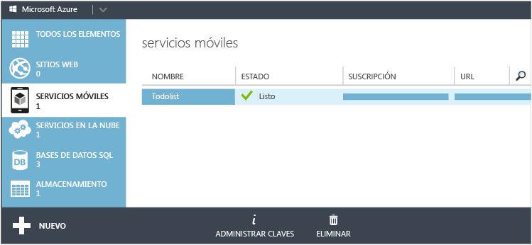
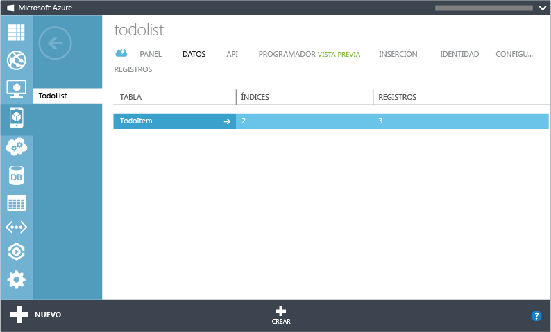

<properties linkid="develop-mobile-tutorials-get-started-with-push-js-vs2013" urlDisplayName="Get Started with Push (JS)" pageTitle="Get started with push notifications (Android JavaScript) | Mobile Dev Center" metaKeywords="" description="Learn how to use Windows Azure Mobile Services to send push notifications to your Android JavaScript app." metaCanonical="http://www.windowsazure.com/es-es/develop/mobile/tutorials/get-started-with-push-dotnet/" services="" documentationCenter="Mobile" title="Get started with push notifications in Mobile Services" authors="ricksal" solutions="" writer="ricksal" manager="" editor="" />

Introducción a las notificaciones de inserción en Servicios móviles
===================================================================

[C\# para Tienda Windows](/es-es/documentation/articles/mobile-services-javascript-backend-windows-store-dotnet-get-started-push "C# para Tienda Windows") [JavaScript para Tienda Windows](/es-es/documentation/articles/mobile-services-javascript-backend-windows-store-javascript-get-started-push "JavaScript para Tienda Windows") [Windows Phone](/es-es/documentation/articles/mobile-services-javascript-backend-windows-phone-get-started-push "Windows Phone") [iOS](/es-es/documentation/articles/mobile-services-ios-get-started-push "iOS") [Android](/es-es/documentation/articles/mobile-services-javascript-backend-android-get-started-push "Android")

Este tema muestra cómo puede utilizar Servicios móviles de Azure para enviar notificaciones de inserción a su aplicación Android. En este tutorial aprenderá a agregar notificaciones de inserción al proyecto de inicio rápido con el servicio de mensajería en la nube de Google (GCM). Cuando haya finalizado, el servicio móvil le enviará una notificación de inserción cada vez que se inserte un registro.

[WACOM.NOTE]Este tutorial muestra la integración de Servicios móviles en Centros de notificaciones, que actualmente está en vista previa. De forma predeterminada, el envío de notificaciones de inserción con Centros de notificaciones no está habilitado en un back-end de JavaScript. Una vez que se haya creado el nuevo centro de notificaciones, el proceso de integración no se puede revertir. Las notificaciones de inserción para iOS solo están disponibles actualmente a través de la compatibilidad predeterminada con inserciones que se describe en [esta versión del tema](/es-es/documentation/articles/mobile-services-android-get-started-push/) (en inglés).

Este tutorial le guiará a través de estos pasos básicos para habilitar las notificaciones de inserción:

1.  [Habilitación del servicio de mensajería en la nube de Google](#register)
2.  [Configuración de Servicios móviles](#configure)
3.  [Incorporación de notificaciones de inserción a la aplicación](#add-push)
4.  [Actualización de scripts para enviar notificaciones de inserción](#update-scripts)
5.  [Inserción de datos para recibir notificaciones](#test)

Este tutorial está basado en el inicio rápido de Servicios móviles. Antes de empezar este tutorial, primero debe completar [Introducción a los Servicios móviles](/es-es/develop/mobile/tutorials/get-started/) o [Introducción a los datos](/es-es/develop/mobile/tutorials/get-started-with-data-js/) para conectar su proyecto al servicio móvil.

Habilitación del servicio de mensajería en la nube de Google
------------------------------------------------------------

[WACOM.INCLUDE [Habilitación de GCM](../includes/mobile-services-enable-Google-cloud-messaging.md)]

A continuación, utilizará este valor de clave de API para permitir que Servicios móviles se autentique con GCM y envíe notificaciones de inserción en nombre de su aplicación.

Configuración de Servicios móviles para enviar solicitudes de inserción
-----------------------------------------------------------------------

1.  Inicie sesión en el [Portal de administración de Azure](https://manage.windowsazure.com/), haga clic en **Servicios móviles** y, a continuación, haga clic en su aplicación.

	

2.  Haga clic en la pestaña **Push**, haga clic en **Habilitar inserción mejorada** y, a continuación, haga clic en **Yes** para aceptar el cambio de configuración.

    

    

    Esto actualiza la configuración del servicio móvil para utilizar la funcionalidad de notificaciones de inserción mejorada que proporcionan los Centros de notificaciones. Una parte del uso de Centros de notificaciones es gratis con el servicio móvil de pago. Para obtener más información al respecto, consulte [Detalles de precios de Servicios móviles](http://go.microsoft.com/fwlink/p/?LinkID=311786).

    **Importante**

    Esta operación reinicia las credenciales de inserción y cambia el comportamiento de los métodos de inserción en sus scripts. Estos cambios no se pueden deshacer. No utilice este método para agregar un centro de notificaciones a un servicio móvil de producción. Para obtener orientación sobre cómo habilitar las notificaciones de inserción mejoradas en un servicio móvil de producción, consulte [esta guía](http://go.microsoft.com/fwlink/p/?LinkId=391951) (en inglés).

3.  Escriba el valor **Clave de API** obtenido del GCM en el procedimiento anterior y, a continuación, haga clic en **Save**.

	

    **Importante**

    Al configurar las credenciales de GCM para las notificaciones de inserción mejoradas en la pestaña Push del portal, se comparten con los Centros de notificaciones para configurar el centro de notificaciones con la aplicación.

El servicio móvil y la aplicación están ahora configurados para funcionar con GCM y los Centros de notificaciones.

Incorporación de notificaciones de inserción a la aplicación
------------------------------------------------------------

### Comprobación de la versión del SDK de Android

[WACOM.INCLUDE [Verify SDK](../includes/mobile-services-verify-android-sdk-version.md)]

El siguiente paso es instalar los servicios de Google Play. El servicio de mensajería en la nube de Google tiene algunos requisitos mínimos en el nivel de API para desarrollo y prueba, los que debe cumplir la propiedad **minSdkVersion** del manifiesto.

Si va a realizar pruebas con un dispositivo antiguo, consulte [Configuración del SDK de Google Play Services](http://go.microsoft.com/fwlink/?LinkId=389801) para determinar el valor mínimo que puede configurar, y cómo configurarlo de forma adecuada.

### Incorporación de Google Play Services al proyecto

[WACOM.INCLUDE [Incorporación de Play Services](../includes/mobile-services-add-Google-play-services.md)]

### Incorporación de código

1.  Abra el archivo `AndroidManifest.xml`. En el código que aparece en los próximos dos pasos, reemplace _`**my_app_package**`_ por el nombre del paquete de aplicaciones para el proyecto, que es el valor del atributo `package` de la etiqueta `manifest`.

2.  Agregue los siguientes permisos nuevos después del elemento `uses-permission` existente:

         <permission android:name="**my_app_package**.permission.C2D_MESSAGE" 
             android:protectionLevel="signature" />
         <uses-permission android:name="**my_app_package**.permission.C2D_MESSAGE" /> 
         <uses-permission android:name="com.google.android.c2dm.permission.RECEIVE" />
         <uses-permission android:name="android.permission.GET_ACCOUNTS" />
         <uses-permission android:name="android.permission.WAKE_LOCK" />

3.  Agregue el siguiente código después de la etiqueta de apertura `application`:

         <receiver android:name="com.microsoft.windowsazure.notifications.NotificationsBroadcastReceiver"
                                        android:permission="com.google.android.c2dm.permission.SEND">
             <intent-filter>
                 <action android:name="com.google.android.c2dm.intent.RECEIVE" />
                 <category android:name="**my_app_package**" />
             </intent-filter>
         </receiver>

4.  Descargue y descomprima el [SDK de Android para Servicios móviles], abra la carpeta **notificaciones**, copie el archivo **notifications-1.0.1.jar** en la carpeta *libs* del proyecto Eclipse y actualice la carpeta *libs*.

    **Nota:**

    Los números que aparecen al final del nombre del archivo pueden cambiar en versiones de SDK posteriores.

5.  Abra el archivo *ToDoItemActivity.java* y agregue la siguiente instrucción de importación:

        import com.microsoft.windowsazure.notifications.NotificationsManager;

6.  Agregue la siguiente variable privada a la clase, donde *`<PROJECT_NUMBER>`* es el número de proyecto que Google asigna a su aplicación en el procedimiento anterior:

        public static final String SENDER_ID = "<PROJECT_NUMBER>";

7.  En el método **onCreate**, antes de crear una instancia del MobileServiceClient, agregue este código que registra el controlador de notificación para el dispositivo:

         NotificationsManager.handleNotifications(this, SENDER_ID, MyHandler.class);

    Más adelante definiremos MyHandler.class, al que se hace referencia en este código.

8.  En el Explorador de paquetes, haga clic con el botón secundario en el paquete (bajo el nodo`src`), haga clic en **Nuevo** y luego en **Clase**.

9.  En **Nombre**, escriba `MyHandler`, en **Superclase**, escriba `com.microsoft.windowsazure.notifications.NotificationsHandler` y luego haga clic en **Finalizar**

    

    Con esto se crea la clase MyHandler.

10. Agregue la siguiente instrucción import:

        import android.content.Context;

11. A continuación, agregue este código a la clase:

        public static final int NOTIFICATION_ID = 1;
        private NotificationManager mNotificationManager;
        NotificationCompat.Builder builder;
        Context ctx;

12. Agregue el siguiente código para invalidar el método **onRegistered**: el cual registra el dispositivo con el Centro de notificaciones del servicio móvil.

        @Override
        public void onRegistered(Context context, String gcmRegistrationId) {
            super.onRegistered(context, gcmRegistrationId);
                
            ToDoActivity.mClient.getPush().register(gcmRegistrationId, null, new RegistrationCallback() {
                @Override
                public void onRegister(Registration registration, Exception exception) {
                      if (exception != null) {
                            // Gestionar error
                      }
                }
            });
        }

13. Agregue el siguiente código para invalidar el método **onReceive**, que ocasiona que se visualice la notificación al recibirla.

        @Override
        public void onReceive(Context context, Bundle bundle) {
            ctx = context;
            String nhMessage = bundle.getString("message");

            sendNotification(nhMessage);
        }

        private void sendNotification(String msg) {
            mNotificationManager = (NotificationManager)
                      ctx.getSystemService(Context.NOTIFICATION_SERVICE);

            PendingIntent contentIntent = PendingIntent.getActivity(ctx, 0,
                  new Intent(ctx, ToDoActivity.class), 0);

            NotificationCompat.Builder mBuilder =
                  new NotificationCompat.Builder(ctx)
                  .setSmallIcon(R.drawable.ic_launcher)
                  .setContentTitle("Notification Hub Demo")
                  .setStyle(new NotificationCompat.BigTextStyle()
                             .bigText(msg))
                  .setContentText(msg);

             mBuilder.setContentIntent(contentIntent);
             mNotificationManager.notify(NOTIFICATION_ID, mBuilder.build());
        }

Ahora su aplicación está actualizada para que sea compatible con las notificaciones de inserción.

Actualización del script de inserción registrado en el Portal de administración
-------------------------------------------------------------------------------

1.  En el Portal de administración, haga clic en la pestaña **Data** y, a continuación, en la tabla **TodoItem**.

        

2.  En **todoitem**, haga clic en la pestaña **Script** y seleccione **Insert**.

 Se muestra la función que se invoca cuando se produce una inserción en la tabla **TodoItem**.

1.  Reemplace la función de inserción por el siguiente código y, a continuación, haga clic en **Save**:

         function insert(item, user, request) {
         // Definir una carga para la notificación del sistema del servicio de mensajería en la nube de Google.
         var payload = 
             '{"data":{"message" : "Hello from Mobile Services!"}}';
            
         request.execute({
             success: function() {
                 // Si la inserción se realiza correctamente, enviar una notificación.
                 push.gcm.send(null, payload, {
                     success: function(pushResponse) {
                         console.log("Sent push:", pushResponse, payload);
                         request.respond();
                         },              
                     error: function (pushResponse) {
                         console.log("Error Sending push:", pushResponse);
                         request.respond(500, { error: pushResponse });
                         }
                     });
                 },
             error: function(err) {
                 console.log("request.execute error", err)
                 request.respond();
             }
           });
         }

	Esto registra un nuevo script de inserción, que usa el [objeto gcm] para enviar una notificación de inserción a todos los dispositivos registrados después de que la inserción se realice correctamente. 

Pruebas de notificaciones de inserción en su aplicación
-------------------------------------------------------

Puede probar la aplicación conectando directamente un teléfono Android con un cable USB o utilizando un dispositivo virtual en el emulador.

### Configuración de un emulador para realizar pruebas

Cuando ejecute esta aplicación en el emulador, asegúrese de utilizar un dispositivo virtual Android (AVD) compatible con las API de Google.

1.  Reinicie Eclipse y, a continuación, en el Explorador de paquetes, haga clic con el botón secundario en el proyecto, haga clic en **Propiedades**, **Android**, marque **API de Google** y, a continuación, haga clic en **Aceptar**.

	

	Con esto, el proyecto se dirige a las API de Google.

1.  En **Ventana**, seleccione **Administrador de dispositivos virtuales de Android**, seleccione su dispositivo y haga clic en **Editar**.

	

2.  Seleccione **API de Google** en **Destino** y haga clic en Aceptar.

	

    Con esto, el dispositivo virtual Android se dirige para usar las API de Google.

### Ejecución de la prueba

1.  En el menú **Run** en Eclipse, haga clic en **Run** para iniciar la aplicación.

2.  En la aplicación, escriba un texto significativo, como *Una nueva tarea de Servicios móviles* y, a continuación, haga clic en el botón **Agregar**.

	

1.  Deslice el dedo hacia abajo desde la parte superior de la pantalla para abrir el Centro de notificaciones del dispositivo y visualizar la notificación.

Ha completado correctamente este tutorial.

Pasos siguientes
----------------

Este tutorial demuestra la funcionalidad de notificación de inserción básica que brinda Servicios móviles. Si su aplicación requiere funcionalidades más avanzadas, como enviar notificaciones entre plataformas, enrutamiento basado en suscripción o volúmenes de tamaño muy grande, considere utilizar los Centros de notificaciones de Azure con su servicio móvil. Para obtener más información, consulte uno de los siguientes temas de Centros de notificaciones:

-   [Introducción a los Centros de notificaciones](/es-es/manage/services/notification-hubs/getting-started-windows-dotnet/)
    Aprenda a aprovechar los Centros de notificaciones en su aplicación Android.

-   [Envío de notificaciones a los suscriptores](/es-es/manage/services/notification-hubs/breaking-news-dotnet/)
    Sepa cómo los usuarios se pueden registrar y recibir notificaciones de inserción de categorías que les interesan.

-   [Envío de notificaciones a los usuarios](/es-es/manage/services/notification-hubs/notify-users/)
    Sepa cómo enviar notificaciones de inserción desde un Servicio móvil a usuarios específicos en cualquier dispositivo.

-   [Envío de notificaciones entre plataformas a los usuarios](/es-es/manage/services/notification-hubs/notify-users-xplat-mobile-services/)
    Sepa cómo utilizar las plantillas para enviar notificaciones de inserción desde un Servicio móvil sin tener que diseñar cargas específicas de plataforma en el back-end.

Considere la posibilidad de profundizar más en los siguientes temas de Servicios móviles:

-   [Introducción a los datos](/es-es/develop/mobile/tutorials/get-started-with-data-js/)
    Obtenga más información sobre cómo almacenar y consultar datos con los Servicios móviles.

-   [Introducción a la autenticación](/es-es/develop/mobile/tutorials/get-started-with-users-js)
    Aprenda a autenticar a los usuarios de su aplicación con cuenta de Windows.

-   [Referencia del script del servidor de Servicios móviles](http://go.microsoft.com/fwlink/?LinkId=262293)
    Obtenga más información acerca del registro y uso de scripts de servidor.

-   [Referencia conceptual de Servicios móviles con HTML/JavaScript](/es-es/develop/mobile/how-to-guides/work-with-html-js-client/)
    Obtenga más información acerca de cómo utilizar los Servicios móviles con HTML y JavaScript.

